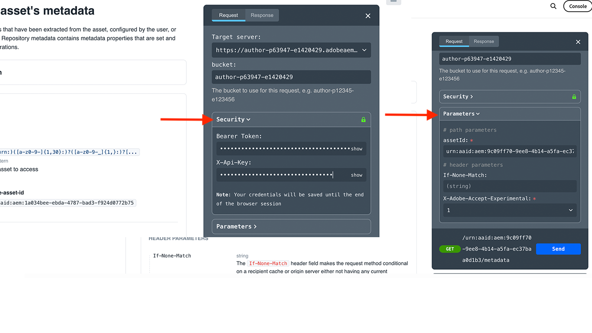
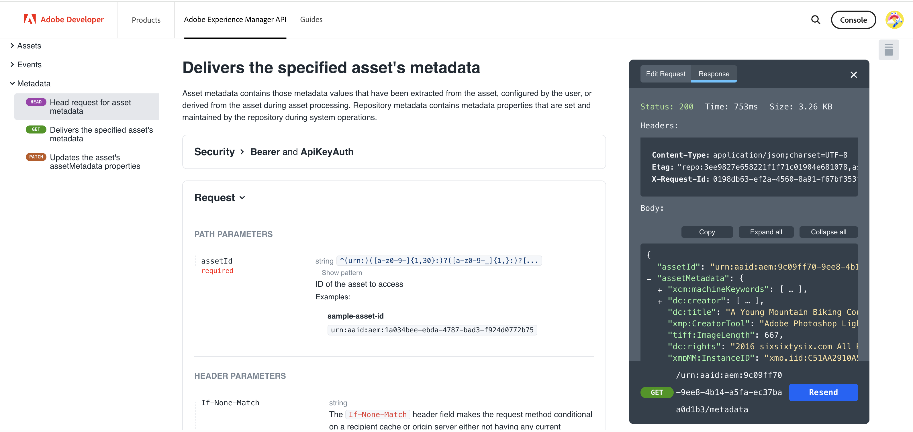
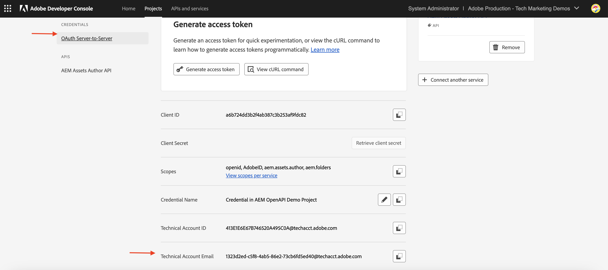
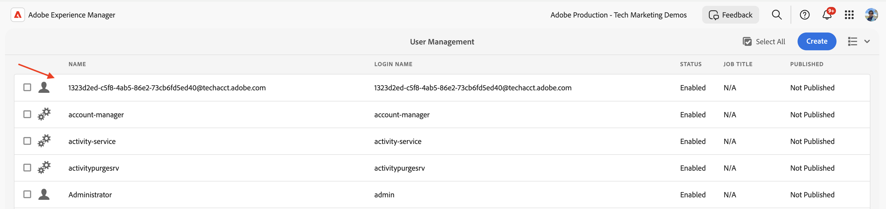
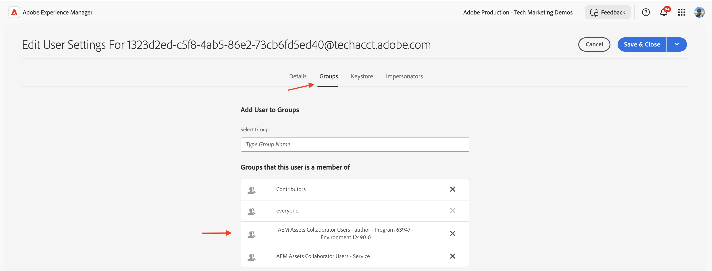
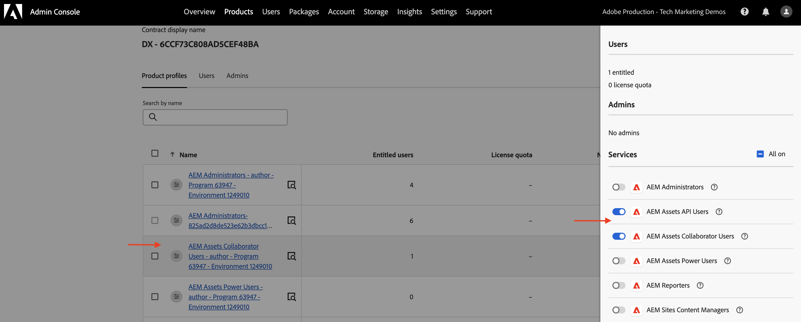
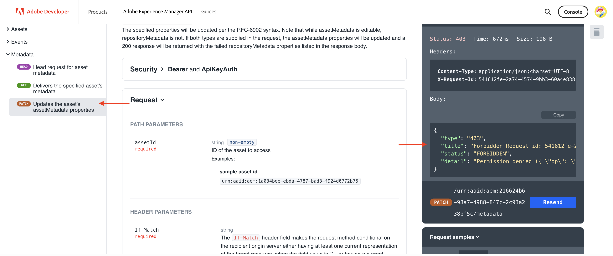

# Invoke OpenAPI-based AEM APIs using OAuth Server-to-Server authentication

Learn how to invoke OpenAPI-based AEM APIs on AEM as a Cloud Service from custom applications using _OAuth Server-to-Server_ authentication.

The OAuth Server-to-Server authentication is ideal for backend services needing API access without user interaction. It uses the OAuth 2.0 _client_credentials_ grant type to authenticate the client application.

## What you learn{#what-you-learn}

In this tutorial, you learn how to:

- Configure an Adobe Developer Console (ADC) project to access the Assets Author API using _OAuth Server-to-Server authentication_.

- Develop a sample NodeJS application that calls the Assets Author API to retrieve metadata for a specific asset.

Before you start, make sure you reviewed the following:

- [Accessing Adobe APIs and related concepts](../overview.md#accessing-adobe-apis-and-related-concepts) section.
- [Set up OpenAPI-based AEM APIs](../setup.md) article.

## Prerequisites

To complete this tutorial, you need:

- Modernized AEM as a Cloud Service environment with the following:
    - AEM Release `2024.10.18459.20241031T210302Z` or later.
    - New style Product Profiles (if environment was created before November 2024)

    See [Set up OpenAPI-based AEM APIs](../setup.md) article for more details.

- The sample [WKND Sites](https://github.com/adobe/aem-guides-wknd?#aem-wknd-sites-project) project must be deployed on to it.

- Access to the [Adobe Developer Console](https://developer.adobe.com/developer-console/docs/guides/getting-started).

- Install [Node.js](https://nodejs.org/en/) on your local machine to run the sample NodeJS application. 

## Development steps

The high-level development steps are:

1. Configure ADC Project
    1. Add the Assets Author API
    1. Configure its authentication method as OAuth Server-to-Server
    1. Associate Product Profile with the authentication configuration
1. Configure the AEM instance to enable ADC Project communication
1. Develop a sample NodeJS application
1. Verify the end-to-end flow

## Configure ADC Project

The configure ADC Project step is _repeated_ from the [Setup OpenAPI-based AEM APIs](../setup.md). It is repeated to add the Assets Author API and configure its authentication method as OAuth Server-to-Server.

>[!TIP]
>
>Make sure you have completed the **Enable AEM APIs access** step from the [Setup OpenAPI-based AEM APIs](../setup.md#enable-aem-apis-access) article. Without it, the Server-to-Server authentication option is not available.


1. From the [Adobe Developer Console](https://developer.adobe.com/console/projects), open the desired project.

1. To add AEM APIs, click on the **Add API** button.

    

1. In the _Add API_ dialog, filter by _Experience Cloud_ and select the **AEM Assets Author API** card and click **Next**.
    If you need a different OpenAPI-based AEM API, refer to the [Adobe Developer Documentation](https://developer.adobe.com/experience-cloud/experience-manager-apis/#openapi-based-apis) to find the one that matches your use case.

    The example below walks through adding the **AEM Assets Author API**.

    

    >[!TIP]
    >
    >If the desired **AEM API card** is disabled and _Why is this disabled?_ information shows the **License required** message one of the reasons could be that you have NOT modernized your AEM as a Cloud Service environment, see [Modernization of AEM as a Cloud Service environment](../setup.md#modernization-of-aem-as-a-cloud-service-environment) for more information.

1. Next, in the _Configure API_ dialog, select the **Server-to-Server** authentication option and click **Next**. The Server-to-Server authentication is ideal for backend services needing API access without user interaction.

    

    >[!TIP]
    >
    >If you do not see the Server-to-Server authentication option, it means that the user setting up the integration is not added as a Developer to the Product Profile where the Service is associated. See [Enable Server-to-Server authentication](../setup.md#enable-server-to-server-authentication) for more information.

1. Rename the credential for easier identification (if needed) and click **Next**. For demo purposes, the default name is used.

    
    
1. Select the **AEM Assets Collaborator Users - author - Program XXX - Environment XXX** Product Profile and click **Save**. As you can see, only the Product Profile associated with the AEM Assets API Users Service is available for selection.

    

1. Review the AEM API and authentication configuration.

    

    

## Configure AEM instance to enable ADC Project communication

Follow the instructions from the [Setup OpenAPI-based AEM APIs](../setup.md#configure-the-aem-instance-to-enable-adc-project-communication) article to configure the AEM instance to enable ADC Project communication.

## Develop a sample NodeJS application

Let's develop a sample NodeJS application that calls the Assets Author API.

You can use other programming languages like Java, Python, etc., to develop the application. 

For testing purposes, you can use the [Postman](https://www.postman.com/), [curl](https://curl.se/), or any other REST client to invoke the AEM APIs.

### Review the API

Before developing the application, let's review [deliver the specified asset's metadata](https://developer.adobe.com/experience-cloud/experience-manager-apis/api/experimental/assets/author/#operation/getAssetMetadata) endpoint from the _Assets Author API_. The API syntax is:

```http
GET https://{bucket}.adobeaemcloud.com/adobe/../assets/{assetId}/metadata
```

To retrieve the metadata of a specific asset, you need the `bucket` and `assetId` values. The `bucket` is the AEM instance name without the Adobe domain name (.adobeaemcloud.com), for example, `author-p63947-e1420428`. 

The `assetId` is the JCR UUID of the asset with the `urn:aaid:aem:` prefix, for example, `urn:aaid:aem:a200faf1-6d12-4abc-bc16-1b9a21f870da`. There are multiple ways to get the `assetId`:

- Append the AEM asset path `.json` extension to get the asset metadata. For example, `https://author-p63947-e1420429.adobeaemcloud.com/content/dam/wknd-shared/en/adventures/cycling-southern-utah/adobestock-221043703.jpg.json` and look for the `jcr:uuid` property.

- Alternatively, you can get the `assetId` by inspecting the asset in the browser's element inspector. Look for the `data-id="urn:aaid:aem:..."` attribute.

    

### Invoke the API using the browser

Before developing the application, let's invoke the API using the **Try it** feature in the [API documentation](https://developer.adobe.com/experience-cloud/experience-manager-apis/api/stable/assets/author/). 

1. Open the [Assets Author API documentation](https://developer.adobe.com/experience-cloud/experience-manager-apis/api/stable/assets/author/) in the browser.

1. Expand the _Metadata_ section and click on the **Delivers the specified asset's metadata** option.

1. In the right pane, click on the **Try it** button.
    

1. Enter the following values:

    | Section | Parameter | Value |
    | --- | --- | --- |
    || bucket | The AEM instance name without the Adobe domain name (.adobeaemcloud.com), for example, `author-p63947-e1420428`. |
    | **Security** | Bearer Token | Use the access token from the ADC Project's OAuth Server-to-Server credential. |
    | **Security** | X-Api-Key | Use the `ClientID` value from the ADC Project's OAuth Server-to-Server credential. |
    | **Parameters** | assetId | The unique identifier for the asset in AEM, for example, `urn:aaid:aem:a200faf1-6d12-4abc-bc16-1b9a21f870da` |
    | **Parameters** | X-Adobe-Accept-Experimental | 1 |

    

    

1. Click **Send** to invoke the API, and review the response in the **Response** tab.

    

The above steps confirm the modernization of the AEM as a Cloud Service environment, enabling AEM APIs access. It also confirms the successful configuration of the ADC Project, and the OAuth Server-to-Server credential ClientID communication with the AEM Author instance.

### Sample NodeJS application

Let's develop a sample NodeJS application. 

To develop the application, you can either use the _Run-the-sample-application_ or the _Step-by-step-development_ instructions.

>[!BEGINTABS]

>[!TAB Run-the-sample-application]

1. Download the sample [demo-nodejs-app-to-invoke-aem-openapi](../assets/s2s/demo-nodejs-app-to-invoke-aem-openapi.zip) application zip file and extract it.

1. Navigate to the extracted folder and install the dependencies.

    ```bash
    $ npm install
    ```

1. Replace the placeholders in the `.env` file with the actual values from the ADC Project's OAuth Server-to-Server credential.

1. Replace the `<BUCKETNAME>` and `<ASSETID>` in the `src/index.js` file with the actual values.

1. Run the NodeJS application.

    ```bash
    $ node src/index.js
    ```

>[!TAB Step-by-step-development]

1. Create a new NodeJS project.

    ```bash
    $ mkdir demo-nodejs-app-to-invoke-aem-openapi
    $ cd demo-nodejs-app-to-invoke-aem-openapi
    $ npm init -y
    ```
    
1. Install the _fetch_ and _dotenv_ library to make HTTP requests and read the environment variables respectively.

    ```bash
    $ npm install node-fetch
    $ npm install dotenv
    ```

1. Open the project in your favorite code editor and update the `package.json` file to add the `type` to `module`.

    ```json
    {
        ...
        "version": "1.0.0",
        "type": "module",
        "main": "index.js",
        ...
    }
    ```

1. Create `.env` file and add the following configuration. Replace the placeholders with the actual values from the ADC Project's OAuth Server-to-Server credential.

    ```properties
    CLIENT_ID=<ADC Project OAuth Server-to-Server credential ClientID>
    CLIENT_SECRET=<ADC Project OAuth Server-to-Server credential Client Secret>
    SCOPES=<ADC Project OAuth Server-to-Server credential Scopes>
    ```

1. Create `src/index.js` file and add the following code, and replace the `<BUCKETNAME>` and `<ASSETID>` with the actual values.

    ```javascript
    // Import the dotenv configuration to load environment variables from the .env file
    import "dotenv/config";

    // Import the fetch function to make HTTP requests
    import fetch from "node-fetch";

    // REPLACE THE FOLLOWING VALUES WITH YOUR OWN
    const bucket = "<BUCKETNAME>"; // Bucket name is the AEM instance name (e.g. author-p63947-e1420428)
    const assetId = "<ASSETID>"; // Asset ID is the unique identifier for the asset in AEM (e.g. urn:aaid:aem:a200faf1-6d12-4abc-bc16-1b9a21f870da). You can get it by inspecting the asset in browser's element inspector, look for data-id="urn:aaid:aem:..."

    // Load environment variables for authentication
    const clientId = process.env.CLIENT_ID; // Adobe IMS client ID
    const clientSecret = process.env.CLIENT_SECRET; // Adobe IMS client secret
    const scopes = process.env.SCOPES; // Scope for the API access

    // Adobe IMS endpoint for obtaining an access token
    const adobeIMSV3TokenEndpointURL =
    "https://ims-na1.adobelogin.com/ims/token/v3";

    // Function to obtain an access token from Adobe IMS
    const getAccessToken = async () => {
        console.log("Getting access token from IMS"); // Log process initiation
        //console.log("Client ID: " + clientId); // Display client ID for debugging purposes

        // Configure the HTTP POST request to fetch the access token
        const options = {
            method: "POST",
            headers: {
            "Content-Type": "application/x-www-form-urlencoded", // Specify form data content type
            },
            // Send client ID, client secret, and scopes as the request body
            body: `grant_type=client_credentials&client_id=${clientId}&client_secret=${clientSecret}&scope=${scopes}`,
        };

        // Make the HTTP request to fetch the access token
        const response = await fetch(adobeIMSV3TokenEndpointURL, options);

        //console.log("Response status: " + response.status); // Log the HTTP status for debugging

        const responseJSON = await response.json(); // Parse the JSON response

        console.log("Access token received"); // Log success message

        // Return the access token
        return responseJSON.access_token;
    };

    // Function to retrieve metadata for a specific asset from AEM
    const getAssetMetadat = async () => {
        // Fetch the access token using the getAccessToken function
        const accessToken = await getAccessToken();

        console.log("Getting asset metadata from AEM");

        // Invoke the Assets Author API to retrieve metadata for a specific asset
        const resp = await fetch(
            `https://${bucket}.adobeaemcloud.com/adobe/../assets/${assetId}/metadata`, // Construct the URL with bucket and asset ID
            {
            method: "GET",
            headers: {
                "If-None-Match": "string", // Header to handle caching (not critical for this tutorial)
                "X-Adobe-Accept-Experimental": "1", // Header to enable experimental Adobe API features
                Authorization: "Bearer " + accessToken, // Provide the access token for authorization
                "X-Api-Key": clientId, // Include the OAuth S2S ClientId for identification
            },
            }
        );

        const data = await resp.json(); // Parse the JSON response

        console.log("Asset metadata received"); // Log success message
        console.log(data); // Display the retrieved metadata
    };

    // Call the getAssets function to start the process
    getAssetMetadat();
    ```

1. Run the NodeJS application.

    ```bash
    $ node src/index.js
    ```

>[!ENDTABS]

### API response

Upon successful execution, the API response is displayed in the console. The response contains the metadata of the specified asset.

```json
{
  "assetId": "urn:aaid:aem:9c09ff70-9ee8-4b14-a5fa-ec37baa0d1b3",
  "assetMetadata": {    
    ...
    "dc:title": "A Young Mountain Biking Couple Takes A Minute To Take In The Scenery",
    "xmp:CreatorTool": "Adobe Photoshop Lightroom Classic 7.5 (Macintosh)",
    ...
  },
  "repositoryMetadata": {
    ...
    "repo:name": "adobestock-221043703.jpg",
    "repo:path": "/content/dam/wknd-shared/en/adventures/cycling-southern-utah/adobestock-221043703.jpg",
    "repo:state": "ACTIVE",
    ...
  }
}
```

Congratulations! You have successfully invoked the OpenAPI-based AEM APIs from your custom application using OAuth Server-to-Server authentication.

### Review the application code

The key callouts from the sample NodeJS application code are:

1. **IMS Authentication**: Fetches an access token using OAuth Server-to-Server credentials setup in the ADC Project.

    ```javascript

    // Function to obtain an access token from Adobe IMS
    const getAccessToken = async () => {

        // Configure the HTTP POST request to fetch the access token
        const options = {
            method: "POST",
            headers: {
            "Content-Type": "application/x-www-form-urlencoded", // Specify form data content type
            },
            // Send client ID, client secret, and scopes as the request body
            body: `grant_type=client_credentials&client_id=${clientId}&client_secret=${clientSecret}&scope=${scopes}`,
        };

        // Make the HTTP request to fetch the access token from Adobe IMS token endpoint https://ims-na1.adobelogin.com/ims/token/v3
        const response = await fetch(adobeIMSV3TokenEndpointURL, options);

        const responseJSON = await response.json(); // Parse the JSON response

        // Return the access token
        return responseJSON.access_token;
    };
    ...
    ```

1. **API Invocation**: Invokes the Assets Author API to retrieve metadata for a specific asset by providing the access token for authorization.

    ```javascript
    // Function to retrieve metadata for a specific asset from AEM
    const getAssetMetadat = async () => {
        // Fetch the access token using the getAccessToken function
        const accessToken = await getAccessToken();

        console.log("Getting asset metadata from AEM");

        // Invoke the Assets Author API to retrieve metadata for a specific asset
        const resp = await fetch(
            `https://${bucket}.adobeaemcloud.com/adobe/../assets/${assetId}/metadata`, // Construct the URL with bucket and asset ID
            {
            method: "GET",
            headers: {
                "If-None-Match": "string", // Header to handle caching (not critical for this tutorial)
                "X-Adobe-Accept-Experimental": "1", // Header to enable experimental Adobe API features
                Authorization: "Bearer " + accessToken, // Provide the access token for authorization
                "X-Api-Key": clientId, // Include the OAuth S2S ClientId for identification
            },
            }
        );

        const data = await resp.json(); // Parse the JSON response

        console.log("Asset metadata received"); // Log success message
        console.log(data); // Display the retrieved metadata
    };
    ...
    ```

## Under the hood

Upon successful API invocation, a user representing the ADC Project's OAuth Server-to-Server credential is created in the AEM Author service, along with the user groups that match the Product Profile and Services configuration. The _technical account user_ is associated with the Product Profile and _Services_ user group, which has the necessary permissions to _READ_ the asset metadata.

To verify the technical account user and user group creation, follow these steps:

- In the ADC Project, navigate to the **OAuth Server-to-Server** credential configuration. Note the **Technical Account Email** value.

    

- In the AEM Author service, navigate to the **Tools** > **Security** > **Users** and search for the **Technical Account Email** value.

    

- Click on the technical account user to view the user details, like **Groups** membership. As shown below, the technical account user is associated with the **AEM Assets Collaborator Users - author - Program XXX - Environment XXX** and **AEM Assets Collaborator Users - Service** user groups.

    

- Note that the technical account user is associated with the **AEM Assets Collaborator Users - author - Program XXX - Environment XXX** Product Profile. The Product Profile is associated with the **AEM Assets API Users** and **AEM Assets Collaborator Users** Services.

    

- The Product Profile and technical account user association can be verified in the **Product Profiles** 's **API credentials** tab.

    

## 403 error for non-GET requests

To _READ_ the asset metadata, the technical account user created for the OAuth Server-to-Server credential has the necessary permissions via the Services user group (for example, AEM Assets Collaborator Users - Service). 

However, to _Create, Update, Delete_ (CUD) the asset metadata, the technical account user requires additional permissions. You can verify it by invoking the API with a non-GET request (for example, PATCH, DELETE) and observe the 403 error response.

Let's invoke the _PATCH_ request to update the asset metadata and observe the 403 error response.

- Open the [Assets Author API documentation](https://developer.adobe.com/experience-cloud/experience-manager-apis/api/experimental/assets/author/) in the browser.

- Enter the following values:

    | Section | Parameter | Value |
    | --- | --- | --- |
    |**Bucket**|  | The AEM instance name without the Adobe domain name (.adobeaemcloud.com), for example, `author-p63947-e1420428`. |
    | **Security** | Bearer Token | Use the access token from the ADC Project's OAuth Server-to-Server credential. |
    | **Security** | X-Api-Key | Use the `ClientID` value from the ADC Project's OAuth Server-to-Server credential. |
    | **Body** |  | `[{ "op": "add", "path": "foo","value": "bar"}]` |
    | **Parameters** | assetId | The unique identifier for the asset in AEM, for example, `urn:aaid:aem:a200faf1-6d12-4abc-bc16-1b9a21f870da` |
    | **Parameters** | X-Adobe-Accept-Experimental| * |
    | **Parameters** | X-Adobe-Accept-Experimental | 1 |

- Click **Send** to invoke the _PATCH_ request and observe the 403 error response.

    

To fix the 403 error, you have two options:

- In ADC Project, update the OAuth Server-to-Server credential's associated Product Profile with an appropriate Product Profile that has the necessary permissions to _Create, Update, Delete_ (CUD) the asset metadata, for example, **AEM Administrators - author - Program XXX - Environment XXX**. For more information, see [How To - API's connected credentials and Product Profile management](../how-to/credentials-and-product-profile-management.md) article.

- Using AEM Project, update the associated AEM Service user group's (for example, AEM Assets Collaborator Users - Service) permissions in AEM Author to allow _Create, Update, Delete_ (CUD) of the asset metadata. For more information, see [How To - AEM Service user group permission management](../how-to/services-user-group-permission-management.md) article.

## Summary

In this tutorial, you learned how to invoke OpenAPI-based AEM APIs from custom applications. You enabled AEM APIs access, created and configured an Adobe Developer Console (ADC) project. 
In the ADC Project, you added the AEM APIs, configured its authentication type, and associated the Product Profile. You also configured the AEM instance to enable ADC Project communication and developed a sample NodeJS application that calls the Assets Author API.

## Additional resources

- [OAuth Server-to-Server credential implementation guide](https://developer.adobe.com/developer-console/docs/guides/authentication/ServerToServerAuthentication/implementation)
