# Invoke OpenAPI-based AEM APIs using OAuth Single Page App

Learn how to invoke OpenAPI-based AEM APIs on AEM as a Cloud Service using **OAuth Single Page App authentication**. It follows the OAuth 2.0 PKCE (Proof Key for Code Exchange) flow for user-based authentication in a Single Page Application (SPA).

OAuth Single Page App authentication is ideal for JavaScript-based applications running in the browser. Whether they lack a backend server or need to fetch access tokens to interact with AEM APIs on behalf of a user.

The PKCE flow extends the OAuth 2.0 _authorization_code_ grant type, enhancing security by preventing authorization code interception. For more information, see the [Difference between OAuth Server-to-Server vs Web App vs Single Page App credentials](../overview.md#difference-between-oauth-server-to-server-vs-web-app-vs-single-page-app-credentials) section.

## What you learn{#what-you-learn}

In this tutorial, you learn how to:

- Configure an Adobe Developer Console (ADC) project to access the OpenAPI-based AEM APIs using _OAuth Single Page App_ authentication or commonly known as _OAuth 2.0 PKCE flow_.

- Implement the OAuth Single Page App authentication flow in a custom SPA.
    - IMS user authentication and app authorization.
    - Access token retrieval using OAuth 2.0 PKCE flow.
    - Use the access token to invoke OpenAPI-based AEM APIs.

Before you start, make sure you reviewed the following:

- [Accessing Adobe APIs and related concepts](../overview.md#accessing-adobe-apis-and-related-concepts) section.
- [Set up OpenAPI-based AEM APIs](../setup.md) article.

## WKND SPA overview and functional flow{#wknd-spa-overview-and-functional-flow}

Let's explore what the WKND SPA is, how it's built, and how it functions.

The WKND SPA is a **React-based Single Page Application** that demonstrates how to securely obtain a user-specific access token and interact with AEM APIs directly from the client side. It implements the OAuth 2.0 PKCE authentication flow through Adobe IMS and integrates with two key AEM APIs:

1. **Sites API**: For accessing Content Fragment models
1. **Assets API**: For managing DAM folders

The Adobe Developer Console (ADC) project is configured to enable OAuth Single Page App authentication, providing the required **client_id** to initiate the OAuth 2.0 PKCE flow.

>[!IMPORTANT]
>
>The ADC Project does NOT provide a _client_secret_. Instead, the SPA generates a _code_verifier_ and _code_challenge_ to securely exchange the authorization code for an _access token_. It eliminates the need to store a client secret on the client side, enhancing security.


>[!VIDEO](https://video.tv.adobe.com/v/3456964?quality=12&learn=on)


The following diagram illustrates the functional flow of the WKND SPA _getting user-specific access token to invoke OpenAPI-based AEM APIs_:

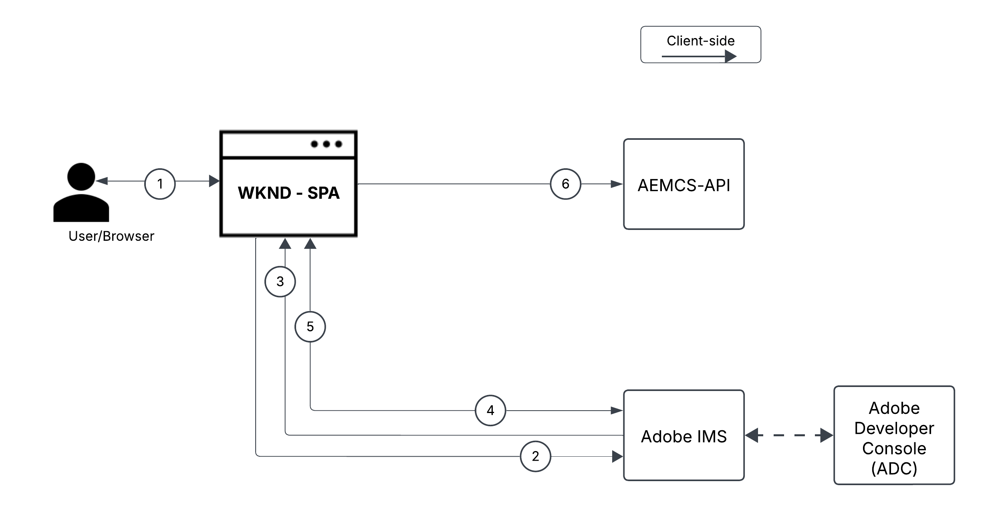

1. The SPA initiates the authentication flow by directing the user to the Adobe Identity Management System (IMS) via an authorization request.
1. As part of the authorization request, the SPA sends the _client_id_, _redirect_uri_, and _code_challenge_ to IMS, following the OAuth 2.0 PKCE flow. The SPA generates a random _code_verifier_, hashes it using SHA-256, and Base64 encodes the result to create the _code_challenge_.
1. The IMS authenticates the user and, upon successful authentication, issues an _authorization_code_, which is sent back to the SPA via the _redirect_uri_.
1. The SPA exchanges the _authorization_code_ for an _access token_ by sending a POST request to the IMS token endpoint. It includes the _code_verifier_ in the request to validate the _code_challenge_ sent earlier. This ensures that the authorization request (Step 2) and token request (Step 4) are linked to the same authentication flow, preventing interception attacks.
1. The IMS validates the _code_verifier_ and returns the user-specific _access token_.
1. The SPA includes the _access token_ in API requests to AEM to authenticate and retrieve user-specific content.

The WKND SPA is a [React](https://react.dev/)-based application and it uses the[React Context](https://react.dev/reference/react/createContext) for authentication state management, [React Router](https://reactrouter.com/home) for navigation.

Other SPA frameworks like Angular, Vue, or vanilla JavaScript can be used to create SPA that integrate with the Adobe APIs using the approaches illustrated in this tutorial.

## How to use this tutorial{#how-to-use-this-tutorial}

You can approach this tutorial in two ways:

- [Review SPA key code snippets](#review-spa-key-code-snippets): Understand the OAuth Single Page App authentication flow and explore the key API call implementations in the WKND SPA.
- [Setup and run the SPA](#setup-and-run-the-spa): Follow step-by-step instructions to configure and run the WKND SPA on your local machine.

Choose the path that best fits your needs!

## Review SPA key code snippets{#review-spa-key-code-snippets}

Let's dive into the key code snippets from the WKND SPA that demonstrate how to:

- Obtain a user-specific access token using the OAuth Single Page App authentication flow.

- Invoke OpenAPI-based AEM APIs directly from the client side.

These snippets help you understand the authentication process and API interactions within the SPA.

### Download the SPA code{#download-the-spa-code}

1. Download the [WKND SPA & AEM APIs - Demo App](../assets/spa/wknd-spa-with-aemapis-demo.zip) zip file and extract it.

1. Navigate to the extracted folder and open the `.env.example` file in your favorite code editor. Review the required configuration parameters.

    ```plaintext
    ########################################################################
    # Adobe IMS, Adobe Developer Console (ADC), and AEM as a Cloud Service Information
    ########################################################################
    # Adobe IMS OAuth endpoints
    REACT_APP_ADOBE_IMS_AUTHORIZATION_ENDPOINT=https://ims-na1.adobelogin.com/ims/authorize/v2
    REACT_APP_ADOBE_IMS_TOKEN_ENDPOINT=https://ims-na1.adobelogin.com/ims/token/v3

    # Adobe Developer Console (ADC) Project's OAuth Single-Page App credential
    REACT_APP_ADC_CLIENT_ID=<ADC Project OAuth Single-Page App credential ClientID>
    REACT_APP_ADC_SCOPES=<ADC Project OAuth Single-Page App credential Scopes>

    # AEM Assets Information
    REACT_APP_AEM_ASSET_HOSTNAME=<AEMCS Hostname, e.g., https://author-p63947-e1502138.adobeaemcloud.com/>

    ################################################
    # Single Page Application Information
    ################################################

    # Enable HTTPS for local development
    HTTPS=true
    PORT=3001

    # SSL Certificate and Key for local development 
    SSL_CRT_FILE=./ssl/server.crt
    SSL_KEY_FILE=./ssl/server.key

    # The URL to which the user will be redirected after the OAuth flow is complete
    REACT_APP_REDIRECT_URI=https://localhost:3000/callback
    ```

    You need to replace the placeholders with the actual values from the Adobe Developer Console (ADC) Project and AEM as a Cloud Service Assets instance.

### IMS user authentication and SPA authorization{#ims-user-authentication-and-spa-authorization}

Let's explore the code that handles IMS user authentication and SPA authorization. To retrieve content fragment models and DAM folders, the user must authenticate with Adobe IMS and grant the WKND SPA permission to access AEM APIs on their behalf.

During the initial login, the user is prompted to provide consent, allowing the WKND SPA to securely access the required resources.

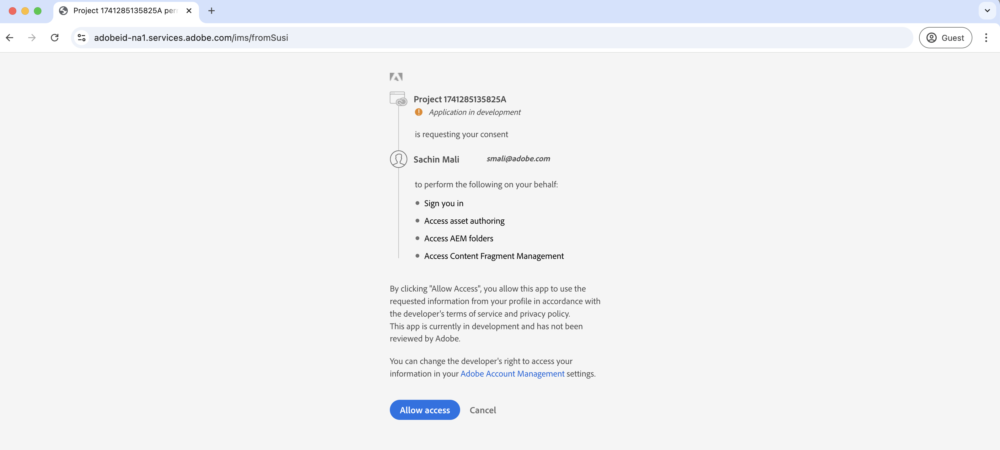

1. In `src/context/IMSAuthContext.js` file, the `login` function initiates the IMS user authentication and app authorization flow. It generates a random `code_verifier` and `code_challenge` to securely exchange the `code` for an access token. The `code_verifier` is stored in the local storage for later use. As mentioned earlier, the SPA does not store or use the `client_secret`, it generates one on the fly and uses it in two steps: `authorize` and `token` requests.

    ```javascript
    ...
    const login = async () => {
        try {
            const codeVerifier = generateCodeVerifier();
            const codeChallenge = generateCodeChallenge(codeVerifier);

            localStorage.setItem(STORAGE_KEYS.CODE_VERIFIER, codeVerifier);

            const params = new URLSearchParams(
                getAuthParams(AUTH_METHODS.S256, codeChallenge, codeVerifier)
            );

            window.location.href = `${
                APP_CONFIG.adobe.ims.authorizationEndpoint //https://ims-na1.adobelogin.com/ims/authorize/v2
            }?${params.toString()}`;
        } catch (error) {
            console.error("Login initialization failed:", error);
            throw error;
        }
    };
    ...

    // Generate a random code verifier
    export function generateCodeVerifier() {
        const array = new Uint8Array(32);
        window.crypto.getRandomValues(array);
        const wordArray = CryptoJS.lib.WordArray.create(array);
        return base64URLEncode(wordArray);
    }

    // Generate code challenge using SHA-256
    export function generateCodeChallenge(codeVerifier) {
        const hash = CryptoJS.SHA256(codeVerifier);
        return base64URLEncode(hash);
    }

    // Get authorization URL parameters
    const getAuthParams = useCallback((method, codeChallenge, codeVerifier) => {
        const baseParams = {
            client_id: APP_CONFIG.adobe.adc.clientId, // ADC Project OAuth Single-Page App credential ClientID
            scope: APP_CONFIG.adobe.adc.scopes, // ADC Project OAuth Single-Page App credential Scopes
            response_type: "code",
            redirect_uri: APP_CONFIG.adobe.spa.redirectUri, // SPA redirect URI https://localhost:3000/callback
            code_challenge_method: method, // S256 or plain
        };

        return {
            ...baseParams,
            code_challenge:
                method === AUTH_METHODS.S256 ? codeChallenge : codeVerifier,
            };
    }, []);    
    ...
    ```

    If the user is not authenticated against the Adobe IMS, the Adobe ID login page is displayed asking the user to authenticate.

    If already authenticated, the user is redirected back to the specified _redirect_uri_ of the WKND SPA with an _authorization_code_.

### Access token retrieval using OAuth 2.0 PKCE flow{#access-token-retrieval-using-oauth-20-pkce-flow}

The WKND SPA securely exchanges the _authorization_code_ with the Adobe IMS for a user-specific access token using the _client_id_ and _code_verifier_.

1. In the `src/context/IMSAuthContext.js` file, the `exchangeCodeForToken` function exchanges the _authorization_code_ for a user-specific access token.

    ```javascript
    ...
    // Handle the callback from the Adobe IMS authorization endpoint
    const handleCallback = async (code) => {
        if (authState.isProcessingCallback) return;

        try {
            updateAuthState({ isProcessingCallback: true });

            const data = await exchangeCodeForToken(code);

            if (data.access_token) {
                handleStorageToken(data.access_token);
                localStorage.removeItem(STORAGE_KEYS.CODE_VERIFIER);
            }
        } catch (error) {
            console.error("Error exchanging code for token:", error);
            throw error;
        } finally {
            updateAuthState({ isProcessingCallback: false });
        }
    };

    ...
    // Exchange the authorization code for an access token
    const exchangeCodeForToken = useCallback(async (code) => {
        const codeVerifier = localStorage.getItem(STORAGE_KEYS.CODE_VERIFIER);

        if (!codeVerifier) {
            throw new Error("No code verifier found");
        }

        //https://ims-na1.adobelogin.com/ims/token/v3
        const response = await fetch(APP_CONFIG.adobe.ims.tokenEndpoint, {
            method: "POST",
            headers: { "Content-Type": "application/x-www-form-urlencoded" },
            body: new URLSearchParams({
                grant_type: "authorization_code",
                client_id: APP_CONFIG.adobe.adc.clientId, // ADC Project OAuth Single-Page App credential ClientID
                code_verifier: codeVerifier, // Code verifier generated during login
                code, // Authorization code received from the IMS
                redirect_uri: `${window.location.origin}/callback`,
            }),
        });

        if (!response.ok) {
            throw new Error("Token request failed");
        }

        return response.json();
    }, []);

    const handleStorageToken = useCallback(
        (token) => {
            if (token) {
                localStorage.setItem(STORAGE_KEYS.ACCESS_TOKEN, token);
                updateAuthState({ isLoggedIn: true, accessToken: token });
            }
        },
        [updateAuthState]
    );
    ...
    ```

    The access token is stored in the browser's local storage and used in the subsequent API calls to the AEM APIs.

### Accessing OpenAPI-based AEM APIs using the access token{#accessing-openapi-based-aem-apis-using-the-access-token}

The WKND SPA uses the user-specific access token to invoke the content fragment models and DAM folders API endpoints.

In the `src/components/InvokeAemApis.js` file, the `fetchContentFragmentModels` function demonstrates how to use the access token to invoke the OpenAPI-based AEM APIs from the client side.

```javascript
    ...
  // Fetch Content Fragment Models
  const fetchContentFragmentModels = useCallback(async () => {
    try {
      updateState({ isLoading: true, error: null });
      const data = await makeApiRequest({
        endpoint: `${API_PATHS.CF_MODELS}?cursor=0&limit=10&projection=summary`,
      });
      updateState({ cfModels: data.items });
    } catch (err) {
      updateState({ error: err.message });
      console.error("Error fetching CF models:", err);
    } finally {
      updateState({ isLoading: false });
    }
  }, [makeApiRequest, updateState]);

  // Common API request helper
  const makeApiRequest = useCallback(
    async ({ endpoint, method = "GET", passAPIKey = false, body = null }) => {
    
      // Get the access token from the local storage
      const token = localStorage.getItem("adobe_ims_access_token");
      if (!token) {
        throw new Error("No access token available. Please login again.");
      }

      const headers = {
        Authorization: `Bearer ${token}`,
        "Content-Type": "application/json",
        ...(passAPIKey && { "x-api-key": APP_CONFIG.adobe.adc.clientId }),
      };

      const response = await fetch(
        `${APP_CONFIG.adobe.aem.hostname}${endpoint}`,
        {
          method,
          headers,
          ...(body && { body: JSON.stringify(body) }),
        }
      );

      if (!response.ok) {
        throw new Error(`API request failed: ${response.statusText}`);
      }

      return method === "DELETE" ? null : response.json();
    },
    []
  );
  ...
```

## Setup and run the SPA{#setup-and-run-the-spa}

Let's configure and run the WKND SPA on your local machine to understand the OAuth Single Page App authentication flow and API calls.

### Prerequisites{#prerequisites}

To complete this tutorial, you need:

- Modernized AEM as a Cloud Service environment with the following:
    - AEM Release `2024.10.18459.20241031T210302Z` or later.
    - New style Product Profiles (if environment was created before November 2024)

  See the [Set-up OpenAPI-based AEM APIs](../setup.md) article for more details.

- The sample [WKND Sites](https://github.com/adobe/aem-guides-wknd?#aem-wknd-sites-project) project must be deployed on to it.

- Access to the [Adobe Developer Console](https://developer.adobe.com/developer-console/docs/guides/getting-started).

- Install [Node.js](https://nodejs.org/en/) on your local machine to run the sample NodeJS application.

### Development steps{#development-steps}

The high-level development steps are:

1. Configure ADC Project
    1. Add the Assets and Sites APIs.
    1. Configure OAuth Single Page App credentials.
1. Configure the AEM instance 
    1. To enable ADC Project communication
    1. To allow the SPA to access the AEM APIs by configuring the CORS settings.
1. Configure and run the WKND SPA on your local machine
1. Verify the end-to-end flow

### Configure ADC Project{#configure-adc-project}

The configure ADC Project step is _repeated_ from the [Setup OpenAPI-based AEM APIs](../setup.md). It is repeated to add the Assets, Sites API and configure its authentication method as OAuth Single Page App.

1. From the [Adobe Developer Console](https://developer.adobe.com/console/projects), open the desired project.

1. To add AEM APIs, click on the **Add API** button.

    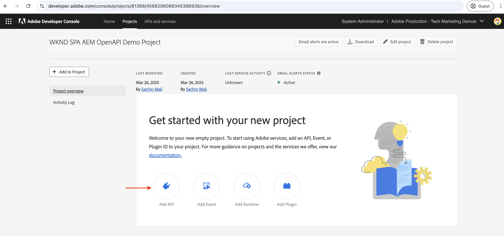

1. In the _Add API_ dialog, filter by _Experience Cloud_ and select the **AEM CS Sites Content Management** card and click **Next**.

    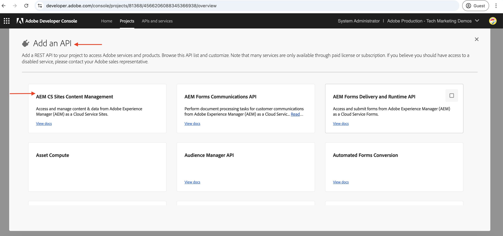

    >[!TIP]
    >
    >If the desired **AEM API card** is disabled and _Why is this disabled?_ information shows the **License required** message one of the reasons could be that you have NOT modernized your AEM as a Cloud Service environment, see [Modernization of AEM as a Cloud Service environment](../setup.md#modernization-of-aem-as-a-cloud-service-environment) for more information.

1. Next, in the _Configure API_ dialog, select the **User Authentication** authentication option and click **Next**.

    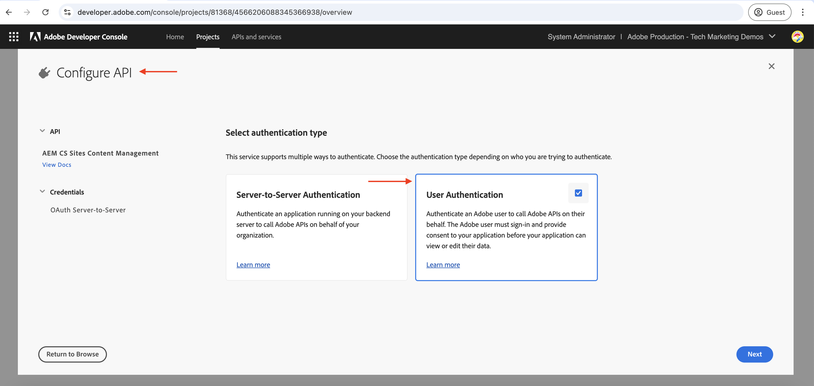

1. In the next _Configure API_ dialog, select the **OAuth Single-Page App** authentication option and click **Next**.

    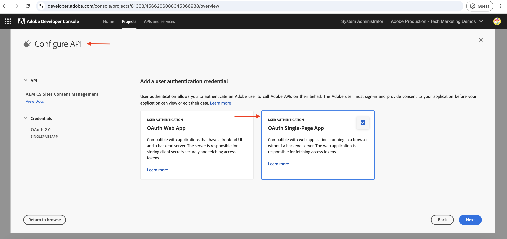

1. In the _Configure OAuth Single-Page App_ dialog, enter the following details and click **Next**.
    - Default redirect URI: `https://localhost:3001/callback`
    - Redirect URI pattern: `https://localhost:3001/callback`

    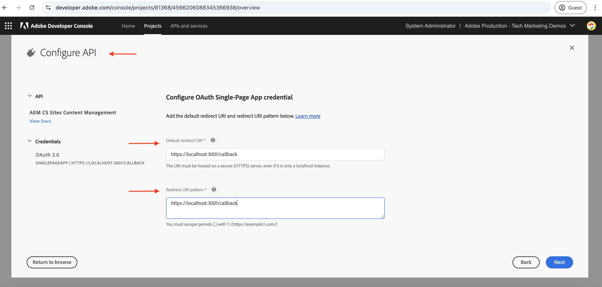

1. Review the available scopes and click **Save configured API**.

    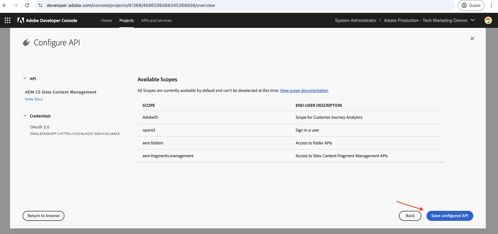

1. Repeat the above steps to add the **AEM Assets Author API**.

1. Review the AEM API and authentication configuration.

    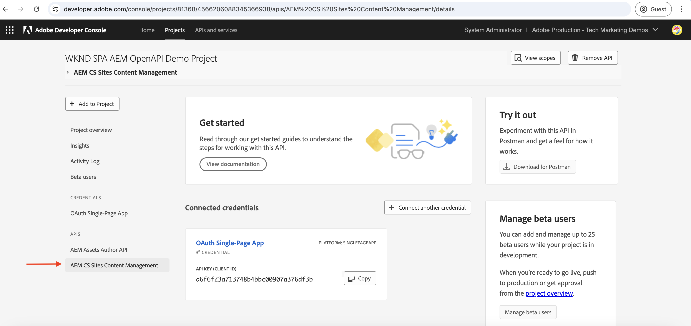

    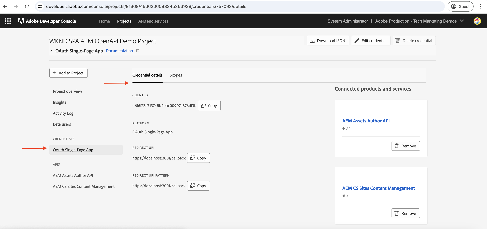

### Configure AEM instance to enable ADC Project communication{#configure-aem-instance-to-enable-adc-project-communication}

Follow the instructions from the [Setup OpenAPI-based AEM APIs](../setup.md#configure-the-aem-instance-to-enable-adc-project-communication) article to configure the AEM instance to enable ADC Project communication.

### AEM CORS configuration{#aem-cors-configuration}

AEM as a Cloud Service's Cross-Origin Resource Sharing (CORS) facilitates non-AEM web properties to make browser-based client-side calls to AEM APIs.

1. In AEM Project, locate or create the `com.adobe.granite.cors.impl.CORSPolicyImpl~wknd-graphql.cfg.json` file from the `/ui.config/src/main/content/jcr_root/apps/wknd/osgiconfig/config.author/` folder.

    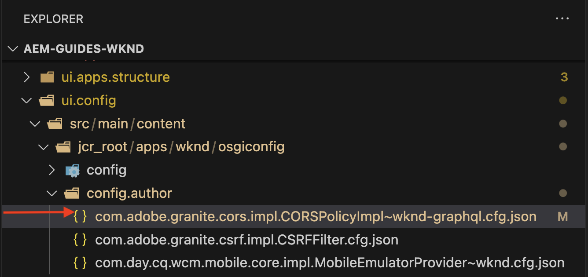

1. Add the following configuration to the file.

    ```json
    {
        "alloworigin":[
          ""
        ],
        "alloworiginregexp":[
          "https://localhost:.*",
          "http://localhost:.*"
        ],
        "allowedpaths": [
          "/adobe/sites/.*",
          "/graphql/execute.json.*",
          "/content/_cq_graphql/wknd-shared/endpoint.json",
          "/content/experience-fragments/.*"
        ],
        "supportedheaders": [
          "Origin",
          "Accept",
          "X-Requested-With",
          "Content-Type",
          "Access-Control-Request-Method",
          "Access-Control-Request-Headers",
          "Authorization"
        ],
        "supportedmethods":[
          "GET",
          "HEAD",
          "POST"
        ],
        "maxage:Integer": 1800,
        "supportscredentials": true,
        "exposedheaders":[ "" ]
    }
    ```

1. Commit the config changes and push the changes to the remote Git repository the Cloud Manager pipeline is connected to.

1. Deploy the above changes using the FullStack Pipeline in the Cloud Manager.    

### Configure and run the SPA{#configure-and-run-the-spa}

1. Download the [WKND SPA & AEM APIs - Demo App](../assets/spa/wknd-spa-with-aemapis-demo.zip) zip file and extract it.

1. Navigate to the extracted folder and copy the `.env.example` file to `.env`.

1. Update the `.env` file with the required configuration parameters from the Adobe Developer Console (ADC) Project and AEM as a Cloud Service environment. For example:

    ```plaintext
    ########################################################################
    # Adobe IMS, Adobe Developer Console (ADC), and AEM as a Cloud Service Information
    ########################################################################
    # Adobe IMS OAuth endpoints
    REACT_APP_ADOBE_IMS_AUTHORIZATION_ENDPOINT=https://ims-na1.adobelogin.com/ims/authorize/v2
    REACT_APP_ADOBE_IMS_TOKEN_ENDPOINT=https://ims-na1.adobelogin.com/ims/token/v3
    REACT_APP_ADOBE_IMS_USERINFO_ENDPOINT=https://ims-na1.adobelogin.com/ims/userinfo/v2

    # Adobe Developer Console (ADC) Project's OAuth Single-Page App credential
    REACT_APP_ADC_CLIENT_ID=ddsfs455a4a440c48c7474687c96945d
    REACT_APP_ADC_SCOPES=AdobeID,openid,aem.folders,aem.assets.author,aem.fragments.management

    # AEM Assets Information
    REACT_APP_AEM_ASSET_HOSTNAME=https://author-p69647-e1453424.adobeaemcloud.com/

    ################################################
    # Single Page Application Information
    ################################################

    # Enable HTTPS for local development
    HTTPS=true
    PORT=3001

    # SSL Certificate and Key for local development 
    SSL_CRT_FILE=./ssl/server.crt
    SSL_KEY_FILE=./ssl/server.key

    # The URL to which the user will be redirected after the OAuth flow is complete
    REACT_APP_REDIRECT_URI=https://localhost:3000/callback
    ```

1. Open a terminal and navigate to the extracted folder. Install the required dependencies and start the WKND SPA using the following command.

    ```bash
    $ npm install
    $ npm start
    ```

### Verify the end-to-end flow{#verify-the-end-to-end-flow}

1. Open a browser and navigate to `https://localhost:3001` to access the WKND SPA. Accept the self-signed certificate warning.

    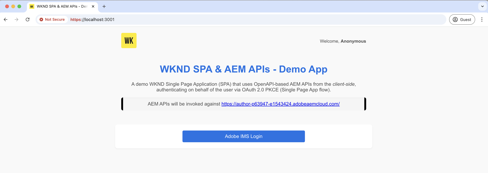

1. Click the **Adobe IMS Login** button to initiate the OAuth Single Page App authentication flow.

1. Authenticate against the Adobe IMS and provide the consent to allow the WKND SPA to access the resources on your behalf.

1. Upon successful authentication, you are redirected back to the WKND SPA's `/invoke-aem-apis` route and access token is stored in the browser's local storage.

    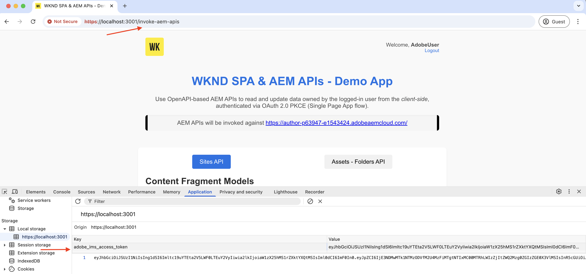

1. From the `https://localhost:3001/invoke-aem-apis` route, click the **Fetch Content Fragment Models** button to invoke the Content Fragment Models API. The SPA displays the list of content fragment models.

    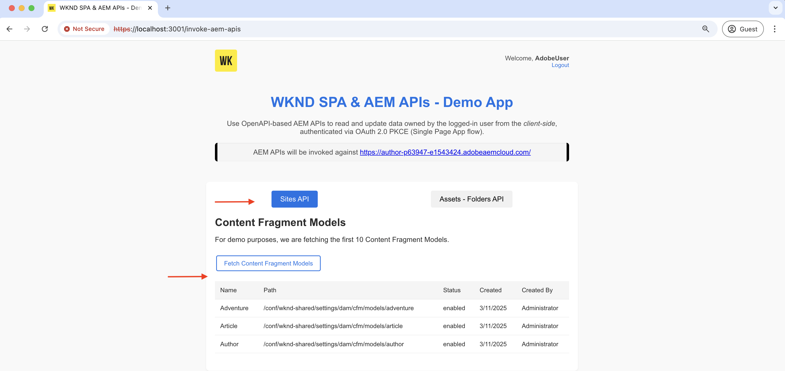

1. Likewise, in the **Assets - Folders API** tab, you can list, create and delete DAM folders.

    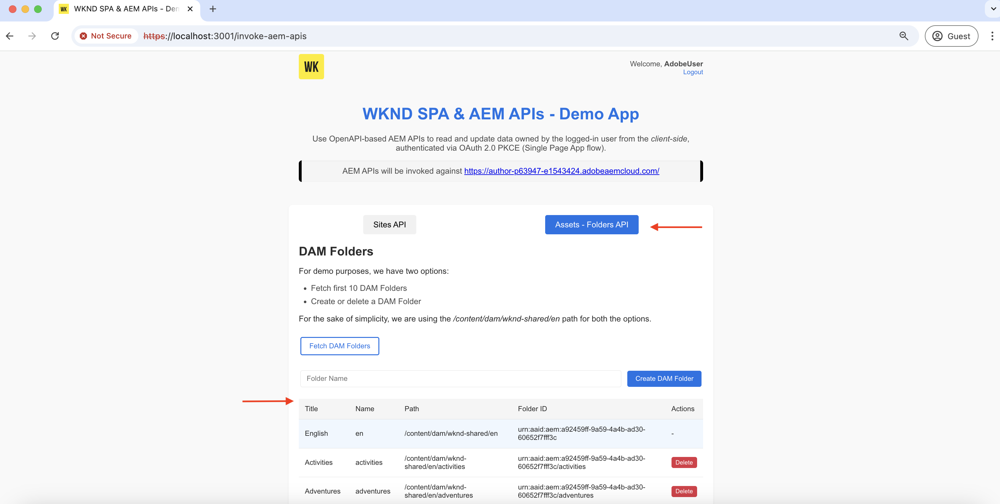

1. In the browser's developer tools, you can inspect the network requests and responses to understand the API calls.

    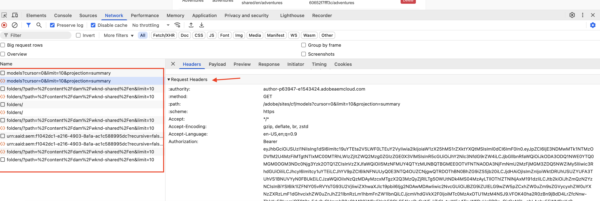

>[!IMPORTANT]
>
>If the authenticated user lacks the necessary permissions to list, create, or delete AEM resources, the API calls fails with a 403 Forbidden error. It ensures that, even if the user is authenticated and possesses a valid IMS access token, they cannot access AEM resources without the required permissions.

### Review the SPA code{#review-the-spa-code}

Let's review the high-level code structure and main entry points of the WKND SPA. The SPA is built using the React framework and uses the React Context API for authentication and state management.

1. The `src/App.js` file is the main entry point of the WKND SPA. The App component wraps the entire application and initializes the `IMSAuthProvider` context.

1. The `src/context/IMSAuthContext.js` creates the Adobe IMSAuthContext to provide the authentication state to the children components. It includes the login, logout, and handleCallback functions to initiate the OAuth Single Page App authentication flow.

1. The `src/components` folder contains various components to demonstrate the API calls to the AEM APIs. The `InvokeAemApis.js` component demonstrates how to use the access token to invoke the AEM APIs.

1. The `src/config/config.js` file loads the environment variables from the `.env` file and exports them for use in the application.

1. The `src/utils/auth.js` file contains utility functions to generate the code verifier and code challenge for the OAuth 2.0 PKCE flow.

1. The `ssl` folder contains the self-signed certificate and key files to run the local SSL HTTP proxy.

You can develop or integrate the existing SPA with the Adobe APIs using the approaches illustrated in this tutorial.

## Summary{#summary}

In this tutorial, you learned how to invoke OpenAPI-based AEM APIs on AEM as a Cloud Service using user-based authentication from a Single Page App (SPA) via OAuth 2.0 PKCE flow.

## Additional resources{#additional-resources}

- [Adobe Experience Manager as a Cloud Service APIs](https://developer.adobe.com/experience-cloud/experience-manager-apis/)
- [User Authentication Implementation Guide](https://developer.adobe.com/developer-console/docs/guides/authentication/UserAuthentication/implementation)
- [Authorize Request](https://developer.adobe.com/developer-console/docs/guides/authentication/UserAuthentication/ims#authorize-request)
- [Fetching Access tokens](https://developer.adobe.com/developer-console/docs/guides/authentication/UserAuthentication/ims#fetching-access-tokens)
