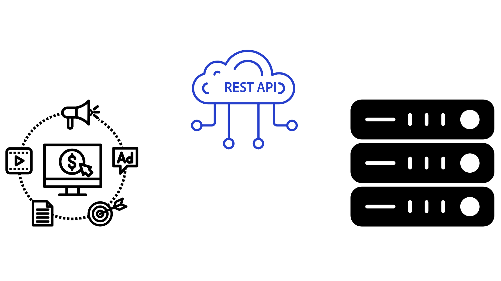
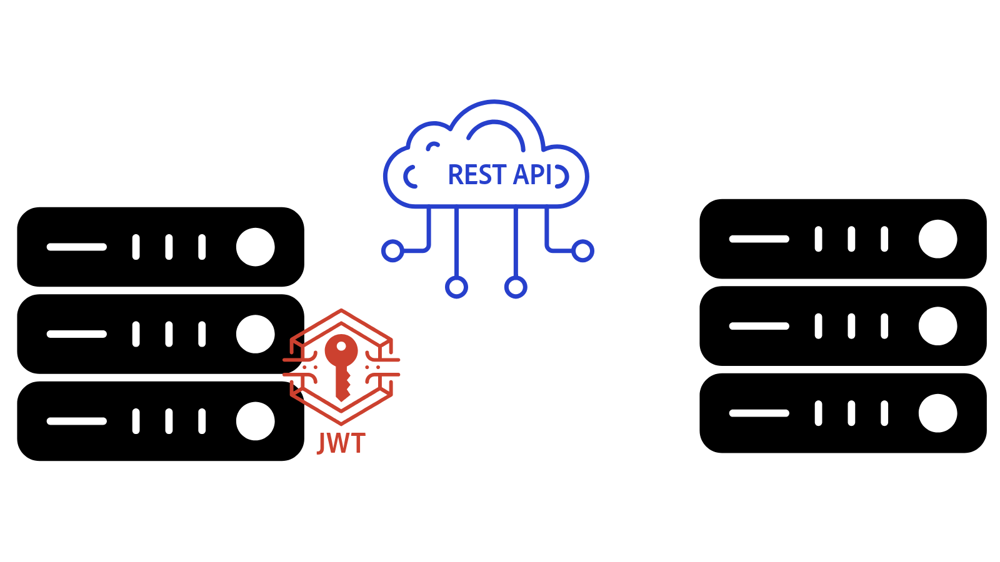

# AEM APIs overview{#aem-apis-overview}

Learn about the different types of APIs in Adobe Experience Manager (AEM) and understand which API to choose for your integration.

To create, read, update, and delete content, assets, and forms in AEM, developers can use a wide range of APIs. These APIs enable developers to create custom applications that interact with AEM.

Let's explore the different types of APIs in AEM and understand which API to choose for your integration.

## Types of AEM APIs{#types-of-aem-apis}

AEM offers following APIs for interacting with its author and publish service types. 

| AEM API Type | Description | Availability |Use Case | API Examples |
| --- | --- | --- | --- | --- |
| OpenAPI-based AEM APIs | Standardized, machine-readable APIs for Assets, Sites, and Forms. | **AEM as a Cloud Service only** | API-first development, modern applications | [Assets Author API](https://developer.adobe.com/experience-cloud/experience-manager-apis/api/experimental/assets/author/), [Folders API](https://developer.adobe.com/experience-cloud/experience-manager-apis/api/experimental/folders/), [AEM Sites API](https://developer.adobe.com/experience-cloud/experience-manager-apis/api/experimental/sites/delivery/), [Forms Acrobat Services](https://developer.adobe.com/experience-cloud/experience-manager-apis/api/experimental/document/) and others |
| RESTful APIs | Traditional REST endpoints for interacting with AEM resources. | AEM 6.X, AEM as a Cloud Service | CRUD operations, modern applications |  [Assets HTTP API](https://experienceleague.adobe.com/en/docs/experience-manager-cloud-service/content/assets/admin/mac-api-assets), [Workflow REST API](https://experienceleague.adobe.com/en/docs/experience-manager-65/content/implementing/developing/extending-aem/extending-workflows/workflows-program-interaction#using-the-workflow-rest-api), [JSON Exporter for Content Services](https://experienceleague.adobe.com/en/docs/experience-manager-cloud-service/content/implementing/developing/full-stack/components-templates/json-exporter) and others |
| GraphQL APIs  |  Optimized for retrieving structured content efficiently with flexible queries. | AEM 6.X, AEM as a Cloud Service | Headless CMS, SPAs, mobile apps | [GraphQL API](https://experienceleague.adobe.com/en/docs/experience-manager-cloud-service/content/headless/graphql-api/content-fragments) |
| Traditional (Non-RESTful) APIs | Older APIs like JCR, Sling Models, Query Builder, and others. | AEM 6.X, AEM as a Cloud Service | Legacy integrations, backward compatibility | [Query Builder API](https://experienceleague.adobe.com/en/docs/experience-manager-cloud-service/content/implementing/developing/full-stack/search/query-builder-api) and others |

For more details, see the [Adobe Experience Manager as a Cloud Service APIs](https://developer.adobe.com/experience-cloud/experience-manager-apis/) page.

## Which API to choose{#which-api-to-choose}

When selecting an API for your integration, consider the following factors:

- **Use Case**: Determine whether the AEM API supports your use case. Whenever possible, _use OpenAPI-based AEM APIs_, as they provide a standardized, modern approach to interacting with AEM. If OpenAPI-based APIs are not available, consider using RESTful APIs or GraphQL APIs and as a last resort, traditional APIs.

- **Compatibility**: Ensure that the selected API is compatible with your AEM version. For instance, _OpenAPI-based AEM APIs are exclusive to AEM as a Cloud Service_ and are unavailable in AEM 6.X.

- **AEM Service Type: Author vs. Publish**: The choice of API also depends on whether it runs on the Author or Publish service, as their access models are different. The AEM Author service is used for content creation and always requires authentication. The AEM Publish service is used for content delivery and may not require authentication, depending on the use case.

- **Authentication**: Verify that the API supports the authentication method you plan to use. For example:
    - **OpenAPI-based AEM APIs**: support OAuth 2.0 authentication, including Client Credentials (Server-to-Server), Authorization Code (Web App), and Proof Key for Code Exchange (Single Page App) grant types. Other AEM APIs do not support OAuth 2.0 authentication.
    - **RESTful APIs**: support JSON Web Token (JWT) authentication, also knows as token-based authentication.

## Difference between JSON Web Token (JWT) and OAuth 2.0{#difference-between-jwt-and-oauth}

Let's compare JSON Web Token (JWT) and OAuth 2.0, two common authentication mechanisms used in AEM APIs:

| Feature | JSON Web Token (JWT) | OAuth 2.0 |
| --- | --- | --- |
| Used In | RESTful APIs | OpenAPI-based AEM APIs (not supported in RESTful or other APIs) |
| Purpose | Service authentication | User or service authentication |
| User Interaction | No user interaction required | User interaction required for Authorization Code and Single Page App grant types |
| Best Suited For | Server-to-server API calls | Secure, permitted access for apps and users |
| Required Information | Private key for signing JWT | Client ID and Client Secret for OAuth 2.0 |
| Token Expiry | Short-lived, often needs refresh | The access-token is short-lived. The refresh-token is long-lived and used to get a new access-token |
| Credentials Management | [AEM Developer Console](https://experienceleague.adobe.com/en/docs/experience-manager-learn/cloud-service/debugging/debugging-aem-as-a-cloud-service/developer-console) | [Adobe Developer Console](https://developer.adobe.com/developer-console/) |

## OpenAPI-based AEM APIs

Learn more about the OpenAPI-based AEM APIs and the important concepts of accessing Adobe APIs in the [OpenAPI-based AEM APIs](./openapis/overview.md) guide.

### Use Cases

<!-- CARDS
{target = _self}

* ./openapis/use-cases/invoke-api-using-oauth-s2s.md
  {title = Invoke API using Server-to-Server authentication}
  {description = Learn how to invoke OpenAPI-based AEM APIs from a custom NodeJS application using OAuth Server-to-Server authentication.}
  {image = ./openapis/assets/s2s/OAuth-S2S.png}
* ./openapis/use-cases/invoke-api-using-oauth-web-app.md
  {title = Invoke API using Web App authentication}
  {description = Learn how to invoke OpenAPI-based AEM APIs from a custom web application using OAuth Web App authentication.}
  {image = ./openapis/assets/web-app/OAuth-WebApp.png}  
-->
<!-- START CARDS HTML - DO NOT MODIFY BY HAND -->

    

        

            

                <figure class="image x-is-16by9">
                    
                </figure>
            

            

                

                    

                        <a href="./openapis/use-cases/invoke-api-using-oauth-s2s.md" target="_self" rel="referrer" title="Invoke API using Server-to-Server authentication">Invoke API using Server-to-Server authentication</a>
                    

                    
Learn how to invoke OpenAPI-based AEM APIs from a custom NodeJS application using OAuth Server-to-Server authentication.

                

                <a href="./openapis/use-cases/invoke-api-using-oauth-s2s.md" target="_self" rel="referrer" class="spectrum-Button spectrum-Button--outline spectrum-Button--primary spectrum-Button--sizeM" style="align-self: flex-start; margin-top: 1rem;">
                    Learn more
                </a>
            

        

    

    

        

            

                <figure class="image x-is-16by9">
                    
                </figure>
            

            

                

                    

                        <a href="./openapis/use-cases/invoke-api-using-oauth-web-app.md" target="_self" rel="referrer" title="Invoke API using Web App authentication">Invoke API using Web App authentication</a>
                    

                    
Learn how to invoke OpenAPI-based AEM APIs from a custom web application using OAuth Web App authentication.

                

                <a href="./openapis/use-cases/invoke-api-using-oauth-web-app.md" target="_self" rel="referrer" class="spectrum-Button spectrum-Button--outline spectrum-Button--primary spectrum-Button--sizeM" style="align-self: flex-start; margin-top: 1rem;">
                    Learn more
                </a>
            

        

    

<!-- END CARDS HTML - DO NOT MODIFY BY HAND -->

## GraphQL APIs - Examples

Learn more about the GraphQL APIs and how to use them in the [Getting Started with AEM Headless - GraphQL](https://experienceleague.adobe.com/en/docs/experience-manager-learn/getting-started-with-aem-headless/graphql/overview)

### Use Cases

<!-- CARDS
{target = _self}

* https://experienceleague.adobe.com/en/docs/experience-manager-learn/getting-started-with-aem-headless/deployments/spa#example-single-page-app
  {title = Single Page Application (SPA)}
  {description = Learn how to build a Single Page Application (SPA) that fetches content from AEM using GraphQL APIs.}
  {image = ./assets/react-app-card.png}
* https://experienceleague.adobe.com/en/docs/experience-manager-learn/getting-started-with-aem-headless/deployments/mobile#example-mobile-apps
  {title = Mobile App}
  {description = Learn how to build a mobile app that fetches content from AEM using GraphQL APIs.}
  {image = ./assets/ios-app-card.png}
* https://experienceleague.adobe.com/en/docs/experience-manager-learn/getting-started-with-aem-headless/deployments/web-component#example-web-component
  {title = Web Component}
  {description = Learn how to build a web component that fetches content from AEM using GraphQL APIs.}
  {image = ./assets/web-component-card.png}
-->
<!-- START CARDS HTML - DO NOT MODIFY BY HAND -->

    

        

            

                <figure class="image x-is-16by9">
                    
                </figure>
            

            

                

                    

                        <a href="https://experienceleague.adobe.com/en/docs/experience-manager-learn/getting-started-with-aem-headless/deployments/spa#example-single-page-app" target="_self" rel="referrer" title="Single Page Application (SPA)">Single Page Application (SPA)</a>
                    

                    
Learn how to build a Single Page Application (SPA) that fetches content from AEM using GraphQL APIs.

                

                <a href="https://experienceleague.adobe.com/en/docs/experience-manager-learn/getting-started-with-aem-headless/deployments/spa#example-single-page-app" target="_self" rel="referrer" class="spectrum-Button spectrum-Button--outline spectrum-Button--primary spectrum-Button--sizeM" style="align-self: flex-start; margin-top: 1rem;">
                    Learn more
                </a>
            

        

    

    

        

            

                <figure class="image x-is-16by9">
                    
                </figure>
            

            

                

                    

                        <a href="https://experienceleague.adobe.com/en/docs/experience-manager-learn/getting-started-with-aem-headless/deployments/mobile#example-mobile-apps" target="_self" rel="referrer" title="Mobile App">Mobile App</a>
                    

                    
Learn how to build a mobile app that fetches content from AEM using GraphQL APIs.

                

                <a href="https://experienceleague.adobe.com/en/docs/experience-manager-learn/getting-started-with-aem-headless/deployments/mobile#example-mobile-apps" target="_self" rel="referrer" class="spectrum-Button spectrum-Button--outline spectrum-Button--primary spectrum-Button--sizeM" style="align-self: flex-start; margin-top: 1rem;">
                    Learn more
                </a>
            

        

    

    

        

            

                <figure class="image x-is-16by9">
                    
                </figure>
            

            

                

                    

                        <a href="https://experienceleague.adobe.com/en/docs/experience-manager-learn/getting-started-with-aem-headless/deployments/web-component#example-web-component" target="_self" rel="referrer" title="Web Component">Web Component</a>
                    

                    
Learn how to build a web component that fetches content from AEM using GraphQL APIs.

                

                <a href="https://experienceleague.adobe.com/en/docs/experience-manager-learn/getting-started-with-aem-headless/deployments/web-component#example-web-component" target="_self" rel="referrer" class="spectrum-Button spectrum-Button--outline spectrum-Button--primary spectrum-Button--sizeM" style="align-self: flex-start; margin-top: 1rem;">
                    Learn more
                </a>
            

        

    

<!-- END CARDS HTML - DO NOT MODIFY BY HAND -->

## RESTful APIs - Examples

Learn more about the RESTful APIs, such as [Assets HTTP API](https://experienceleague.adobe.com/en/docs/experience-manager-cloud-service/content/assets/admin/mac-api-assets) and [JSON Exporter](https://experienceleague.adobe.com/en/docs/experience-manager-cloud-service/content/implementing/developing/full-stack/components-templates/json-exporter).

### Use Cases

<!-- CARDS
{target = _self}

* https://experienceleague.adobe.com/en/docs/experience-manager-learn/getting-started-with-aem-headless/content-services/overview
  {title = Invoke API using Server-to-Server authentication}
  {description = Learn how to build a native mobile app that fetches content from AEM using Content Services RESTful APIs.}
  {image = ./assets/RESTful-Content-Service.png}
* https://experienceleague.adobe.com/en/docs/experience-manager-learn/getting-started-with-aem-headless/authentication/overview
  {title = Token-based Authentication for RESTful APIs}
  {description = Learn how to invoke RESTful APIs using JSON Web Token (JWT) authentication.}
  {image = ./assets/RESTful-TokenAuth.png}
-->
<!-- START CARDS HTML - DO NOT MODIFY BY HAND -->

    

        

            

                <figure class="image x-is-16by9">
                    
                </figure>
            

            

                

                    

                        <a href="https://experienceleague.adobe.com/en/docs/experience-manager-learn/getting-started-with-aem-headless/content-services/overview" target="_self" rel="referrer" title="Invoke API using Server-to-Server authentication">Invoke API using Server-to-Server authentication</a>
                    

                    
Learn how to build a native mobile app that fetches content from AEM using Content Services RESTful APIs.

                

                <a href="https://experienceleague.adobe.com/en/docs/experience-manager-learn/getting-started-with-aem-headless/content-services/overview" target="_self" rel="referrer" class="spectrum-Button spectrum-Button--outline spectrum-Button--primary spectrum-Button--sizeM" style="align-self: flex-start; margin-top: 1rem;">
                    Learn more
                </a>
            

        

    

    

        

            

                <figure class="image x-is-16by9">
                    
                </figure>
            

            

                

                    

                        <a href="https://experienceleague.adobe.com/en/docs/experience-manager-learn/getting-started-with-aem-headless/authentication/overview" target="_self" rel="referrer" title="Token-based Authentication for RESTful APIs">Token-based Authentication for RESTful APIs</a>
                    

                    
Learn how to invoke RESTful APIs using JSON Web Token (JWT) authentication.

                

                <a href="https://experienceleague.adobe.com/en/docs/experience-manager-learn/getting-started-with-aem-headless/authentication/overview" target="_self" rel="referrer" class="spectrum-Button spectrum-Button--outline spectrum-Button--primary spectrum-Button--sizeM" style="align-self: flex-start; margin-top: 1rem;">
                    Learn more
                </a>
            

        

    

<!-- END CARDS HTML - DO NOT MODIFY BY HAND -->

