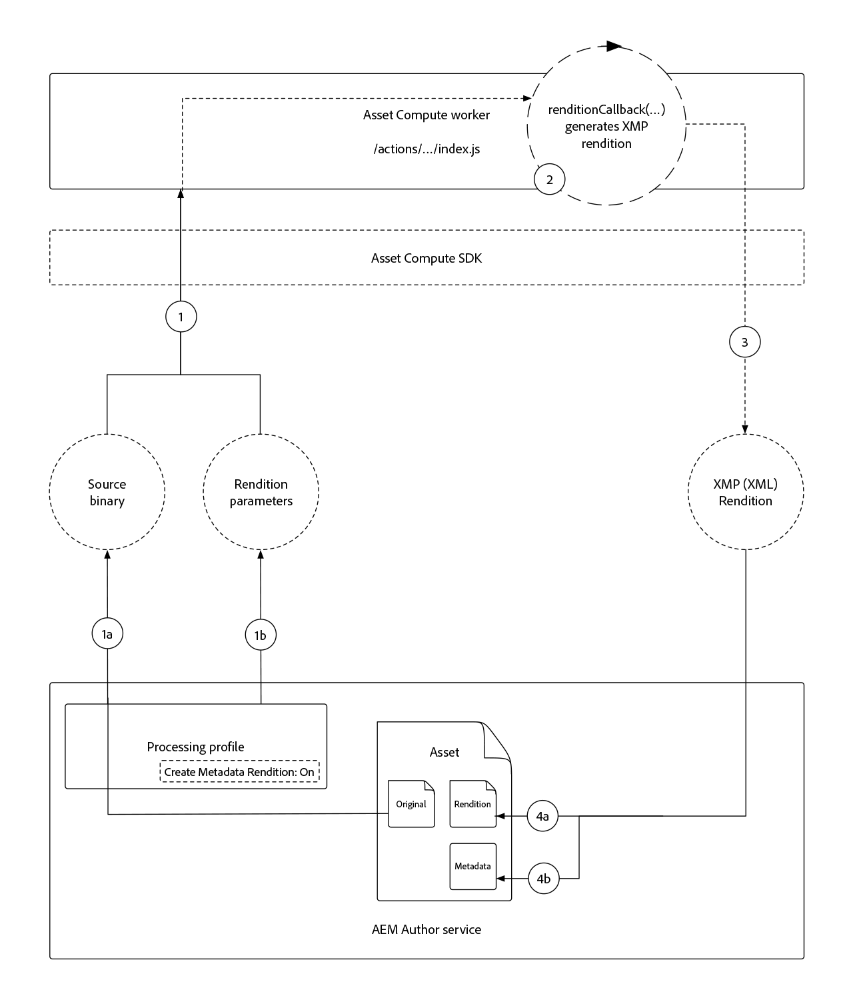
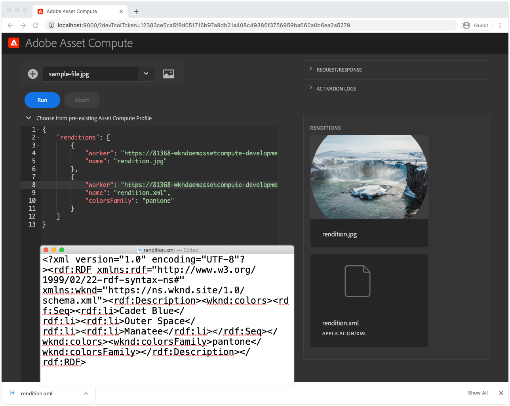
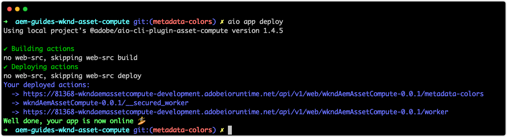
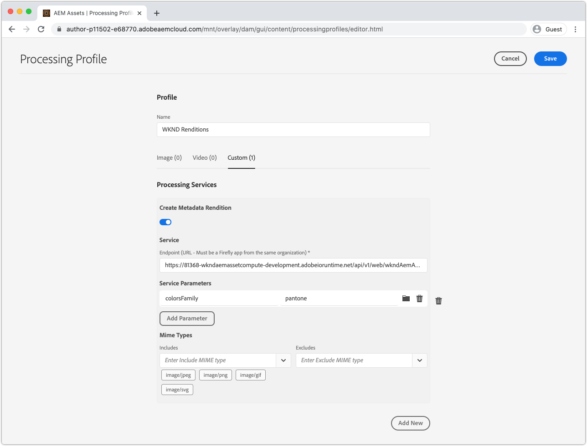
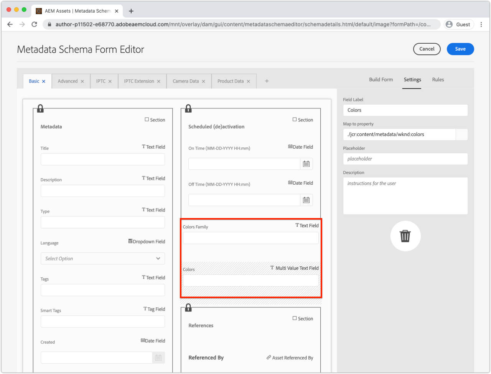
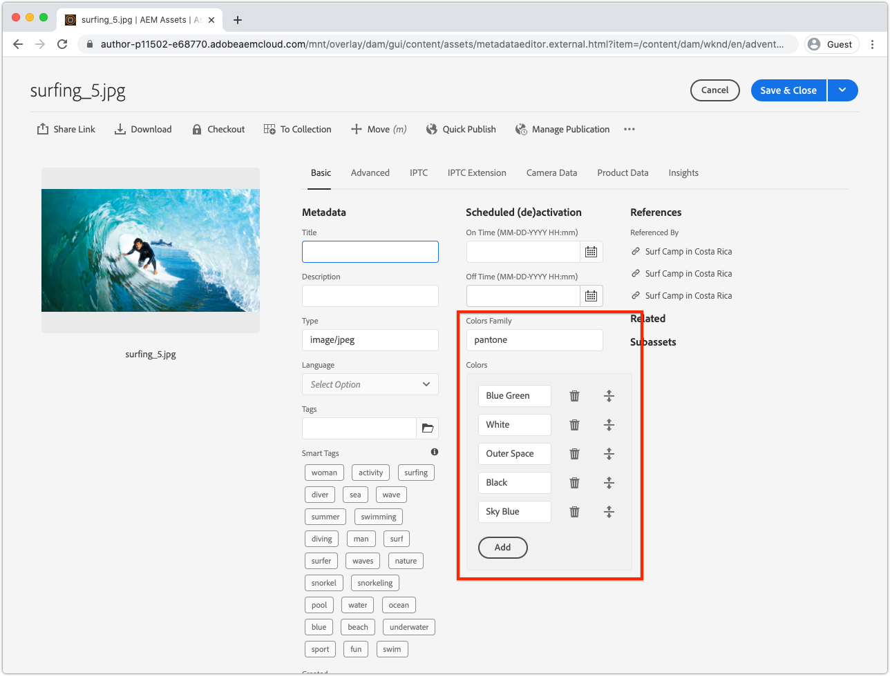
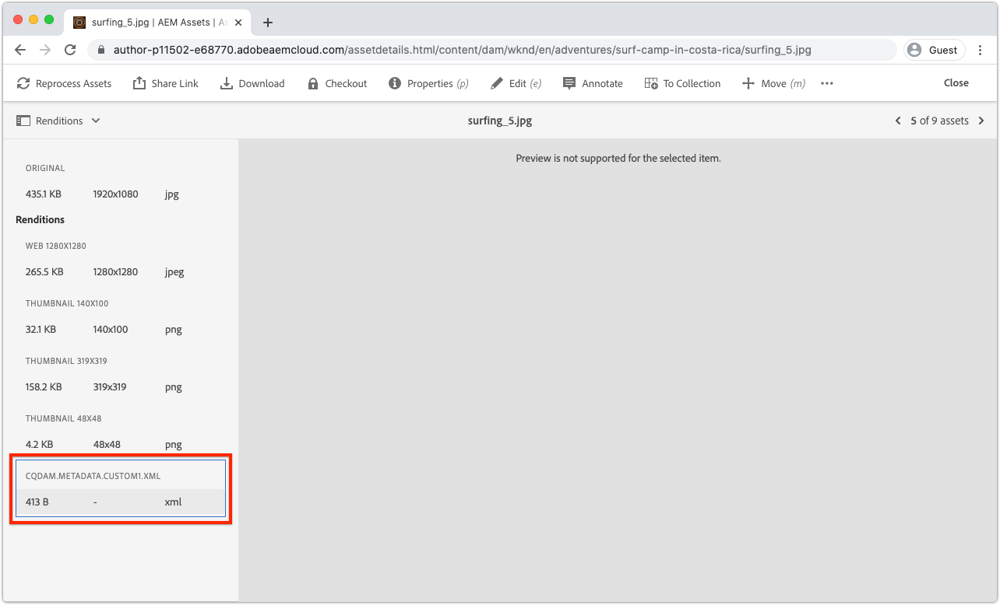

# Develop an Asset Compute metadata worker

Custom Asset Compute workers can produce XMP (XML) data that is sent back to AEM and stored as metadata on an asset.

Common use cases include:

+ Integrations with 3rd party systems, such as a PIM (Product Information Management system), where additional metadata must be retrieved and stored on the asset
+ Integrations with Adobe services, such as Content and Commerce AI to augment asset metadata with additional machine learning attributes
+ Deriving metadata about the asset from its binary and storing it as asset metadata in AEM as a Cloud Service

## What you will do

>[!VIDEO](https://video.tv.adobe.com/v/327313?quality=12&learn=on)

In this tutorial we'll create an Asset Compute metadata worker that derives the most commonly used colors in an image asset, and writes the names of the colors back to the asset's metadata in AEM. While the worker itself is basic, this tutorial uses it to explore how Asset Compute workers can be used to write back metadata to assets in AEM as a Cloud Service.

## Logical flow of a Asset Compute metadata worker invocation

The invocation of Asset Compute metadata workers is nearly identical to that of [binary rendition generating workers](../develop/worker.md), with the primary difference being the return type is an XMP (XML) rendition whose values are also written to the asset's metadata.
 
Asset Compute workers implement the Asset Compute SDK worker API contract, in the `renditionCallback(...)` function, which is conceptually:

+ __Input:__ An AEM asset's original binary and Processing Profile parameters
+ __Output:__ An XMP (XML) rendition persisted to the AEM asset as a rendition and to the asset's metadata



1. AEM Author service invokes the Asset Compute metadata worker, providing the asset's __(1a)__ original binary, and __(1b)__ any parameters defined in the Processing Profile.
1. The Asset Compute SDK orchestrates the execution of the custom Asset Compute metadata worker's `renditionCallback(...)` function, deriving an XMP (XML) rendition, based on the asset's binary __(1a)__ and any Processing Profile parameters __(1b)__.
1. The Asset Compute worker saves the XMP (XML) representation to `rendition.path`.
1. The XMP (XML) data written to `rendition.path` is transported via the Asset Compute SDK to AEM Author Service and exposes it as __(4a)__ a text rendition and __(4b)__ persisted to the asset's metadata node.

## Configure the manifest.yml{#manifest}

All Asset Compute workers must be registered in the [manifest.yml](../develop/manifest.md). 

Open the project's `manifest.yml` and add a worker entry that configures the new worker, in this case `metadata-colors`.

_Remember `.yml` is whitespace sensitive._

```
packages:
  __APP_PACKAGE__:
    license: Apache-2.0
    actions: 
      worker:
        function: actions/worker/index.js 
        web: 'yes' 
        runtime: 'nodejs:12'
        limits:
          timeout: 60000 # in ms
          memorySize: 512 # in MB
          concurrency: 10 
        annotations:
          require-adobe-auth: true
      metadata-colors:
        function: actions/metadata-colors/index.js 
        web: 'yes' 
        runtime: 'nodejs:12'
        limits:
          memorySize: 512 # in MB   
```          

`function` points to the worker implementation created in the [next step](#metadata-worker). Name workers semantically (for example, the `actions/worker/index.js` might have been better named `actions/rendition-circle/index.js`), as these show in the [worker's URL](#deploy) and also determine the [worker's test suite folder name](#test).

The `limits` and `require-adobe-auth` are configured discretely per worker. In this worker, `512 MB` of memory is allocated as the code inspects (potentially) large binary image data. The other `limits` are removed to use defaults.

## Develop a metadata worker{#metadata-worker}

Create a new metadata worker JavaScript file in the Asset Compute project at the path [defined manifest.yml for the new worker](#manifest), at `/actions/metadata-colors/index.js`

### Install npm modules

Install the extra npm modules ([@adobe/asset-compute-xmp](https://www.npmjs.com/package/@adobe/asset-compute-xmp?activeTab=versions), [get-image-colors](https://www.npmjs.com/package/get-image-colors), and [color-namer](https://www.npmjs.com/package/color-namer)) that will be used in this Asset Compute worker.

```
$ npm install @adobe/asset-compute-xmp
$ npm install get-image-colors
$ npm install color-namer
```

### Metadata worker code

This worker looks very similar to the [rendition-generating worker](../develop/worker.md), the the primary difference is it writes XMP (XML) data to the `rendition.path` to get saved back to AEM.


```javascript
"use strict";

const { worker, SourceCorruptError } = require("@adobe/asset-compute-sdk");
const fs = require("fs").promises;

// Require the @adobe/asset-compute-xmp module to create XMP 
const { serializeXmp } = require("@adobe/asset-compute-xmp");

// Require supporting npm modules to derive image colors from image data
const getColors = require("get-image-colors");
// Require supporting npm modules to convert image colors to color names
const namer = require("color-namer");

exports.main = worker(async (source, rendition, params) => {
  // Perform any necessary source (input) checks
  const stats = await fs.stat(source.path);
  if (stats.size === 0) {
    // Throw appropriate errors whenever an erring condition is met
    throw new SourceCorruptError("source file is empty");
  }
  const MAX_COLORS = 10;
  const DEFAULT_COLORS_FAMILY = 'basic';

  // Read the color family parameter to use to derive the color names
  let colorsFamily = rendition.instructions.colorsFamily || DEFAULT_COLORS_FAMILY;

  if (['basic', 'hex', 'html', 'ntc', 'pantone', 'roygbiv'].indexOf(colorsFamily) === -1) { 
      colorsFamily = DEFAULT_COLORS_FAMILY;
  }
  
  // Use the `get-image-colors` module to derive the most common colors from the image
  let colors = await getColors(source.path, { options: MAX_COLORS });

  // Convert the color Chroma objects to their closest names
  let colorNames = colors.map((color) => getColorName(colorsFamily, color));

  // Serialize the data to XMP metadata
  // These properties are written to the [dam:Asset]/jcr:content/metadata resource
  // This stores
  // - The list of color names is stored in a JCR property named `wknd:colors`
  // - The colors family used to derive the color names is stored in a JCR property named `wknd:colorsFamily`
  const xmp = serializeXmp({
      // Use a Set to de-duplicate color names
      "wknd:colors": [...new Set(colorNames)],
      "wknd:colorsFamily": colorsFamily
    }, {
      // Define any property namespaces used in the above property/value definition
      // These namespaces will be automatically registered in AEM if they do not yet exist
      namespaces: {
        wknd: "https://wknd.site/assets/1.0/",
      },
    }
  );

  // Save the XMP metadata to be written back to the asset's metadata node
  await fs.writeFile(rendition.path, xmp, "utf-8");
});

/**
 * Helper function that derives the closest color name for the color, based on the colors family
 * 
 * @param {*} colorsFamily the colors name family to use
 * @param {*} color the color to convert to a name
 */
function getColorName(colorsFamily, color) {
    if ('hex' === colorsFamily) {  return color; }

    let names = namer(color.rgb())[colorsFamily];

    if (names.length >= 1) { return names[0].name; }
}
```

## Run the metadata worker locally{#development-tool}

With the worker code complete, it can be executed using the local Asset Compute Development Tool.

Because our Asset Compute project contains two workers (the previous [circle rendition](../develop/worker.md) and this `metadata-colors` worker), the [Asset Compute Development Tool's](../develop/development-tool.md) profile definition  lists execution profiles for both workers. The second profile definition points to the new `metadata-colors` worker.
 
 

1. From the root of the Asset Compute project
1. Execute `aio app run` to start the Asset Compute Development Tool
1. In the __Select a file...__ drop down, pick a [sample image](../assets/samples/sample-file.jpg) to process
1. In the second profile definition configuration, which points to the `metadata-colors` worker, update `"name": "rendition.xml"` as this worker generates an XMP (XML) rendition. Optionally, add a `colorsFamily` parameter (supported values `basic`, `hex`, `html`, `ntc`, `pantone`, `roygbiv`).

    ```json
    {
        "renditions": [
            {
                "worker": "...",
                "name": "rendition.xml",
                "colorsFamily": "pantone"
            }
        ]
    }
    ```
1. Tap __Run__ and wait for the XML rendition to generate
    + Since both workers are listed in the profile definition, both renditions will generate. Optionally, the top profile definition pointing at the [circle rendition worker](../develop/worker.md) can be deleted, to avoid executing it from Development Tool.
1. The __Renditions__ section previews the generated rendition. Tap the `rendition.xml` to download it, and open it in VS Code (or your favorite XML/text editor) to review.

## Test the worker{#test}

Metadata workers can be tested using the [same Asset Compute testing framework as binary renditions](../test-debug/test.md). The only difference is the `rendition.xxx` file in the test case must  be the expected XMP (XML) rendition.

1. Create the following structure in the Asset Compute project:

    ```
    /test/asset-compute/metadata-colors/success-pantone/
        
        file.jpg
        params.json
        rendition.xml
    ```             

2. Use the [sample file](../assets/samples/sample-file.jpg) as the test case's `file.jpg`.
3. Add the following JSON to the `params.json`.

    ```
    {
        "fmt": "xml",
        "colorsFamily": "pantone"
    }
    ```

    Note the `"fmt": "xml"` is required to instruct the test suite to generate an `.xml` text-based rendition.

4. Provide the expected XML in the `rendition.xml` file. This can be obtained by:
    + Running the test input file through Development Tool and saving the (validated) XML rendition out.

    ```
    <?xml version="1.0" encoding="UTF-8"?><rdf:RDF xmlns:rdf="http://www.w3.org/1999/02/22-rdf-syntax-ns#" xmlns:wknd="https://wknd.site/assets/1.0/"><rdf:Description><wknd:colors><rdf:Seq><rdf:li>Silver</rdf:li><rdf:li>Black</rdf:li><rdf:li>Outer Space</rdf:li></rdf:Seq></wknd:colors><wknd:colorsFamily>pantone</wknd:colorsFamily></rdf:Description></rdf:RDF>
    ```

5. Execute `aio app test` from the root of the Asset Compute project to execute all test suites.

### Deploy the worker to Adobe I/O Runtime{#deploy}

To invoke this new metadata worker from AEM Assets, it must be deployed to Adobe I/O Runtime, using the command:

```
$ aio app deploy
```



Note this will deploy all the workers in the project. Review the [unabridged deploy instructions](../deploy/runtime.md) for how to deploy to Stage and Production workspaces.

### Integrate with AEM Processing Profiles{#processing-profile}

Invoke the worker from AEM by creating a new, or modifying an existing, custom Processing Profile service that invokes this deployed worker.



1. Login to AEM as a Cloud Service Author service as an __AEM Administrator__
1. Navigate to __Tools > Assets > Processing Profiles__
1. __Create__ a new, or __edit__ and existing, Processing Profile
1. Tap the __Custom__ tab, and tap __Add New__
1. Define the new service
    + __Create Metadata Rendition__: Toggle to active
    + __Endpoint:__ `https://...adobeioruntime.net/api/v1/web/wkndAemAssetCompute-0.0.1/metadata-colors`
        + This is th URL to the worker obtained during the [deploy](#deploy) or using the command `aio app get-url`. Ensure the URL points at the correct workspace based on the AEM as a Cloud Service environment. 
    + __Service Parameters__
        + Tap __Add Parameter__
            + Key: `colorFamily`
            + Value: `pantone`
                + Supported values: `basic`, `hex`, `html`, `ntc`, `pantone`, `roygbiv`
    + __Mime Types__
        + __Includes:__ `image/jpeg`, `image/png`, `image/gif`, `image/svg`
            + These are the only MIME types supported by the 3rd party npm modules used to derive the colors.
        + __Excludes:__ `Leave blank`
1. Tap __Save__ in the top right
1. Apply the Processing Profile to an AEM Assets folder if not done so already

### Update the Metadata Schema{#metadata-schema}

To review the colors metadata, map two new fields on the image's metadata schema to the new metadata data properties the worker populates.



1. In the AEM Author service, navigate to __Tools > Assets > Metadata Schemas__
1. Navigate into __default__ and select and edit __image__ and add read-only form fields to expose the generated color metadata
1. Add a __Single Line Text__ 
    + __Field Label__: `Colors Family`
    + __Map to property__: `./jcr:content/metadata/wknd:colorsFamily`
    + __Rules > Field > Disable edit__: Checked
1. Add a __Multi Value Text__ 
    + __Field Label__: `Colors`
    + __Map to property__: `./jcr:content/metadata/wknd:colors`
1. Tap __Save__ in the top right

## Processing assets



1. In the AEM Author service, navigate to __Assets > Files__
1. Navigate to the folder, or sub-folder, the Processing Profile is applied to
1. Upload a new image (JPEG, PNG, GIF or SVG) to the folder, or re-process existing images using the updated [Processing Profile](#processing-profile)
1. When processing is complete, select the asset, and tap __properties__ in the top action bar to display its metadata
1. Review the `Colors Family` and `Colors` [metadata fields](#metadata-schema) for the metadata written back from the custom Asset Compute metadata worker.

With the color metadata written to the asset's metadata, on the `[dam:Asset]/jcr:content/metadata` resource, this metadata is indexed increased asset discover-ability using these terms via search, and they can even be written back to the asset's binary if then __DAM Metadata Writeback__ workflow is invoked on it.

### Metadata rendition in AEM Assets



The actual XMP file generated by the Asset Compute metadata worker is also stored as a discrete rendition on the asset. This file is generally not used, rather the applied values to the asset's metadata node is used, but the raw XML output from the worker is available in AEM.

## metadata-colors worker code on Github

The final `metadata-colors/index.js` is available on Github at:

+ [aem-guides-wknd-asset-compute/actions/metadata-colors/index.js](https://github.com/adobe/aem-guides-wknd-asset-compute/blob/master/actions/metadata-colors/index.js)

The final `test/asset-compute/metadata-colors` test suite is available on Github at:

+ [aem-guides-wknd-asset-compute/test/asset-compute/metadata-colors](https://github.com/adobe/aem-guides-wknd-asset-compute/blob/master/test/asset-compute/metadata-colors)
