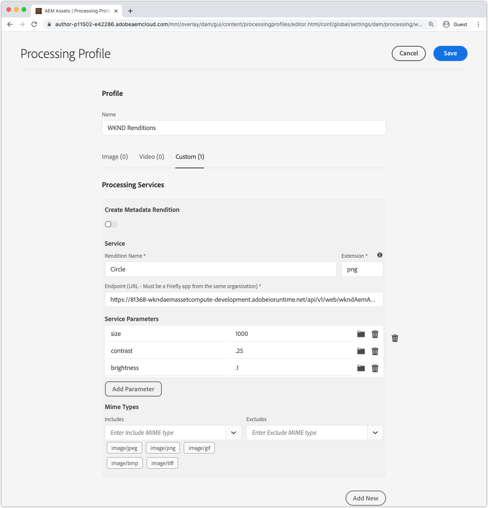
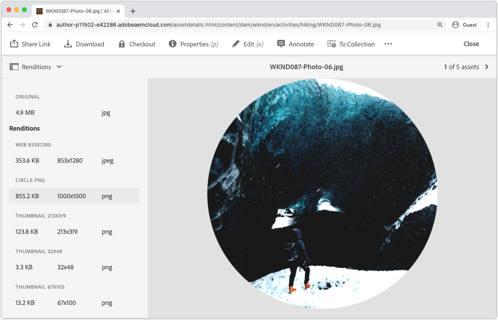

# Integrate with AEM Processing Profiles

For Asset Compute workers to generate custom renditions in AEM as a Cloud Service, they must be registered in AEM as a Cloud Service Author service via Processing Profiles. All assets subject to that Processing Profile will have the worker invoked upon upload or re-processing, and have the custom rendition generated and made available via the asset's renditions.

## Define a Processing Profile

First create a new Processing Profile that will invoke the worker with the configurable parameters.

1. Login to AEM as a Cloud Service Author service as an __AEM Administrator__. As this is a tutorial we recommend using a Dev environment or an environment in a Sandbox.
1. Navigate to __Tools > Assets > Processing Profiles__
1. Tap __Create__ button
1. Name the Processing Profile, `WKND Asset Renditions`
1. Tap the __Custom__ tab, and tap __Add New__
1. Define the new service
    + __Rendition name:__ `Circle`
        + The file name rendition that will be used to identify this rendition in AEM Assets
    + __Extension:__ `png`
        + The extension of the rendition that will be generated. Set to `png` as this is the supported output format the worker's web service supports, and results in transparent background behind the circle cut out.
    + __Endpoint:__ `https://...adobeioruntime.net/api/v1/web/wkndAemAssetCompute-0.0.1/worker`
        + This is th URL to the worker obtained via `aio app get-url`. Ensure the URL points at the correct workspace based on the AEM as a Cloud Service environment.
        + Make sure the worker URL points to the correct workspace. AEM as a Cloud Service Stage should use the Stage workspace URL, and AEM as a Cloud Service Production should use the Production workspace URL.
    + __Service Parameters__
        + Tap __Add Parameter__
            + Key: `size`
            + Value: `1000`
        + Tap __Add Parameter__
            + Key: `contrast`
            + Value: `0.25`
        + Tap __Add Parameter__
            + Key: `brightness`
            + Value: `0.10`
        + These key/value pairs that are passed into the Asset Compute worker and available via `rendition.instructions` JavaScript object.
    + __Mime Types__
        + __Includes:__ `image/jpeg`, `image/png`, `image/gif`, `image/bmp`, `image/tiff`
            + These MIME types are the only ones the worker's npm modules. This list limits which assets will be processed by the custom worker.
        + __Excludes:__ `Leave blank`
            + Never process assets with these MIME Types using this service configuration. In this case, we only use an allow list.
1. Tap __Save__ in the top right

## Apply and invoke a Processing Profile

1. Select the newly created Processing Profile, `WKND Asset Renditions`
1. Tap __Apply Profile to Folder(s)__ in the top action bar
1. Select a folder to apply the Processing Profile to, such as `WKND` and tap __Apply__
1. Navigate to the folder the Processing Profile was not applied to via __AEM > Assets > Files__ and tap into `WKND`.
1. Upload some new images assets ([sample-1.jpg](../assets/samples/sample-1.jpg), [sample-2.jpg](../assets/samples/sample-2.jpg), and [sample-3.jpg](../assets/samples/sample-3.jpg)) in any folder under the folder with the Processing Profile applied, and wait for the uploaded asset to be processed.
1. Tap the asset to open its details
    + Default renditions may generate and appear more quickly in AEM than custom renditions.
1. Open the __Renditions__ view from the left sidebar
1. Tap on the asset named `Circle.png` and review the generated rendition

    

## Finished!

Congratulations! You have finished the [tutorial](../overview.md) on how to extend AEM as a Cloud Service Asset Compute microservices! You should now have the ability to set up, develop, test, debug and deploy custom Asset Compute workers for use by your AEM as a Cloud Service Author service.

### Review the full project source code on Github

The final Asset Compute project is available on Github at:

+ [aem-guides-wknd-asset-compute](https://github.com/adobe/aem-guides-wknd-asset-compute)

_Github contains is the final state of the project, fully populated with the worker and test cases, but does not contain any credentials, ie. `.env`, `.config.json` or `.aio`._

## Troubleshooting

+ [Custom rendition missing from asset in AEM](../troubleshooting.md#custom-rendition-missing-from-asset)
+ [Asset processing fails in AEM](../troubleshooting.md#asset-processing-fails)
