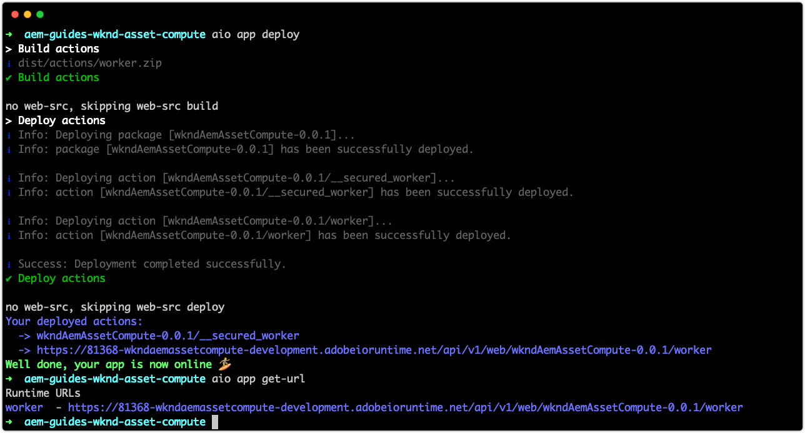
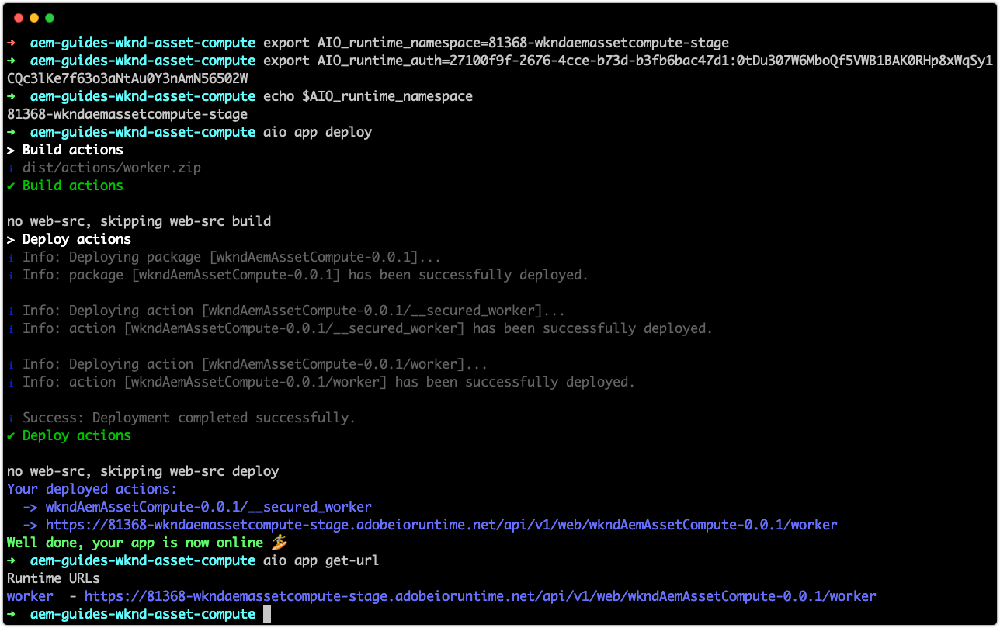
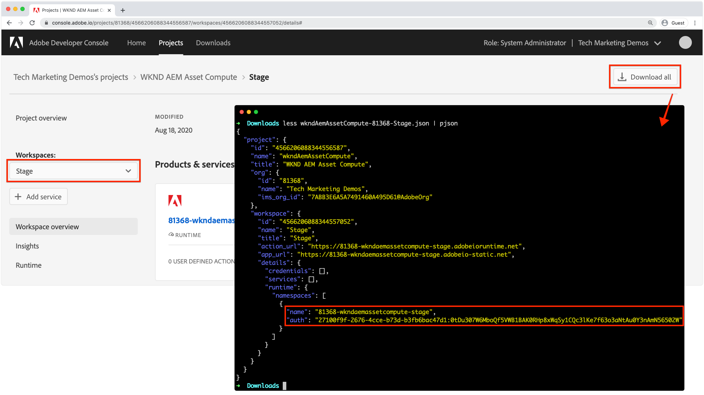

# Deploy to Adobe I/O Runtime

Asset Compute projects, and the workers they contain, must be deployed to Adobe I/O Runtime via the Adobe I/O CLI to be used by AEM as a Cloud Service. 

When deploying to Adobe I/O Runtime for use by AEM as a Cloud Service Author services only two environment variables are required:

+ `AIO_runtime_namespace` points the App Builder Workspace to deploy to
+ `AIO_runtime_auth` are the App Builder workspace's authentication credentials

The other standard variables defined in the `.env` file are implicitly provided by AEM as a Cloud Service when it invokes the Asset Compute worker.

## Development workspace

Because this project was generated using `aio app init` using the `Development` workspace, `AIO_runtime_namespace` is automatically set to `81368-wkndaemassetcompute-development` with the matching `AIO_runtime_auth` in our local `.env` file.  If an `.env` file exists in the directory used to issue the deploy command, its values are used, unless they are supersedes via an OS level variable export, which is how [stage and production](#stage-and-production) workspaces are targeted.



To deploy to the workspace define in the projects `.env` file:

1. Open the command line in the root of the Asset Compute project
1. Execute the command `aio app deploy`
1. Execute the command `aio app get-url` to obtain the worker URL for use in the AEM as a Cloud Service Processing Profile to reference this custom Asset Compute worker. If the project contains multiple workers, discrete URLs for each worker are listed.

If local development and AEM as a Cloud Service Development environments use separate Asset Compute deployments, deployments to AEM as a Cloud Service Dev can be managed in the same manner as [Stage and Production deployments](#stage-and-production).

## Stage and Production workspaces{#stage-and-production}

Deploying to Stage and Production workspaces are typically done by your CI/CD system of choice. The Asset Compute project must be deployed to each Workspace (Stage and then Production) discretely.

Setting true environment variables overrides values for the same-named variables in `.env`.



The general approach, typically automated by a CI/CD system, for deploying to Stage and Production environments is:

1. Ensure the [Adobe I/O CLI npm module and Asset Compute plug-in](../set-up/development-environment.md#aio) are installed
1. Check out the Asset Compute project to deploy from Git
1. Set the environment variables with the values that correspond to the target workspace (Stage or Production)
    + The two required variables are `AIO_runtime_namespace` and `AIO_runtime_auth` and are obtained per workspace in Adobe I/O Developer Console via the Workspace's __Download All__ feature.



The values of these keys can be set by issuing export commands from the command line:

```
$ export AIO_runtime_namespace=81368-wkndaemassetcompute-stage
$ export AIO_runtime_auth=27100f9f-2676-4cce-b73d-b3fb6bac47d1:0tDu307W6MboQf5VWB1BAK0RHp8xWqSy1CQc3lKe7f63o3aNtAu0Y3nAmN56502W

```

If your Asset Compute workers require any other variables, such at cloud storage, these should be exported as environment variables as well.

1. Once all the environment variables are set for the target workspace to deploy to, execute the deploy command:
    + `aio app deploy`
1. The worker URL(s) referenced by the AEM as a Cloud Service Processing Profile is also available via:
    + `aio app get-url`.

If the Asset Compute project version changes the worker URL(s) also change to reflect the new version, and the URL will need to be updated in the Processing Profiles.

## Workspace API provisioning{#workspace-api-provisioning}

When [setting up the App Builder project in Adobe I/O](../set-up/app-builder.md) to support local development, a new Development workspace was created and __Asset Compute, I/O Events__ and __I/O Events Management APIs__ were added to it.

The __Asset Compute, I/O Events__ and __I/O Events Management APIs__ APIS are only explicitly added to the workspaces used for local development. Workspaces that integrate (exclusively) with AEM as a Cloud Service environments do __not__ need these APIs explicitly added as the APIs are made naturally available to AEM as a Cloud Service.
