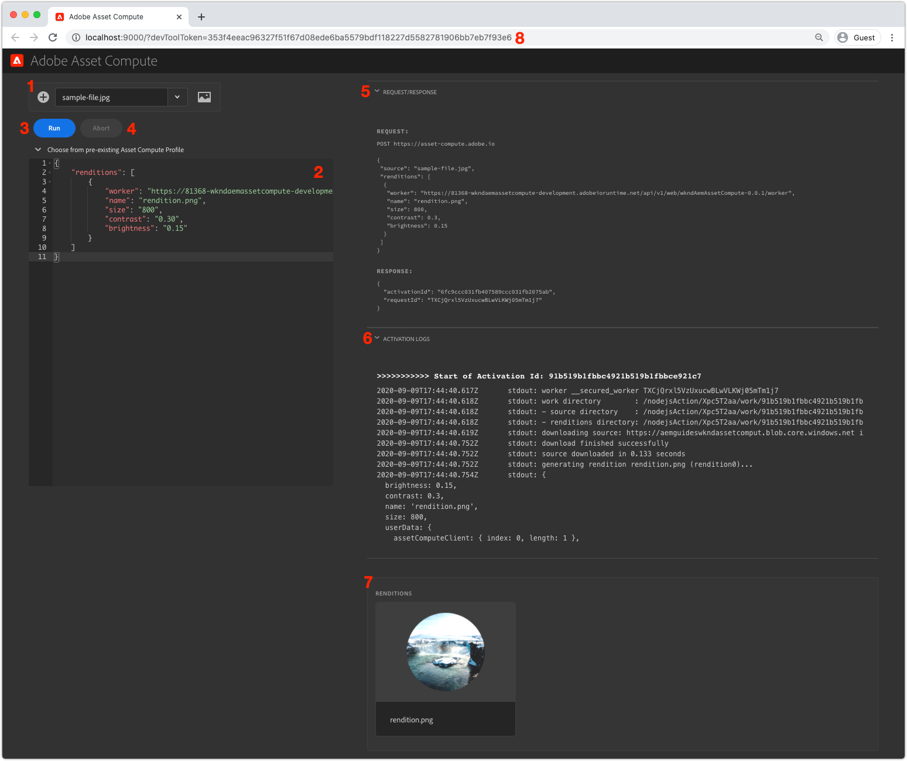

# Asset Compute Development Tool

The Asset Compute Development Tool is a local web harness allowing developers to configure and execute Asset Computer workers locally, outside the context of the AEM SDK against the Asset Compute resources in Adobe I/O Runtime.

## Run the Asset Compute Development Tool

The Asset Compute Development Tool can be run from the root of the Asset Compute project via the terminal command:

```
$ aio app run
```

This will start the Development Tool at __http://localhost:9000__, and automatically open it in a browser window. For the Development Tool to run, [a valid, auto-generated devToolToken must be provided via a query parameter](#troubleshooting__devtooltoken).

## Understand the Asset Compute Development Tools interface{#interface}



1. __Source file:__ The source file selection is used to:
    +  Selected the asset binary that will be the `source` binary passed to the Asset Compute worker
    +  Upload source files
1. __Asset Compute profile(s) definition:__ Defines the Asset Compute worker to run including parameters: including the worker's URL end-point, the resultant rendition name, and any parameters
1. __Run:__ The Run button executes the Asset Compute profile as defined in the Asset Compute configuration profile editor
1. __Abort:__ The Abort button cancels an execution initiated from tapping the Run button
1. __Request/Response:__ Provides the HTTP request and response to/from the Asset Compute worker running in Adobe I/O Runtime. This can be helpful for debugging
1. __Activation Logs:__ The logs describing the Asset Compute worker's execution, along with any errors. This information is also available in the `aio app run` standard out
1. __Renditions:__ Displays all renditions generated by the execution of th Asset Compute worker
1. __devToolToken query parameter:__ The Asset Compute Development Tool token requires a valid `devToolToken` query parameter to be present. This token is automatically generated every time a new Development Tool is spawned

### Run a custom worker

>[!VIDEO](https://video.tv.adobe.com/v/40241?quality=12&learn=on)

_Click-through of running an Asset Compute work in Development Tool (No audio)_

1. Ensure Asset Compute Development Tool is started from your project root using the `aio app run` command.
1. In the Asset Compute Development Tool, upload or select a [sample image file](../assets/samples/sample-file.jpg)
    + Ensure the file is selected in the __Source file__ dropdown
1. Review the __Asset Compute profile definition__ text area
    + The `worker` key defines the URL to the deployed Asset Compute worker
    + The `name` key defines the name of the rendition to generate
    + Other key/values can be provided in this JSON object, and will be available in the worker under the `rendition.instructions` object
        + Optionally add values for `size`, `contrast` and `brightness`:

            ```json
            {
                "renditions": [
                    {
                        "worker": "...",
                        "name": "rendition.png",
                        "size":"800",
                        "contrast": "0.30",
                        "brightness": "-0.15"
                    }
                ]
            }
            ```
            
1. Tap the __Run__ button
1. The __Renditions section__ will populate with a rendition place holder
1. Once the worker completes, the rendition placeholder will display the generated rendition

Making code changes to the worker code while Development Tool is running will "hot deploy" the changes. The "hot deploy" takes several seconds, so allow the deploy to complete before re-running the worker from Development Tool. 

## Troubleshooting

+ [Incorrect YAML indentation](../troubleshooting.md#incorrect-yaml-indentation)
+ [memorySize limit is set too low](../troubleshooting.md#memorysize-limit-is-set-too-low)
+ [Development Tool cannot start due to missing private.key](../troubleshooting.md#missing-private-key)
+ [Source files dropdown incorrect](../troubleshooting.md#source-files-dropdown-incorrect)
+ [Missing or invalid devToolToken query parameter](../troubleshooting.md#missing-or-invalid-devtooltoken-query-parameter)
+ [Unable to remove source files](../troubleshooting.md#unable-to-remove-source-files)
+ [Rendition returned partially drawn/corrupt](../troubleshooting.md#rendition-returned-partially-drawn-or-corrupt)
