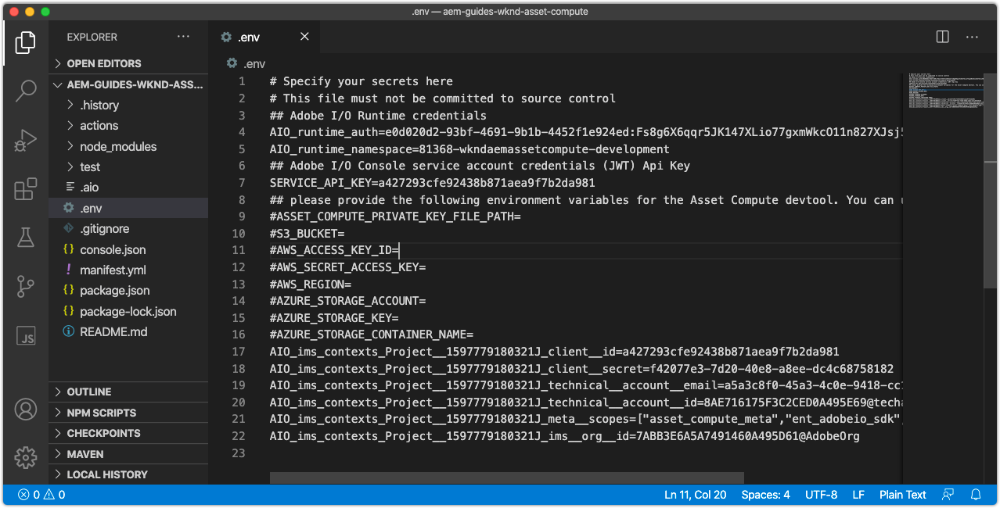
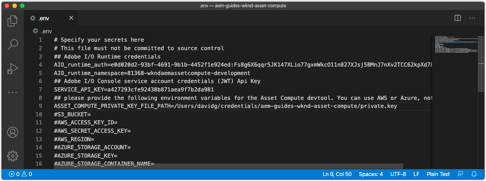
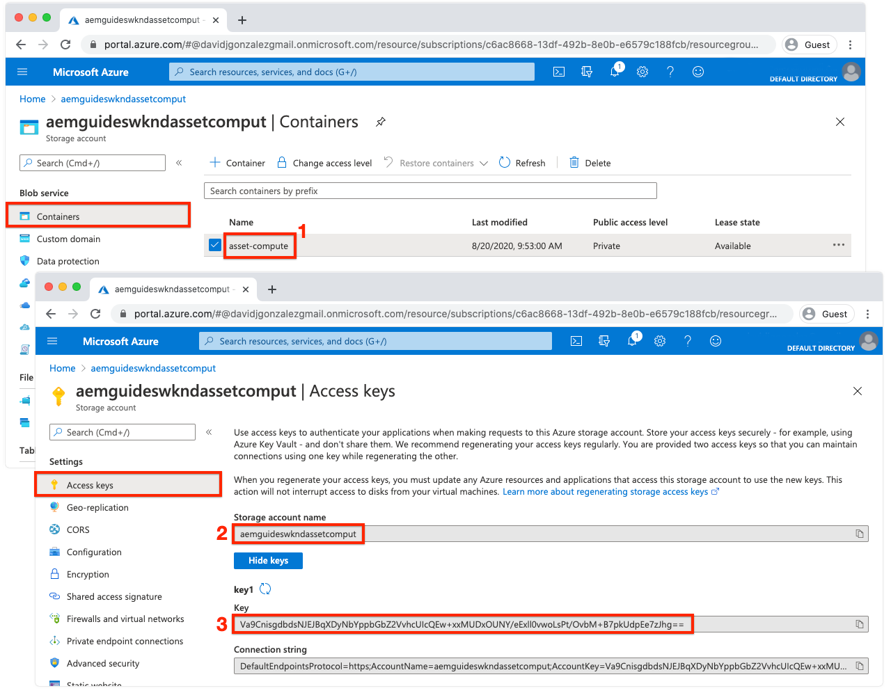
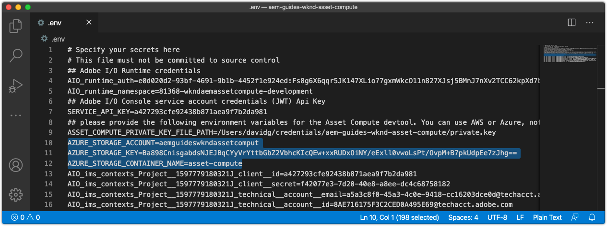

# Configure the environment variables



Before beginning development of Asset Compute workers, ensure the project is configured with Adobe I/O and cloud storage information. This information is stored in the project's `.env`  which is used only for local development, and not save in Git. The `.env` file provides a convenient way to expose key/values pairs to the local Asset Compute local development environment. When [deploying](../deploy/runtime.md) Asset Compute workers to Adobe I/O Runtime, the `.env` file is not used, but rather a subset of values are passed in via environment variables. Other custom parameters and secrets can be stored in the `.env` file as well, such as development credentials for 3rd party web services.

<!--
## Reference the `private.key`



Open the `.env` file, uncomment the `ASSET_COMPUTE_PRIVATE_KEY_FILE_PATH` key, and provide the absolute path on your filesystem to the `private.key` that pairs with the public certificate added to your Adobe I/O App Builder project.

+ If your key pair was generated by Adobe I/O, it was auto-downloaded as part of the  `config.zip`.
+ If you provided the public key to Adobe I/O, then you should also be in possession of the matching private key.
+ If you do not have these key pairs, you can generate new key pairs or upload new public keys at the bottom of:
[https://console.adobe.com](https://console.adobe.io) > Your Asset Compute App Builder project > Workspaces @ Development > Service Account (JWT).

Remember the `private.key` file should not be checked into Git as it contains secrets, rather it should be stored in a safe place outside the project.

For example, on macOS this might look like:

```
...
ASSET_COMPUTE_PRIVATE_KEY_FILE_PATH=/Users/example-user/credentials/aem-guides-wknd-asset-compute/private.key
...
```
-->

## Configure Cloud Storage credentials

Local development of Asset Compute workers requires access to [cloud storage](../set-up/accounts-and-services.md#cloud-storage). The cloud storage credentials used for local development are provided in the `.env` file.
 
This tutorial prefers the use of Azure Blob Storage, however Amazon S3 and it's corresponding keys in the `.env` file can be used instead.

### Using Azure Blob Storage

Uncomment and populate the following keys in the `.env` file, and populate them with the values for the provisioned cloud storage  found on Azure Portal.



1. Value for the `AZURE_STORAGE_CONTAINER_NAME` key
1. Value for the `AZURE_STORAGE_ACCOUNT` key
1. Value for the `AZURE_STORAGE_KEY` key

For example, this might look like (values for illustration only):

```
...
AZURE_STORAGE_ACCOUNT=aemguideswkndassetcomput
AZURE_STORAGE_KEY=Va9CnisgdbdsNJEJBqXDyNbYppbGbZ2V...OUNY/eExll0vwoLsPt/OvbM+B7pkUdpEe7zJhg==
AZURE_STORAGE_CONTAINER_NAME=asset-compute
...
```

The resultant `.env` file looks as follows:



If you are NOT using Microsoft Azure Blob Storage, remove or leave these commented out (by prefixing with `#`).

### Using Amazon S3 cloud storage{#amazon-s3}

If you are using Amazon S3 cloud storage uncomment and populate the following keys in the `.env` file. 

For example, this might look like (values for illustration only):

```
...
S3_BUCKET=aemguideswkndassetcompute
AWS_ACCESS_KEY_ID=KKIXZLZYNLXJLV24PLO6
AWS_SECRET_ACCESS_KEY=Ba898CnisgabdsNJEJBqCYyVrYttbGbZ2...OiNYExll0vwoLsPtOv
AWS_REGION=us-east-1
...
```

## Validating the project configuration

Once the generated Asset Compute project has been configured, validate the configuration prior to making code changes to ensure the supporting services are provisioned, in the `.env` files.

To start Asset Compute Development Tool for the Asset Compute project:

1. Open a command line in the Asset Compute project root (in VS Code this can be opened directly in the IDE  via Terminal > New Terminal), and execute the command:

    ```
    $ aio app run
    ```

1. The local Asset Compute Development Tool will open in your default Web browser at __http://localhost:9000__.

    

1. Watch the command line output and Web browser for error messages as Development Tool initializes.
1. To stop the Asset Compute Development Tool, tap `Ctrl-C` in the window that executed `aio app run` to terminate the process.

## Troubleshooting

+ [Development Tool cannot start due to missing private.key](../troubleshooting.md#missing-private-key)
