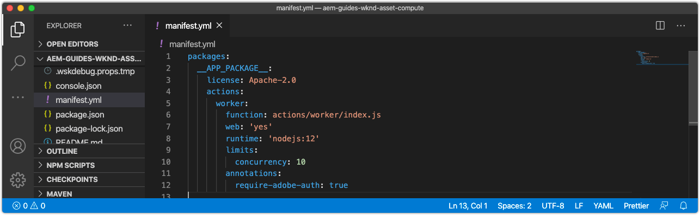
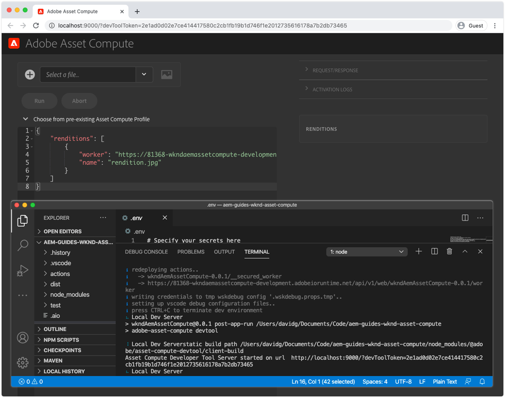

# Configure the manifest.yml

The `manifest.yml`, located in the root of the Asset Compute project, describes all the workers in this project to be deployed.



## Default worker definition

Workers are defined as Adobe I/O Runtime action entries under `actions`, and comprised of a set of configurations. 

Workers accessing other Adobe I/O integrations must set the `annotations -> require-adobe-auth` property to `true` as this [exposes the worker's Adobe I/O credentials](https://experienceleague.adobe.com/docs/asset-compute/using/extend/develop-custom-application.html#access-adobe-apis) via the `params.auth` object. This is  typically required when the worker calls out to Adobe I/O APIs such as the Adobe Photoshop, Lightroom or Sensei APIs, and can be toggled per worker.

1. Open and review the auto-generated worker `manifest.yml`. Projects that contains multiple Asset Compute workers, must define an entry for each worker under the `actions` array.

```yml
packages:
  __APP_PACKAGE__:
    license: Apache-2.0
    actions: # the array of workers, since we have a single worker there is only one entry beneath actions
      worker: # the auto-generated worker definition
        function: actions/worker/index.js # the entry point to the worker 
        web: 'yes'  # as our worker is invoked over HTTP from AEM Author service
        runtime: 'nodejs:12' # the target nodejs runtime (only 10 and 12 are supported)
        limits:
          concurrency: 10
        annotations:
          require-adobe-auth: true # set to true, to pass through Adobe I/O access token/client id via params.auth in the worker, typically required when the worker calls out to Adobe I/O APIs such as the Adobe Photoshop, Lightroom or Sensei APIs.
```          

## Define limits

Each worker can configure the [limits](https://www.adobe.io/apis/experienceplatform/runtime/docs.html#!adobedocs/adobeio-runtime/master/guides/system_settings.md) for its execution context in Adobe I/O Runtime. These values should be tuned to provide optimal sizing for the worker, based on the volume, rate and type of assets it will compute, as well as the type of work it performs.

Review [Adobe sizing guidance](https://experienceleague.adobe.com/docs/asset-compute/using/extend/develop-custom-application.html#sizing-workers) before setting limits. Asset Compute workers can run out of memory when processing assets, resulting in the Adobe I/O Runtime execution being killed, so ensure the worker is sized appropriately to handle all candidate assets.

1. Add an `inputs` section to the new `wknd-asset-compute` actions entry. This allows tuning of the Asset Compute worker's overall performance and resource allocation.

```yml
packages:
  __APP_PACKAGE__:
    license: Apache-2.0
    actions: 
      worker:
        function: actions/worker/index.js 
        web: 'yes' 
        runtime: 'nodejs:12'
        limits: # Allows for the tuning of the worker's performance
          timeout: 60000 # timeout in milliseconds (1 minute)
          memorySize: 512 # memory allocated in MB; if the worker offloads heavy computational work to other Web services this number can be reduced
          concurrency: 10 # adjust based on expected concurrent processing and timeout 
        annotations:
          require-adobe-auth: true
           
```    

## The finished manifest.yml

The final `manifest.yml` looks like:

```yml
packages:
  __APP_PACKAGE__:
    license: Apache-2.0
    actions: 
      worker:
        function: actions/worker/index.js 
        web: 'yes' 
        runtime: 'nodejs:12'
        limits:
          timeout: 60000 # in ms
          memorySize: 512 # in MB
          concurrency: 10 
        annotations:
          require-adobe-auth: true
```

## manifest.yml on Github

The final `.manifest.yml` is available on Github at:

+ [aem-guides-wknd-asset-compute/manifest.yml](https://github.com/adobe/aem-guides-wknd-asset-compute/blob/master/manifest.yml)


## Validating the manifest.yml

Once the generated Asset Compute `manifest.yml` is updated, run the local Development Tool and ensure starts successfully with the updated `manifest.yml` settings.

To start Asset Compute Development Tool for the Asset Compute project:

1. Open a command line in the Asset Compute project root (in VS Code this can be opened directly in the IDE  via Terminal > New Terminal), and execute the command:

    ```
    $ aio app run
    ```

1. The local Asset Compute Development Tool will open in your default Web browser at __http://localhost:9000__.

    

1. Watch the command line output and Web browser for error messages as Development Tool initializes.
1. To stop the Asset Compute Development Tool, tap `Ctrl-C` in the window that executed `aio app run` to terminate the process.

## Troubleshooting

+ [Incorrect YAML indentation](../troubleshooting.md#incorrect-yaml-indentation)
+ [memorySize limit is set too low](../troubleshooting.md#memorysize-limit-is-set-too-low)
