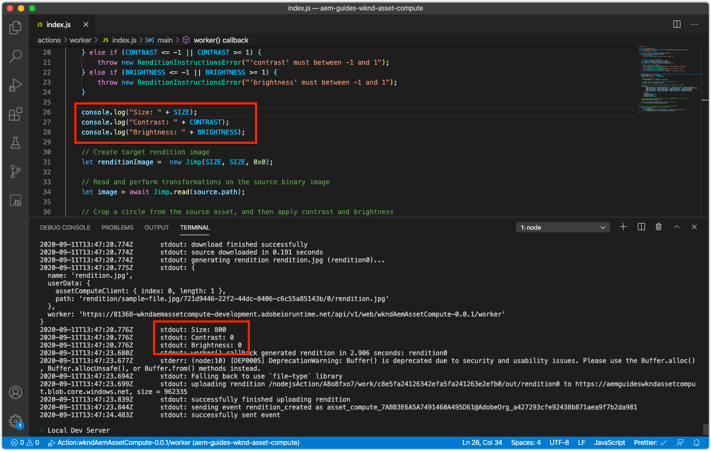
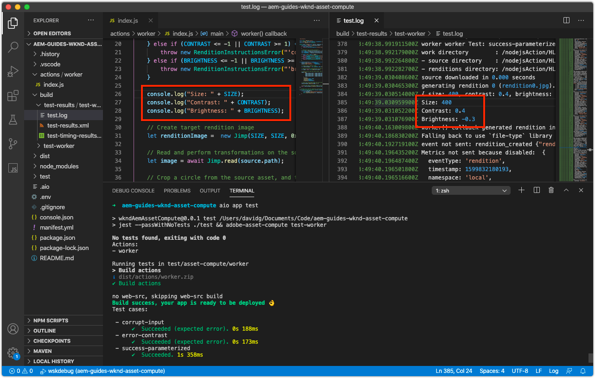
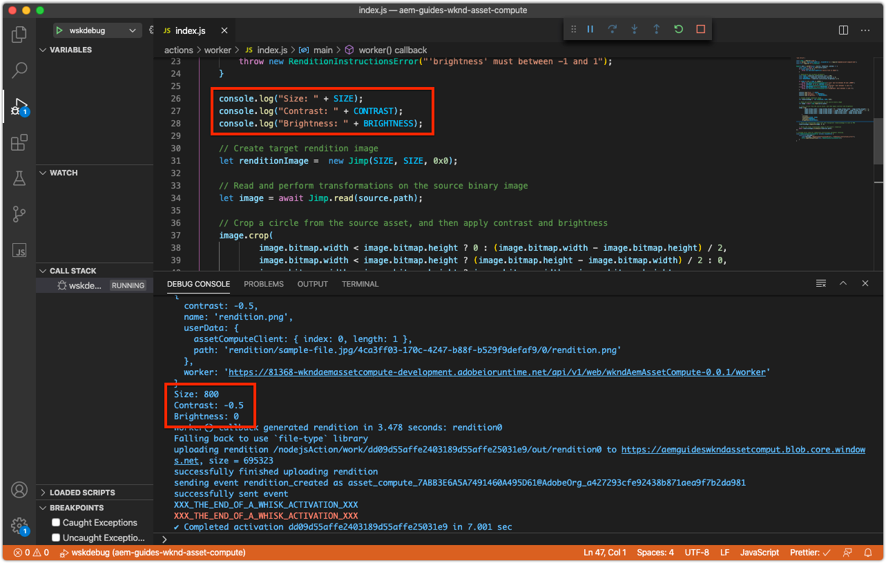
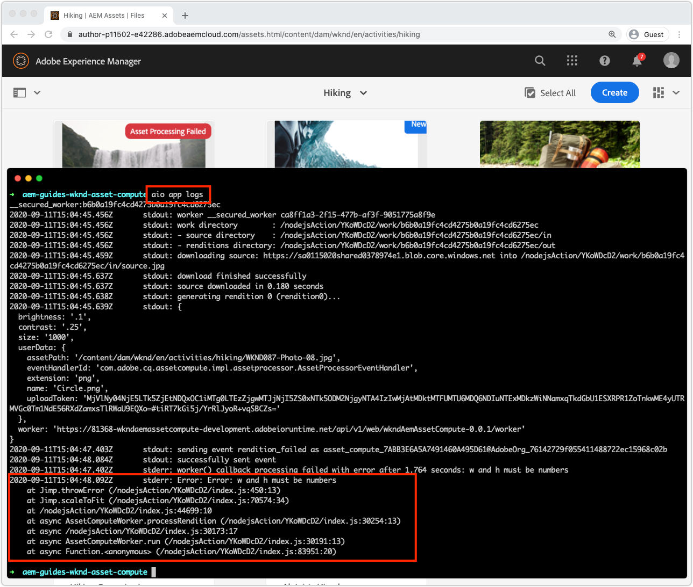

# Debug an Asset Compute worker

Asset Compute workers can be debugged in several ways, from simple debug log statements, to attached VS Code as a remote debugger, to pulling logs for activations in Adobe I/O Runtime initiated from AEM as a Cloud Service.

## Logging

The most basic form of debugging Asset Compute workers uses traditional `console.log(..)` statements in the worker code. The `console` JavaScript object is an implicit, global object so there is no need to import or require it, as it is always present in all contexts. 

These log statements are available for review differently based on how the Asset Compute worker is executed:

+ From `aio app run`, logs print to standard out and the [Development Tool's](../develop/development-tool.md) Activation Logs
    
+ From `aio app test`, logs print to `/build/test-results/test-worker/test.log`
    
+ Using `wskdebug`, logs statements print to the VS Code Debug Console (View > Debug Console), standard out
    
+ Using `aio app logs`, log statements print to the activation log output

## Remote debugging via attached debugger

>[!WARNING]
>
>Use Microsoft Visual Studio Code 1.48.0 or greater for compatibility with wskdebug

The [wskdebug](https://www.npmjs.com/package/@openwhisk/wskdebug) npm module, supports attaching a debugger to Asset Compute workers, including the ability to set breakpoints in VS Code and step through the code.

>[!VIDEO](https://video.tv.adobe.com/v/40383?quality=12&learn=on)

_Click-through of debugging an Asset Compute worker using wskdebug (No audio)_

1. Ensure [wskdebug](../set-up/development-environment.md#wskdebug) and [ngrok](../set-up/development-environment.md#ngork) npm modules are installed
1. Ensure [Docker Desktop and the supporting Docker images](../set-up/development-environment.md#docker) are installed  and running
1. Close any active running instances of Development Tool.
1. Deploy the latest code using `aio app deploy`  and record the deployed action name (name between the `[...]`). This is used to update the `launch.json` in step 8.

   ```
   ℹ Info: Deploying package [wkndAemAssetCompute-0.0.1]...
   ```


1. Start a new instance of Asset Compute Development Tool using the command `npx adobe-asset-compute devtool`
1. In VS Code, tap the Debug icon in the left navigation
    + If prompted, tap __create a launch.json file > Node.js__ to create a new `launch.json` file.
    + Else, tap the __Gear__ icon to the right of the __Launch Program__ dropdown to open the existing `launch.json` in the editor.
1. Add the following JSON object configuration to the `configurations` array:

    ```json
    {
        "type": "pwa-node",
        "request": "launch",
        "name": "wskdebug",
        "attachSimplePort": 0,
        "runtimeExecutable": "wskdebug",
        "args": [
            "wkndAemAssetCompute-0.0.1/__secured_worker",  // Version must match your Asset Compute worker's version
            "${workspaceFolder}/actions/worker/index.js",  // Points to your worker
            "-l",
            "--ngrok"
        ],
        "localRoot": "${workspaceFolder}",
        "remoteRoot": "/code",
        "outputCapture": "std",
        "timeout": 30000
    }
    ```

1. Select the new __wskdebug__ from the dropdown
1. Tap the green __Run__ button to the left of __wskdebug__ dropdown
1. Open `/actions/worker/index.js` and tap to the left of the line numbers to add break points 1. Navigate to the Asset Compute Development Tool Web browser window opened in step 6
1. Tap the __Run__ button to execute the worker
1. Navigate back to VS Code, to `/actions/worker/index.js` and step through the code
1. To exit the debug-able Development Tool, tap `Ctrl-C` in the terminal that ran `npx adobe-asset-compute devtool` command in step 6

## Accessing logs from Adobe I/O Runtime{#aio-app-logs}

[AEM as a Cloud Service leverages Asset Compute workers via Processing Profiles](../deploy/processing-profiles.md) by directly invoking them in Adobe I/O Runtime. Because these invocations do not involve local development, their executions cannot be debugged using local tooling such as Asset Compute Development Tool or wskdebug. Instead, the Adobe I/O CLI can be be used to fetch logs from the worker executed in a particular workspace in Adobe I/O Runtime.

1. Ensure the [workspace-specific environment variables](../deploy/runtime.md) are set via `AIO_runtime_namespace` and `AIO_runtime_auth`, based on the workspace requiring debugging.
1. From the command line, execute `aio app logs`
    + If the workspace is incurring heavy traffic, expand the number of activation logs via the `--limit` flag:
        `$ aio app logs --limit=25`
1. The most recent (up to the provided `--limit`) activations logs are returned as the output of the command for review.
   
   

## Troubleshooting

+ [Debugger does not attach](../troubleshooting.md#debugger-does-not-attach)
+ [Breakpoints not pausing](../troubleshooting.md#breakpoints-no-pausing)
+ [VS Code debugger not attached](../troubleshooting.md#vs-code-debugger-not-attached)
+ [VS Code debugger attached after worker execution began](../troubleshooting.md#vs-code-debugger-attached-after-worker-execution-began)
+ [Worker times out while debugging](../troubleshooting.md#worker-times-out-while-debugging)
+ [Cannot terminate debugger process](../troubleshooting.md#cannot-terminate-debugger-process)
