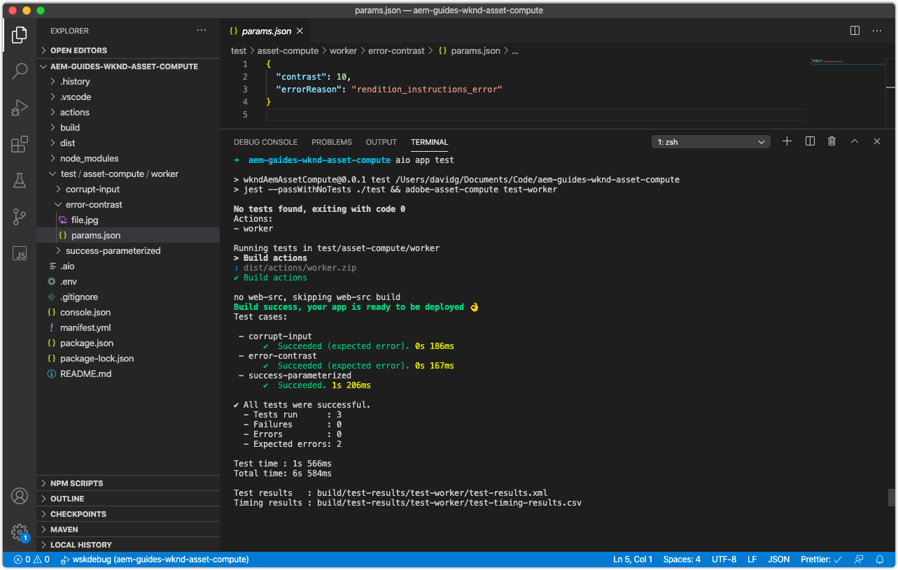

# Test an Asset Compute worker

The Asset Compute project defines a pattern for easily creating and executing [tests of Asset Compute workers](https://docs.adobe.com/content/help/en/asset-compute/using/extend/test-custom-application.html).

## Anatomy of a worker test

Asset Compute workers' tests are broken into test suites, and within each test suite, one or more test cases asserting a condition to test.

The structure of tests in an Asset Compute project are as follows:

```

/actions/<worker-name>/index.js
...
/test/
  asset-compute/
    <worker-name>/           <--- Test suite for the worker, must match the yaml key for this worker in manifest.yml
        <test-case-1>/       <--- Specific test case 
            file.jpg         <--- Input file (ie. `source.path` or `source.url`)
            params.json      <--- Parameters (ie. `rendition.instructions`)
            rendition.png    <--- Expected output file (ie. `rendition.path`)
        <test-case-2>/       <--- Another specific test case for this worker
            ...
```

Each test cast can have the following files:

+ `file.<extension>`
    + Source file to test (extension can be anything except `.link`)
    + Required
+ `rendition.<extension>`
    + Expected rendition
    + Required, except for error testing
+ `params.json`
    + The single rendition JSON instructions
    + Optional
+ `validate`
    + A script that gets expected and actual rendition file paths as arguments and must return exit code 0 if the result is ok, or a non-zero exit code if the validation or comparison failed.
    + Optional, defaults to the `diff` command
    + Use a shell script that wraps a docker run command for using different validation tools
+ `mock-<host-name>.json`
    + JSON formatted HTTP responses for [mocking external service calls](https://www.mock-server.com/mock_server/creating_expectations.html).
    + Optional, only used if the worker code makes HTTP requests of its own

## Writing a test case

This test case asserts the parameterized input (`params.json`) for the input file (`file.jpg`) generates the expected PNG rendition (`rendition.png`).

1. First delete the auto-generated `simple-worker` tests case at `/test/asset-compute/simple-worker` as this is invalid, as our worker no longer simply copies the source to the rendition.
1. Create a new test case folder at `/test/asset-compute/worker/success-parameterized` to test a successful execution of the worker that generates a PNG rendition.
1. In the `success-parameterized` folder, add the test [input file](./assets/test/success-parameterized/file.jpg) for this test case and name it `file.jpg`.
1. In the `success-parameterized` folder, add a new file named `params.json` that defines the input parameters of the worker:

   ```json
   { 
       "size": "400",
       "contrast": "0.25",
       "brightness": "-0.50"
   }
   ```
   
   These are the same key/values passed into the [Development Tool's Asset Compute profile definition](../develop/development-tool.md), less the `worker` key.
 
1. Add the expected [rendition file](./assets/test/success-parameterized/rendition.png) to this test case and name it `rendition.png`. This file represents the expected output of the worker for the given input `file.jpg`. 
1. From the command line, run the tests the project root by executing `aio app test`
    + Ensure [Docker Desktop](../set-up/development-environment.md#docker) and supporting Docker images are installed and started
    + Terminate any running Development Tool instances


## Writing an error checking test case

This test case tests to ensure the worker throws the appropriate error when the `contrast` parameter is set to an invalid value.

1. Create a new test case folder at `/test/asset-compute/worker/error-contrast` to test a erring execution of the worker due to an invalid `contrast` parameter value.
1. In the `error-contrast` folder, add the test [input file](./assets/test/error-contrast/file.jpg) for this test case and name it `file.jpg`. The contents of this file is immaterial to this test, it just needs to exist to get past the "Corrupt source" check, in order to reach the `rendition.instructions` validity checks, that this test case validates.
1. In the `error-contrast` folder, add a new file named `params.json` that defines the input parameters of the worker with the contents:
 
    ```json
    {
        "contrast": "10",
        "errorReason": "rendition_instructions_error"
    }
    ```
    
    + Set `contrast` parameters to `10`, an invalid value, as contrast must be between -1 and 1, to throw a `RenditionInstructionsError`.
    + Assert the appropriate error is thrown in tests by setting the `errorReason` key to the "reason" associated with the expected error. This invalid contrast parameter throws the [custom error](../develop/worker.md#errors), `RenditionInstructionsError`, therefore set the `errorReason` to this error's reason, or`rendition_instructions_error` to assert it is thrown.

1. Since no rendition should be generated during an erring execution, no `rendition.<extension>` file is necessary.
1. Run the test suite from the root of the project by executing the command `aio app test`
    + Ensure [Docker Desktop](../set-up/development-environment.md#docker) and supporting Docker images are installed and started
    + Terminate any running Development Tool instances



## Test cases on Github

The final test cases are available on Github at:

+ [aem-guides-wknd-asset-compute/test/asset-compute/worker](https://github.com/adobe/aem-guides-wknd-asset-compute/tree/master/test/asset-compute/worker)

## Troubleshooting

+ [No rendition generated during test execution](../troubleshooting.md#test-no-rendition-generated)
+ [Test generates incorrect rendition](../troubleshooting.md#tests-generates-incorrect-rendition)
