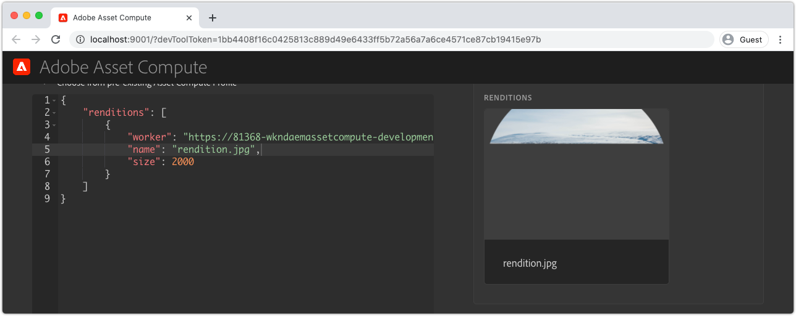
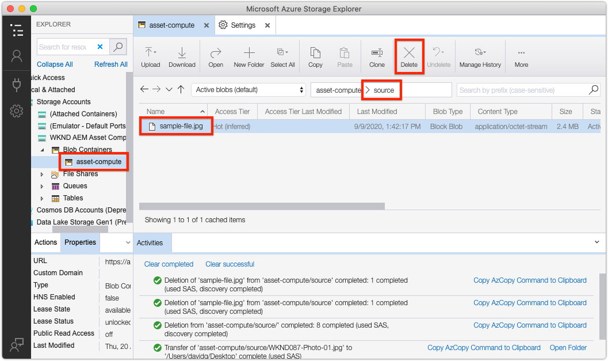
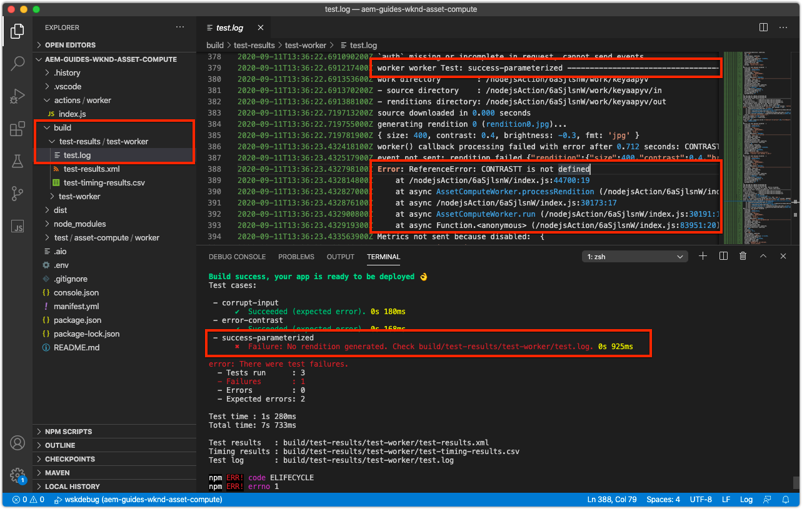
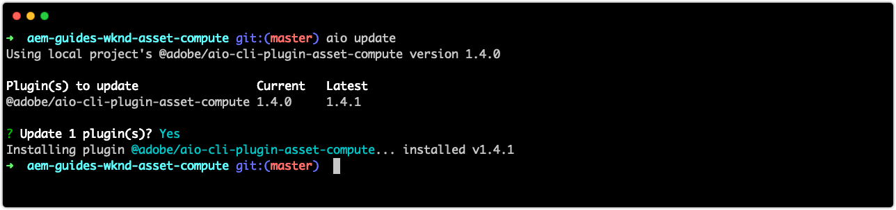

# Troubleshoot Asset Compute extensibility

The following is an index of common issues and errors, along with the resolutions, that might be encountered when developing and deploying custom Asset Compute workers for AEM Assets.

## Develop{#develop}

### Rendition is returned partially drawn/corrupted{#rendition-returned-partially-drawn-or-corrupt}

+ __Error__: Rendition renders incompletely (when an image) or is corrupt and cannot be opened.

  

+ __Cause__: The worker's `renditionCallback` function is exiting before the rendition can be completely written to `rendition.path`.
+ __Resolution__: Review the custom worker code and ensure all asynchronous calls are made synchronous using `await`.

## Development Tool{#development-tool}

### Console.json file missing from Asset Compute project{#missing-console-json}

+ __Error:__ Error: Missing required files at validate (.../node_modules/@adobe/asset-compute-client/lib/integrationConfiguration.js:XX:YY) at async setupAssetCompute (.../node_modules/@adobe/asset-compute-devtool/src/assetComputeDevTool.js:XX:YY)
+ __Cause:__ The `console.json` file is missing from the root of the Asset Compute project
+ __Resolution:__ Download a new `console.json` form your Adobe I/O project
  1. In console.adobe.io, open the Adobe I/O project the Asset Compute project is configured to use
  1. Tap the __Download__ button in the top right
  1. Save the downloaded file to the root of your Asset Compute project using the filename `console.json`

### Incorrect YAML indentation in manifest.yml{#incorrect-yaml-indentation}

+ __Error:__ YAMLException: bad indentation of a mapping entry at line X, column Y:(via standard out from `aio app run` command)
+ __Cause:__ Yaml files are white-spaced sensitive, it likely that your indentation is incorrect.
+ __Resolution:__ Review your `manifest.yml` and ensure all indentation is correct.

### memorySize limit is set too low{#memorysize-limit-is-set-too-low}

+ __Error:__  Local Dev Server OpenWhiskError: PUT https://adobeioruntime.net/api/v1/namespaces/xxx-xxx-xxx/actions/xxx-0.0.1/__secured_workeroverwrite=true Returned HTTP 400 (Bad Request) --> "The request content was malformed:requirement failed: memory 64 MB below allowed threshold of 134217728 B"
+ __Cause:__ A `memorySize` limit for the worker in the `manifest.yml` was set below the minimum allowed threshold as reported by the error message in bytes.
+ __Resolution:__  Review the `memorySize` limits in the `manifest.yml` and ensure they are all large than the minimum allowed threshold.

### Development Tool cannot start due to missing private.key{#missing-private-key}

+ __Error:__ Local Dev ServerError: Missing required files at validatePrivateKeyFile.... (via standard out from `aio app run` command)
+ __Cause:__ The `ASSET_COMPUTE_PRIVATE_KEY_FILE_PATH` value in `.env` file, does not point to `private.key` or `private.key` is not read-able by the current user.
+ __Resolution:__ Review the `ASSET_COMPUTE_PRIVATE_KEY_FILE_PATH` value in `.env` file, and ensure it contains the full, absolute path to the `private.key` on your file system.

### Source files dropdown incorrect{#source-files-dropdown-incorrect}

Asset Compute Development Tool may enter a state where it pulls stale data, and is most noticeable in the __Source file__ dropdown displaying incorrect items.

+ __Error:__ Source file dropdown displays incorrect items.
+ __Cause:__ Stale cached browser state causes the 
+ __Resolution:__ In your browser completely clear the browser tab's "application state", the browser cache, local storage and service worker.

### Missing or invalid devToolToken query parameter{#missing-or-invalid-devtooltoken-query-parameter}

+ __Error:__ "Unauthorized" notification in Asset Compute Development Tool
+ __Cause:__ `devToolToken` is missing or invalid
+ __Resolution:__ Close the Asset Compute Development Tool browser window, terminate any running Development Tool processes initiated via the `aio app run` command, and re-start Development Tool (using `aio app run`).

### Unable to remove source files{#unable-to-remove-source-files}

+ __Error:__ There is no way to remove added source files from the Development Tools UI
+ __Cause:__ This functionality has not been implemented
+ __Resolution:__ Log into your cloud storage provider using the credentials defined in `.env`. Locate the container used by the Development Tools (also specified in `.env`), navigate into the __source__ folder, and delete any source images. YOu may need to perform the steps outlined in [Source files dropdown incorrect](#source-files-dropdown-incorrect) if the deleted source files continue to display in the dropdown as they may be cached locally in the Development Tools "application state".

    

## Test{#test}

### No rendition generated during test execution{#test-no-rendition-generated}

+ __Error:__ Failure: No rendition generated.
+ __Cause:__ The worker failed to generate a rendition due to an unexpected error such as a JavaScript syntax error.
+ __Resolution:__ Review the test execution's `test.log` at `/build/test-results/test-worker/test.log`. Locate the section in this file corresponding to the failing test case, and review for errors.

   

### Test generates incorrect rendition causing test to fail{#tests-generates-incorrect-rendition}

+ __Error:__ Failure: Rendition 'rendition.xxx' not as expected.
+ __Cause:__ The worker output a rendition that was not the same as the `rendition.<extension>` provided in the test case. 
    + If the expected `rendition.<extension>` file is not created in the exact same manner as the locally generated rendition in the test case, the test may fail as there may be some difference in the bits. For example, if the Asset Compute worker changes the contrast using APIs, and the expected result is created by adjusting the contrast in Adobe Photoshop CC, the files may appear the same, but minor variations in the bits may be different.
+ __Resolution:__ Review rendition output from the test by navigating to `/build/test-worker/<worker-name>/<test-run-timestamp>/<test-case>/rendition.<extension>`, and compare it to the expected rendition file in the test case. To create an exact expected asset, either:
    + Use the Development Tool to generate a rendition, validate it is correct, and use that as the expected rendition file
    + Or, validate the test-generated file at `/build/test-worker/<worker-name>/<test-run-timestamp>/<test-case>/rendition.<extension>`, validate it is correct, and use tht as the expected rendition file

## Debug

### Debugger does not attach{#debugger-does-not-attach}

+ __Error__: Error processing launch: Error: Could not connect ot debug target at... 
+ __Cause__: Docker Desktop is not running on the local system. Verify this by reviewing the VS Code Debug Console (View > Debug Console), confirming this error is reported.
+ __Resolution__: Start [Docker Desktop and confirm the requisite Docker images are installed](./set-up/development-environment.md#docker).

### Breakpoints not pausing{#breakpoints-no-pausing}

+ __Error__: When running the Asset Compute worker from the debug-able Development Tool, VS Code does not pause at breakpoints.

#### VS Code debugger not attached{#vs-code-debugger-not-attached}

+ __Cause:__ The VS Code debugger was stopped/disconnected.
+ __Resolution:__ Restart the VS Code debugger, and verify it attaches by watching the VS Code Debug Output console (View > Debug Console)

#### VS Code debugger attached after worker execution began{#vs-code-debugger-attached-after-worker-execution-began}

+ __Cause:__ The VS Code debugger did not attach prior to tapping __Run__ in Development Tool.
+ __Resolution:__ Ensure the debugger has attached by reviewing VS Code's Debug Console (View > Debug Console), and then re-run the Asset Compute worker from Development Tool.

### Worker times out while debugging{#worker-times-out-while-debugging}

+ __Error__: Debug Console reports "Action will timeout in -XXX milliseconds" or [Asset Compute Development Tool's](./develop/development-tool.md) rendition preview spins indefinitely or
+ __Cause__: The worker timeout as defined in the [manifest.yml](./develop/manifest.md) is exceeded during debugging.
+ __Resolution__: Temporarily increase the worker's timeout in the [manifest.yml](./develop/manifest.md) or accelerate debugging activities.

### Cannot terminate debugger process{#cannot-terminate-debugger-process}

+ __Error__: `Ctrl-C` on the command line does not terminate the debugger process (`npx adobe-asset-compute devtool`).
+ __Cause__: A bug  in `@adobe/aio-cli-plugin-asset-compute` 1.3.x, results in `Ctrl-C` not being recognized as a terminating command.
+ __Resolution__: Update `@adobe/aio-cli-plugin-asset-compute` to version 1.4.1+

    ```
    $ aio update
    ```

    

## Deploy{#deploy}

### Custom rendition missing from asset in AEM{#custom-rendition-missing-from-asset}

+ __Error:__ New and re-processed assets process successfully, but are missing the custom rendition

#### Processing profile not applied to ancestor folder

+ __Cause:__ The asset does not exist under a folder with the Processing Profile that uses the custom worker
+ __Resolution:__ Apply the Processing Profile to an ancestor folder of the asset

#### Processing profile superseded by lower Processing Profile

+ __Cause:__ The asset exists beneath a folder with the custom worker Processing Profile applied, however a different Processing Profile that does not use the customer worker has been applied between that folder and the asset.
+ __Resolution:__ Combine, or otherwise reconcile, the two Processing Profiles and remove the intermediate Processing Profile

### Asset processing fails in AEM{#asset-processing-fails}

+ __Error:__ Asset Processing Failed badge displayed on asset
+ __Cause:__ An error occurred in the execution of the custom worker
+ __Resolution:__ Follow the instructions on [debugging Adobe I/O Runtime activations](./test-debug/debug.md#aio-app-logs) using `aio app logs`.
