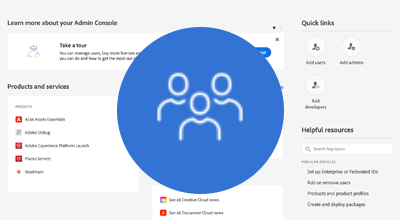
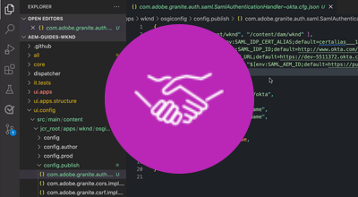

# AEM as a Cloud Service authentication

AEM as a Cloud Service supports multiple of authentication options and varies by service type. 

|                       | AEM Author | AEM Publish | 
|-----------------------|:----------:|:-----------:|
| [Adobe IMS](../accessing/overview.md) |  &#10004;  | &#10008;    |
| [SAML 2.0](./saml-2-0.md) |  &#10008;  | &#10004;    |
| [Token authentication](../../headless-tutorial/authentication/overview.md) |  &#10004;  | &#10004;    |

## Authentication options

Click into the corresponding link below to for details on how to set up and use the authentication approach.

<table>
  <tr>
   <td>
      
      
<strong><a href="../accessing/overview.md">Adobe IMS</a></strong>

      

          Manage AEM Author access using Adobe IMS via the Adobe Admin Console.
      

    </td>   
   <td>
      
      
<strong><a href="./saml-2-0.md">SAML 2.0</a></strong>

      

        Authenticate your web site's user to an IDP using AEM Publish service's SAML 2.0 integration.
      

    </td>   
   <td>
      
      
<strong><a href="../../headless-tutorial/authentication/overview.md">Token authentication</a></strong>

      

        Allow applications and middleware to authenticate to AEM using an API service token.
      

    </td>   
  </tr>
</table>
