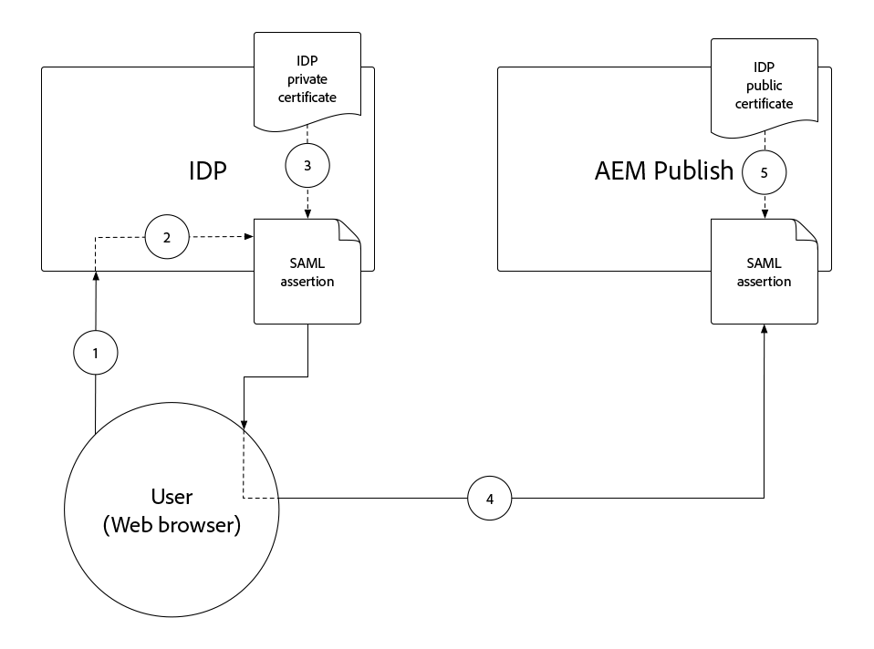
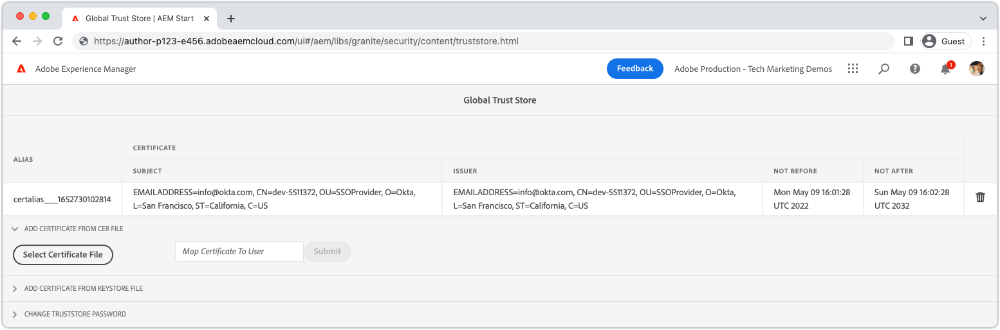
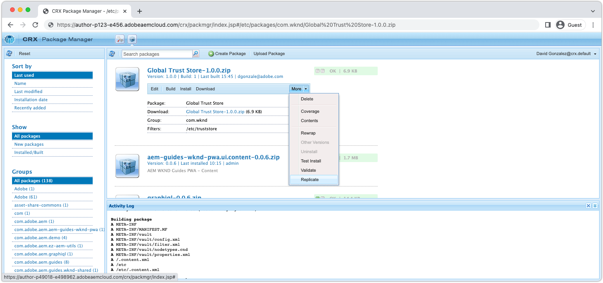
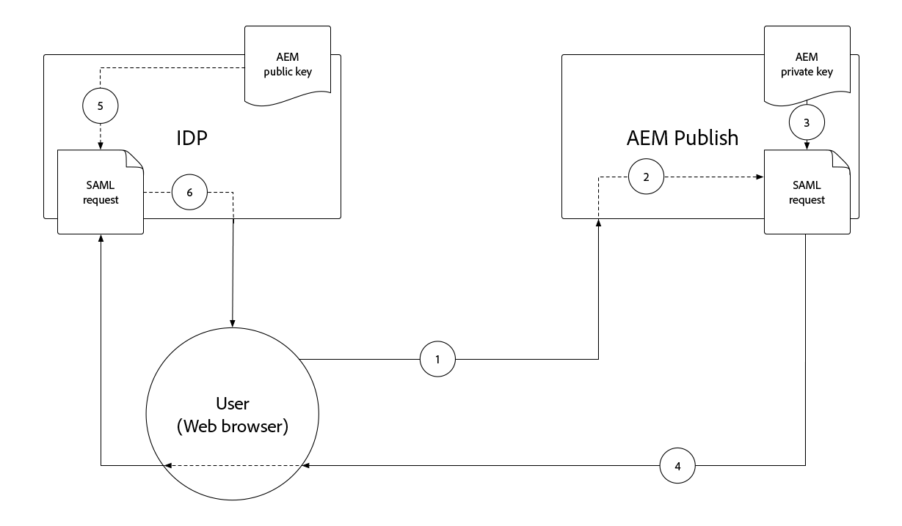
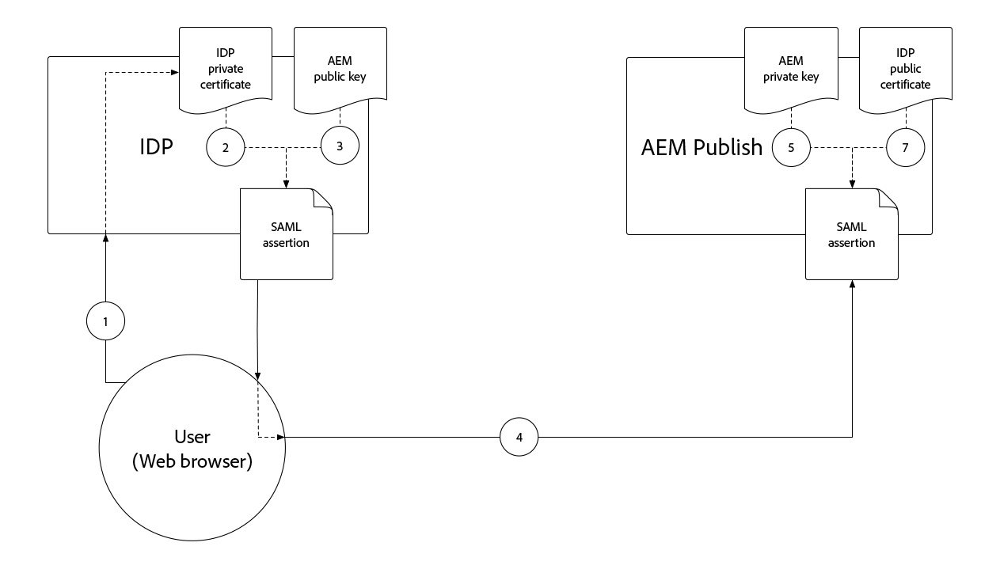
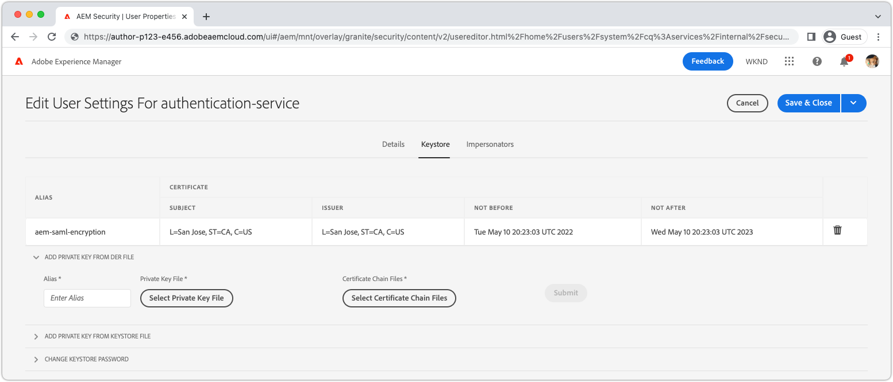

# SAML 2.0 authentication{#saml-2-0-authentication}

Learn how to set up and authenticate end-users (not AEM authors) to a SAML 2.0 compatible IDP of your choosing.

## What SAML for AEM as a Cloud Service?

SAML 2.0 integration with AEM Publish (or Preview), allows end users of an AEM-based web experience to authenticate to a non-Adobe IDP (Identity Provider), and access AEM as a named, authorized user.

|                       | AEM Author | AEM Publish | 
|-----------------------|:----------:|:-----------:|
| SAML 2.0 support      |  &#10008;  | &#10004;    |

+++ Understand the SAML 2.0 flow with AEM

The typical flow of an AEM Publish SAML integration is as follows:

1. User makes a request to AEM Publish the indicates authentication is required.
    + User requests a CUGs/ACL protected resource.
    + User requests a resource that is subject to an Authentication Requirement.
    + User follows a link to AEM's login endpoint (i.e. `/system/sling/login`) that explicitly requests the login action.
1. AEM makes an AuthnRequest to the IDP, requesting IDP to start authentication process.
1. User authenticates to IDP.
    + User is prompted by the IDP for credentials.
    + User is already authenticated with the IDP and does not have to provide further credentials.
1. IDP generates a SAML assertion containing the user's data, and signs it using the IDP's private certificate.
1. IDP sends the SAML assertion via HTTP POST, by way of the user's web browser (RESPECTIVE_PROTECTED_PATH/saml_login), to AEM Publish.
1. AEM Publish receives the SAML assertion, and validates the SAML assertion's integrity and authenticity using the IDP public certificate. 
1. AEM Publish manages the AEM user record based on the SAML 2.0 OSGi configuration, and the contents of the SAML Assertion.
    + Creates user
    + Synchronizes user attributes
    + Updates AEM user group membership
1. AEM Publish sets the AEM `login-token` cookie on the HTTP response, which is used to authenticate subsequent requests to AEM Publish.
1. AEM Publish redirects user to URL on AEM Publish as specified by the `saml_request_path` cookie.

+++

## Configuration walk-through

>[!VIDEO](https://video.tv.adobe.com/v/343040?quality=12&learn=on)

This video walks through of setting up SAML 2.0 integration with AEM as a Cloud Service Publish service, and using Okta as the IDP.

## Prerequisites

The following are required when setting up SAML 2.0 authentication:

+ Deployment Manager access to Cloud Manager
+ AEM Administrator access to AEM as a Cloud Service environment
+ Administrator access to the IDP
+ Optionally, access to a public/private keypair used to encryption SAML payloads

SAML 2.0 is only supported to authenticate uses to AEM Publish or Preview. To manage the authentication of AEM Author using and IDP, [integrate the IDP with Adobe IMS](https://helpx.adobe.com/enterprise/using/set-up-identity.html).


## Install IDP public certificate on AEM

The IDP's public certificate is added to AEM's Global Trust Store, and used to validate the SAML assertion sent by the IDP is valid.

+++SAML assertion signing flow



1. User authenticates to IDP.
1. IDP generates a SAML assertion containing the user's data.
1. IDP signs the SAML assertion using the IDP's private certificate.
1. IDP initiates a client-side HTTP POST to AEM Publish's SAML endpoint (`.../saml_login`) that includes the signed SAML assertion.
1. AEM Publish receives the HTTP POST containing the signed SAML assertion, can validate the signature using the IDP public certificate.

+++



1. Obtain the __public certificate__ file from the IDP. This certificate allows AEM to validate the SAML assertion provided to AEM by the IDP.

    The certificate is in PEM format, and should resemble:

    ```
    -----BEGIN CERTIFICATE-----
    MIIC4jCBAcoCCQC33wnybT5QZDANBgkqhkiG9w0BAQsFADAyMQswCQYDVQQGEwJV
    ...
    m0eo2USlSRTVl7QHRTuiuSThHpLKQQ==
    -----END CERTIFICATE-----
    ```

1. Log in to AEM Author as an AEM Administrator.
1. Navigate to __Tools > Security > Trust Store__.
1. Create or open the Global Trust Store. If creating a Global Trust Store, store the password some place safe.
1. Expand __Add certificate from CER file__.
1. Select __Select Certificate File__, and upload the certificate file provided by the IDP. 
1. Leave __Map Certificate to User__ blank.
1. Select __Submit__.
1. The newly added certificate appears above the __Add certificate from CRT file__ section.
1. Make note of the __alias__, as this value is used in the [SAML 2.0 Authentication Handler OSGi configuration](#saml-2-0-authentication-handler-osgi-configuration).
1. Select __Save & Close__.

The Global Trust Store is configured with the IDP's public certificate on AEM Author, but since SAML is only used on AEM Publish, the Global Trust Store must be replicated to AEM Publish for the IDP public certificate to be accessible there.



1. Navigate to __Tools > Deployment > Packages__.
1. Create a package
    + Package name: `Global Trust Store`
    + Version: `1.0.0`
    + Group: `com.your.company`
1. Edit the new __Global Trust Store__ package.
1. Select the __Filters__ tab, and add a filter for the root path `/etc/truststore`.
1. Select __Done__ and then __Save__.
1. Select the __Build__ button for the __Global Trust Store__ package.
1. Once built, select __More__ > __Replicate__ to activate the Global Trust Store node (`/etc/truststore`) to AEM Publish.

## Create authentication-service keystore{#authentication-service-keystore}

_Creating a keystore for authentication-service is required when the [SAML 2.0 authentication handler OSGi configuration property `handleLogout` is set to `true`](#saml-20-authenticationsaml-2-0-authentication) or when [AuthnRequest signing/SAML assertion ecryption](#install-aem-public-private-key-pair) is required_

1. Log in to AEM Author as an AEM Administrator, to upload the private key.
1. Navigate to __Tools > Security > Users__, and select __authentication-service__ user, and select __Properties__ from the top action bar.
1. Select the __Keystore__ tab.
1. Create or open the keystore. If creating a keystore, keep the password safe.
    + A [public/private keystore is installed into this keystore](#install-aem-public-private-key-pair) only if AuthnRequest signing/SAML assertion encryption is required.
    + If this SAML integration supports logout, but not AuthnRequest signing/SAML assertion, then an empty keystore is sufficient.
1. Select __Save & Close__.
1. Create a package containing the updated __authentication-service__ user. 

    _Use the following temporary workaround using packages:_

   1. Navigate to __Tools > Deployment > Packages__.
   1. Create a package
       + Package name: `Authentication Service`
       + Version: `1.0.0`
       + Group: `com.your.company`
   1. Edit the new __Authentication Service Key Store__ package.
   1. Select the __Filters__ tab, and add a filter for the root path `/home/users/system/cq:services/internal/security/<AUTHENTICATION SERVICE UUID>/keystore`.
        + The `<AUTHENTICATION SERVICE UUID>` can be found by navigating to __Tools > Security > Users__, and selecting __authentication-service__ user. The UUID is the last part of the URL.
   1. Select __Done__ and then __Save__.
   1. Select the __Build__ button for the __Authentication Service Key Store__ package.
   1. Once built, select __More__ > __Replicate__ to activate the Authentication Service key store to AEM Publish.

## Install AEM public/private key pair{#install-aem-public-private-key-pair}

_Installing the AEM public/private key pair is optional_

AEM Publish can be configured to sign AuthnRequests (to IDP), and encrypt SAML assertions (to AEM). This is achieved by providing a private key to AEM Publish, and it's matching public key to the IDP.

+++ Understand the AuthnRequest signing flow (optional)

The AuthnRequest (the request to the IDP from AEM Publish that initiates the login process) can be signed by AEM Publish. To do this, AEM Publish signs the AuthnRequest using the private key, that the IDP then validates the signature using the public key. This guarantees to the IDP that AuthnRequest was initiated, and requested by AEM Publish, and not a malicious third party.



1. User makes an HTTP request to AEM Publish that results in an SAML authentication request to the IDP.
1. AEM Publish generates the SAML request to send to the IDP.
1. AEM Publish signs the SAML request using AEM's private key.
1. AEM Publish initiates the AuthnRequest, an HTTP client-side redirect to the IDP that contains the signed SAML request.
1. IDP receives the AuthnRequest, and validates the signature using AEM's public key, guaranteeing AEM Publish initiated the AuthnRequest.
1. AEM Publish then validates the decrypted SAML assertion's integrity and authenticity using the IDP public certificate.

+++

+++ Understand the SAML assertion encryption flow (optional)

All HTTP communication between IDP and AEM Publish should be over HTTPS, and thus secure by default. However, as required, SAML assertions can be encrypted in the event extra confidentiality is required on top of that provided by HTTPS. To do this, the IDP encrypts the SAML Assertion data using the private key, and AEM Publish decrypts the SAML assertion using the private key.



1. User authenticates to IDP.
1. IDP generates a SAML assertion containing the user's data, and signs it using the IDP's private certificate.
1. IDP then encrypts the SAML assertion with AEM's public key, which requires the AEM private key to decrypt.
1. The encrypted SAML assertion is sent, by way of the user's web browser to AEM Publish.
1. AEM Publish receives the SAML assertion, and decrypts it using AEM's private key.
1. IDP prompts user to authenticate.

+++

Both AuthnRequest signing, and SAML assertion encryption are optional, however they are both enabled, using the [SAML 2.0 authentication handler OSGi configuration property `useEncryption`](#saml-20-authenticationsaml-2-0-authentication), meaning both or neither can be used.



1. Obtain the public key, private key (PKCS#8 in DER format), and certificate chain file (this may be the public key) used to sign the AuthnRequest, and encrypt the SAML assertion. The keys are typically provided by the IT organization's security team.

    + A self-signed key pair can be generated using __openssl__:

    ```
    $ openssl req -x509 -sha256 -days 365 -newkey rsa:4096 -keyout aem-private.key -out aem-public.crt

    # Provide a password (keep in safe place), and other requested certificate information

    # Convert the keys to AEM's required format 
    $ openssl rsa -in aem-private.key -outform der -out aem-private.der
    $ openssl pkcs8 -topk8 -inform der -nocrypt -in aem-private.der -outform der -out aem-private-pkcs8.der
    ```

1. Upload the public key to the IDP.
    + Using the `openssl` method above, the public key is the `aem-public.crt` file.
1. Log in to AEM Author as an AEM Administrator, to upload the private key.
1. Navigate to __Tools > Security > Trust Store__, and select __authentication-service__ user, and select __Properties__ from the top action bar.
1. Navigate to __Tools > Security > Users__, and select __authentication-service__ user, and select __Properties__ from the top action bar.
1. Select the __Keystore__ tab.
1. Create or open the keystore. If creating a keystore, keep the password safe.
1. Select __Add private key from DER file__, and add the private key and chain file to AEM:
    + __Alias__: Provide a meaningful name, often the name of the IDP.
    + __Private key file__: Upload the private key file (PKCS#8 in DER format).
        + Using the `openssl` method above, this is the `aem-private-pkcs8.der` file
    + __Select certificate chain file__: Upload the accompanying chain file (this may be the public key).
        + Using the `openssl` method above, this is the `aem-public.crt` file
    + Select __Submit__
1. The newly added certificate appears above the __Add certificate from CRT file__ section.
    + Make note of the __alias__ as this is used in the [SAML 2.0 authentication handler OSGi configuration](#saml-20-authentication-handler-osgi-configuration) 
1. Select __Save & Close__.
1. Create a package containing the updated __authentication-service__ user. 

    _Use the following temporary workaround using packages:_

   1. Navigate to __Tools > Deployment > Packages__.
   1. Create a package
       + Package name: `Authentication Service`
       + Version: `1.0.0`
       + Group: `com.your.company`
   1. Edit the new __Authentication Service Key Store__ package.
   1. Select the __Filters__ tab, and add a filter for the root path `/home/users/system/cq:services/internal/security/<AUTHENTICATION SERVICE UUID>/keystore`.
        + The `<AUTHENTICATION SERVICE UUID>` can be found by navigating to __Tools > Security > Users__, and selecting __authentication-service__ user. The UUID is the last part of the URL.
   1. Select __Done__ and then __Save__.
   1. Select the __Build__ button for the __Authentication Service Key Store__ package.
   1. Once built, select __More__ > __Replicate__ to activate the Authentication Service key store to AEM Publish.

## Configure SAML 2.0 authentication handler{#configure-saml-2-0-authentication-handler}

AEM's SAML configuration is performed via the __Adobe Granite SAML 2.0 Authentication Handler__ OSGi configuration. 
The configuration is an OSGi factory configuration, meaning a single AEM as a Cloud Service Publish service may have multiple SAML configuration's covering discrete resources trees of the repository; this is useful for multi-site AEM deployments.

+++ SAML 2.0 Authentication Handler OSGi configuration glossary

### Adobe Granite SAML 2.0 Authentication Handler OSGi configuration{#configure-saml-2-0-authentication-handler-osgi-configuration}

|                                   | OSGi property                 | Required | Value format          | Default value             | Description | 
|-----------------------------------|-------------------------------|:--------:|:---------------------:|---------------------------|-------------|
| Paths                             | `path`                        | &#10004; | String array          | `/`                       | AEM paths this authentication handler is used for. | 
| IDP URL                           | `idpUrl`                      | &#10004; | String                |                           | IDP URL the SAML authentication request is sent. |
| IDP certificate alias             | `idpCertAlias`                | &#10004; | String                |                           | The alias of the IDP certificate found in the AEM's Global Trust Store |
| IDP HTTP redirect                 | `idpHttpRedirect`             | &#10008; | Boolean               | `false`                   | Indicates if an HTTP Redirect to the IDP URL instead of sending an AuthnRequest. Set to `true` for IDP initiated authentication. | 
| IDP identifier                    | `idpIdentifier`               | &#10008; | String                |                           | Unique IDP Id to ensure AEM user and group uniqueness. If empty, the `serviceProviderEntityId` is used instead. |
| Assertion consumer service URL    | `assertionConsumerServiceURL` | &#10008; | String                |                           | The `AssertionConsumerServiceURL` URL attribute in the AuthnRequest specifying where the `<Response>` message must be sent to AEM. |
| SP entity Id                      | `serviceProviderEntityId`     | &#10004; | String                |                           | Uniquely identifies AEM to the IDP; usually the AEM host name. |
| SP encryption                     | `useEncryption`               | &#10008; | Boolean               | `true`                    | Indicates if the IDP encrypts SAML assertions. Requires `spPrivateKeyAlias` and `keyStorePassword` to be set. |
| SP private key alias              | `spPrivateKeyAlias`           | &#10008; | String                |                           | The alias of the private key in the `authentication-service` user's key store. Required if `useEncryption` is set to `true`. |
| SP key store password             | `keyStorePassword`            | &#10008; | String                |                           | The password of 'authentication-service' user's keys store. Required if `useEncryption` is set to `true`. |
| Default redirect                  | `defaultRedirectUrl`          | &#10008; | String                | `/`                       | The default redirect URL after successful authentication. Can be relative to the AEM host (for example, `/content/wknd/us/en/html`). |
| User Id attribute                 | `userIDAttribute`             | &#10008; | String                | `uid`                     | The name of the SAML assertion attribute containing the user ID of the AEM user. Leave empty to use the `Subject:NameId`. |
| Auto-create AEM users             | `createUser`                  | &#10008; | Boolean               | `true`                    | Indicates if AEM users are created on successful authentication. |
| AEM user intermediate path        | `userIntermediatePath`        | &#10008; | String                |                           | When creating AEM users, this value is used as the intermediate path (for example, `/home/users/<userIntermediatePath>/jane@wknd.com`). Requires `createUser` to be set to `true`.  |
| AEM user attributes               | `synchronizeAttributes`       | &#10008; | String array          |                           | List of SAML attribute mappings to store on the AEM user, in the format `[ "saml-attribute-name=path/relative/to/user/node" ]` (for example, `[ "firstName=profile/givenName" ]`). See the [full list of native AEM attributes](#aem-user-attributes). |
| Add user to AEM groups            | `addGroupMemberships`         | &#10008; | Boolean               | `true`                    | Indicates if an AEM user is automatically added to AEM user groups after successful authentication. |
| AEM group membership attribute    | `groupMembershipAttribute`    | &#10008; | String                | `groupMembership`         | The name of the SAML assertion attribute containing a list of AEM user groups the user should be added to. Requires `addGroupMemberships` to be set to `true`.  |
| Default AEM groups                | `defaultGroups`               | &#10008; | String array          |                           | A list of AEM user groups authenticated users are always added to (for example, `[ "wknd-user" ]`). Requires `addGroupMemberships` to be set to `true`.  |
| NameIDPolicy Format               | `nameIdFormat`                | &#10008; | String                | `urn:oasis:names:tc:SAML:2.0:nameid-format:transient` | The value of the NameIDPolicy format parameter to send in the AuthnRequest message. |
| Store SAML response               | `storeSAMLResponse`           | &#10008; | Boolean               | `false`                   | Indicates if the `samlResponse` value is stored on the AEM `cq:User` node. |
| Handle logout                     | `handleLogout`                | &#10008; | Boolean               | `false`                   | Indicates if logout request is handled by this SAML authentication handler. Requires `logoutUrl` to be set. |
| Logout URL                        | `logoutUrl`                   | &#10008; | String                |                           | IDP's URL where the SAML logout request is sent to. Required if `handleLogout` is set to `true`. |
| Clock tolerance                   | `clockTolerance`              | &#10008; | Integer               | `60`                      | IDP and AEM (SP) clock skew tolerance when validating SAML assertions. |
| Digest method                     | `digestMethod`                | &#10008; | String                | `http://www.w3.org/2001/04/xmlenc#sha256`             | The digest algorithm that the IDP uses when signing a SAML message. |
| Signature method                  | `signatureMethod`             | &#10008; | String                | `http://www.w3.org/2001/04/xmldsig-more#rsa-sha256`   | The signature algorithm that the IDP uses when signing a SAML message.  | 
| Identity sync type                | `identitySyncType`            | &#10008; | `default` or `idp`    | `default`                                             | Do not change `from` default for AEM as a Cloud Service. | 
| Service ranking                   | `service.ranking`             | &#10008; | Integer               | `5002`                    | Higher ranking configurations are preferred for the same `path`. | 

### AEM user attributes{#aem-user-attributes}

AEM uses the following user attributes, which can be populated via the `synchronizeAttributes` property in the Adobe Granite SAML 2.0 Authentication Handler OSGi configuration.  Any IDP attributes can be synchronized to any AEM user property, however mapping to AEM use attribute properties (listed below) allows AEM to naturally use them.

| User attribute                 | Relative property path from `rep:User` node |
|--------------------------------|--------------------------|
| Title (for example, `Mrs`)             | `profile/title`          |
| Given name (i.e. first name)   | `profile/givenName`      |
| Family name (i.e. last name)   | `profile/familyName`     |
| Job title                      | `profile/jobTitle`       |
| Email address                  | `profile/email`          |
| Street address                 | `profile/street`         |
| City                           | `profile/city`           |
| Postal code                    | `profile/postalCode`     |
| Country                        | `profile/country`        |
| Phone number                   | `profile/phoneNumber`    |
| About me                       | `profile/aboutMe`        |

+++

1. Create an OSGi configuration file in your project at `/ui.config/src/main/content/jcr_root/wknd-examples/osgiconfig/config.publish/com.adobe.granite.auth.saml.SamlAuthenticationHandler~saml.cfg.json` and open in your IDE.
    + Change `/wknd-examples/` to your `/<project name>/`
    + The identifier after the `~` in the filename should uniquely identify this configuration, so it may be the name of the IDP, such as `...~okta.cfg.json`. The value should be alphanumeric with hyphens.
1.  Paste the following JSON into the `com.adobe.granite.auth.saml.SamlAuthenticationHandler~...cfg.json` file, and update the `wknd` references as needed.

    ```json
    {
        "path": [ "/content/wknd", "/content/dam/wknd" ], 
        "idpCertAlias": "$[env:SAML_IDP_CERT_ALIAS;default=certalias___1652125559800]",
        "idpIdentifier": "$[env:SAML_IDP_ID;default=http://www.okta.com/exk4z55r44Jz9C6am5d7]",
        "idpUrl": "$[env:SAML_IDP_URL;default=https://dev-5511372.okta.com/app/dev-5511372_aemasacloudservice_1/exk4z55r44Jz9C6am5d7/sso/saml]",
        "serviceProviderEntityId": "$[env:SAML_AEM_ID;default=https://publish-p123-e456.adobeaemcloud.com]",
        "useEncryption": false,
        "createUser": true,
        "userIntermediatePath": "wknd/idp",
        "synchronizeAttributes":[
            "firstName=profile/givenName"
        ],
        "addGroupMemberships": true,
        "defaultGroups": [ 
            "wknd-users"
        ]
    }
    ```

1. Update the values as required by your project. See the __SAML 2.0 Authentication Handler OSGi configuration glossary__ above for configuration property descriptions
1. It is recommended, but not required, to use OSGi environment variables and secrets, when values may change out of sync with the release cycle, or when the values different between similar environment types/service tiers. Default values can be set using the `$[env:..;default=the-default-value]"` syntax as shown above.

OSGi configurations per environment (`config.publish.dev`, `config.publish.stage`, and `config.publish.prod`) can be defined with specific attributes if the SAML configuration varies between environments.

### Use encryption

When [encrypting the AuthnRequest and SAML assertion](#encrypting-the-authnrequest-and-saml-assertion), the following properties are required: `useEncryption`, `spPrivateKeyAlias`, and `keyStorePassword`. The `keyStorePassword` contains a password therefore the value must not be stored in the OSGi configuration file, but rather injected using [secret configuration values](https://experienceleague.adobe.com/docs/experience-manager-cloud-service/content/implementing/deploying/configuring-osgi.html#secret-configuration-values) 

+++Optionally, update the OSGi configuration to use encryption

1. Open `/ui.config/src/main/content/jcr_root/wknd-examples/osgiconfig/config.publish/com.adobe.granite.auth.saml.SamlAuthenticationHandler~saml.cfg.json` in your IDE.
1. Add the three properties `useEncryption`, `spPrivateKeyAlias`, and `keyStorePassword` as shown below.

    ```json
    {
    "path": [ "/content/wknd", "/content/dam/wknd" ], 
    "idpCertAlias": "$[env:SAML_IDP_CERT_ALIAS;default=certalias___1234567890]",
    "idpIdentifier": "$[env:SAML_IDP_ID;default=http://www.okta.com/abcdef1235678]",
    "idpUrl": "$[env:SAML_IDP_URL;default=https://dev-5511372.okta.com/app/dev-123567890_aemasacloudservice_1/abcdef1235678/sso/saml]",
    "serviceProviderEntityId": "$[env:SAML_AEM_ID;default=https://publish-p123-e456.adobeaemcloud.com]",
    "useEncryption": true,
    "spPrivateKeyAlias": "$[env:SAML_AEM_KEYSTORE_ALIAS;default=aem-saml-encryption]",
    "keyStorePassword": "$[secret:SAML_AEM_KEYSTORE_PASSWORD]",
    "createUser": true,
    "userIntermediatePath": "wknd/idp"
    "synchronizeAttributes":[
        "firstName=profile/givenName"
    ],
    "addGroupMemberships": true,
    "defaultGroups": [ 
        "wknd-users"
    ]
    }
    ```

1. The three OSGi configuration properties required for encryption are:

+ `useEncryption` set to `true`
+ `spPrivateKeyAlias` contains the keystore entry alias for the private key used by the SAML integration.
+ `keyStorePassword` contains an [OSGi secret configuration variable](https://experienceleague.adobe.com/docs/experience-manager-cloud-service/content/implementing/deploying/configuring-osgi.html#secret-configuration-values) containing the `authentication-service` user keystore's password.

+++

## Configure Referrer filter

During the SAML authentication process, the IDP initiates a client-side HTTP POST to AEM Publish's `.../saml_login` end point. If the IDP and AEM Publish exist on different origin, AEM Publish's __Referrer Filter__ is configured via OSGi configuration to allow HTTP POSTs from the IDP's origin.

1. Create (or edit) an OSGi configuration file in your project at `/ui.config/src/main/content/jcr_root/wknd-examples/osgiconfig/config.publish/org.apache.sling.security.impl.ReferrerFilter.cfg.json`.
    + Change `/wknd-examples/` to your `/<project name>/`
1. Ensure the `allow.empty` value is set to `true`, the `allow.hosts` (or if you prefer, `allow.hosts.regexp`) contains the IDP's origin, and `filter.methods` includes `POST`. The OSGi configuration should be similar to:

    ```json
    {
        "allow.empty": true,
        "allow.hosts.regexp": [ ],
        "allow.hosts": [ 
            "$[env:SAML_IDP_REFERRER;default=dev-123567890.okta.com]"
        ],
        "filter.methods": [
            "POST",
        ],
        "exclude.agents.regexp": [ ]
    }
    ```

AEM Publish supports a single Referrer filter configuration, so merge the SAML configuration requirements, with any existing configurations.

OSGi configurations per environment (`config.publish.dev`, `config.publish.stage`, and `config.publish.prod`) can be defined with specific attributes if the `allow.hosts` (or `allow.hosts.regex`) vary between environments.

## Configure Cross-Origin Resource Sharing (CORS)

During the SAML authentication process, the IDP initiates a client-side HTTP POST to AEM Publish's `.../saml_login` end point. If the IDP and AEM Publish exist on different hosts/domains, AEM Publish's __CRoss-Origin Resource Sharing (CORS)__ must be configured to allow HTTP POSTs from the IDP's host/domain.

This HTTP POST request's `Origin` header usually has a different value than the AEM Publish host, thus requiring CORS configuration. 

When testing SAML authentication on the local AEM SDK (`localhost:4503`), the IDP may set the `Origin` header to `null`. If so, add `"null"` to the `alloworigin` list.

1. Create an OSGi configuration file in your project at `/ui.config/src/main/content/jcr_root/wknd-examples/osgiconfig/config.publish/com.adobe.granite.cors.impl.CORSPolicyImpl~saml.cfg.json`
    + Change `/wknd-examples/` to your project name
    + The identifier after the `~` in the filename should uniquely identify this configuration, so it may be the name of the IDP, such as `...CORSPolicyImpl~okta.cfg.json`. The value should be alphanumeric with hyphens.
1.  Paste the following JSON into the `com.adobe.granite.cors.impl.CORSPolicyImpl~...cfg.json` file.

```json
{
    "alloworigin": [ 
        "$[env:SAML_IDP_ORIGIN;default=https://dev-1234567890.okta.com]", 
        "null"
    ],
    "allowedpaths": [ 
        ".*/saml_login"
    ],
    "supportedmethods": [ 
        "POST"
    ]
}
```

OSGi configurations per environment (`config.publish.dev`, `config.publish.stage`, and `config.publish.prod`) can be defined with specific attributes if the `alloworigin` and `allowedpaths` varies between environments.

## Configure AEM Dispatcher to allow SAML HTTP POSTs

After successful authentication to the IDP, the IDP will orchestrate an HTTP POST back to AEM's registered `/saml_login` end point (configured in the IDP). This HTTP POST to `/saml_login` is blocked by default at Dispatcher, so it must be explicitly allowed using the following Dispatcher rule:

1. Open `dispatcher/src/conf.dispatcher.d/filters/filters.any` in your IDE.
1. Add to the bottom of the file, an allow rule for HTTP POSTs to URLs that end with `/saml_login`.

```
...

# Allow SAML HTTP POST to ../saml_login end points
/0190 { /type "allow" /method "POST" /url "*/saml_login" }
```

>[!NOTE]
>When deploying multiple SAML configurations in AEM for various protected paths and distinct IDP endpoints, ensure that the IDP posts to the RESPECTIVE_PROTECTED_PATH/saml_login endpoint to select the appropriate SAML configuration on the AEM side. If there are duplicate SAML configurations for the same protected path, the selection of the SAML configuration will occur randomly.
    
If URL rewriting at the Apache webserver is configured (`dispatcher/src/conf.d/rewrites/rewrite.rules`), ensure that requests to the `.../saml_login` end points are not accidentally mangled.

### How to enable Dynamic Group Membership for SAML Users in new environments

To significantly enhance group evaluation performance in new AEM as a Cloud Service environments, the activation of the Dynamic Group Membership feature is recommended in new environments. 
This is also a necessary step when data synchronization is activated. More details [here](https://experienceleague.adobe.com/en/docs/experience-manager-cloud-service/content/sites/authoring/personalization/user-and-group-sync-for-publish-tier) .
To do this, add the following property to the OSGI configuration file:  

`/apps/example/osgiconfig/config.publish/com.adobe.granite.auth.saml.SamlAuthenticationHandler~example.cfg.json`

With this configuration, users and groups are created as [Oak External Users](https://jackrabbit.apache.org/oak/docs/security/authentication/identitymanagement.html). In AEM, external users and groups have a default `rep:principalName` composed by `[user name];[idp]` or `[group name];[idp]`.
Remark that Access Control Lists (ACL) are associated with the PrincipalName of users or groups.
When deploying this configuration in an existing deployment where previously `identitySyncType` was not specified or set to `default`, new users and groups will be created and ACL must be applied to these new users and groups. Note that external groups cannot contain local users. [Repoinit](https://sling.apache.org/documentation/bundles/repository-initialization.html) can be used to create ACL for SAML External groups, even if they will be only created when the user will perform a login.
To avoid this refactoring on ACL, a standard [migration feature](#automatic-migration-to-dynamic-group-membership-for-existing-environments) has been implemented.

### How memberships are stored in local and external groups with dynamic group membership

On local groups the group members are stored in the oak attribute: `rep:members`. The attribute contains the list of uid of every member of the group. Additional details can be found [here](https://jackrabbit.apache.org/oak/docs/security/user/membership.html#member-representation-in-the-repository).
Example:

```
{
  "jcr:primaryType": "rep:Group",
  "rep:principalName": "operators",
  "rep:managedByIdp": "SAML",
  "rep:members": [
    "635afa1c-beeb-3262-83c4-38ea31e5549e",
    "5e496093-feb6-37e9-a2a1-7c87b1cec4b0",
    ...
  ],
   ...
}
```

External groups with dynamic group membership do not store any member in the group entry.
The group membership is instead stored in the users entries. Additional documentation can be found [here](https://jackrabbit.apache.org/oak/docs/security/authentication/external/dynamic.html). For example this is the OAK node for the group:

```
{
  "jcr:primaryType": "rep:Group",
  "jcr:mixinTypes": [
    "rep:AccessControllable"
  ],
  "jcr:createdBy": "",
  "jcr:created": "Tue Jul 16 2024 08:58:47 GMT+0000",
  "rep:principalName": "GROUP_1;aem-saml-idp-1",
  "rep:lastSynced": "Tue Jul 16 2024 08:58:47 GMT+0000",
  "jcr:uuid": "d9c6af8a-35c0-3064-899a-59af55455cd0",
  "rep:externalId": "GROUP_1;aem-saml-idp-1",
  "rep:authorizableId": "GROUP_1;aem-saml-idp-1"
}
```

This is the node for a user member of that group:

```
{
  "jcr:primaryType": "rep:User",
  "jcr:mixinTypes": [
    "rep:AccessControllable"
  ],
  "surname": "Test",
  "rep:principalName": "testUser",
  "rep:externalId": "test;aem-saml-idp-1",
  "rep:authorizableId": "test",
  "rep:externalPrincipalNames": [
    "projects-users;aem-saml-idp-1",
    "GROUP_2;aem-saml-idp-1",
    "GROUP_1;aem-saml-idp-1",
    "operators;aem-saml-idp-1"
  ],
  ...
}
```

### Automatic migration to dynamic group membership for existing environments

When this migration is enabled, it is carried out during user authentication and consists of the following steps:
1. The local user is migrated to an external user while maintaining the original username. This implies that migrated local users, now acting as external users, retain their original username instead of following the naming syntax mentioned in the previous section. One additional property will be added called: `rep:externalId` with the value of `[user name];[idp]`. The user `PrincipalName` is not modified.
2. For each external group received in the SAML Assertion, an external group is created. If a corresponding local group exists, the external group is added to the local group as a member. 
3. The user is added as member of the external group.
4. The local user is then removed from all the Saml local groups he was member of. Saml local groups are identified by the OAK property: `rep:managedByIdp`. This property is set by the Saml Authentication handler when the attribute `syncType` is not specified or set to `default`. 

For instance, if before the migration `user1` is a local user and a member of local group `group1`, after the migration the following changes will occur:
`user1` becomes an external user. The attribute `rep:externalId` is added to his profile.
`user1` becomes member of external group: `group1;idp`
`user1` is no longer a direct member of local group: `group1`
`group1;idp` is a member of the local group: `group1`.
`user1` is then a member of the local group: `group1` though inheritance

The group membership for external groups is stored in the user profile in the attribute `rep:authorizableId`

### How to configure automatic migration to dynamic group membership

1. Enable the property `"identitySyncType": "idp_dynamic_simplified_id"` in SAML OSGI configuration file: `com.adobe.granite.auth.saml.SamlAuthenticationHandler~...cfg.json` :
2. Configure the new OSGI service with PID: `com.adobe.granite.auth.saml.migration.SamlDynamicGroupMembershipMigration~...` with the property:

  ```
  {
    "idpIdentifier": "<vaule of identitySyncType of saml configuration to be migrated>"
  }
  ```

## Deploying SAML configuration

The OSGi configurations must be committed to Git and deployed to AEM as a Cloud Service using Cloud Manager.

```
$ git remote -v            
adobe   https://git.cloudmanager.adobe.com/myOrg/myCloudManagerGit/ (fetch)
adobe   https://git.cloudmanager.adobe.com/myOrg/myCloudManagerGit/ (push)
$ git add .
$ git commit -m "SAML 2.0 configurations"
$ git push adobe saml-auth:develop
```

Deploy the target Cloud Manager Git branch (in this example, `develop`), using a Full Stack deployment pipeline.

## Invoking the SAML authentication

The SAML authentication flow can be invoked from an AEM Site web page, by creating a specially crafted links, or a buttons. The parameters described below can be programmatically set as needed, so for instance, a log in button may set the `saml_request_path`, which is where the user is taken upon successful SAML authentication, to different AEM pages, based on the context of the button.

## Secured Caching while using SAML

On the AEM publish instance, most pages are typically cached. However, for SAML-protected paths, caching should either be disabled or secured caching enabled using the auth_checker configuration. For more information, please refer to the details provided [here](https://experienceleague.adobe.com/en/docs/experience-manager-dispatcher/using/configuring/permissions-cache)

Please be aware that if you cache protected paths without enabling the auth_checker, you may experience unpredictable behavior.

### GET request

SAML authentication can be invoked by creating a HTTP GET request in the format:

`HTTP GET /system/sling/login`

and providing query parameters:

| Query parameter name | Query parameter value |
|----------------------|-----------------------|
| `resource`           | Any JCR path, or sub-path, that is the SAML authentication handler listens on, as defined in the [Adobe Granite SAML 2.0 Authentication Handler OSGi configuration's](#configure-saml-2-0-authentication-handler) `path` property. |
| `saml_request_path`  | The URL path the user should be taken to after successful SAML authentication.   |

For example, this HTML link will trigger the SAML log in flow, and upon success take the user to `/content/wknd/us/en/protected/page.html`. These query parameters can be programmaticaly set as needed.

```html
<a href="/system/sling/login?resource=/content/wknd&saml_request_path=/content/wknd/us/en/protected/page.html">
    Log in using SAML
</a>
```

## POST request

SAML authentication can be invoked by creating a HTTP POST request in the format:

`HTTP POST /system/sling/login`

and providing the form data:

| Form data name | Form data value |
|----------------------|-----------------------|
| `resource`           | Any JCR path, or sub-path, that is the SAML authentication handler listens on, as defined in the [Adobe Granite SAML 2.0 Authentication Handler OSGi configuration's](#configure-saml-2-0-authentication-handler) `path` property. |
| `saml_request_path`  | The URL path the user should be taken to after successful SAML authentication.   |


For example, this HTML button will use a HTTP POST to trigger the SAML log in flow, and upon success, take the user to `/content/wknd/us/en/protected/page.html`. These form data parameters can be programmaticaly set as needed.

```html
<form action="/system/sling/login" method="POST">
    <input type="hidden" name="resource" value="/content/wknd">
    <input type="hidden" name="saml_request_path" value="/content/wknd/us/en/protected/page.html">
    <input type="submit" value="Log in using SAML">
</form>
```

### Dispatcher configuration

Both the HTTP GET and POST methods require client access to AEM's `/system/sling/login` endpoints, and thus they must be allowed via AEM Dispatcher.

Allow the necessary URL patterns based on if GET or POST isused

```
# Allow GET-based SAML authentication invocation
/0191 { /type "allow" /method "GET" /url "/system/sling/login" /query "*" }

# Allow POST-based SAML authentication invocation
/0192 { /type "allow" /method "POST" /url "/system/sling/login" }
```
