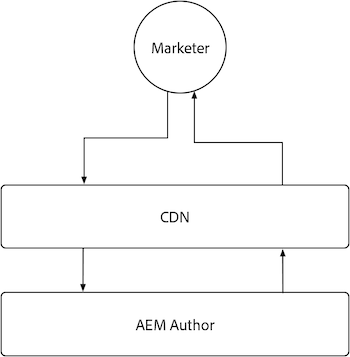
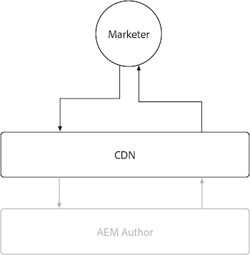

# AEM Author

AEM Author has limited caching due to the highly dynamic, and permission sensitive nature of the content it serves. In general, it is not recommended to customize caching for AEM Author and instead rely on the cache configurations provided by Adobe to ensure a performant experience.

{align="center"}

While customizing caching on AEM Author is discouraged, it is helpful to understand that AEM Author has an Adobe-managed CDN, but does not have an AEM Dispatcher. Remember that all AEM Dispatcher configurations are ignored on AEM Author, as it does not have an AEM Dispatcher.

## CDN

AEM Author service uses a CDN, however its purpose is to enhance the delivery of product resources, and should not be extensively configured, instead letting it work as it is.

{align="center"}

The AEM Author CDN sits between the end user, typically a marketer or content author, and the AEM Author. It caches immutable files, such as static assets that power the AEM authoring experience, and not authored content.

AEM Author's CDN does cache several types of resources that may be of interest, including a [customizable TTL on Persisted Queries](https://experienceleague.adobe.com/docs/experience-manager-cloud-service/content/headless/graphql-api/persisted-queries.html?author-instances), and a [long TTL on custom Client Libraries](https://experienceleague.adobe.com/docs/experience-manager-cloud-service/content/implementing/content-delivery/caching.html#client-side-libraries).

### Default cache life

The following customer facing resources are cached by the AEM Author CDN, and have the following default cache life:

| Content type | Default CDN cache life |
|:------------ |:---------- |
| [Persisted queries (JSON)](https://experienceleague.adobe.com/docs/experience-manager-cloud-service/content/headless/graphql-api/persisted-queries.html?author-instances) | 1 minute | 
| [Client libraries (JS/CSS)](https://experienceleague.adobe.com/docs/experience-manager-cloud-service/content/implementing/content-delivery/caching.html#client-side-libraries) | 30 days |
| [Everything else](https://experienceleague.adobe.com/docs/experience-manager-cloud-service/content/implementing/content-delivery/caching.html#other-content) | Not cached |

## AEM Dispatcher

AEM Author service does not include AEM Dispatcher, and only uses the [CDN](#cdn) for caching.
