# CDN cache hit ratio analysis

Learn how to analyze the AEM as a Cloud Service provided **CDN logs** and gain insights such as **cache hit ratio**, and **top URLs of _MISS_ and _PASS_ cache types** for optimization purposes.

The CDN logs are available in JSON format, which contains various fields including `url`, `cache`, for more information, see the [CDN Log Format](https://experienceleague.adobe.com/docs/experience-manager-cloud-service/content/implementing/developing/logging.html?lang=en#cdn-log:~:text=Toggle%20Text%20Wrapping-,Log%20Format,-The%20CDN%20logs). The `cache` field provides information about _state of the cache_ and its possible values are HIT, MISS, or PASS. Let's review the details of possible values.

| State of Cache   Possible Value                                                   | Description |
|------------------------------------|:-----------------------------------------------------:|
| HIT | The requested data is _found in the CDN cache and does not require making a fetch_ request to the AEM server. |
| MISS | The requested data is _not found in the CDN cache and has to be requested_ from the AEM server. |
| PASS | The requested data is _explicitly set to not be cached_ and always be retrieved from the AEM server. |

For this tutorial purpose, the [AEM WKND project](https://github.com/adobe/aem-guides-wknd) is deployed to the AEM as a Cloud Service environment and a small performance test is triggered using [Apache JMeter](https://jmeter.apache.org/).

## Download CDN logs

To download the CDN logs, follow these steps:

1. Log into Cloud Manager at [my.cloudmanager.adobe.com](https://my.cloudmanager.adobe.com/) and select your organization and program.

1. For a desired AEMCS environment, select **Download Logs** from the ellipsis menu.

    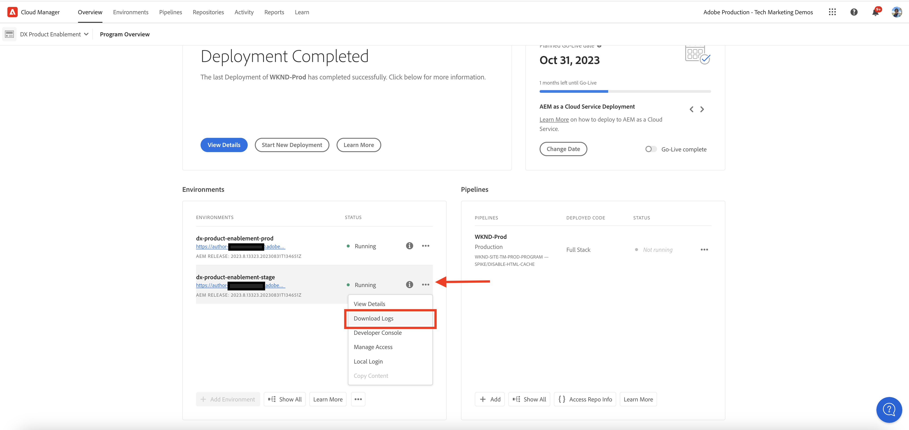{width="500" zoomable="yes"}

1. In the **Download Logs** dialog, select the **Publish** Service from the drop-down menu, then click the download icon next to the **cdn** row.

    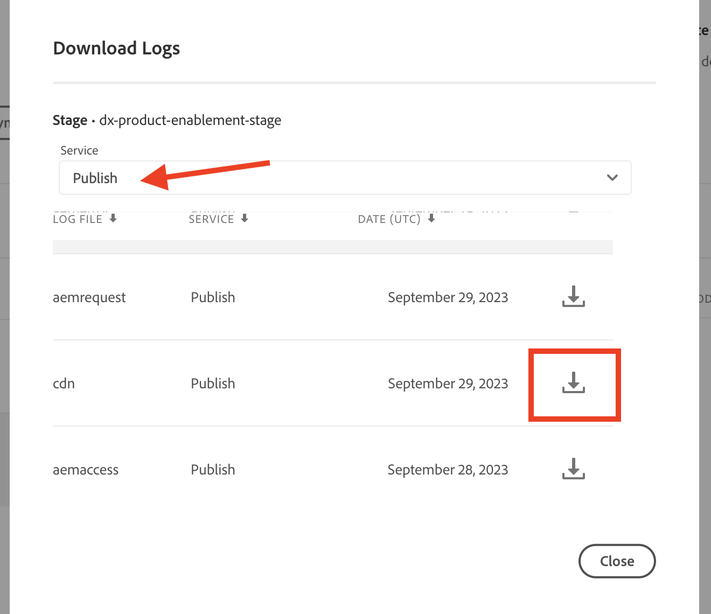{width="500" zoomable="yes"}

If the downloaded log file is from _today_ the file extension is `.log` otherwise for past log files the extension is `.log.gz`.

## Analyze downloaded CDN logs

To gain insights such as cache hit ratio, and top URLs of MISS and PASS cache types analyze the downloaded CDN log file. These insights help to optimize the [CDN cache configuration](https://experienceleague.adobe.com/docs/experience-manager-cloud-service/content/implementing/content-delivery/caching.html) and enhance the site performance.

To analyze the CDN logs, this article uses the **Elasticsearch, Logstash, and Kibana (ELK)** [dashboard tooling](https://github.com/adobe/AEMCS-CDN-Log-Analysis-ELK-Tool) and [Jupyter Notebook](https://jupyter.org/).

### Using dashboard tooling

The [ELK stack](https://www.elastic.co/elastic-stack) is a set of tools that provide a scalable solution to search, analyze, and visualize the data. It consists of Elasticsearch, Logstash, and Kibana.

To identify the key details, let's use the [ AEMCS-CDN-Log-Analysis-ELK-Tool](https://github.com/adobe/AEMCS-CDN-Log-Analysis-ELK-Tool) dashboard tooling project. This project provides a Docker container of the ELK stack and a pre-configured Kibana dashboard to analyze the CDN logs.

1. Follow the steps from [How to setup the ELK Docker container](https://github.com/adobe/AEMCS-CDN-Log-Analysis-ELK-Tool#how-to-set-up-the-elk-docker-container) and make sure to import the **CDN Cache Hit Ratio** Kibana dashboard.

1. To identify the CDN cache hit ratio and top URLs, follow these steps:

    1. Copy the downloaded CDN log file/s inside the environment-specific folder.

    1. Open the **CDN Cache Hit Ratio** dashboard by clicking Hamburger Menu > Analytics > Dashboard > CDN Cache Hit Ratio.

        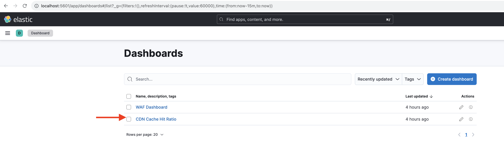{width="500" zoomable="yes"}

    1. Select the desired time range from the top-right corner.

        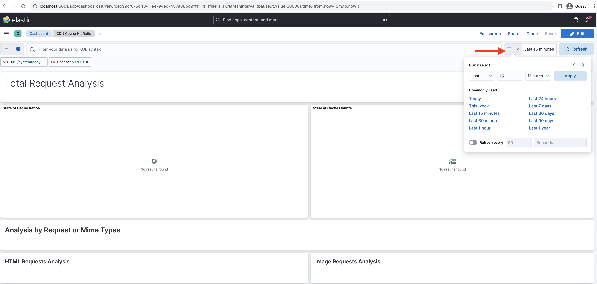{width="500" zoomable="yes"}
    
    1. The **CDN Cache Hit Ratio** dashboard is self-explanatory. 
    
    1. The _Total Request Analysis_ section displays the following details:
        - Cache ratios by cache type
        - Cache counts by cache type

        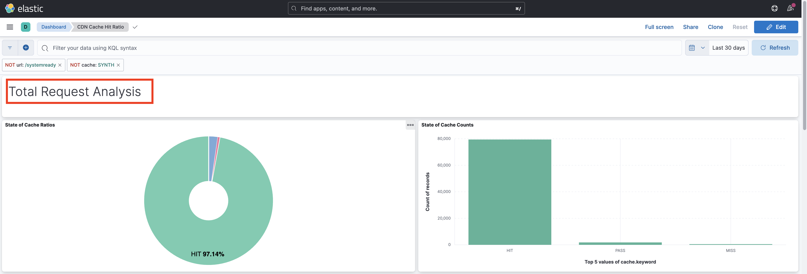{width="500" zoomable="yes"}

    1. The _Analysis by Request or Mime Types_ displays the following details: 
        - Cache ratios by cache type
        - Cache counts by cache type
        - Top MISS and PASS URLs

        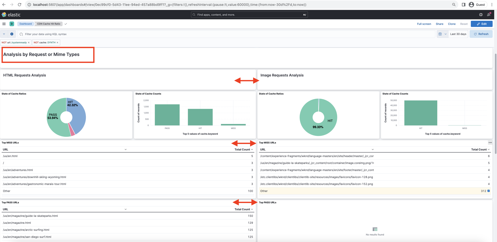{width="500" zoomable="yes"}

#### Filtering by environment name or program ID

To filter the ingested logs by environment name, follow the below steps:

1. In the CDN Cache Hit Ratio dashboard, click the **Add Filter** icon.

    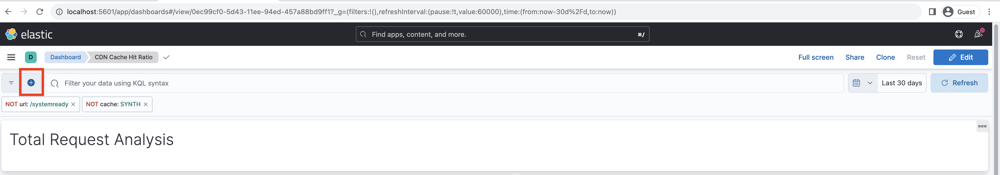{width="500" zoomable="yes"}

1. In the **Add filter** modal, select the `aem_env_name.keyword` field from the drop-down menu, and `is` operator and desired environment name for next field and finally click _Add filter_.

    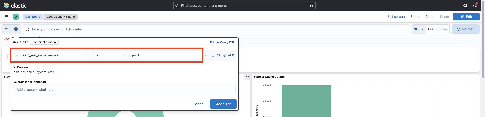{width="500" zoomable="yes"}

#### Filtering by hostname

To filter the ingested logs by hostname, follow the below steps:

1. In the CDN Cache Hit Ratio dashboard, click the **Add Filter** icon.

    {width="500" zoomable="yes"}

1. In the **Add filter** modal, select the `host.keyword` field from the drop-down menu, and `is` operator and desired hostname for next field and finally click _Add filter_.

    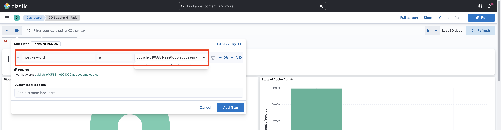{width="500" zoomable="yes"}

Likewise add more filters to the dashboard based on the analysis requirements.

### Using Jupyter Notebook

The [Jupyter Notebook](https://jupyter.org/) is an open-source web application that lets you create documents that contain code, text, and visualization. It is used for data transformation, visualization, and statistical modeling.

To accelerate the CDN logs analysis, download the [AEM-as-a-CloudService - CDN Logs Analysis - Jupyter Notebook](./assets/cdn-logs-analysis/aemcs_cdn_logs_analysis.ipynb) file. 

The downloaded `aemcs_cdn_logs_analysis.ipynb` "Interactive Python Notebook" file is self-explanatory, however, the key highlights of each section are:

- **Install additional libraries**: installs the `termcolor` and `tabulate` Python libraries.
- **Load CDN logs**: loads the CDN log file using `log_file` variable value, make sure to update its value. It also transforms this CDN log into the [Pandas DataFrame](https://pandas.pydata.org/docs/reference/frame.html).
- **Perform analysis**: the first code block is _Display Analysis Result for Total, HTML, JS/CSS and Image Requests_, it provides cache hit ratio percentage, bar, and pie charts.
The second code block is _Top 5 MISS and PASS Request URLs for HTML, JS/CSS, and Image_, it displays URLs and their counts in table format.

#### Run the Jupyter Notebook in Experience Platform

>[!IMPORTANT]
>
>If you are using or licensed the Experience Platform, you can run the Jupyter Notebook without installing additional software.

To run the Jupyter Notebook in Experience Platform, follow these steps:

1. Login to the [Adobe Experience Cloud](https://experience.adobe.com/), in the Home page > **Quick access** section > click the **Experience Platform**

    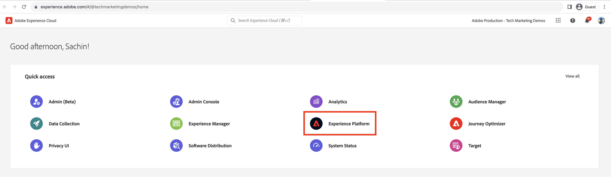{width="500" zoomable="yes"}

1. In the Adobe Experience Platform Home page > Data Science section >, click the **Notebooks** menu item. To start the Jupyter Notebooks environment, click the **JupyterLab** tab. 

    {width="500" zoomable="yes"}

1. In the JupyterLab menu, using the **Upload Files** icon, upload the downloaded CDN log file and `aemcs_cdn_logs_analysis.ipynb` file.

    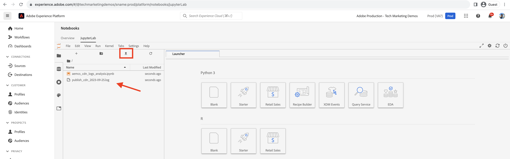{width="500" zoomable="yes"}

1. Open the `aemcs_cdn_logs_analysis.ipynb` file by double-clicking.

1. In the **Load CDN Log File** section of the notebook, update the `log_file` value.

    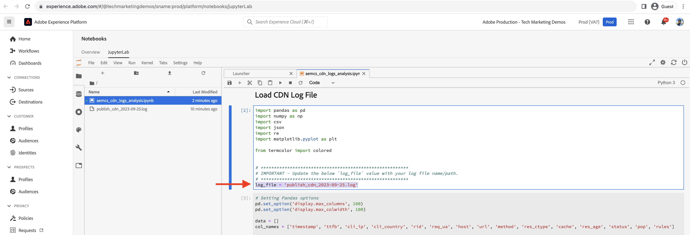{width="500" zoomable="yes"}

1. To run the selected cell and advance, click the **Play** icon. 
    
    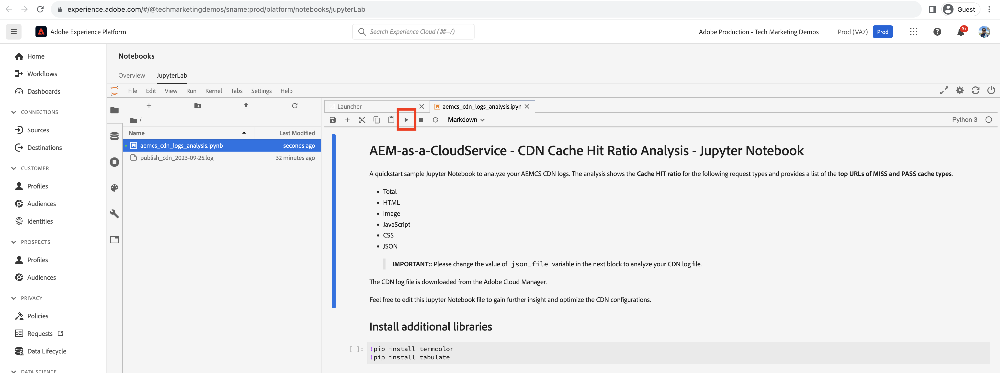{width="500" zoomable="yes"}

1. After running the **Display Analysis Result for Total, HTML, JS/CSS, and Image Requests** code cell, the output displays the cache hit ratio percentage, bar, and pie charts.
    
    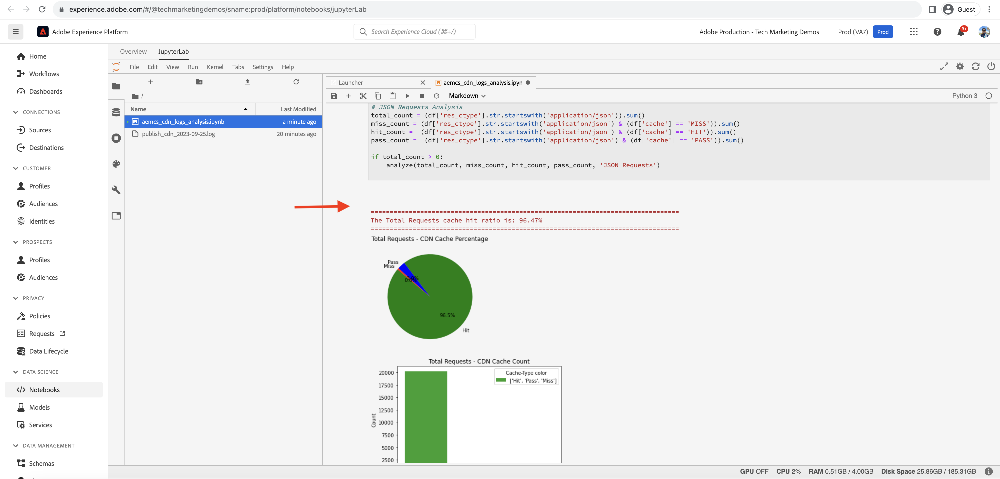{width="500" zoomable="yes"}

1. After running the **Top 5 MISS and PASS Request URLs for HTML, JS/CSS, and Image** code cell, the output displays the Top 5 MISS and PASS Request URLs.

    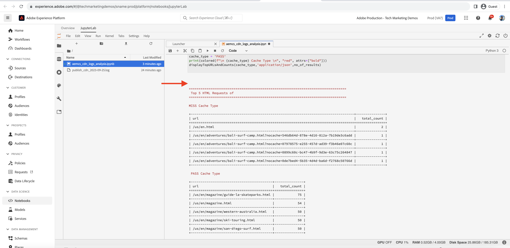{width="500" zoomable="yes"}

You can enhance the Jupyter Notebook to analyze the CDN logs based on your requirements.

## Optimize CDN cache configuration

After analyzing the CDN logs, you can optimize the CDN cache configuration to improve the site performance. The AEM best practice is to have a cache hit ratio of 90% or higher.

For more information, see [Optimize CDN Cache Configuration](https://experienceleague.adobe.com/docs/experience-manager-cloud-service/content/implementing/content-delivery/caching.html#caching).

The AEM WKND project has a reference CDN configuration, for more information, see [CDN Configuration](https://github.com/adobe/aem-guides-wknd/blob/main/dispatcher/src/conf.d/available_vhosts/wknd.vhost#L137-L190) from the `wknd.vhost` file.
