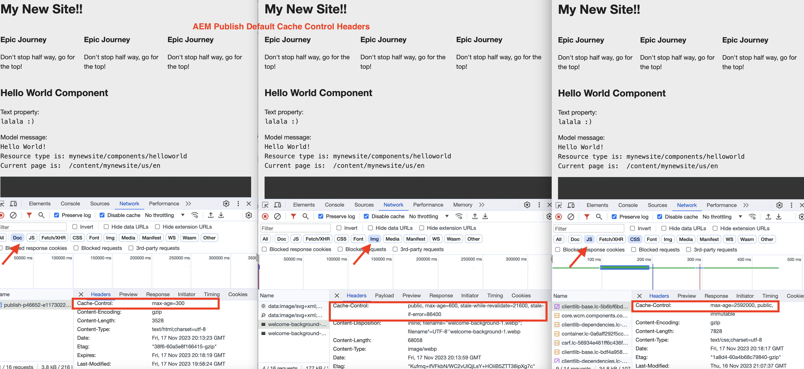

# How to enable CDN caching

Learn how to enable the caching of HTTP responses in AEM as a Cloud Service's CDN. The caching of responses is controlled by `Cache-Control`, `Surrogate-Control`, or `Expires` HTTP response cache headers. 

These cache headers are typically set in AEM Dispatcher vhost configurations using `mod_headers`, but can also be set in custom Java&trade; code running in AEM Publish itself.

## Default caching behavior

When custom configurations are NOT present, the default values are used. In following screenshot, you can see the default caching behavior for AEM Publish and Author when an [AEM Project Archetype](https://github.com/adobe/aem-project-archetype) based `mynewsite` AEM project is deployed.

{width="800" zoomable="yes"}

 Review the [AEM Publish - Default cache life](https://experienceleague.adobe.com/docs/experience-manager-learn/cloud-service/caching/publish.html#cdn-cache-life) and [AEM Author - Default cache life](https://experienceleague.adobe.com/docs/experience-manager-learn/cloud-service/caching/author.html?#default-cache-life) for more information.

In summary, AEM as a Cloud Service caches most of the content types (HTML, JSON, JS, CSS, and Assets) in AEM Publish and a few content types (JS, CSS) in AEM Author.

## Enable caching

To change the default caching behavior, you can update the cache headers in two ways.

1. **Dispatcher vhost configuration:** Only available for AEM Publish.
1. **Custom Java&trade; code:** Available for both AEM Publish and Author. 

Let's review each of these options.

### Dispatcher vhost configuration

This option is the recommended approach for enabling caching however it is only available for AEM Publish. To update the cache headers, use the `mod_headers` module and `<LocationMatch>` directive in the Apache HTTP Server's vhost file. The general syntax is as follows:

```
<LocationMatch "$URL$ || $URL_REGEX$">
    # Removes the response header of this name, if it exists. If there are multiple headers of the same name, all will be removed.
    Header unset Cache-Control
    Header unset Surrogate-Control
    Header unset Expires

    # Instructs the web browser and CDN to cache the response for 'max-age' value (XXX) seconds. The 'stale-while-revalidate' and 'stale-if-error' attributes controls the stale state treatment at CDN layer.
    Header set Cache-Control "max-age=XXX,stale-while-revalidate=XXX,stale-if-error=XXX"
    
    # Instructs the CDN to cache the response for 'max-age' value (XXX) seconds. The 'stale-while-revalidate' and 'stale-if-error' attributes controls the stale state treatment at CDN layer.
    Header set Surrogate-Control "max-age=XXX,stale-while-revalidate=XXX,stale-if-error=XXX"
    
    # Instructs the web browser and CDN to cache the response until the specified date and time.
    Header set Expires "Sun, 31 Dec 2023 23:59:59 GMT"
</LocationMatch>
```

The following summarizes the purpose of each **header** and applicable **attributes** for the header.

|                     | Web Browser | CDN       | Description |
|---------------------|:-----------:|:---------:|:-----------:|
| Cache-Control       | &#10004;    | &#10004;  | This header controls the web browser and CDN cache life.|
| Surrogate-Control   | &#10008;    | &#10004;  | This header controls the CDN cache life.|
| Expires             | &#10004;    | &#10004;  | This header controls the web browser and CDN cache life.|


- **max-age**: This attribute controls the TTL or "time to live" of the response content in seconds.
- **stale-while-revalidate**: This attribute controls the _stale state_ treatment of the response content at CDN layer when received request is within the specified period in seconds. The _stale state_ is the time period after the TTL has expired and before the response is revalidated.
- **stale-if-error**: This attribute controls the _stale state_ treatment of the response content at CDN layer when the origin server is unavailable and received request is within the specified period in seconds.

Review the [staleness and revalidation](https://developer.fastly.com/learning/concepts/edge-state/cache/stale/) details for more information.

#### Example

To increase the web browser and CDN cache life of the **HTML content type** to _10 minutes_ without stale state treatment, follow these steps:

1. In your AEM project, locate the desired vhsot file from `dispatcher/src/conf.d/available_vhosts` directory.
1. Update the vhost (e.g `wknd.vhost`) file as follows:

    ```
    <LocationMatch "^/content/.*\.(html)$">
        # Removes the response header if present
        Header unset Cache-Control
        
        # Instructs the web browser and CDN to cache the response for max-age value (600) seconds.
        Header set Cache-Control "max-age=600"
    </LocationMatch>
    ```

    The vhost files in `dispatcher/src/conf.d/enabled_vhosts` directory are **symlinks** to the files in `dispatcher/src/conf.d/available_vhosts` directory, so make sure to create symlinks if not present.
1. Deploy the vhost changes to desired AEM as a Cloud Service environment using the [Cloud Manager - Web Tier Config Pipeline](https://experienceleague.adobe.com/docs/experience-manager-cloud-service/content/implementing/using-cloud-manager/cicd-pipelines/introduction-ci-cd-pipelines.html?#web-tier-config-pipelines) or [RDE Commands](https://experienceleague.adobe.com/docs/experience-manager-learn/cloud-service/developing/rde/how-to-use.html?lang=en#deploy-apache-or-dispatcher-configuration).

However, to have different values for web browser and CDN cache life, you can use the `Surrogate-Control` header in above example. Likewise to expire the cache at a specific date and time, you can use the `Expires` header. Also, using the `stale-while-revalidate` and `stale-if-error` attributes, you can control the stale state treatment of the response content. The AEM WKND project has a [reference stale state treatment](https://github.com/adobe/aem-guides-wknd/blob/main/dispatcher/src/conf.d/available_vhosts/wknd.vhost#L150-L155) CDN cache configuration.

Similarly, you can update the cache headers for other content types (JSON, JS, CSS, and Assets) as well.

### Custom Java&trade; code

This option is available for both AEM Publish and Author. However, it is not recommended to enable caching in AEM Author and keep the default caching behavior.

To update the cache headers, use the `HttpServletResponse` object in custom Java&trade; code (Sling servlet, Sling servlet filter). The general syntax is as follows:

```java
// Instructs the web browser and CDN to cache the response for 'max-age' value (XXX) seconds. The 'stale-while-revalidate' and 'stale-if-error' attributes controls the stale state treatment at CDN layer.
response.setHeader("Cache-Control", "max-age=XXX,stale-while-revalidate=XXX,stale-if-error=XXX");

// Instructs the CDN to cache the response for 'max-age' value (XXX) seconds. The 'stale-while-revalidate' and 'stale-if-error' attributes controls the stale state treatment at CDN layer.
response.setHeader("Surrogate-Control", "max-age=XXX,stale-while-revalidate=XXX,stale-if-error=XXX");

// Instructs the web browser and CDN to cache the response until the specified date and time.
response.setHeader("Expires", "Sun, 31 Dec 2023 23:59:59 GMT");
```
