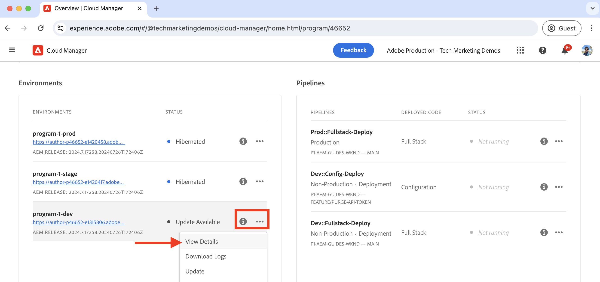
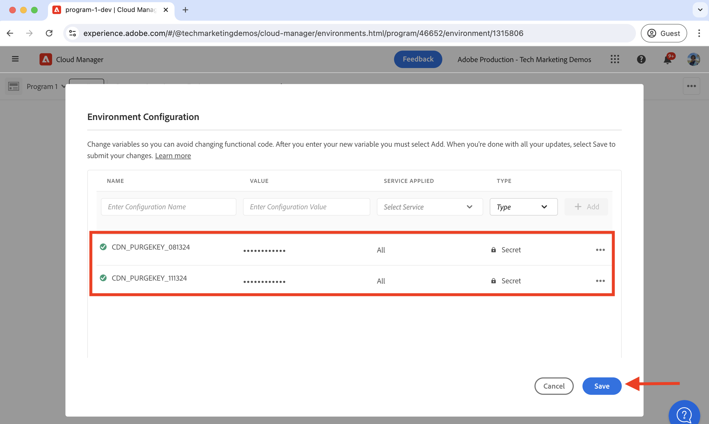
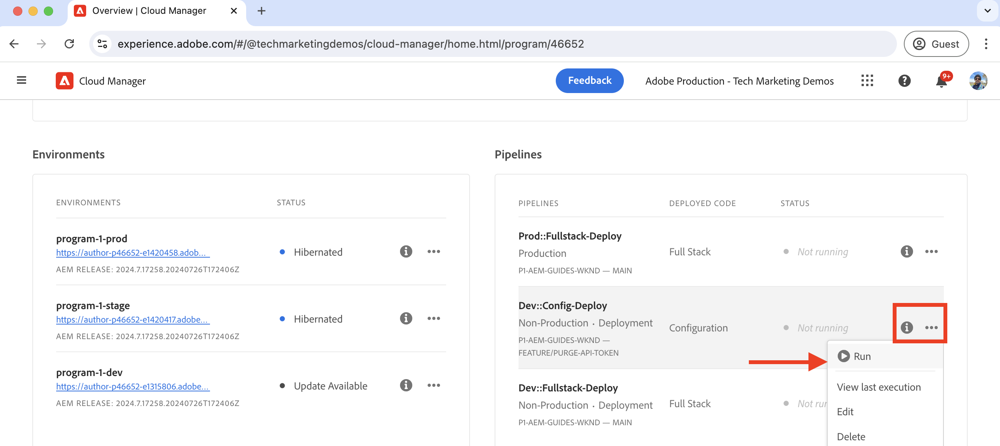
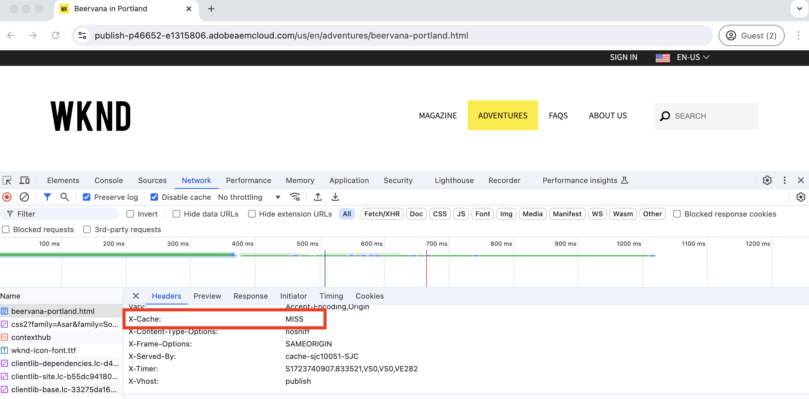

# How to purge the CDN cache

Learn how to purge or remove the cached HTTP response from the AEM as a Cloud Service's CDN. Using the self-service feature called **Purge API Token**, you can purge the cache for a specific resource, a group of resources, and the entire cache.

In this tutorial, you learn how to set up and use the Purge API Token to purge the CDN cache of the sample [AEM WKND](https://github.com/adobe/aem-guides-wknd) site using the self-service feature.

>[!VIDEO](https://video.tv.adobe.com/v/3432948?quality=12&learn=on)

## Cache invalidation vs explicit purge

There are two ways to remove the cached resources from the CDN:

1. **Cache invalidation:** It is the process of removing the cached resources from the CDN based on the cache headers like `Cache-Control`, `Surrogate-Control`, or `Expires`. The cache header's `max-age` attribute value is used to determine the cache lifetime of the resources, also known as the cache TTL (Time To Live). When the cache lifetime expires, the cached resources are automatically removed from the CDN cache. 

1. **Explicit purge:** It is the process of manually removing the cached resources from the CDN cache before the TTL expires. The explicit purge is useful when you want to remove the cached resources immediately. However, it increases the traffic to the origin server.

When cached resources are removed from the CDN cache, the next request for the same resource fetches the latest version from the origin server.

## Set up the Purge API Token

Let's learn how to set up the Purge API Token to purge the CDN cache.

### Configure the CDN rule

The Purge API Token is created by configuring the CDN rule in your AEM project code.

1. Open the `cdn.yaml` file from the main `config` folder of your AEM project. For example, the [WKND project's cdn.yaml](https://github.com/adobe/aem-guides-wknd/blob/main/config/cdn.yaml) file.

1. Add the following CDN rule to the `cdn.yaml` file:

```yaml
kind: "CDN"
version: "1"
metadata:
  envTypes: ["dev", "stage", "prod"]
data:  
  authentication: # The main authentication configuration
    authenticators: # The list of authenticators
       - name: purge-auth # The name of the authenticator
         type: purge  # The type of the authenticator, must be purge
         purgeKey1: ${{CDN_PURGEKEY_081324}} # The first purge key, must be referenced by the Cloud Manager secret-type environment variable name ${{CDN_EDGEKEY_073124}}
         purgeKey2: ${{CDN_PURGEKEY_111324}} # The second purge key, must be referenced by the Cloud Manager secret-type environment variable name ${{CDN_EDGEKEY_111324}}. It is used for the rotation of secrets without any interruptions.
    rules: # The list of authentication rules
       - name: purge-auth-rule # The name of the rule
         when: { reqProperty: tier, equals: "publish" } # The condition when the rule should be applied
         action: # The action to be taken when the rule is applied
           type: authenticate # The type of the action, must be authenticate
           authenticator: purge-auth # The name of the authenticator to be used, must match the name from the above authenticators list               
```
  
  In above rule, both `purgeKey1` and `purgeKey2` are added from the beginning to support the rotation of secrets without any interruptions. However, you can start with only `purgeKey1` and add `purgeKey2` later when rotating the secrets.

1. Save, commit, and push the changes to the Adobe upstream repository.

### Create Cloud Manager environment variable

Next, create the Cloud Manager environment variables to store the Purge API Token value.

1. Log into Cloud Manager at [my.cloudmanager.adobe.com](https://my.cloudmanager.adobe.com/) and select your organization and program.

1. In the __Environments__ section, click the **ellipses** (…) next to the desired environment and select **View Details**.

    

1. Then select the **Configuration** tab and click the **Add Configuration** button.

1. In the **Environment Configuration** dialog, enter the following details:
    - **Name**: Enter the name of the environment variable. It must match the `purgeKey1` or `purgeKey2` value from the `cdn.yaml` file.
    - **Value**: Enter the Purge API Token value.
    - **Service Applied**: Select the **All** option.
    - **Type**: Select the **Secret** option.
    - Click the **Add** button.

    

1. Repeat the above steps to create the second environment variable for the `purgeKey2` value.

1. Click **Save** to save and apply the changes.

### Deploy the CDN rule

Finally, deploy the configured CDN rule to the AEM as a Cloud Service environment using the Cloud Manager pipeline.

1. In the Cloud Manager, navigate to the **Pipelines** section.

1. Create a new pipeline or select the existing pipeline that deploys only the **Config** files. For detailed steps, see [Create a config pipeline](https://experienceleague.adobe.com/en/docs/experience-manager-learn/cloud-service/security/traffic-filter-and-waf-rules/how-to-setup#deploy-rules-through-cloud-manager).

1. Click the **Run** button to deploy the CDN rule.

    

## Use the Purge API Token

To purge the CDN cache, invoke the AEM service specific domain URL with the Purge API Token. The syntax to purge the cache is as follows:

```
PURGE <URL> HTTP/1.1
Host: <AEM_SERVICE_SPECIFIC_DOMAIN>
X-AEM-Purge-Key: <PURGE_API_TOKEN>
X-AEM-Purge: <PURGE_TYPE>
Surrogate-Key: <SURROGATE_KEY>
```

Where:

- **PURGE `<URL>`**: The `PURGE` method is followed by the URL path of the resource that you want to purge.
- **Host: `<AEM_SERVICE_SPECIFIC_DOMAIN>`**: It specifies the domain of the AEM service.
- **X-AEM-Purge-Key: `<PURGE_API_TOKEN>`**: A custom header that contains the Purge API Token value.
- **X-AEM-Purge: `<PURGE_TYPE>`**: A custom header that specifies the type of purge operation. The value can be `hard`, `soft`, or `all`. The following table describes each purge type:

    | Purge Type | Description |
    |:------------:|:-------------:|
    | hard (default)       | Removes the cached resource immediately. Avoid it as it increases the traffic to the origin server. |
    | soft       | Marks the cached resource as stale and fetches the latest version from the origin server. |
    | all        | Removes all the cached resources from the CDN cache. |

- **Surrogate-Key: `<SURROGATE_KEY>`**: (Optional) A custom header that specifies the surrogate keys (separated by space) of the resource groups to purge. The surrogate key is used to group the resources together and must be set in the response header of the resource.

>[!TIP]
>
>In below examples, the `X-AEM-Purge: hard` is used for demonstration purposes. You can replace it with `soft` or `all` based on your requirements. Be cautious while using the `hard` purge type as it increases the traffic to the origin server.

### Purge the cache for a specific resource

In this example, the `curl` command purges the cache for the `/us/en.html` resource on the WKND site deployed in an AEM as a Cloud Service environment.

```bash
curl -X PURGE "https://publish-p46652-e1315806.adobeaemcloud.com/us/en.html" \
-H "X-AEM-Purge-Key: 123456789" \
-H "X-AEM-Purge: hard"
```

Upon successful purge, a `200 OK` response is returned with JSON content.

```json
{ "status": "ok", "id": "1000098-1722961031-13237063" }
```

### Purge the cache for a group of resources

In this example, the `curl` command purges the cache for the group of resources with the surrogate key `wknd-assets`. The `Surrogate-Key` response header is set in [`wknd.vhost`](https://github.com/adobe/aem-guides-wknd/blob/main/dispatcher/src/conf.d/available_vhosts/wknd.vhost#L176), for example:

```http
<VirtualHost *:80>
    ...

    # Core Component Image Component: long-term caching (30 days) for immutable URLs, background refresh to avoid MISS
    <LocationMatch "^/content/.*\.coreimg.*\.(?i:jpe?g|png|gif|svg)$">
        Header set Cache-Control "max-age=2592000,stale-while-revalidate=43200,stale-if-error=43200,public,immutable" "expr=%{REQUEST_STATUS} < 400"
        # Set Surrogate-Key header to group the cache of WKND assets, thus it can be flushed independtly
        Header set Surrogate-Key "wknd-assets"
        Header set Age 0
    </LocationMatch>

    ...
</VirtualHost>
```

```bash
curl -X PURGE "https://publish-p46652-e1315806.adobeaemcloud.com" \
-H "Surrogate-Key: wknd-assets" \
-H "X-AEM-Purge-Key: 123456789" \
-H "X-AEM-Purge: hard"
```

Upon successful purge, a `200 OK` response is returned with JSON content.

```json
{ "wknd-assets": "10027-1723478994-2597809-1" }
```

### Purge the entire cache

In this example, using the `curl` command the entire cache is purged from the sample WKND site deployed on AEM as a Cloud Service environment.

```bash
curl -X PURGE "https://publish-p46652-e1315806.adobeaemcloud.com/" \
-H "X-AEM-Purge-Key: 123456789" \
-H "X-AEM-Purge: all"
```

Upon successful purge, a `200 OK` response is returned with JSON content.

```json
{"status":"ok"}
```

### Verify the cache purge

To verify the cache purge, access the resource URL in the web browser and review the response headers. The `X-Cache` header value should be `MISS`.

  
