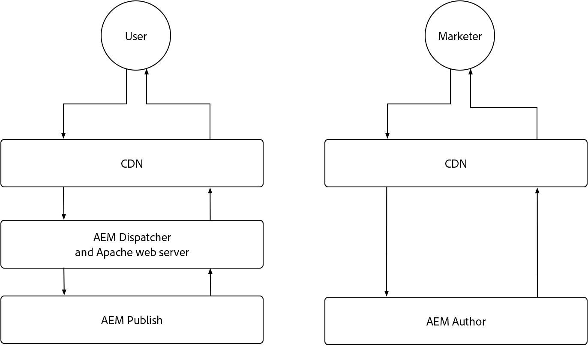

# AEM as a Cloud Service caching

In AEM as a Cloud Service, understanding caching is crucial. Caching involves storing and reusing previously fetched data to enhance system efficiency and reduce load times. This mechanism significantly accelerates content delivery, boosts website performance, and optimizes user experience.

AEM as a Cloud Service has multiple caching layers, and strategies that differ between the Author and Publish services. 

{align="center"} 

## AEM caching

AEM as a Cloud Service has a robust, configurable multi-layer caching strategy, including a CDN, AEM Dispatcher, and optionally a customer managed CDN. Caching across layers can be fine-tuned to optimize performance, ensuring AEM only delivers the best experiences. AEM has different caching concerns for the Author and Publish services. Explore the caching strategies for each service below.

    

    

        

          <figure class="image is-16by9">
            
          </figure>
        

        

          

            
<a href="./publish.md" title="AEM Publish service caching">AEM Publish service caching</a>

            
AEM Publish service uses a managed CDN and AEM Dispatcher to optimize end-user web experiences.

            <a href="./publish.md" class="spectrum-Button spectrum-Button--outline spectrum-Button--primary spectrum-Button--sizeM">
              Learn
            </a>
          

        

      

    

    

        

            

            <figure class="image is-16by9">
                
            </figure>
            

            

            

                
<a href="./author.md" title="AEM Author service caching">AEM Author service caching</a>

                
AEM Author service uses a managed CDN to provide optimized authoring experiences.

                <a href="./author.md" class="spectrum-Button spectrum-Button--outline spectrum-Button--primary spectrum-Button--sizeM">
                Learn
                </a>
            

            

        

    

