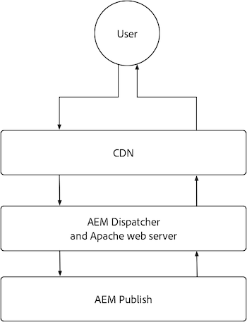
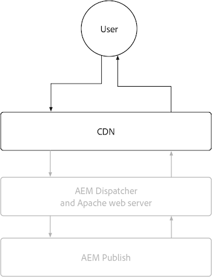
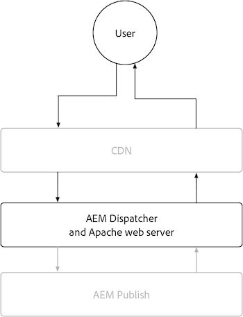

# AEM Publish

The AEM Publish service has two primary caching layers, the AEM as a Cloud Service CDN and AEM Dispatcher. Optionally a customer managed CDN can be placed in front of the AEM as a Cloud Service CDN. The AEM as a Cloud Service CDN provides edge delivery of content, ensuring experiences are delivered with low latency to users around the world. AEM Dispatcher provides caching directly in front of AEM Publish, and is used to mitigate unnecessary load on AEM Publish itself.

{align="center"}

## CDN

AEM as a Cloud Service's CDN's caching is controlled by HTTP response cache headers, and is intended to cache content to optimize a balance between freshness and performance. The CDN sits between the end-user and the AEM Dispatcher, and is used to cache content as close to the end user as possible, ensuring a performant experience. 

{align="center"}

Configuring how the CDN caches content is limited to setting cache headers on HTTP responses. These cache headers are typically set in AEM Dispatcher vhost configurations using `mod_headers`, but can also be set in custom Java&trade; code running in AEM Publish itself.

### When are HTTP requests/responses cached?

AEM as a Cloud Service CDN caches only HTTP responses, and all the following criteria must be met:

+ HTTP response status is `2xx` or `3xx`
+ HTTP request method is `GET` or `HEAD`
+ At least one of the following HTTP response headers is present: `Cache-Control`, `Surrogate-Control`, or  `Expires`
+ The HTTP response can be any content types, including HTML, JSON, CSS, JS, and binary files.

By default, HTTP responses not cached by [AEM Dispatcher](#aem-dispatcher) automatically have any HTTP response cache headers removed to avoid caching at CDN. This behavior can be carefully overridden using `mod_headers` with the `Header always set ...` directive when necessary.

### What is cached?

AEM as a Cloud Service CDN caches the following:

+ HTTP response body
+ HTTP response headers

Typically an HTTP request/response for a single URL is cached as a single object. However, the CDN can handle caching multiple objects for a single URL, when the `Vary` header is set on the HTTP response. Avoid specifying `Vary` on headers whose values do not have a tightly controlled set of values, as this can result in many cache misses, reducing cache hit ratio. To support caching of varying requests at AEM Dispatcher, [review the variant caching documentation](https://experienceleague.adobe.com/docs/experience-manager-learn/cloud-service/developing/advanced/variant-caching.html).

### Cache life{#cdn-cache-life}

The AEM Publish CDN is TTL (time-to-live) based, meaning that the cache life is determined by the `Cache-Control`, `Surrogate-Control`, or `Expires` HTTP response headers. If the HTTP response caching headers are not set by the project, and the [eligibility criteria](#when-are-http-requestsresponses-cached) are met, Adobe sets a default cache life is 10 minutes (600 seconds).

Here is how the cache headers influence the CDN cache life:

+ [`Cache-Control`](https://developer.fastly.com/reference/http/http-headers/Cache-Control/) HTTP response header instructs the web browser and CDN how long to cache the response. The value is in seconds. For example, `Cache-Control: max-age=3600` tells the web browser to cache the response for one hour. This value is ignored by the CDN if `Surrogate-Control` HTTP response header is also present.
+ [`Surrogate-Control`](https://developer.fastly.com/reference/http/http-headers/Surrogate-Control/) HTTP response header instructs the AEM CDN how long to cache the response. The value is in seconds. For example, `Surrogate-Control: max-age=3600` tells the CDN to cache the response for one hour.
+ [`Expires`](https://developer.fastly.com/reference/http/http-headers/Expires/) HTTP response header instructs the AEM CDN (and web browser) how long the cached response is valid. The value is a date. For example, `Expires: Sat, 16 Sept 2023 09:00:00 EST` tells the web browser to cache the response until the date and time specified. 

Use `Cache-Control` to control the cache life when it is the same for both browser and CDN. Use `Surrogate-Control` when the web browser should cache the response for a different duration than the CDN.

#### Default cache life

If an HTTP response qualifies for AEM Dispatcher caching [per above qualifiers](#when-are-http-requestsresponses-cached), the following are the default values unless custom configuration are present.

| Content type | Default CDN cache life |
|:------------ |:---------- |
| [HTML/JSON/XML](https://experienceleague.adobe.com/docs/experience-manager-cloud-service/content/implementing/content-delivery/caching.html#html-text) | 5 minutes |
| [Assets (images, videos, documents, and so on)](https://experienceleague.adobe.com/docs/experience-manager-cloud-service/content/implementing/content-delivery/caching.html#images) | 10 minutes |
| [Persisted queries (JSON)](https://experienceleague.adobe.com/docs/experience-manager-cloud-service/content/headless/graphql-api/persisted-queries.html?publish-instances) | 2 hours | 
| [Client libraries (JS/CSS)](https://experienceleague.adobe.com/docs/experience-manager-cloud-service/content/implementing/content-delivery/caching.html#client-side-libraries) | 30 days |
| [Other](https://experienceleague.adobe.com/docs/experience-manager-cloud-service/content/implementing/content-delivery/caching.html#other-content) | Not cached |

### How to customize cache rules

[Configuring how the CDN caches content](https://experienceleague.adobe.com/docs/experience-manager-cloud-service/content/implementing/content-delivery/caching.html#disp) is limited to setting cache headers on HTTP responses. These cache headers are typically set in AEM Dispatcher `vhost` configurations using `mod_headers`, but can also be set in custom Java&trade; code running in AEM Publish itself.

## AEM Dispatcher

{align="center"}

### When are HTTP requests/responses cached?

HTTP responses for corresponding HTTP requests are cached when all the following criteria are met:

+ HTTP request method is `GET` or `HEAD` 
  + `HEAD` HTTP requests only cache the HTTP response headers. They do not have response bodies.
+ HTTP response status is `200`
+ HTTP response is NOT for a binary file.
+ HTTP request URL path ends with an extension, for example: `.html`, `.json`, `.css`, `.js`, etc.
+ HTTP request does not contain authorization, and are not authenticated by AEM.
  + However, caching of authenticated requests [can be enabled globally](https://experienceleague.adobe.com/docs/experience-manager-dispatcher/using/configuring/dispatcher-configuration.html#caching-when-authentication-is-used) or selectively via [permission sensitive caching](https://experienceleague.adobe.com/docs/experience-manager-dispatcher/using/configuring/permissions-cache.html).
+ HTTP request does not contain query parameters.
  + However, configuring [Ignored query parameters](https://experienceleague.adobe.com/docs/experience-manager-dispatcher/using/configuring/dispatcher-configuration.html?lang=en#ignoring-url-parameters) allows HTTP requests with the ignored query parameters to be cached/served from the cache.
+ HTTP request's path [matches an allow Dispatcher rule, and does not match a deny rule](https://experienceleague.adobe.com/docs/experience-manager-dispatcher/using/configuring/dispatcher-configuration.html#specifying-the-documents-to-cache).
+ HTTP response does not have any of the following HTTP response headers set by AEM Publish:

    + `no-cache`
    + `no-store`
    + `must-revalidate`

### What is cached?

AEM Dispatcher caches the following:

+ HTTP response body
+ HTTP response headers specified in the Dispatcher's [cache headers configuration](https://experienceleague.adobe.com/docs/experience-manager-dispatcher/using/configuring/dispatcher-configuration.html#caching-http-response-headers). See the default configuration that ships with the [AEM Project Archetype](https://github.com/adobe/aem-project-archetype/blob/develop/src/main/archetype/dispatcher.cloud/src/conf.dispatcher.d/available_farms/default.farm#L106-L113).
  + `Cache-Control`
  + `Content-Disposition`
  + `Content-Type`
  + `Expires`
  + `Last-Modified`
  + `X-Content-Type-Options`

### Cache life

AEM Dispatcher caches HTTP responses using the following approaches: 

+ Until invalidation is triggered through mechanisms such as publishing or unpublishing of the content.
+ TTL (time-to-live) when explicitly [configured in the Dispatcher configuration](https://experienceleague.adobe.com/docs/experience-manager-dispatcher/using/configuring/dispatcher-configuration.html#configuring-time-based-cache-invalidation-enablettl). See the default configuration in the [AEM Project Archetype](https://github.com/adobe/aem-project-archetype/blob/develop/src/main/archetype/dispatcher.cloud/src/conf.dispatcher.d/available_farms/default.farm#L122-L127) by reviewing the `enableTTL` configuration.

#### Default cache life

If an HTTP response qualifies for AEM Dispatcher caching [per above qualifiers](#when-are-http-requestsresponses-cached-1), the following are the default values unless custom configuration are present.

| Content type | Default CDN cache life |
|:------------ |:---------- |
| [HTML/JSON/XML](https://experienceleague.adobe.com/docs/experience-manager-cloud-service/content/implementing/content-delivery/caching.html#html-text) | Until invalidation |
| [Assets (images, videos, documents, and so on)](https://experienceleague.adobe.com/docs/experience-manager-cloud-service/content/implementing/content-delivery/caching.html#images) | Never |
| [Persisted queries (JSON)](https://experienceleague.adobe.com/docs/experience-manager-cloud-service/content/headless/graphql-api/persisted-queries.html?publish-instances) | 1 minute | 
| [Client libraries (JS/CSS)](https://experienceleague.adobe.com/docs/experience-manager-cloud-service/content/implementing/content-delivery/caching.html#client-side-libraries) | 30 days |
| [Other](https://experienceleague.adobe.com/docs/experience-manager-cloud-service/content/implementing/content-delivery/caching.html#other-content) | Until invalidation |

### How to customize cache rules

The AEM Dispatcher's cache can be configured via the [Dispatcher configuration](https://experienceleague.adobe.com/docs/experience-manager-dispatcher/using/configuring/dispatcher-configuration.html?lang=en#configuring-the-dispatcher-cache-cache) including:

+ What is cached
+ What parts of the cache are invalidated on publish/unpublish
+ What HTTP request query parameters are ignored when evaluating the cache
+ What HTTP response headers are cached
+ Enable or disabling of TTL caching
+ ... and much more

Using `mod_headers` to set cache headers the `vhost` configuration will not affect Dispatcher caching (TTL-based) as these are added to the HTTP response after AEM Dispatcher processes the response. To affect Dispatcher caching via HTTP response headers, custom Java&trade; code running in AEM Publish that sets the appropriate HTTP response headers is required.
