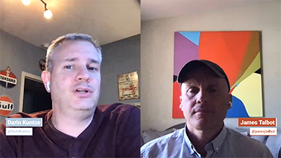
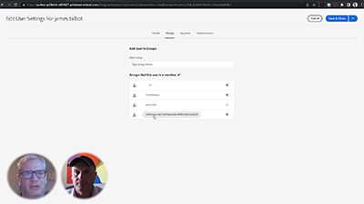
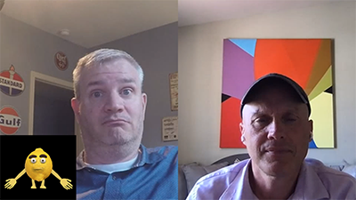
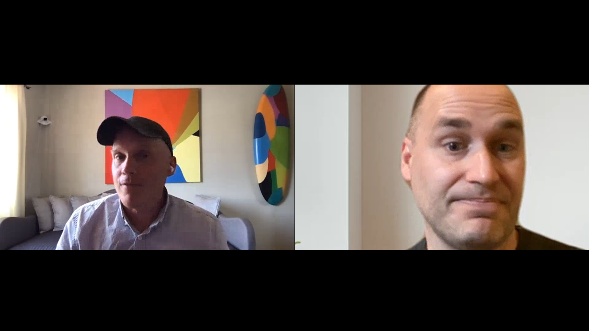
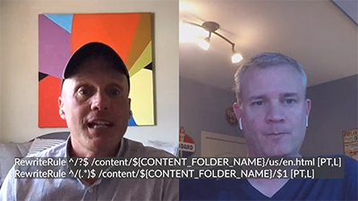
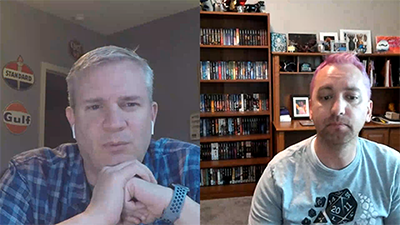

# Cloud 5

>[!VIDEO](https://video.tv.adobe.com/v/343127)

## Introduction

Welcome to season two's Cloud 5 Series from AEM Engineering. One of the primary problems in the implementation phase of any product is having enough code samples and/or live demonstrations of those samples, tool, or APIs. The goal of this series is to deliver useful information about AEM as a Cloud Service in 5 minutes or less.

## Suggestion Box

Visit the [Suggestion Box](https://forms.office.com/r/74P5Xz4UH0) for submitting topic ideas.

## Season 2

Each season varies in length and will be released on a fixed schedule. Season 2's topics are primarily driven from past requests that we have come across in our day-to-day engagements with customers and partners. Visit this page for weekly updates or follow us on the social network of your choosing.

<table>
    <tr>
        <td>
            
            

                <a href="season-2/cloud5-experience-v-content-fragments.md"><strong>Fragments</strong></a>        
                 <em>with Darin Kuntze & James Talbot, Senior Cloud Architects</em>
            

            

                 
                A colorful take on the differences between experience and content fragments. Spoiler: everyone wins.
            

        </td>   
         <td>
            
            

                <a href="season-2/cloud5-repo-modernizer.md"><strong>Repository Modernizer</strong></a> 
                <em>with Darin Kuntze & James Talbot, Senior Cloud Architects</em>
            

            

                 
                Quick insight into using the repository modernizer to restructure existing project packages to discrete packages compatible with AEM as a cloud service.
            

         </td>
         <td>
            
            

                  <a href="season-2/cloud5-admin-console.md"><strong>Admin Console</strong></a>
                <em>with Darin Kuntze & James Talbot, Senior Cloud Architects</em>
            

            

             
               Darin and James discuss some common things that people should know about admin console, provisioning and access.
            

         </td> 
  </tr>
  <tr>
         <td>
            
            

                  <a href="season-2/cloud5-sling-job-scheduler.md"><strong>Sling Jobs</strong></a>
                <em>with Darin Kuntze & James Talbot, Senior Cloud Architects</em>
            

            

             
               Darin and James discuss gotchas and things to look out for job scheduling and consumption in AEM as a cloud service.
            

         </td> 
         <td>
            
            

                  <a href="season-2/cloud5-repoinit.md"><strong>Sling Repository Initializer</strong></a>
                <em>with Darin Kuntze & James Talbot, Senior Cloud Architects</em>
            

            

             
              Learn a few tricks to unlock the power of using Sling Repository Initializer, a.k.a repoinit.
            

         </td>   
     <td>
            
      

         <a href="season-2/cloud5-fix-your-cache.md"><strong>Fix Your... Cache</strong></a>
          <em>with Damian Langsweirdt & James Talbot, Senior Cloud Architects</em>
      

      

          
             Explore areas to optimize your cache and speed up your site running on AEM as a Cloud Service.
      

   </td> 
  </tr>
<tr>
   <td>
           
      

            <a href="season-2/cloud5-fix-your-rewrites.md"><strong>Fix Your... Rewrites</strong></a>
          <em>with Darin Kuntze & James Talbot, Senior Cloud Architects</em>
      

      

         
         Quick insight on things that will help speed up your rewrite development and optimization on AEM as a Cloud Service.
      

     </td>   
     <td>
            
      

            <a href="season-2/cloud5-MoCM-experience-audit.md"><strong>Mysteries of Cloud Manager... Experience Audit</strong></a>
          <em>with Darin Kuntze, Senior Cloud Architect</em>
      

      

         
        Explore the basics of Cloud Manager and its Experience Audit capabilities.
      

   </td>
     <td>
            
      

            <a href="season-2/cloud5-MoCM-unit-tests.md"><strong>Mysteries of Cloud Manager... Unit Tests</strong></a>
          <em>with Darin Kuntze & Bryan Stopp, Senior Cloud Architects</em>
      

      

         
        Darin and Bryan discuss how Cloud Manager integrates unit test execution and code coverage reporting into its CI/CD pipeline to help encourage and promote the best practice of unit testing AEM code.
      

   </td> 
  </tr>
    <tr>
        <td>
                
            

                <strong>Mysteries of Cloud Manager... Functional Tests</strong>         
                <em>with Darin Kuntze & Bryan Stopp, Senior Cloud Architects</em>
            

            
 
                Coming 12 August 2022
            

        </td>
        <td></td>
        <td></td>
    </tr>
</table>
