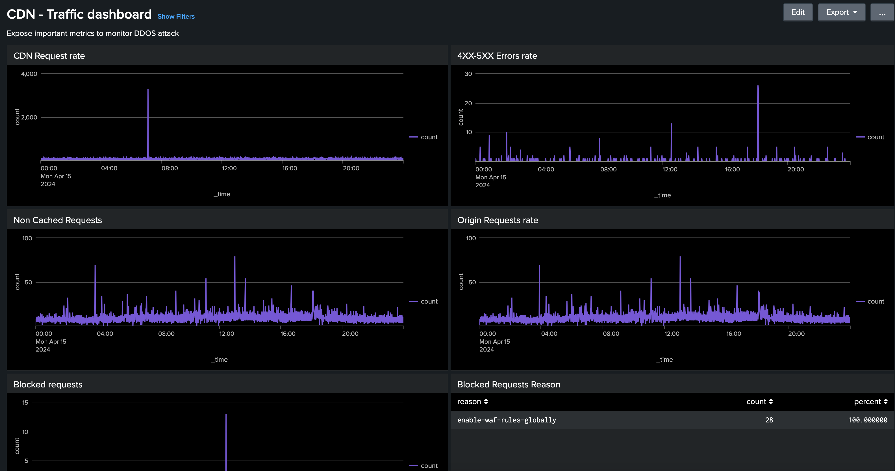
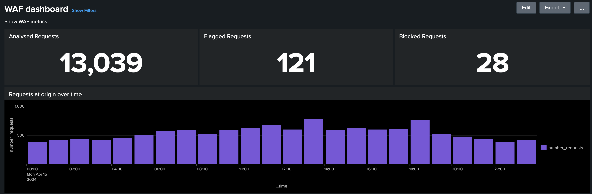

# CDN log analysis tooling

Learn about the _AEM Cloud Service CDN Log Analysis Tooling_ that Adobe provides and how it helps to get insights into both your CDN performance and AEM implementation.
 
>[!VIDEO](https://video.tv.adobe.com/v/3429177?quality=12&learn=on)

## Overview

The [AEM as a Cloud Service CDN Log Analysis Tooling](https://github.com/adobe/AEMCS-CDN-Log-Analysis-Tooling) offers pre-built dashboards that you can integrate with the [Splunk](https://www.splunk.com/en_us/products/observability-cloud.html) or the [ELK stack](https://www.elastic.co/elastic-stack) for real-time monitoring and analysis of your CDN logs. 

By using this tooling, you can achieve real-time monitoring and proactive issue detection. Thus, ensuring optimized content delivery and proper security measures against Denial of Service (DoS) and Distributed Denial of Service (DDoS) attacks.

## Key Features

- Streamlined Log Analysis
- Real-time Monitoring
- Seamless Integration
- Dashboards for
    - Identify potential security threats
    - Faster end-user experience

## Dashboard Overview

To quickstart the log analysis, Adobe provides pre-built dashboards for both Splunk and ELK stack.

- **CDN Cache Hit Ratio**: provides insights into the total cache hit ratio and total count of requests by HIT, PASS, and MISS status. It also provides top HIT, PASS, and MISS URLs.

    

- **CDN Traffic Dashboard**: provides insights into the traffic via CDN and Origin request rate, 4xx and 5xx error rates, and non-cached requests. It also provides max CND and Origin requests per second per client IP address and more insights to optimize the CDN configurations.

    

- **WAF Dashboard**: provides insights via analyzed, flagged, and blocked requests. It also provides top attacks by WAF Flag ID, top 100 attackers by client IP, country, and user agent and more insights to optimize the WAF configurations.

    

## Splunk integration

For organizations leveraging [Splunk](https://www.splunk.com/en_us/products/observability-cloud.html) and who have enabled AEMCS log forwarding to their Splunk instances can quickly import pre-built dashboards. This setup facilitates accelerated log analysis, providing actionable insights to optimize AEM implementations and mitigate security threats such as DOS attacks.

You can get started using the [Splunk dashboards for AEMCS CDN Log Analysis](https://github.com/adobe/AEMCS-CDN-Log-Analysis-Tooling/blob/main/Splunk/README.md#splunk-dashboards-for-aemcs-cdn-log-analysis) guide.

## ELK integration

The [ELK stack](https://www.elastic.co/elastic-stack), comprising Elasticsearch, Logstash, and Kibana, is another powerful option for log analysis. It is useful for organizations that do not have access to a Splunk setup or log forwarding capabilities. Setting up the ELK stack locally is straightforward, the tooling provides the Docker Compose file to get started quickly. Then, you can import the pre-built dashboards and ingest the CDN logs that are downloaded using the Adobe Cloud Manager.

You can get started using the [ELK Docker container for AEMCS CDN Log Analysis](https://github.com/adobe/AEMCS-CDN-Log-Analysis-Tooling/blob/main/ELK/README.md#elk-docker-container-for-aemcs-cdn-log-analysis) guide.
