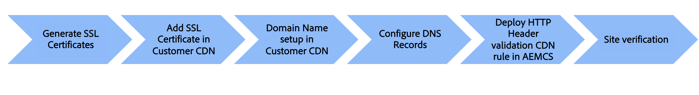

# Custom domain name with customer-managed CDN

Learn how to add a custom domain name to an AEM as a Cloud Service web site that uses a **customer-managed CDN**.

In this tutorial, the branding of the sample [AEM WKND](https://github.com/adobe/aem-guides-wknd) site is enhanced by adding an HTTPS-addressable custom domain name `wkndviaawscdn.enablementadobe.com` with Transport Layer Security (TLS) using a customer-managed CDN. In this tutorial, AWS CloudFront is used as the customer-managed CDN, however any CDN provider should be compatible with AEM as a Cloud Service.

>[!VIDEO](https://video.tv.adobe.com/v/3432561?quality=12&learn=on)

The high-level steps are:

{width="800" zoomable="yes"}

## Prerequisites

>[!VIDEO](https://video.tv.adobe.com/v/3432562?quality=12&learn=on)

- [OpenSSL](https://www.openssl.org/) and [dig](https://www.isc.org/blogs/dns-checker/) are installed on your local machine.
- Access to third-party services:
    - Certificate Authority (CA) -  to request the signed certificate for your site domain, like [DigitCert](https://www.digicert.com/) 
    - Customer CDN - to set up the customer CDN and add SSL certificates and domain details, like AWS CloudFront, Azure CDN, or Akamai.
    - Domain Name System (DNS) hosting service - to add DNS records for your custom domain, like Azure DNS, or AWS Route 53. 
- Access to [Adobe Cloud Manager](https://my.cloudmanager.adobe.com/) to deploy HTTP Header validation CDN rule to the AEM as a Cloud Service environment.
- Sample [AEM WKND](https://github.com/adobe/aem-guides-wknd) site is deployed to the AEM as a Cloud Service environment of [production program](https://experienceleague.adobe.com/en/docs/experience-manager-cloud-service/content/implementing/using-cloud-manager/programs/introduction-production-programs) type.

If you do not have access to third-party services, _collaborate with your security or hosting team to complete the steps_.

## Generate SSL certificate

>[!VIDEO](https://video.tv.adobe.com/v/3427908?quality=12&learn=on)

You have two options:

1. Using `openssl` command-line tool - you can generate a private key and a Certificate Signing Request (CSR) for your site domain. To request a signed certificate, submit the CSR to a Certificate Authority (CA).
1. Your hosting team provides the required private key and signed certificate for your site.

Let's review the steps for the first option. 

To generate a private key and a CSR, run the following commands and provide the required information when prompted:

```bash
# Generate a private key and a CSR
$ openssl req -newkey rsa:2048 -keyout <YOUR-SITE-NAME>.key -out <YOUR-SITE-NAME>.csr -nodes
```

To request a signed certificate, provide the generated CSR to the CA by following their documentation. Once the CA signs the CSR, you receive the signed certificate file.

### Review signed certificate

Reviewing the signed certificate before adding it to the Cloud Manager is a good practice. You can review the certificate details using the following command:

```bash
# Review the certificate details
$ openssl crl2pkcs7 -nocrl -certfile <YOUR-SIGNED-CERT>.crt | openssl pkcs7 -print_certs -noout
```

The signed certificate may contain the certificate chain, which includes the root and intermediate certificates along with the end-entity certificate. 

The Adobe Cloud Manager accepts the end-entity certificate and the certificate chain _in separate form fields_, so you must extract the end-entity certificate and the certificate chain from the signed certificate.

In this tutorial, the [DigitCert](https://www.digicert.com/) signed certificate issued against `*.enablementadobe.com` domain is used as an example. The end-entity and certificate chain is extracted by opening the signed certificate in a text editor and copying the content between the `-----BEGIN CERTIFICATE-----` and `-----END CERTIFICATE-----` markers.

## Set up customer-managed CDN

>[!VIDEO](https://video.tv.adobe.com/v/3432563?quality=12&learn=on)

Set up the customer CDN, like AWS CloudFront, Azure CDN, or Akamai, and add the SSL certificate and domain details. In this tutorial, AWS CloudFront is used as an example. However, depending on your CDN vendor, the steps may vary. The key callouts are:

- Add the SSL certificate to the CDN.
- Add the custom domain name to the CDN.
- Configure the CDN to cache the content, like images, CSS, and JavaScript files.
- Add the `X-Forwarded-Host` HTTP header to the CDN settings so that your CDN includes this header in all requests it sends to the AEMCD origin.
- Make sure the `Host` header value is set to the default AEM as a Cloud Service domain containing the program and environment ID and ending with `adobeaemcloud.com`. The HTTP host header value passed from the customer CDN to the Adobe CDN must be the default AEM as a Cloud Service domain, any other value result in an error state.

## Configure DNS records

>[!VIDEO](https://video.tv.adobe.com/v/3432564?quality=12&learn=on)

To configure the DNS record for your custom domain follow these steps,

1. Add a CNAME record for the custom domain pointing to the CDN domain name.

This tutorial adds a CNAME record to Azure DNS for the custom domain `wkndviaawscdn.enablementadobe.com` and points it to the AWS CloudFront distribution domain name.

### Site verification

Verify the custom domain name by accessing the site using the custom domain name. 
It may or may not work depending on the vhhost configuration in the AEM as a Cloud Service environment. 

A crucial security step is to deploy the HTTP Header validation CDN rule to the AEM as a Cloud Service environment. The rule ensures that the request is coming from the customer CDN and not from any other source.

## Current working state without HTTP Header validation CDN rule

>[!VIDEO](https://video.tv.adobe.com/v/3432565?quality=12&learn=on)

Without the HTTP Header validation CDN rule, the `Host` header value is set to the default AEM as a Cloud Service domain containing the program and environment ID and ending with `adobeaemcloud.com`. Adobe CDN transforms the `Host` header value to the value of the `X-Forwarded-Host` received from the customer CDN only if the HTTP Header validation CDN rule is deployed. Otherwise, the `Host` header value is passed as is to the AEM as a Cloud Service environment and the `X-Forwarded-Host` header is not used.

### Sample servlet code to print the Host header value

The following servlet code prints the `Host`, `X-Forwarded-*`, `Referer` and `Via` HTTP header values in the JSON response.

```java
package com.adobe.aem.guides.wknd.core.servlets;

import java.io.IOException;
import java.util.Enumeration;

import javax.servlet.Servlet;
import javax.servlet.ServletException;

import org.apache.sling.api.SlingHttpServletRequest;
import org.apache.sling.api.SlingHttpServletResponse;
import org.apache.sling.api.resource.ResourceResolverFactory;
import org.apache.sling.api.servlets.HttpConstants;
import org.apache.sling.api.servlets.ServletResolverConstants;
import org.apache.sling.api.servlets.SlingSafeMethodsServlet;
import org.osgi.service.component.annotations.Component;
import org.osgi.service.component.annotations.Reference;

@Component(service = Servlet.class, property = {
        ServletResolverConstants.SLING_SERVLET_PATHS + "=/bin/verify-headers",
        ServletResolverConstants.SLING_SERVLET_METHODS + "=" + HttpConstants.METHOD_GET
})
public class VerifyHeadersServlet extends SlingSafeMethodsServlet {

    @Reference
    private ResourceResolverFactory resourceResolverFactory;

    @Override
    protected void doGet(SlingHttpServletRequest request, SlingHttpServletResponse response)
            throws ServletException, IOException {
        response.setContentType("application/json");
        response.setCharacterEncoding("UTF-8");

        // Create JSON response
        StringBuilder jsonResponse = new StringBuilder();
        jsonResponse.append("{");

        Enumeration<String> headerNames = request.getHeaderNames();
        boolean firstHeader = true;

        while (headerNames.hasMoreElements()) {
            String headerName = headerNames.nextElement();

            if (headerName.startsWith("X-Forwarded-") || headerName.startsWith("Host")
                    || headerName.startsWith("Referer") || headerName.startsWith("Via")) {
                if (!firstHeader) {
                    jsonResponse.append(",");
                }
                jsonResponse.append("\"").append(headerName).append("\": \"").append(request.getHeader(headerName))
                        .append("\"");
                firstHeader = false;
            }
        }

        jsonResponse.append("}");

        response.getWriter().write(jsonResponse.toString());
    }
}
```

To test the servlet, update the `../dispatcher/src/conf.dispatcher.d/filters/filters.any` file with the following configuration. Also make sure that the CDN is configured to **NOT cache** the `/bin/*` path.

```plaintext
# Testing purpose bin
/0300 { /type "allow" /extension "json" /path "/bin/*"}
/0301 { /type "allow" /path "/bin/*"}
/0302 { /type "allow" /url "/bin/*"}
```

## Configure and deploy HTTP Header validation CDN rule

>[!VIDEO](https://video.tv.adobe.com/v/3432566?quality=12&learn=on)

To configure and deploy the HTTP Header validation CDN rule, follow these steps:

- Add HTTP Header validation CDN rule in the `cdn.yaml` file, an example is provided below.

    ```yaml
    kind: "CDN"
    version: "1"
    metadata:
    envTypes: ["prod"]
    data:
    authentication:
        authenticators:
        - name: edge-auth
            type: edge
            edgeKey1: ${{CDN_EDGEKEY_080124}}
            edgeKey2: ${{CDN_EDGEKEY_110124}}
        rules:
        - name: edge-auth-rule
            when: { reqProperty: tier, equals: "publish" }
            action:
            type: authenticate
            authenticator: edge-auth
    ```

- Create secret-type environment variables (CDN_EDGEKEY_080124, CDN_EDGEKEY_110124) using the Cloud Manager UI.
- Deploy the HTTP Header validation CDN rule to the AEM as a Cloud Service environment using the Cloud Manager pipeline.

## Pass secret in the X-AEM-Edge-Key HTTP Header

>[!VIDEO](https://video.tv.adobe.com/v/3432567?quality=12&learn=on)

Update the customer CDN to pass the secret in the `X-AEM-Edge-Key` HTTP Header. The secret is used by the Adobe CDN to validate the request is coming from the customer CDN and transform the `Host` header value to the value of the `X-Forwarded-Host` received from the customer CDN.

## End to end video

You can also watch the end-to-end video that demonstrates the above steps to add a custom domain name with a customer-managed CDN to an AEM as a Cloud Service-hosted site.

>[!VIDEO](https://video.tv.adobe.com/v/3432568?quality=12&learn=on)
