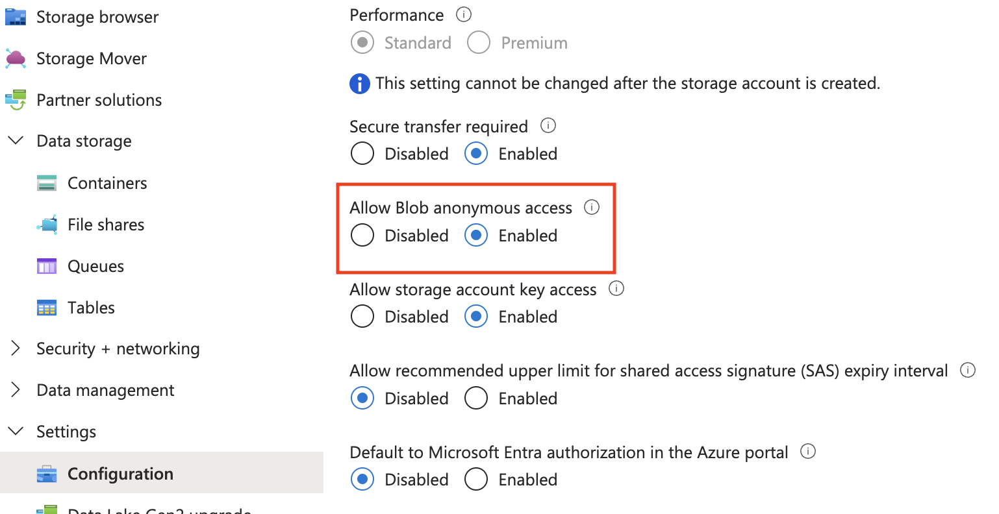
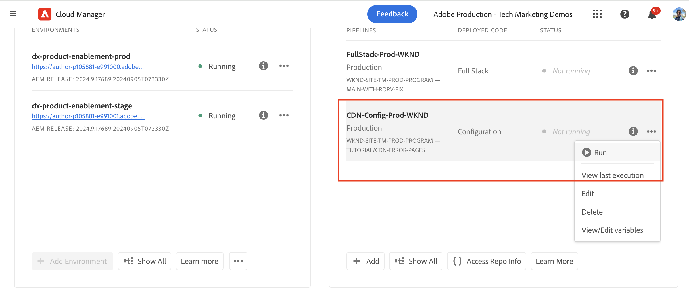
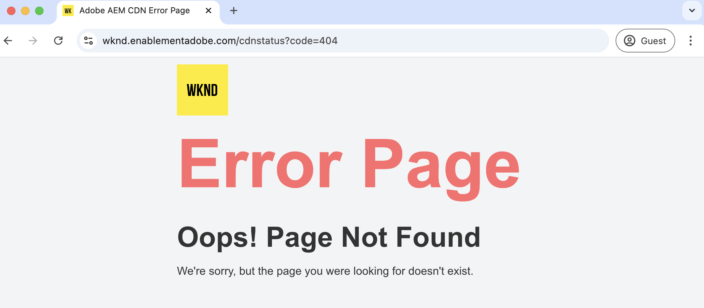
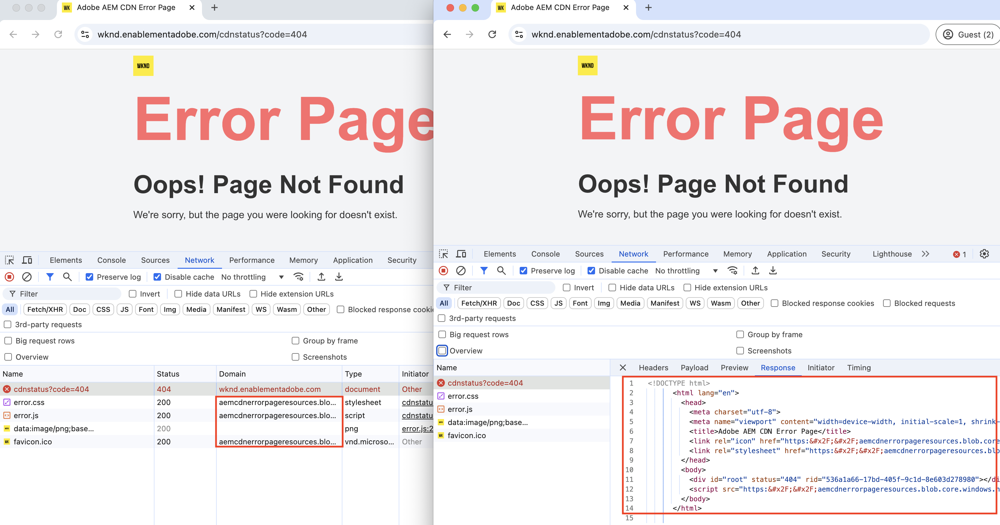

# Custom error pages

Learn how to implement custom error pages for your AEM as a Cloud Service hosted website.

In this tutorial, you learn:

- Default error pages
- Error pages served from
  - AEM service type - author, publish, preview
  - Adobe-managed CDN
- Options to customize error pages
  - ErrorDocument Apache directive
  - ACS AEM Commons - Error Page Handler
  - CDN Error Pages

## Default error pages

Let's review when error pages are displayed, default error pages, and where they are served from.

Error pages are displayed when:

- page does not exist (404) 
- not authorized to access a page (403)
- server error (500) because of code issues or server is unreachable.

AEM as a Cloud Service provides _default error pages_ for the above scenarios. It is a generic page and does not match your brand.

The default error page _gets served_ from the _AEM service type_(author, publish, preview) or from the _Adobe-managed CDN_. See the table below for more details.

| Error page served from | Details |
|---------------------|:-----------------------:|
| AEM service type - author, publish, preview    |  When the page request is served by the AEM service type, the error page is served from the AEM service type. |
| Adobe-managed CDN   | When the Adobe-managed CDN _cannot reach the AEM service type_ (origin server), the error page is served from the Adobe-managed CDN. **It is an unlikely event but worth mentioning.** |

However, you can _customize both AEM service type and Adobe-managed_ CDN error pages to match your brand and provide a better user experience.

## Options to customize error pages

The following options are available to customize error pages:

| Applicable to | Option Name | Description |
|---------------------|:-----------------------:|:-----------------------:|
| AEM service types - publish & preview | ErrorDocument directive | Use the [ErrorDocument](https://httpd.apache.org/docs/2.4/custom-error.html) directive in the Apache configuration file to specify the path to the custom error page. Only applicable to the AEM service types - publish and preview. |
| AEM service types - author, publish, preview | ACS AEM Commons Error Page Handler | Use the [ACS AEM Commons Error Page Handler](https://adobe-consulting-services.github.io/acs-aem-commons/features/error-handler/index.html) to customize error across all AEM service types. |
| Adobe-managed CDN | CDN Error Pages | Use the CDN error pages to customize the error pages when the Adobe-managed CDN cannot reach the AEM service type (origin server). |


## Prerequisites

In this tutorial, you learn how to customize error pages using the _ErrorDocument_ directive, the _ACS AEM Commons Error Page Handler_ and the _CDN Error Pages_ options. To follow this tutorial, you need:

- The [local AEM development environment](https://experienceleague.adobe.com/en/docs/experience-manager-learn/cloud-service/local-development-environment-set-up/overview) or AEM as a Cloud Service environment. The _CDN Error Pages_ option is applicable to the AEM as a Cloud Service environment.

- The [AEM WKND project](https://github.com/adobe/aem-guides-wknd) to customize error pages.

## Set-up

- Clone and deploy the AEM WKND project to your local AEM development environment by following the steps below:

    ```
    # For local AEM development environment
    $ git clone git@github.com:adobe/aem-guides-wknd.git
    $ cd aem-guides-wknd
    $ mvn clean install -PautoInstallSinglePackage -PautoInstallSinglePackagePublish
    ```

- For AEM as a Cloud Service environment, deploy the AEM WKND project by running the [Full-stack pipeline](https://experienceleague.adobe.com/en/docs/experience-manager-cloud-service/content/implementing/using-cloud-manager/cicd-pipelines/introduction-ci-cd-pipelines#full-stack-pipeline), see the [non-production pipeline](https://experienceleague.adobe.com/en/docs/experience-manager-learn/cloud-service/cloud-manager/cicd-non-production-pipeline) example.

- Verify that the WKND site pages render correctly.

## ErrorDocument Apache directive to customize error pages{#errordocument-directive}

Let's review how [AEM WKND](https://github.com/adobe/aem-guides-wknd) project uses the `ErrorDocument` Apache directive to display custom error pages.

- The `ui.content.sample` module contains the branded [error pages](https://github.com/adobe/aem-guides-wknd/tree/main/ui.content.sample/src/main/content/jcr_root/content/wknd/language-masters/en/errors) @ `/content/wknd/language-masters/en/errors`. Review them in your [local AEM](http://localhost:4502/sites.html/content/wknd/language-masters/en/errors) or AEM as a Cloud Service `https://author-p<ID>-e<ID>.adobeaemcloud.com/ui#/aem/sites.html/content/wknd/language-masters/en/errors` environment.

- The `wknd.vhost` file from the `dispatcher` module contains:
    - The [ErrorDocument directive](https://github.com/adobe/aem-guides-wknd/blob/main/dispatcher/src/conf.d/available_vhosts/wknd.vhost#L139-L143) that points to the above [error pages](https://github.com/adobe/aem-guides-wknd/blob/main/dispatcher/src/conf.d/variables/custom.vars#L7-L8).
    - The [DispatcherPassError](https://github.com/adobe/aem-guides-wknd/blob/main/dispatcher/src/conf.d/available_vhosts/wknd.vhost#L133) value is set to 1 so the Dispatcher let Apache handle all errors.

    ```
    ...
    # ErrorDocument directive in wknd.vhost file
    ErrorDocument 404 ${404_PAGE}
    ErrorDocument 500 ${500_PAGE}
    ErrorDocument 502 ${500_PAGE}
    ErrorDocument 503 ${500_PAGE}
    ErrorDocument 504 ${500_PAGE}

    ...
    # DispatcherPassError value in wknd.vhost file
    <IfModule disp_apache2.c>
        ...
        DispatcherPassError        1
    </IfModule>

    # Custom error pages path in custom.vars file
    Define 404_PAGE /content/wknd/us/en/errors/404.html
    Define 500_PAGE /content/wknd/us/en/errors/500.html
    ...
    ```

- Review the WKND site's custom error pages by entering an incorrect page name or path in your environment, for example [https://publish-p105881-e991000.adobeaemcloud.com/us/en/foo/bar.html](https://publish-p105881-e991000.adobeaemcloud.com/us/en/foo/bar.html).
    
## ACS AEM Commons-Error Page Handler to customize error pages{#acs-aem-commons-error-page-handler}

To customize error pages using the ACS AEM Commons Error Page Handler, review the [How to Use](https://adobe-consulting-services.github.io/acs-aem-commons/features/error-handler/index.html#how-to-use) section.

## CDN error pages to customize error pages{#cdn-error-pages}

Let's implement CDN error pages to customize error pages when the Adobe-managed CDN cannot reach the AEM service type (origin server).

>[!IMPORTANT]
>
> Note that the Adobe-managed CDN cannot reach the AEM service type (origin server) is an unlikely event but worth planning for.


### CDN error pages overview

The CDN error page is implemented as a Single Page Application (SPA) by the Adobe-managed CDN.

The WKND specific branded content must be generated dynamically using the JavaScript file. The JavaScript file must be hosted in a publicly accessible location. Thus, the following static files must be developed and hosted in a publicly accessible location:

1. **jsUrl**: The absolute URL of the JavaScript file to render the error page content by creating HTML elements dynamically.
1. **cssUrl**: The absolute URL of the CSS file to style the error page content.
1. **icoUrl**: The absolute URL of the favicon.

### Develop a custom error page

Let's develop the WKND specific branded error page content as a Single Page Application (SPA).

For demo purposes, let's use [React](https://react.dev/), however, you can use any JavaScript framework or library.

- Create a new React project by running the following command:

    ```
    $ npx create-react-app aem-cdn-error-page
    ```

- Open the project in your favorite code editor and update the below files:

    - `src/App.js`: It is the main component that renders the error page content.
    
      ```javascript
      import logo from "./wknd-logo.png";
      import "./App.css";

      function App() {
        return (
          <>
            <div className="App">
              <div className="container">
              
              </div>
            </div>
            <div className="container">
              <div className="error-code">CDN Error Page</div>
              <h1 className="error-message">Ruh-Roh! Page Not Found</h1>
              <p className="error-description">
                We're sorry, we are unable to fetch this page!
              </p>
            </div>
          </>
        );
      }

      export default App;

      ```

    - `src/App.css`: Style the error page content.

      ```css
      .App {
        text-align: left;
      }

      .App-logo {
        height: 14vmin;
        pointer-events: none;
      }


      body {
        margin-top: 0;
        padding: 0;
        font-family: Arial, sans-serif;
        background-color: #fff;
        color: #333;
        display: flex;
        justify-content: center;
        align-items: center;
      }

      .container {
        text-align: letf;
        padding-top: 10px;
      }

      .error-code {
        font-size: 4rem;
        font-weight: bold;
        color: #ff6b6b;
      }

      .error-message {
        font-size: 2.5rem;
        margin-bottom: 10px;
      }

      .error-description {
        font-size: 1rem;
        margin-bottom: 20px;
      }
      ```
  
    - Add the `wknd-logo.png` file to the `src` folder. Copy the [file](https://github.com/adobe/aem-guides-wknd/blob/main/ui.frontend/src/main/webpack/resources/images/favicons/favicon-512.png) as `wknd-logo.png`.

    - Add the `favicon.ico` file to the `public` folder. Copy the [file](https://github.com/adobe/aem-guides-wknd/blob/main/ui.frontend/src/main/webpack/resources/images/favicons/favicon-32.png) as `favicon.ico`.

    - Verify the WKND branded CDN error page content by running the project:

      ```
      $ npm start
      ```
    
      Open the browser and navigate to `http://localhost:3000/` to see the CDN error page content.

    - Build the project to generate the static files:

      ```
      $ npm run build
      ```

      The static files are generated in the `build` folder.


Alternatively, you can download the [aem-cdn-error-page.zip](./assets/aem-cdn-error-page.zip) file containing the above React project files.

Next, host the above static files in a publicly accessible location.      

### Host static files required for CDN error page

Let's host the static files in Azure Blob Storage. However, you can use any static file hosting service like [Netlify](https://www.netlify.com/), [Vercel](https://vercel.com/), or [AWS S3](https://aws.amazon.com/s3/).

- Follow the official [Azure Blob Storage](https://learn.microsoft.com/en-us/azure/storage/blobs/storage-quickstart-blobs-portal) documentation to create a container and upload the static files. 

  >[!IMPORTANT]
  >
  >If you are using other static file hosting services, follow their documentation to host the static files.

- Make sure that the static files are publicly accessible. My WKND demo specific storage account settings are as follows:

    - **Storage Account Name**: `aemcdnerrorpageresources`
    - **Container Name**: `static-files`

    

- In above `static-files` container, below files from the `build` folder are uploaded:

    - `error.js`: The `build/static/js/main.<hash>.js` file is renamed to `error.js` and [publicly accessible](https://aemcdnerrorpageresources.blob.core.windows.net/static-files/error.js).
    - `error.css`: The `build/static/css/main.<hash>.css` file is renamed to `error.css` and [publicly accessible](https://aemcdnerrorpageresources.blob.core.windows.net/static-files/error.css).
    - `favicon.ico`: The `build/favicon.ico` file is uploaded as is and [publicly accessible](https://aemcdnerrorpageresources.blob.core.windows.net/static-files/favicon.ico).

Next, configure the CDN rule (errorPages) and reference the above static files.

### Configure the CDN rule

Let's configure the `errorPages` CDN rule that uses the above static files to render the CDN error page content.

1. Open the `cdn.yaml` file from the main `config` folder of your AEM project. For example, the [WKND project's cdn.yaml](https://github.com/adobe/aem-guides-wknd/blob/main/config/cdn.yaml) file.

1. Add the following CDN rule to the `cdn.yaml` file:

    ```yaml
    kind: "CDN"
    version: "1"
    metadata:
      envTypes: ["dev", "stage", "prod"]
    data:
      # The CDN Error Page configuration. 
      # The error page is displayed when the Adobe-managed CDN is unable to reach the origin server.
      # It is implemented as a Single Page Application (SPA) and WKND branded content must be generated dynamically using the JavaScript file 
      errorPages:
        spa:
          title: Adobe AEM CDN Error Page # The title of the error page
          icoUrl: https://aemcdnerrorpageresources.blob.core.windows.net/static-files/favicon.ico # The PUBLIC URL of the favicon
          cssUrl: https://aemcdnerrorpageresources.blob.core.windows.net/static-files/error.css # The PUBLIC URL of the CSS file
          jsUrl: https://aemcdnerrorpageresources.blob.core.windows.net/static-files/error.js # The PUBLIC URL of the JavaScript file
    ```

1. Save, commit, and push the changes to the Adobe upstream repository.

### Deploy the CDN rule

Finally, deploy the configured CDN rule to the AEM as a Cloud Service environment using the Cloud Manager pipeline.

1. In the Cloud Manager, navigate to the **Pipelines** section.

1. Create a new pipeline or select the existing pipeline that deploys only the **Config** files. For detailed steps, see [Create a config pipeline](https://experienceleague.adobe.com/en/docs/experience-manager-learn/cloud-service/security/traffic-filter-and-waf-rules/how-to-setup#deploy-rules-through-cloud-manager).

1. Click the **Run** button to deploy the CDN rule.

  

### Test the CDN error pages

To test the CDN error pages, follow the below steps:

- Open the browser and navigate to the Publish environment URL, append the `cdnstatus?code=404` to the URL, for example, [https://publish-p105881-e991000.adobeaemcloud.com/cdnstatus?code=404](https://publish-p105881-e991000.adobeaemcloud.com/cdnstatus?code=404) or access using the [custom domain URL](https://wknd.enablementadobe.com/cdnstatus?code=404)

  

- The supported codes are: 403, 404, 406, 500 and 503.

- Verify the browser network tab to see the static files are loaded from the Azure Blob Storage. The HTML document delivered by the Adobe-managed CDN contains the bare minimum content and the JavaScript file dynamically creates the branded error page content.

  

## Summary

In this tutorial, you learned how to implement custom error pages for your AEM as a Cloud Service hosted website. 

You also learned the detailed steps for the CDN error pages option to customize error pages when the Adobe-managed CDN cannot reach the AEM service type (origin server).


