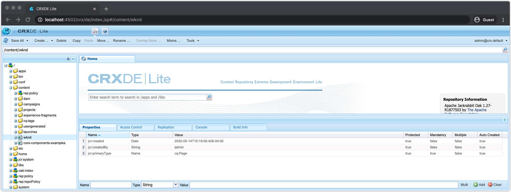
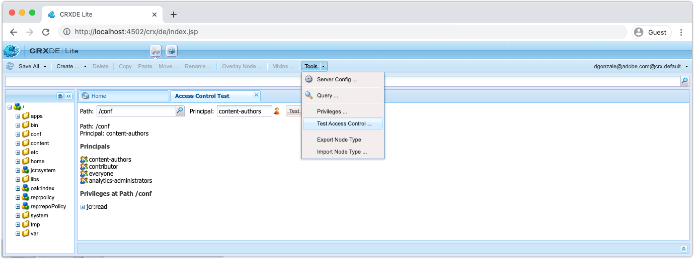
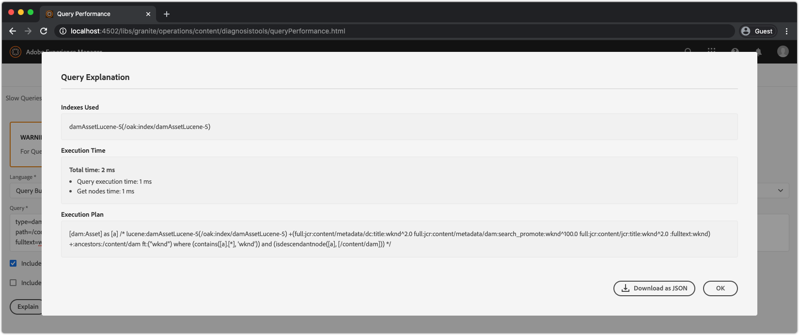
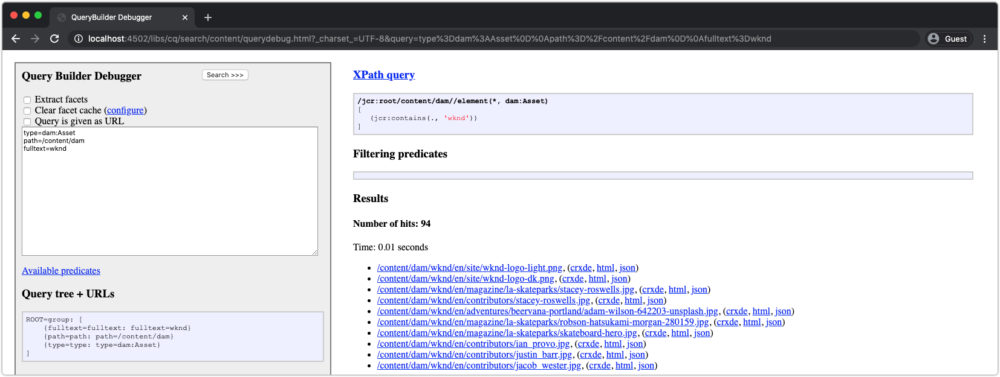

# Other tools for debugging AEM SDK

A variety of other tools can aid in debugging your application on the AEM SDK's local quickstart. 

## CRXDE Lite

CRXDE Lite is a web-based interface for interacting with the JCR, AEM's data repository. CRXDE Lite provides completely visibility into the JCR, including nodes, properties, property values, and permissions.

CRXDE Lite is located at:

+ Tools > General > CRXDE Lite
+ or directly at [http://localhost:4502/crx/de/index.jsp](http://localhost:4502/crx/de/index.jsp)

### Debugging content

CRXDE Lite provides direct access to the JCR. The content visible via CRXDE Lite is limited by the permissions granted to your user, meaning you may not be able to see or modifying everything in the JCR depending on your access.

+ The JCR structure is navigated and manipulated using the left navigation pane
+ Selecting a node in the left navigation pane, exposes the node property's in the bottom pane. 
  + Properties can be added, removed or changed from the pane
+ Double-clicking a file node in the left navigation, opens the file's content in the top right pane
+ Tap the Save All button in the top left to persist changed, or the down arrow next to Save All to Revert any unsaved changes.

Any changes made directly to AEM SDK via CRXDE Lite may be difficult to track and govern. As appropriate, ensure changes made via CRXDE Lite make their way back to the AEM project's mutable content packages (`ui.content`) and committed to Git. Ideally, all application content changes originate from the code base and flow into AEM SDK via deployments, rather than making changes directly to the AEM SDK via CRXDE Lite.

### Debugging access controls

CRXDE Lite provides a way to test and evaluate access control on a specific node for a specific user or group (aka principal).

To access the Test Access Control console in CRXDE Lite, navigate to:

+ CRXDE Lite > Tools > Test Access Control ... 

1. Using the Path field, select a JCR Path to evaluate
1. Using the Principal field, select the user or group to valuate the path against
1. Tap the Test button

The results display below:

+ __Path__ reiterates the path that was evaluated
+ __Principal__ reiterates the user or group that the path was evaluated for
+ __Principals__ lists all the principals the selected principal is part of.
  + This is helpful to understand the transitive group memberships that may provide permissions via inheritance
+ __Privileges at Path__ lists all the JCR permissions the selected principal has on the evaluated path

## Explain Query

Explain Query web-based tool in AEM SDK's local quickstart, that provides key insights into how AEM interprets and executes queries, and an invaluable tool to ensure queries are being executed in a performant manner by AEM.

Explain Query is located at:

+ Tools > Diagnosis > Query Performance > Explain Query Tab
+ [http://localhost:4502/libs/granite/operations/content/diagnosistools/queryPerformance.html](http://localhost:4502/libs/granite/operations/content/diagnosistools/queryPerformance.html) > Explain Query tab

## QueryBuilder Debugger 

QueryBuilder debugger is web-based tool that helps you debug and understand search queries using AEM's [QueryBuilder](https://experienceleague.adobe.com/docs/experience-manager-65/developing/platform/query-builder/querybuilder-api.html) syntax.

QueryBuilder Debugger is located at:

+ [http://localhost:4502/libs/cq/search/content/querydebug.html](http://localhost:4502/libs/cq/search/content/querydebug.html)
