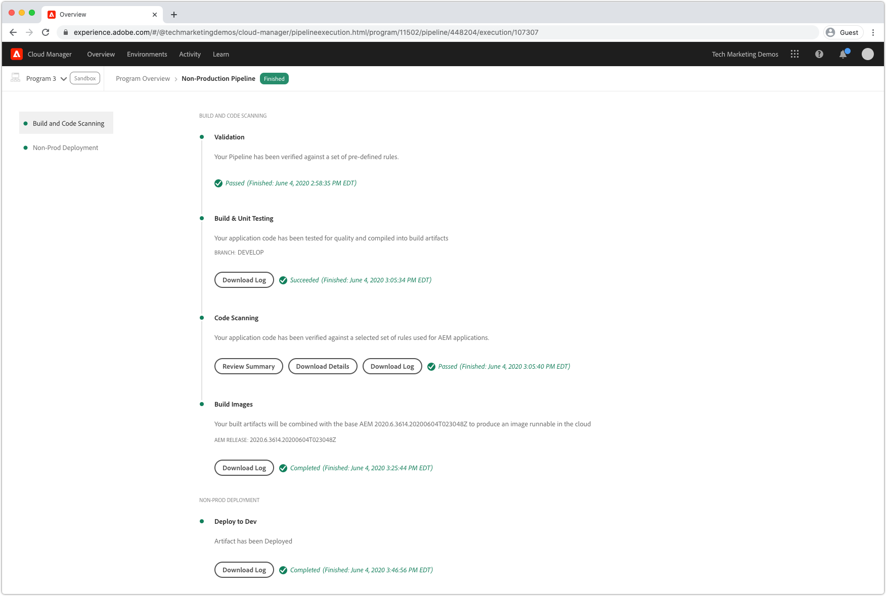
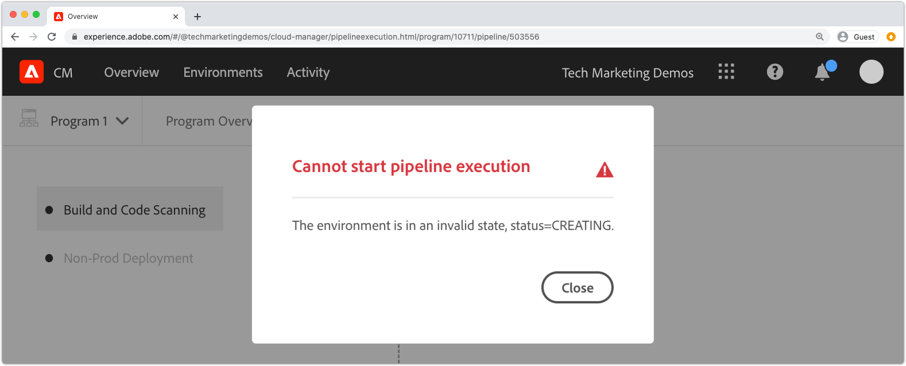
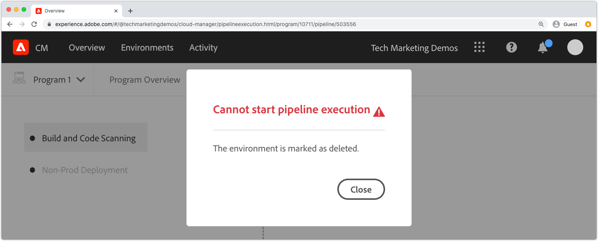
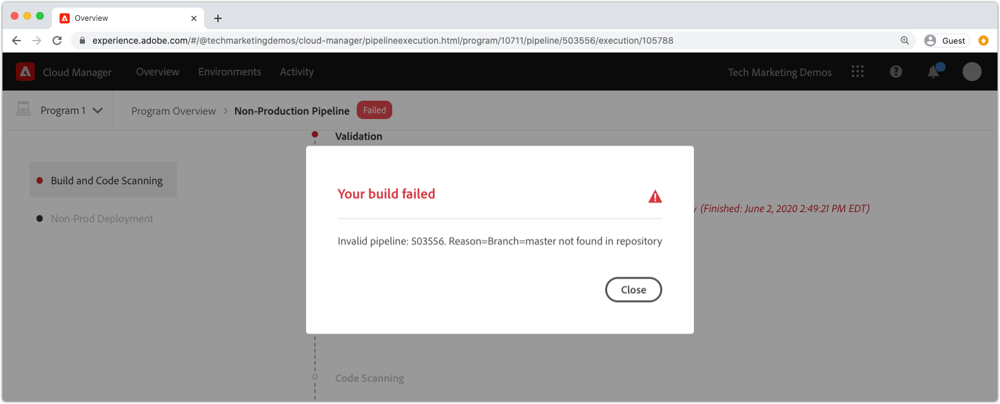
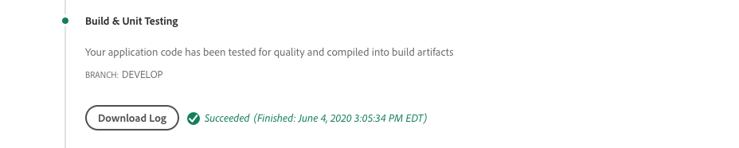
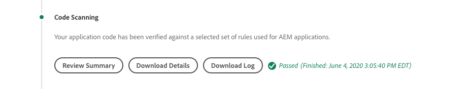
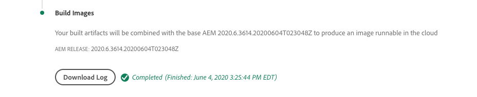
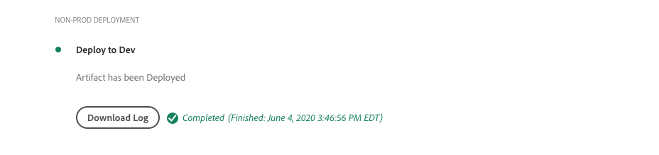
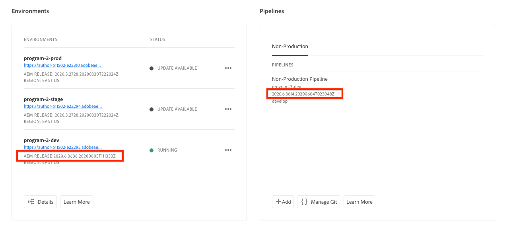

# Debugging AEM as a Cloud Service build and deployments 

Adobe Cloud Manager facilitates the code build and deployments to AEM as a Cloud Service. Failures may occur during steps in the build process, requiring action to resolve them. This guide walks through understanding common failures in in the deployment, and how to best approach them.



## Validation

The validation step simply ensures that basic Cloud Manager configurations are valid. Common validation failures include:

### The environment is in an invalid state

+ __Error message:__ The environment is in an invalid state.

+ __Cause:__ The pipeline's target environment is in a transitional state at which time it cannot accept new builds. 
+ __Resolution:__ Wait for the state to resolve to a running (or update available) state. If the environment is being deleted, re-create the environment, or choose a different environment to build to.

### The environment associate with the pipeline cannot be found

+ __Error message:__ The environment is marked as deleted.

+ __Cause:__ The environment the pipeline is configured to use has been deleted. 
    Even if a new environment of the same name is re-created, Cloud Manager will not automatically re-associate the pipeline to that same-named environment.
+ __Resolution:__ Edit the pipeline configuration, and re-select the environment to deploy to.

### The Git branch associated with the pipeline cannot be found

+ __Error message:__ Invalid pipeline: XXXXXX. Reason=Branch=xxxx not found in repository.

+ __Cause:__ The Git branch the pipeline is configured to use has been deleted. 
+ __Resolution:__ Re-create the missing Git branch using the exact same name, or re-configure the pipeline to build from a different, existing branch. 

## Build & Unit Testing



The Build and Unit Testing phase performs a Maven build (`mvn clean package`) of the project checked out from the pipeline's configured Git branch. 

Errors identified in this phase should be re-producible building the project locally, with the following exceptions:

+ A maven dependency not available on [Maven Central](https://search.maven.org/) is used, and the Maven repository containing the dependency is either:
    + Unreachable from Cloud Manager, such as a private internal Maven repository, or the Maven repository requires authentication and the incorrect credentials have been provided.
    + Not explicitly registered in the project's `pom.xml`. Note that, including Maven repositories is discouraged as it increases build times.
+ Unit tests fail due to timing issues. This may occur when unit tests are timing-sensitive. A strong indicator is relying on `.sleep(..)` in the test code.
+ The use of unsupported Maven plugins, such as the [Apache Maven Toolchains plug-in](https://maven.apache.org/plugins/maven-toolchains-plugin/).

## Code Scanning



Code scanning performs static code analysis using a mix of Java and AEM-specific best practices. 

Code scanning results in a build failure if a Critical Security vulnerabilities exist in the code. Lesser violations can be overridden, but it is recommended they are fixed. Note that code scanning is imperfect and can result in [false positives](https://docs.adobe.com/content/help/en/experience-manager-cloud-manager/using/how-to-use/understand-your-test-results.html#dealing-with-false-positives).

To resolve code scanning issues, download the report provided by Cloud Manager vai the , and review the offending lines. Note that 

## Build Images



Build image is responsible for combining the built code artifacts created in the Build & Unit Testing step with the AEM Release, to form a single deployable artifact.

While any code build and compilation issues are found during Build & Unit Testing, there may be configuration or structural issues identified when attempting to combine the custom build artifact with the AEM release.

### Duplicate OSGi configurations

When multiple OSGi configurations resolve via runmode for the target AEM environment, the Build Image step fails with the error:

```
[ERROR] Unable to convert content-package [/tmp/packages/enduser.all-1.0-SNAPSHOT.zip]: 
Configuration ‘com.example.ExampleComponent’ already defined in Feature Model ‘com.example.groupId:example.all:slingosgifeature:xxxxx:X.X’, 
set the ‘mergeConfigurations’ flag to ‘true’ if you want to merge multiple configurations with same PID
```

#### Cause 1

+ __Cause:__ The AEM project's all package, contains multiple code packages, and the same OSGi configuration is provided by more than one of the code packages, resulting in a conflict, resulting the Build Image step unable to decide which should be used, thus failing the build. Note this does not apply to OSGi factory configurations, as long as they have unique names.
+ __Resolution:__ Review all code packages (including any included 3rd party code packages) being deployed as part of the AEM application, looking for duplicate OSGi configurations that resolve, via runmode, to the target environment. The error message's guidance of "set the mergeConfigurations flag to true" is not possible in AEM as a Cloud service, and should be ignored.

#### Cause 2

+ __Cause:__ The AEM project's incorrectly includes the same code package twice, resulting in the duplication of any OSGi configuration contained in said package.
+ __Resolution:__ Review all pom.xml's of packages embedded in the all project, and ensure they have the `filevault-package-maven-plugin` [configuration](https://docs.adobe.com/content/help/en/experience-manager-cloud-service/implementing/developing/aem-project-content-package-structure.html#cloud-manager-target) set to `<cloudManagerTarget>none</cloudManagerTarget>`.

### Malformed repoinit script

Repoinit scripts define baseline content, users, ACLs, etc. In AEM as a Cloud Service, repoinit scripts are applied during Build Image, however on AEM SDK's local quickstart they are applied when the OSGi repoinit factory configuration is activated. Because of this, Repoinit scripts may quietly fail (with logging) on AEM SDK's local quickstart, and but cause the Build Image step to fail, halting deployment.

+ __Cause:__ A repoinit script is malformed. Note this may leave your repository in an incomplete state as any repoinit scripts after the failing script will be executed against the repository.
+ __Resolution:__ Review the AEM SDK's local quickstart when the repoinit script OSGi configuration is deployed to determine if and what the errors are.

### Unsatisfied repoinit content dependency

Repoinit scripts define baseline content, users, ACLs, etc. In AEM SDK's local quickstart, repoinit scripts are applied when the repoinit OSGi factory configuration is activated, or in other words, after the repository is active and may have incurred content changes directly or via content packages. In AEM as a Cloud Service, repoinit scripts are applied during Build Image against a a repository that may not contain content the repoinit script depends on.

+ __Cause:__ A repoinit script depends on content that is not existent.
+ __Resolution:__ Ensure the content the repoinit script depends on exists. Often, this indicates an inadequately defined repoinit scripts that is missing directives that define these missing, but required, content structures. This can reproduced locally by deleting AEM, unpacking the Jar and adding the repoinit OSGi configuration containing the repoinit script to the install folder, and starting AEM. The error will present itself in the AEM SDK local quickstart's error.log.

### Create an Adobe Support case

If the above troubleshooting approaches do not resolve the issue, please create an Adobe Support case, via:

+ [Adobe Admin Console](https://adminconsole.adobe.com) > Support Tab > Create Case

  _If you are a member of multiple Adobe Orgs, ensure the Adobe Org that has failing pipeline is selected in the Adobe Orgs switcher prior to creating the case._

## Deploy to

The Deploy to step is responsible for taking the code artifact generated in Build Image, starts up new AEM Author and Publish services using it, and upon success, removes any old AEM Author and Publish services. Mutable content packages and indexes are installed and updated in this step as well.

Familiarize yourself with [AEM as a Cloud Service logs](./logs.md) prior to debugging the Deploy to step. The `aemerror` log contains information around the start up and shutdown of pods which may be pertinent to Deploy to issues. Note that the log available via the Download Log button in the Cloud Manager's Deploy to step is not the `aemerror` log, and does not contain detailed information pertaining to your applications start up.



The three primary reasons why the Deploy to step may fail:

### The Cloud Manager pipeline holds an old AEM version

+ __Cause:__ A Cloud Manager pipeline holds an older version of AEM than what is deployed to the target environment. This may happens when a pipeline is re-used and pointed at a new environment that is running a later version of AEM. This can be identified by checking to see if the environment's AEM version is greater than than pipeline's AEM version.

+ __Resolution:__
  + If the target environment has an Update Available, select Update from the environment's actions, and then re-run the build.
  + If the target environment does not have an Update Available, this means it is running the latest version of AEM. To resolve this, delete the pipeline and re-create it.

### Cloud Manager times out

Code running during the start up of the newly deployed AEM service takes so long that Cloud Manager times out before the deploy can complete. In these cases, the deployment may eventually succeed, even thought Cloud Manager status reported Failed.

+ __Cause:__ Custom code may execute operations, such as large queries or content traversals, triggered early on in OSGi bundle or Component life-cycles significantly delaying the start up time of AEM.
+ __Resolution:__ Review the implementation for code that runs early in the OSGi Bundle's lifecycle, and review the `aemerror` logs for AEM Author and Publish services around the time of the failure (log time in GMT) as shown by the Cloud Manager, and look for log messages indicating any custom log running processes. 

### Incompatible code or configuration

Most code and configuration violations are caught in earlier in the build, however it is possible for custom code or configuration to be incompatible with the AEM as a Cloud Service and go undetected until it executes in the container.

+ __Cause:__ Custom code may invoke lengthy operations, such as large queries or content traversals, triggered early on in OSGi bundle or Component life-cycles significantly delaying the start up time of AEM.
+ __Resolution:__ Review the `aemerror` logs for AEM Author and Publish services around the time (log time in GMT) of the failure as shown by the Cloud Manager.
  1. Review the logs for any ERRORS thrown by the Java classes provided by the custom application. If any issues are found, resolve, push the fixed code, and re-build the pipeline.
  1. Review the logs for any ERRORS reported by aspects of AEM that you are extending/interacting with in your custom application, and investigate those; these ERRORs may not be directly attributed to Java classes. If any issues are found, resolve, push the fixed code, and re-build the pipeline.

### Create an Adobe Support case

If the above troubleshooting approaches do not resolve the issue, please create an Adobe Support case, via:

+ [Adobe Admin Console](https://adminconsole.adobe.com) > Support Tab > Create Case

  _If you are a member of multiple Adobe Orgs, ensure the Adobe Org that has failing pipeline is selected in the Adobe Orgs switcher prior to creating the case._
