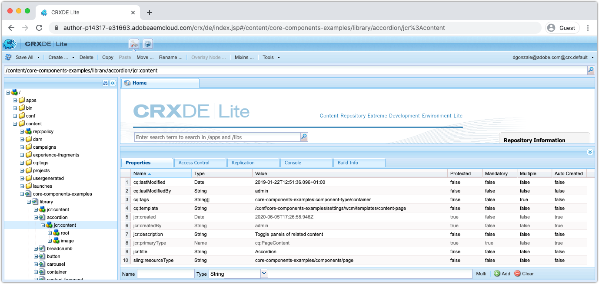
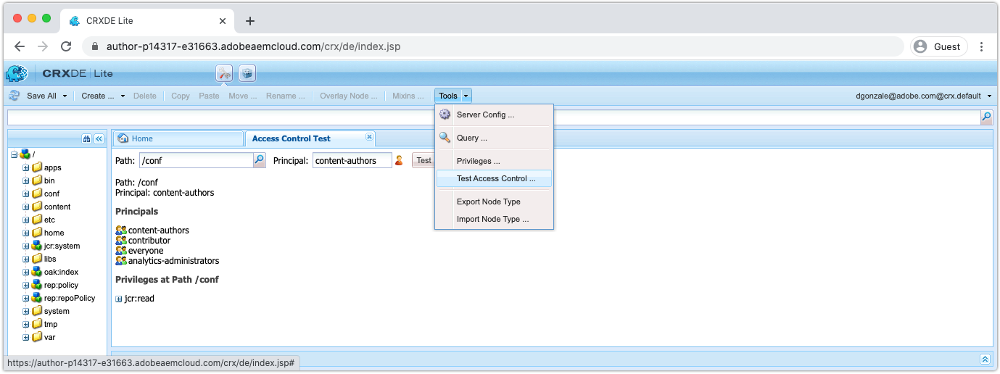

# Debugging AEM as a Cloud Service with CRXDE Lite

CRXDE Lite is __ONLY__ available on AEM as a Cloud Service Development environments (as well as the local AEM SDK).

## Accessing CRXDE Lite on AEM Author

CRXDE Lite is __only__ accessible on AEM as a Cloud Service Development environments, and is __not__ available on Stage or Production environments.

To access CRXDE Lite on AEM Author:

1. Log in to the AEM as a Cloud Service AEM Author service.
1. Navigate to Tools > General > CRXDE Lite

This will open CRXDE Lite using the credentials and permissions used to log in to AEM Author. 

## Debugging content

CRXDE Lite provides direct access to the JCR. The content visible via CRXDE Lite is limited by the permissions granted to your user, meaning you may not be able to see or modifying everything in the JCR depending on your access.

Note that `/apps`, `/libs` and `/oak:index` are immutable, meaning they cannot be changed at runtime by any user. These locations in the JCR can only be modified via code deployments.

+ The JCR structure is navigated and manipulated using the left navigation pane
+ Selecting a node in the left navigation pane, exposes the node property's in the bottom pane. 
    + Properties can be added, removed or changed from the pane
+ Double-clicking a file node in the left navigation, opens the file's content in the top right pane
+ Tap the Save All button in the top left to persist changed, or the down arrow next to Save All to Revert any unsaved changes.

Making changes to mutable content at runtime in AEM as a Cloud Service development environments via CRXDE Lite must be done with care. 
Any changes made directly to AEM via CRXDE Lite may be difficult to track and govern. As appropriate, ensure changes made via CRXDE Lite make their way back to the AEM project's mutable content packages (`ui.content`) and committed to Git, in order to ensure the issue is resolved. Ideally, all application content changes originate from the code base and flow into AEM via deployments, rather than making changes directly to the AEM via CRXDE Lite.

### Debugging access controls

CRXDE Lite provides a way to test and evaluate access control on a specific node for a specific user or group (aka principal).

To access the Test Access Control console in CRXDE Lite, navigate to:

+ CRXDE Lite > Tools > Test Access Control ... 

1. Using the Path field, select a JCR Path to evaluate
1. Using the Principal field, select the user or group to valuate the path against
1. Tap the Test button

The results display below:

+ __Path__ reiterates the path that was evaluated
+ __Principal__ reiterates the user or group that the path was evaluated for
+ __Principals__ lists all the principals the selected principal is part of.
    + This is helpful to understand the transitive group memberships that may provide permissions via inheritance
+ __Privileges at Path__ lists all the JCR permissions the selected principal has on the evaluated path

### Unsupported debugging activities

The following are debugging activities that can __not__ be performed in CRXDE Lite.

### Debugging OSGi configurations

Deployed OSGi configurations cannot be reviewed via CRXDE Lite. OSGi configurations are maintained in the AEM Project's `ui.apps` code package at `/apps/example/config.xxx`, however upon deployment to AEM as a Cloud Service environments, the OSGi configurations resources are not persisted to the JCR, therefore not visible via CRXDE Lite.

Instead, use the [Developer Console > Configurations](./developer-console.md#configurations) to review deployed OSGi configurations.
