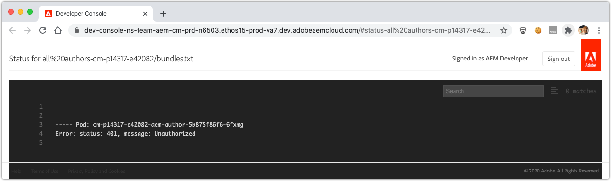
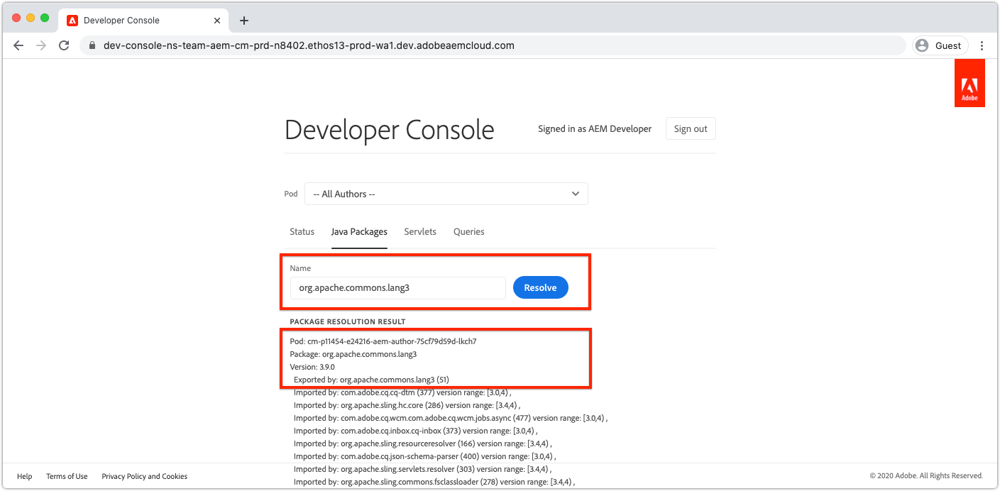
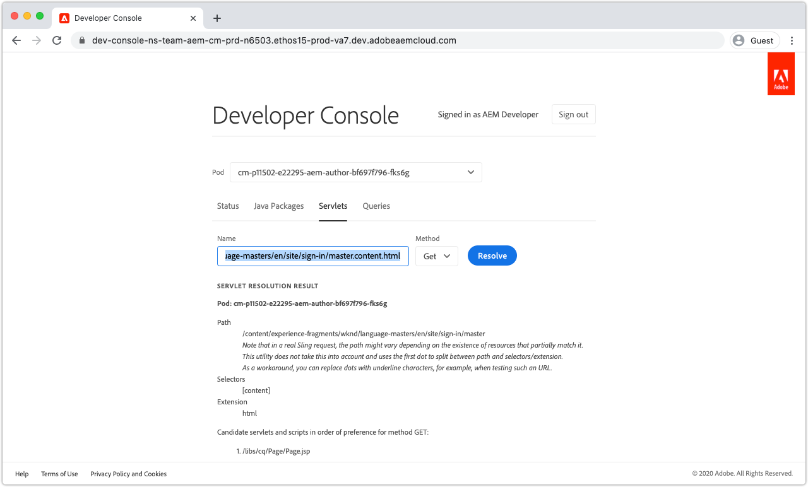
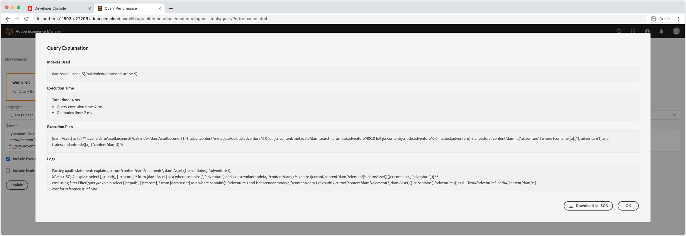

# Debugging AEM as a Cloud Service with the Developer Console

AEM as a Cloud Service provides a Developer Console for each environment that exposes various details of the running AEM service that are helpful in debugging.

Each AEM as a Cloud Service environment has it's own Developer Console.

## Developer Console access

To access and use the Developer Console the following permissions must be given to the developer's Adobe ID via [Adobe's Admin Console](https://adminconsole.adobe.com).

1. Ensure the Adobe Org that has effected Cloud Manger and AEM as a Cloud Service products is active in the Adobe Org switcher.
1. The developer must be a member of the Cloud Manager Product's __Developer - Cloud Service__ Product Profile.
    + If this membership does not exist, the developer will not be able to log in to Developer Console.
1. The developer must be a member of the __AEM Users__ or __AEM Administrators__ Product Profile on AEM Author and/or Publish. 
    + If this membership does not exist, the [status](#status) dumps will timeout with a 401 Unauthorized error.

### Troubleshooting Developer Console access

#### 401 Unauthorized error when dumping status

If dumping any status a 401 Unauthorized error is reported, it means your user does not yet exist with the necessary permissions in AEM as a Cloud Service or the login tokens use are invalid or have expired.

To resolve the 401 Unauthorized issue:

1. Ensure your user is a member of the appropriate Adobe IMS Product Profile (AEM Administrators or AEM Users) for the Developer Console's associated AEM as a Cloud Service Product instance. 
    + Remember that Developer Console access 2 Adobe IMS Product Instances; the AEM as a Cloud Service Author and Publish product instances, so ensure the correct Product Profiles are used depending on which service tier requires access via Developer Console.
1. Log in to the AEM as a Cloud Service (Author or Publish) and ensure your user and groups have properly synced into AEM. 
    + Developer Console requires your user record to be created in the corresponding AEM service tier for it to authenticate to that service tier.
1. Clear your browsers cookies as well as application state (local storage) and re-log into Developer Console, ensuring the access token Developer Console is using is correct and unexpired.

## Pod
 
AEM as a Cloud Service Author and Publish services are comprised of multiple instances respectively in order to handle traffic variability and rolling updates without downtime. These instances are referred to as Pods. Pod selection in Developer Console defines the scope of data that will exposed via the other controls.

+ A pod is a discrete instance that is part of an AEM Service (Author or Publish)
+ Pods are transient, meaning AEM as a Cloud Service creates and destroys them as need
+ Only pods that are part of the associated AEM as a Cloud Service environment, are listed that environment's Developer Console's Pod switcher.
+ At the bottom of the Pod switcher, convenience options allow for selecting Pods by service type:
    + All Authors
    + All Publishers
    + All Instances

## Status

Status provides options for outputting specific AEM runtime state in text or JSON output. The Developer Console provides similar information as the AEM SDK's local quickstart's OSGi Web console, with the marked difference that Developer Console is read-only.

### Bundles

Bundles lists all OSGi bundles in AEM. This functionality is similar to [AEM SDK's local quickstart's OSGi Bundles](http://localhost:4502/system/console/bundles) at `/system/console/bundles`.

Bundles help in debugging by:

+ Listing all OSGi bundles deployed to AEM as a Service
+ Listing each OSGi bundle's state; including if they are active or not
+ Providing details into unresolved dependencies that cause OSGi bundles from becoming active

### Components

Components lists all the OSGi components in AEM. This functionality is similar to [AEM SDK's local quickstart's OSGi Components](http://localhost:4502/system/console/components) at `/system/console/components`.

Components help in debugging by:

+ Listing all OSGi components deployed to AEM as a Cloud Service
+ Providing each OSGi component's state; including if they are active or unsatisfied
+ Providing details into unsatisfied service references may cause OSGi components from becoming active
+ Listing OSGi properties and their values bound to the OSGi component

### Configurations

Configurations lists all the OSGi component's configurations (OSGi properties and values). This functionality is similar to [AEM SDK's local quickstart's OSGi Configuration Manager](http://localhost:4502/system/console/configMgr) at `/system/console/configMgr`.

Configurations help in debugging by:

+ Listing OSGi properties and their values by OSGi component
+ Locating and identifying misconfigured properties 

### Oak Indexes

Oak Indexes provide a dump of the nodes defined beneath `/oak:index`. Keep in mind this does not show merged indexes, which occurs when an AEM index is modified.

Oak Indexes help in debugging by:

+ Listing all Oak Index definitions providing insights into how search queries are executed in AEM. Keep in mind, that modified to AEM indexes are not reflected here. This view is only helpful for indexes that are solely provided by AEM, or solely provided by the custom code.

### OSGi Services

Components lists all the OSGi services. This functionality is similar to [AEM SDK's local quickstart's OSGi Services](http://localhost:4502/system/console/services) at `/system/console/services`.

OSGi Services help in debugging by:

+ Listing all OSGi services in AEM, along with its providing OSGi bundle, and all OSGi bundles that consume it

### Sling Jobs

Sling Jobs lists all the Sling Jobs queues. This functionality is similar to [AEM SDK's local quickstart's Jobs](http://localhost:4502/system/console/slingevent) at `/system/console/slingevent`.

Sling Jobs help in debugging by:

+ Listing of Sling Job queues and their configurations
+ Providing insights into the number of active, queued and processed Sling jobs, which is helpful for debugging issues with Workflow, Transient Workflow and other work performed by Sling Jobs in AEM.

## Java Packages

Java Packages allows checking if a Java package, and version, are available for use in AEM as a Cloud Service. This functionality is the same as [AEM SDK's local quickstart's Dependency Finder](http://localhost:4502/system/console/depfinder) at `/system/console/depfinder`.

Java Packages is used to trouble shoot Bundles not be starting because of unresolved imports, or unresolved classes in scripts (HTL, JSP, etc). If Java Packages reports no bundles export a Java package (or the version does not match that imported by an OSGi bundle):

+ Ensure your project's AEM API maven dependency's version matches the environment's AEM Release version (and if possible, update everything to the latest).
+ If extra Maven dependencies are used in the Maven project
    + Determine if an alternative API provided by the AEM SDK API dependency can be used instead.
    + If the extra dependency is required, ensure it's provide as an OSGi bundle (rather than a plain Jar) and it is embedded in your project's code package, (`ui.apps`), similar to how the core OSGi Bundle is embedded in the `ui.apps` package.

## Servlets

Servlets is used to provide insight as to how AEM resolves a URL to a Java servlet or script (HTL, JSP) that ultimately handles the request. This functionality is the same as [AEM SDK's local quickstart's Sling Servlet Resolver](http://localhost:4502/system/console/servletresolver) at `/system/console/servletresolver`.

Servlets helps in debugging determining: 

+ How a URL is decomposed into its addressable parts (resource, selector, extension).
+ What servlet or script a URL resolves to, helping identify mal-formed URLs or mis-registered servlets/scripts.

## Queries

Queries help provide insights into what and how search queries are executed on AEM. This functionality is the same as  [AEM SDK's local quickstart's Tools > Query Performance ](http://localhost:4502/libs/granite/operations/content/diagnosistools/queryPerformance.html) console. 

Queries only works when a specific pod is selected, as it opens that pod's Query Performance web console, requiring the developer to have access to log into the AEM service.

Queries helps in debugging by: 

+ Explaining how queries are interpreted, analyzed and executed by Oak. This is very important when tracking why a query is slow, and understanding how it can be sped up.
+ Listing the most popular queries running in AEM, with the ability to Explain them.
+ Listing the slowest queries running in AEM, with the ability to Explain them.
