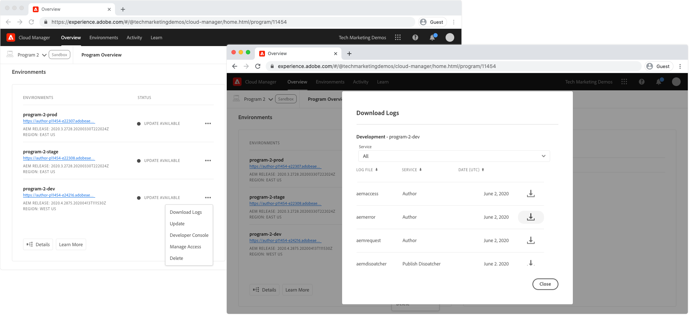

# Debugging AEM as a Cloud Service using logs

Logs act as the frontline for debugging AEM applications in AEM as a Cloud Service, but are dependent on adequate logging in the deployed AEM application. 

All log activity for a given environment's AEM service (Author, Publish/Publish Dispatcher) is consolidated into a single log file, even if different pods within that service generate the log statements.

Pod Ids are provided in each log statement, and allowing filtering or collating of log statements. Pod Id's are in the format of:

+ `cm-p<PROGRAM ID>-e<ENVIRONMENT ID>-aem-<author|publish>-<POD NAME>`
+ Example: `cm-p12345-e56789-aem-author-abcdefabde-98765`

## Custom log files

AEM as a Cloud Services does not support custom log files, however it does support custom logging.

For Java logs to be available in AEM as a Cloud Service (via [Cloud Manager](#cloud-manager) or [Adobe I/O CLI](#aio)), custom log statements must be written the `error.log`. Logs written to custom named logs, such as `example.log`, will not be accessible from AEM as a Cloud Service.

## AEM Author and Publish service logs

Both AEM Author and Publish services provide AEM runtime server logs:

+ `aemerror` is the Java error log (found at `/crx-quickstart/error.log` on the AEM SDK local quickstart). The following are the [recommended log levels](#log-levels) for custom loggers per environment type:
   + Development: `DEBUG`
   + Stage: `WARN`
   + Production: `ERROR`
+ `aemaccess` lists HTTP requests to the AEM service with details
+ `aemrequest` lists HTTP requests made to AEM service and their corresponding HTTP response

## AEM Publish Dispatcher logs

Only AEM Publish Dispatcher provides Apache web server and Dispatcher logs, as these aspects only exists in the AEM Publish tier, and not on the AEM Author tier.

+ `httpdaccess` lists HTTP requests made to the AEM service's Apache web server/Dispatcher.
+ `httperror`  lists log messages from the Apache web server, and help with debugging supported Apache modules such as `mod_rewrite`.
  + Development: `DEBUG`
  + Stage: `WARN`
  + Production: `ERROR`
+ `aemdispatcher` lists log messages from the Dispatcher modules, including filtering and serving from cache messages.
  + Development: `DEBUG`
  + Stage: `WARN`
  + Production: `ERROR`
        
## Cloud Manager{#cloud-manager}

Adobe Cloud Manager allows for the download of logs, by day, via an environment's Download Logs action.



These logs can be downloaded and inspected via any log analysis tools. 

## Adobe I/O CLI with Cloud Manager plugin{#aio}

Adobe Cloud Manager supports accessing AEM as a Cloud Service logs via the [Adobe I/O CLI](https://github.com/adobe/aio-cli) with the [Cloud Manager plugin for the Adobe I/O CLI](https://github.com/adobe/aio-cli-plugin-cloudmanager).

First, [set up the Adobe I/O with Cloud Manager plugin](../../local-development-environment/development-tools.md#aio-cli).

Ensure the relevant Program Id and Environment Id have been identified, and use [list-available-log-options](https://github.com/adobe/aio-cli-plugin-cloudmanager#aio-cloudmanagerlist-available-log-options-environmentid) to list the log options that are used to [tail](#aio-cli-tail-logs) or [download](#aio-cli-download-logs) logs.

```
$ aio cloudmanager:list-programs
Program Id Name      Enabled 
14304      Program 1 true    
11454      Program 2 true 
11502      Program 3 true    

$ aio config:set cloudmanager_programid <PROGRAM ID>

$ aio cloudmanager:list-environments        
Environment Id Name            Type  Description 
22295          program-3-dev   dev               
22310          program-3-prod  prod              
22294          program-3-stage stage   

$ aio cloudmanager:list-available-log-options <ENVIRONMENT ID>
Environment Id Service    Name          
22295          author     aemaccess     
22295          author     aemerror      
22295          author     aemrequest    
22295          publish    aemaccess     
22295          publish    aemerror      
22295          publish    aemrequest    
22295          dispatcher httpdaccess   
22295          dispatcher httpderror    
22295          dispatcher aemdispatcher 
```

### Tailing logs{#aio-cli-tail-logs}

Adobe I/O CLI provides the ability to tail logs in real-time from AEM as a Cloud Service using the [tail-logs](https://github.com/adobe/aio-cli-plugin-cloudmanager#aio-cloudmanagertail-log-environmentid-service-name) command. Tailing is useful to watching real-time log activity as actions are performed on the AEM as a Cloud Service environment.

```
$ aio config:set cloudmanager_programid <PROGRAM ID>
$ aio cloudmanager:tail-logs <ENVIRONMENT ID> <SERVICE> <NAME>
```

Other command line tools, such as `grep` can be used in concert with `tail-logs` to help isolate log statements of interest, for example:

```
$ aio cloudmanager:tail-logs 12345 author | grep com.example.MySlingModel
```

... only displays log statements generated from `com.example.MySlingModel` or contain that string in them. 

### Downloading logs{#aio-cli-download-logs}

Adobe I/O CLI provides the ability to download logs from AEM as a Cloud Service using the [download-logs](https://github.com/adobe/aio-cli-plugin-cloudmanager#aio-cloudmanagerdownload-logs-environmentid-service-name-days)) command. This provides the same end result as downloading the logs from the Cloud Manager web UI, with the difference being the `download-logs` command consolidates logs across days, based on the how many days of logs are requested.

```
$ aio config:set cloudmanager_programid <PROGRAM ID>
$ aio cloudmanager:download-logs <ENVIRONMENT> <SERVICE> <NAME> <DAYS>
```

## Understanding logs

Logs in AEM as a Cloud Service have multiple pods writing log statements into them. Because multiple AEM instances write to the same log file, it is important to understand how to analyze, and reduce noise while debugging. To explain, the following `aemerror` log snippet will be used:

```
01.01.2020 12:00:00.000 [cm-p12345-e56789-aem-author-abcdefg-1111] *DEBUG* [qtp2078364989-269] com.example.components.impl.ExampleModelImpl Preparing to collect resources
01.01.2020 12:00:01.002 [cm-p12345-e56789-aem-author-abcdefg-2222] *WARN*  [qtp40782847611-87] com.example.services.impl.ExampleServiceImpl Unable to resolve resource [ /content/example ] to a resource. Aborting.
01.01.2020 12:00:02.003 [cm-p12345-e56789-aem-author-abcdefg-1111] *ERROR* [qtp2078364989-269] com.example.components.impl.ExampleModelImpl Unable to collect any resources
```

Using the Pod Ids, the data point after the date and time, the logs can be collated by Pod, or AEM instance within the service, making it easier to trace and understand code execution.

__Pod cm-p12345-e56789-aem-author-abcdefg-1111__

```
01.01.2020 12:00:00.000 [cm-p12345-e56789-aem-author-abcdefg-1111] *DEBUG* [qtp2078364989-269] com.example.components.impl.ExampleModelImpl Preparing to collect resources
01.01.2020 12:00:02.003 [cm-p12345-e56789-aem-author-abcdefg-1111] *ERROR* [qtp2078364989-269] com.example.components.impl.ExampleModelImpl Unable to collect any resources
```

__Pod cm-p12345-e56789-aem-author-abcdefg-2222__

```
01.01.2020 12:00:01.002 [cm-p12345-e56789-aem-author-abcdefg-2222] *WARN*  [qtp2078364989-269] com.example.services.impl.ExampleServiceImpl Unable to resolve resource [ /content/example ] to a resource. Aborting.
```

## Recommended log levels{#log-levels}

Adobe's general guidance on log levels per AEM as a Cloud Service environment are:

+ Local Development (AEM SDK): `DEBUG`
+ Development: `DEBUG`
+ Stage: `WARN` 
+ Production: `ERROR`

Setting the most appropriate log level for each environment type is with AEM as a Cloud Service, log levels are maintained in code

+ Java log configurations is maintained in OSGi configurations
+ Apache web server and Dispatcher log levels in the the dispatcher project

...and thus, require a deployment to change.

### Environment specific variables to set Java log levels

An alternative to setting static well-known Java log levels for each environment is to use AEM as Cloud Service's [environment specific variables](https://docs.adobe.com/content/help/en/experience-manager-cloud-service/implementing/deploying/configuring-osgi.html#environment-specific-configuration-values) to parameterize log levels, allowing the values to be changed dynamically via the [Adobe I/O CLI with Cloud Manager plugin](#aio-cli).

This requires updating the logging OSGi configurations to use the environment specific variable placeholders. [Default values](https://docs.adobe.com/content/help/en/experience-manager-cloud-service/implementing/deploying/configuring-osgi.html#default-values) for log levels should be set as per [Adobe recommendations](#log-levels). For example:

`/apps/example/config/org.apache.sling.commons.log.LogManager.factory.config-example.cfg.json`

```
{
    "org.apache.sling.commons.log.names": ["com.example"],
    "org.apache.sling.commons.log.level": "$[env:LOG_LEVEL;default=DEBUG]"
}
```

This approach has downsides that must be taken into account:

+ [A limited number of environment variables are allowed](https://docs.adobe.com/content/help/en/experience-manager-cloud-service/implementing/deploying/configuring-osgi.html#number-of-variables), and creating a variable to manage the log level will use one.
+ Environment variables can only be managed programmatically via [Adobe I/O CLI](https://github.com/adobe/aio-cli-plugin-cloudmanager#aio-cloudmanagerset-environment-variables-environmentid) or [Cloud Manager HTTP APIs](https://docs.adobe.com/content/help/en/experience-manager-cloud-service/implementing/deploying/configuring-osgi.html#cloud-manager-api-format-for-setting-properties).
+ Changes to environment variables must be manually reset by a supported tool. Forgetting to reset a high traffic environment, such as Production, to a less verbose log level may flood the logs and impact AEM's performance.

_Environment specific variables do not work for Apache web server or Dispatcher log configurations as these are not configured via OSGi configuration._