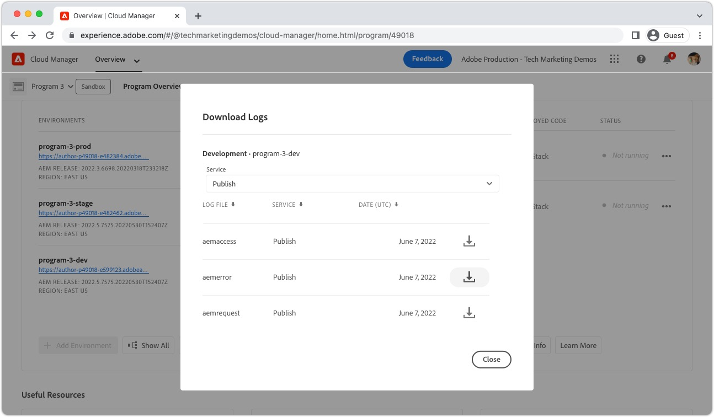
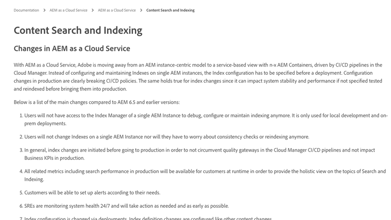

# Traversal warnings

>[!TIP]
>Bookmark this page for future reference.

_What are traversal warnings?_

Traversal warnings are __aemerror__ log statements indicating poorly performing queries are being executed on the AEM Publish service. Traversal warnings typically manifest in AEM in two ways:

1. __Slow queries__ that do not use indexes, resulting in slow response times.
1. __Failing queries__, that throw a `RuntimeNodeTraversalException`, resulting in a broken experience.

Allowing traversal warnings to go unchecked slows down AEM performance, and can result in broken experiences for your users.

## How to resolve traversal warnings

Mitigating traversal warnings can be approached using three simple steps: analyze, adjust, and verify. Expect several iterations of adjust and verify before identifying the optimal adjustments.

<div class="columns is-multiline">

<!-- Analyze -->
<div class="column is-half-tablet is-half-desktop is-one-third-widescreen" aria-label="Analyze" tabindex="0">
   <div class="x-card">
       <div class="card-image">
           <figure class="image is-16by9">
               <a href="#analyze" title="Analyze" tabindex="-1">
                   
               </a>
           </figure>
       </div>
       <div class="card-content is-padded-small">
           <div class="content">
                <p class="headline is-size-5 has-text-weight-bold">Analyze the problem</p>
               <p class="is-size-6">Identify and understand what queries are traversing.</p>
               <a href="#analyze" class="spectrum-Button spectrum-Button--outline spectrum-Button--primary spectrum-Button--sizeM">
                   <span class="spectrum-Button-label has-no-wrap has-text-weight-bold">Analyze</span>
               </a>
           </div>
       </div>
   </div>
</div>

<!-- Adjust -->
<div class="column is-half-tablet is-half-desktop is-one-third-widescreen" aria-label="Adjust" tabindex="0">
   <div class="x-card">
       <div class="card-image">
           <figure class="image is-16by9">
               <a href="#adjust" title="Adjust" tabindex="-1">
                   
               </a>
           </figure>
       </div>
       <div class="card-content is-padded-small">
           <div class="content">
                <p class="headline is-size-5 has-text-weight-bold">Adjust the code or configuration</p>
               <p class="is-size-6">Update queries and indexes to avoid query traversals.</p>
               <a href="#adjust" class="spectrum-Button spectrum-Button--outline spectrum-Button--primary spectrum-Button--sizeM">
                   <span class="spectrum-Button-label has-no-wrap has-text-weight-bold">Adjust</span>
               </a>
           </div>
       </div>
   </div>
</div>

<!-- Verify -->
<div class="column is-half-tablet is-half-desktop is-one-third-widescreen" aria-label="Verify" tabindex="0">
   <div class="x-card">
       <div class="card-image">
           <figure class="image is-16by9">
               <a href="#verify" title="Verify" tabindex="-1">
                   
               </a>
           </figure>
       </div>
       <div class="card-content is-padded-small">
           <div class="content">
                <p class="headline is-size-5 has-text-weight-bold">Verify the adjustments worked</p>                       
               <p class="is-size-6">Verify changes to queries and indexes remove traversals.</p>
               <a href="#verify" class="spectrum-Button spectrum-Button--outline spectrum-Button--primary spectrum-Button--sizeM">
                   <span class="spectrum-Button-label has-no-wrap has-text-weight-bold">Verify</span>
               </a>
           </div>
       </div>
   </div>
</div>

</div>

## 1. Analyze{#analyze}

First, identify which AEM Publish services are exhibiting traversal warnings. To do this, from Cloud Manager, [download Publish services' `aemerror` logs](https://experienceleague.adobe.com/docs/experience-manager-learn/cloud-service/debugging/debugging-aem-as-a-cloud-service/logs.html#cloud-manager){target="_blank"} from all environments (Dev, Stage and Production) for the past __three days__.



Open the log files, and search for the Java™ class `org.apache.jackrabbit.oak.plugins.index.Cursors$TraversingCursor`. The log containing traversal warnings contain a series of statements that look similar to:

```log
24.05.2022 14:18:46.146 [cm-p123-e456-aem-author-9876-edcba] *WARN* [192.150.10.214 [1653401908419] GET /content/wknd/us/en/example.html HTTP/1.1] 
org.apache.jackrabbit.oak.plugins.index.Cursors$TraversingCursor Traversed 5000 nodes with filter 
Filter(query=select [jcr:path], [jcr:score], * from [nt:base] as a where [xyz] = 'abc' and isdescendantnode(a, '/content') 
/* xpath: /jcr:root/content//element(*, nt:base)[(@xyz = 'abc')] */, path=/content//*, property=[xyz=[abc]]) 
called by apps.wknd.components.search.example__002e__jsp._jspService; 
consider creating an index or changing the query
```

Depending on the context of the query's execution, the log statements may contain helpful information about the originator of the query:

+ HTTP Request URL associated with query execution
    
  + Example: `GET /content/wknd/us/en/example.html HTTP/1.1`

+ Oak query syntax
    
  +  Example: `select [jcr:path], [jcr:score], * from [nt:base] as a where [xyz] = 'abc' and isdescendantnode(a, '/content')`

+ XPath query
    
  + Example: `/jcr:root/content//element(*, nt:base)[(@xyz = 'abc')] */, path=/content//*, property=[xyz=[abc]])`

+ Code executing the query
    
  + Example:  `apps.wknd.components.search.example__002e__jsp._jspService` &#8594; `/apps/wknd/components/search/example.html`

__Failing queries__ are followed up by a `RuntimeNodeTraversalException` statement, similar to:

```log
24.05.2022 14:18:47.240 [cm-p123-e456-aem-author-9876-edcba] *WARN* [192.150.10.214 [1653401908419] GET /content/wknd/us/en/example.html HTTP/1.1] 
org.apache.jackrabbit.oak.query.FilterIterators The query read or traversed more than 100000 nodes.
org.apache.jackrabbit.oak.query.RuntimeNodeTraversalException: 
    The query read or traversed more than 100000 nodes. To avoid affecting other tasks, processing was stopped.
    ...
```    

## 2. Adjust{#adjust}

Once the offending queries and their invoking code is discovered, adjustments must be made. Two types of adjustments can be made to mitigate traversal warnings:

### Adjust the query

__Change the query__ to add new query restrictions that resolve to existing index restrictions. When possible, prefer changing the query to changing indexes.

+ [Learn how to tune query performance](https://experienceleague.adobe.com/docs/experience-manager-65/developing/bestpractices/troubleshooting-slow-queries.html#query-performance-tuning){target="_blank"}

### Adjust the index

__Change (or create) an AEM index__ such that existing query restrictions are resolvable to the index updates. 

+ [Learn how to tune existing indexes](https://experienceleague.adobe.com/docs/experience-manager-65/developing/bestpractices/troubleshooting-slow-queries.html#query-performance-tuning){target="_blank"}
+ [Learn how to create indexes](https://experienceleague.adobe.com/docs/experience-manager-65/developing/bestpractices/troubleshooting-slow-queries.html#create-a-new-index){target="_blank"}

## 3. Verify{#verify}

Adjustments made to either the queries, indexes, or both - must be verified to ensure they mitigate the traversal warnings.


If only [adjustments to the query](#adjust-the-query) are made, the query can be directly tested on AEM as a Cloud Service via Developer Console's [Explain Query](https://experienceleague.adobe.com/docs/experience-manager-learn/cloud-service/debugging/debugging-aem-as-a-cloud-service/developer-console.html#queries){target="_blank"}. Explain Query runs against the AEM Author service, however since index definitions are the same across the Author and Publish services, validating queries against the AEM Author service is sufficient.

If [adjustments to the index](#adjust-the-index) are made, the index must be deployed to AEM as a Cloud Service. With the index adjustments deployed, Developer Console's [Explain Query](https://experienceleague.adobe.com/docs/experience-manager-learn/cloud-service/debugging/debugging-aem-as-a-cloud-service/developer-console.html#queries){target="_blank"} can be used to executed and tune the query further.

Ultimately, all changes (query and code) are committed to Git and deployed to AEM as a Cloud Service using Cloud Manager. Once deployed, test the code paths associated with the original traversal warnings are retested, and verify that traversal warnings no longer appear in the `aemerror` log.

## Other resources

Check out these other useful resources for understanding AEM indexes, search, and traversal warnings.

<div class="columns is-multiline">

<!-- Cloud 5 - Search &amp; Indexing -->
<div class="column is-half-tablet is-half-desktop is-one-third-widescreen" aria-label="Cloud 5 - Search &amp; Indexing" tabindex="0">
   <div class="card">
       <div class="card-image">
           <figure class="image is-16by9">
               <a href="https://experienceleague.adobe.com/docs/experience-manager-learn/cloud-service/cloud-5/cloud5-aem-search-and-indexing.html" title="Cloud 5 - Search &amp; Indexing" tabindex="-1"></a>
           </figure>
       </div>
       <div class="card-content is-padded-small">
           <div class="content">
               <p class="headline is-size-6 has-text-weight-bold"><a href="https://experienceleague.adobe.com/docs/experience-manager-learn/cloud-service/cloud-5/cloud5-aem-search-and-indexing.html" title="Cloud 5 - Search &amp; Indexing">Cloud 5 - Search &amp; Indexing</a></p>
               <p class="is-size-6">The Cloud 5 team shows explores the ins and outs of the search and indexing on AEM as a Cloud Service.</p>
               <a href="https://experienceleague.adobe.com/docs/experience-manager-learn/cloud-service/cloud-5/cloud5-aem-search-and-indexing.html" class="spectrum-Button spectrum-Button--outline spectrum-Button--primary spectrum-Button--sizeM">
                   <span class="spectrum-Button-label has-no-wrap has-text-weight-bold">Learn more</span>
               </a>
           </div>
       </div>
   </div>
</div>

<!-- Content Search and Indexing -->
<div class="column is-half-tablet is-half-desktop is-one-third-widescreen" aria-label="Content Search and Indexing
" tabindex="0">
   <div class="card">
       <div class="card-image">
           <figure class="image is-16by9">
               <a href="https://experienceleague.adobe.com/docs/experience-manager-cloud-service/content/operations/indexing.html" title="Content Search and Indexing" tabindex="-1">
                   
               </a>
           </figure>
       </div>
       <div class="card-content is-padded-small">
           <div class="content">
               <p class="headline is-size-6 has-text-weight-bold"><a href="https://experienceleague.adobe.com/docs/experience-manager-cloud-service/content/operations/indexing.html" title="Content Search and Indexing">Content Search and indexing documentation</a></p>
               <p class="is-size-6">Learn how to create and manage indexes in AEM as a Cloud Service.</p>
               <a href="https://experienceleague.adobe.com/docs/experience-manager-cloud-service/content/operations/indexing.html" class="spectrum-Button spectrum-Button--outline spectrum-Button--primary spectrum-Button--sizeM">
                   <span class="spectrum-Button-label has-no-wrap has-text-weight-bold">Learn more</span>
               </a>
           </div>
       </div>
   </div>
</div>

<!-- Modernizing your Oak indexes -->
<div class="column is-half-tablet is-half-desktop is-one-third-widescreen" aria-label="Modernizing your Oak indexes" tabindex="0">
   <div class="card">
       <div class="card-image">
           <figure class="image is-16by9">
               <a href="https://experienceleague.adobe.com/docs/experience-manager-learn/cloud-service/migration/moving-to-aem-as-a-cloud-service/search-and-indexing.html" title="Modernizing your Oak indexes" tabindex="-1">
                   
               </a>
           </figure>
       </div>
       <div class="card-content is-padded-small">
           <div class="content">
               <p class="headline is-size-6 has-text-weight-bold"><a href="https://experienceleague.adobe.com/docs/experience-manager-learn/cloud-service/migration/moving-to-aem-as-a-cloud-service/search-and-indexing.html" title="Modernizing your Oak indexes">Modernizing your Oak indexes</a></p>
               <p class="is-size-6">Learn how to convert AEM 6 Oak index definitions to be AEM as a Cloud Service compatible, and maintain indexes going forward.</p>
               <a href="https://experienceleague.adobe.com/docs/experience-manager-learn/cloud-service/migration/moving-to-aem-as-a-cloud-service/search-and-indexing.html" class="spectrum-Button spectrum-Button--outline spectrum-Button--primary spectrum-Button--sizeM">
                   <span class="spectrum-Button-label has-no-wrap has-text-weight-bold">Learn more</span>
               </a>
           </div>
       </div>
   </div>
</div>

<!-- Index definition documentation -->
<div class="column is-half-tablet is-half-desktop is-one-third-widescreen" aria-label="Index definition documentation" tabindex="0">
   <div class="card">
       <div class="card-image">
           <figure class="image is-16by9">
               <a href="https://jackrabbit.apache.org/oak/docs/query/lucene.html" title="Index definition documentation" tabindex="-1">
                   
               </a>
           </figure>
       </div>
       <div class="card-content is-padded-small">
           <div class="content">
               <p class="headline is-size-6 has-text-weight-bold"><a href="https://jackrabbit.apache.org/oak/docs/query/lucene.html" title="Index definition documentation">Lucene index documentation</a></p>
               <p class="has-ellipsis is-size-6">The Apache Oak Jackrabbit Lucene index reference that documents all supported Lucene index configurations.</p>
               <a href="https://jackrabbit.apache.org/oak/docs/query/lucene.html" class="spectrum-Button spectrum-Button--outline spectrum-Button--primary spectrum-Button--sizeM">
                   <span class="spectrum-Button-label has-no-wrap has-text-weight-bold">Learn more</span>
               </a>
           </div>
       </div>
   </div>
</div>

</div>
