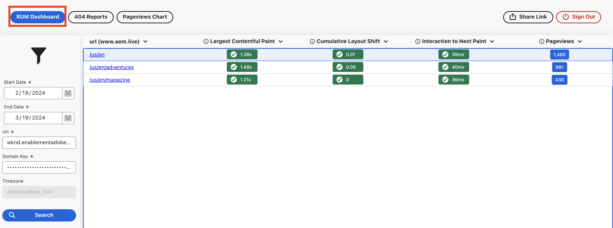

# Real User Monitoring (RUM)

Learn about Real User Monitoring (RUM) in AEM as a Cloud Service website. Understand how to enable RUM, what data is collected and how to use RUM data to optimize the user experience on your website.

## Overview

Real User Monitoring (RUM) is a method used to _collect, measure, and analyze user interactions and experiences_ with a website in real time. It provides insights into how site visitors are interacting with your website, including their behavior, performance, and overall experience. This is achieved by injecting a small piece of JavaScript code into the site's pages.

Using JavaScript code, RUM captures data directly from the user's browser as they interact with your website. This data can be used to identify and diagnose performance issues, optimize user experience, and improve business outcomes.

The RUM feature in AEM as a Cloud Service provides a comprehensive view of the user experience of your website. It captures following key metrics for each page (URL) visited by the user:

- [Largest Contentful Paint (LCP)](https://web.dev/articles/lcp) -  measures loading performance.
- [Cumulative Layout Shift (CLS)](https://web.dev/articles/cls) - measures visual stability.
- [Interaction to Next Paint (INP)](https://web.dev/articles/inp) - measures interactivity.
- Pageviews - measures the number of times a page is viewed.

Also it captures the 404 errors and pageview charts for the website.

The LCP, CLS, and INP metrics are part of the [Core Web Vitals](https://web.dev/articles/vitals) which are a set of metrics related to speed, responsiveness, and visual stability of a website. These metrics are used by Google to measure the user experience on a website and are important for search engine ranking.

## Enable RUM

To enable RUM for your AEMCS website, see [How to Set Up the Real User Monitoring Service](https://experienceleague.adobe.com/en/docs/experience-manager-cloud-service/content/implementing/using-cloud-manager/content-requests#how-to-set-up-the-rum-service).

The key details of RUM in AEMCS are:

- The RUM is only applicable to publish service of AEMCS, meaning JavaScript code is injected only on the publish environment.
- The `com.adobe.granite.webvitals.WebVitalsConfig` OSGi configuration control the include and exclude paths, these are repository paths and not URL paths.
- By default `/content` path is included.
- To exclude paths, add the `AEM_WEBVITALS_EXCLUDE` Cloud Manager environment variable, see [Adding Environment Variables](https://experienceleague.adobe.com/en/docs/experience-manager-cloud-service/content/implementing/using-cloud-manager/environment-variables#add-variables). The paths are separated by a comma.
- OOTB code is responsible for injecting the JavaScript code into the pages.

### Verification

To verify if RUM is enabled for your website, view the published page's  HTML source and search for the following script blocks:

```html
...

<!-- Added before the closing </head> tag -->
<script type="module">
    window.RUM_BASE = 'https://rum.hlx.page/';
    import { sampleRUM } from 'https://rum.hlx.page/.rum/@adobe/helix-rum-js@^1/src/index.js';
    sampleRUM('top');
    window.addEventListener('load', () => sampleRUM('load'));
    document.addEventListener('click', () => sampleRUM('click'));
</script>

...

<!-- Added before the closing </body> tag -->
<script type="module">
    window.RUM_BASE = 'https://rum.hlx.page/';
    import { sampleRUM } from 'https://rum.hlx.page/.rum/@adobe/helix-rum-js@^1/src/index.js';
    sampleRUM('lazy');
    sampleRUM('cwv');
</script>
```

## RUM data collection

- The RUM data is collected using `sampleRUM()` function by passing the checkpoint name. In the above example, the checkpoints are `top`, `load`, `click`, `lazy`, and `cwv`.
- A checkpoint is a named event in the sequence of loading the page and interacting with it. 

Also see [Real User Monitoring Service and Privacy](https://experienceleague.adobe.com/en/docs/experience-manager-cloud-service/content/implementing/using-cloud-manager/content-requests#rum-service-and-privacy) and [What Data is Being Collected](https://experienceleague.adobe.com/en/docs/experience-manager-cloud-service/content/implementing/using-cloud-manager/content-requests#what-data-is-being-collected) for more details.

## RUM data view

To view the RUM data you need `domainkey`, Adobe provides it as part of the RUM setup. The RUM dashboard is available at [https://data.aem.live/](https://data.aem.live/) and you can access it using the domain key and url. 

For example, below screenshot shows the RUM dashboard for the AEM WKND website.



The RUM dashboard provides the following key insights:

- **Performance Metrics** - LCP, CLS, INP, and Pageviews.
- **Error Metrics** - 404 errors.
- **Pageview Charts** - Number of pageviews over time.

## How to use RUM data

Using above insights, you can optimize the user experience on your website. For example:

- Reduce LCP, CLS, and INP to improve the page loading performance and interactivity. See [How to improve LCP](https://web.dev/articles/lcp#improve-lcp), [How to improve CLS](https://web.dev/articles/cls#improve-cls) and [How to improve INP](https://web.dev/articles/inp#improve-inp)for more details.
- To improve the user experience, fix the 404 errors.
- To understand the user behavior and optimize the content, analyze the pageview charts.

Adobe recommends regular review of the RUM dashboard and specially after major or minor release.

Also see [Who Can Benefit from Real User Monitoring Service](https://experienceleague.adobe.com/en/docs/experience-manager-cloud-service/content/implementing/using-cloud-manager/content-requests#who-can-benefit-from-rum-service) for more details.
