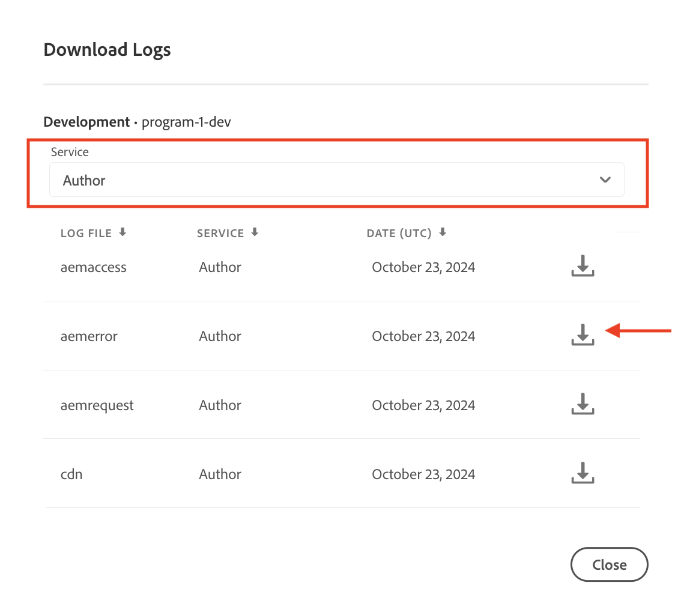

# How to run a job on leader instance in AEM as a Cloud Service

Learn how to run a job on the leader instance in the AEM Author service as part of AEM as a Cloud Service, and understand how to configure it to run only once.

Sling Jobs are asynchronous tasks that operate in the background, designed to handle system or user-triggered events. By default, these jobs are distributed equally across all instances (pods) in the cluster.

For more information, see [Apache Sling Eventing and Job Handling](https://sling.apache.org/documentation/bundles/apache-sling-eventing-and-job-handling.html).

## Create and process jobs

For demo purposes, let's create a simple _job that instructs the job processor to log a message_.

### Create a job

Use the below code to _create_ an Apache Sling job:

```java
package com.adobe.aem.guides.wknd.core.sling.jobs.impl;

import java.util.HashMap;
import java.util.Map;

import org.apache.sling.event.jobs.JobManager;
import org.osgi.service.component.annotations.Activate;
import org.osgi.service.component.annotations.Component;
import org.osgi.service.component.annotations.Reference;
import org.slf4j.Logger;
import org.slf4j.LoggerFactory;

@Component(immediate = true)
public class SimpleJobCreaterImpl {

    private static final Logger log = LoggerFactory.getLogger(SimpleJobCreaterImpl.class);

    // Define the topic on which the job will be created
    protected static final String TOPIC = "wknd/simple/job/topic";

    // Inject a JobManager
    @Reference
    private JobManager jobManager;

    @Activate
    protected final void activate() throws Exception {
        log.info("SimpleJobCreater activated successfully");
        createJob();
        log.info("SimpleJobCreater created a job");
    }

    private void createJob() {
        // Create a job and add it on the above defined topic
        Map<String, Object> jobProperties = new HashMap<>();
        jobProperties.put("action", "log");
        jobProperties.put("message", "Job metadata is: Created in activate method");
        jobManager.addJob(TOPIC, jobProperties);
    }
}
```

The key points to note in the above code are:

- The job payload has two properties: `action` and `message`.
- Using the [JobManager](https://javadoc.io/doc/com.adobe.aem/aem-sdk-api/latest/org/apache/sling/event/jobs/JobManager.html)'s `addJob(...)` method, the job is added to the topic `wknd/simple/job/topic`.

### Process a job

Use the below code to _process_ the above Apache Sling job:

```java
package com.adobe.aem.guides.wknd.core.sling.jobs.impl;

import org.apache.sling.event.jobs.Job;
import org.apache.sling.event.jobs.consumer.JobConsumer;
import org.osgi.service.component.annotations.Component;
import org.slf4j.Logger;
import org.slf4j.LoggerFactory;

@Component(service = JobConsumer.class, property = {
        JobConsumer.PROPERTY_TOPICS + "=" + SimpleJobCreaterImpl.TOPIC
}, immediate = true)
public class SimpleJobConsumerImpl implements JobConsumer {

    private static final Logger log = LoggerFactory.getLogger(SimpleJobConsumerImpl.class);

    @Override
    public JobResult process(Job job) {
        // Get the action and message properties
        String action = job.getProperty("action", String.class);
        String message = job.getProperty("message", String.class);

        // Log the message
        if ("log".equals(action)) {
            log.info("Processing WKND Job, and {}", message);
        }

        // Return a successful result
        return JobResult.OK;
    }

}
```

The key points to note in the above code are:

- The `SimpleJobConsumerImpl` class implements the `JobConsumer` interface. 
- It is a service registered to consume jobs from the topic `wknd/simple/job/topic`.
- The `process(...)` method processes the job by logging the job payload's `message` property.

### Default job processing

When you deploy the above code to an AEM as a Cloud Service environment and run it on the AEM Author service, which operates as a cluster with multiple AEM Author JVMs, the job will run once on each AEM Author instance (pod), meaning the number of jobs created will match the number of pods. The number of pods will always be more than one (for non-RDE environments), but will fluctuate based on AEM as a Cloud Service' internal resource management.

The job is run on each AEM Author instance (pod) because the `wknd/simple/job/topic` is associated with AEM's main queue, which distributes jobs across all available instances. 

This is often problematic if the job is responsible for changing state, such as creating or updating resources or external services.

If you want the job to run only once on the AEM Author service, add the [job queue configuration](#how-to-run-a-job-on-the-leader-instance) described below.

You can verify it by reviewing the logs of the AEM Author service in [Cloud Manager](https://experienceleague.adobe.com/en/docs/experience-manager-learn/cloud-service/debugging/debugging-aem-as-a-cloud-service/logs#cloud-manager).




You should see:

```
<DD.MM.YYYY HH:mm:ss.SSS> [cm-pxxxx-exxxx-aem-author-68775db964-nxxcx] *INFO* [sling-oak-observation-15] org.apache.sling.event.impl.jobs.queues.JobQueueImpl.<main queue> Starting job queue <main queue>
<DD.MM.YYYY HH:mm:ss.SSS> INFO [com.adobe.aem.guides.wknd.core.sling.jobs.impl.SimpleJobConsumerImpl] Processing WKND Job, and Job metadata is: Created in activate method

<DD.MM.YYYY HH:mm:ss.SSS> [cm-pxxxx-exxxx-aem-author-68775db964-r4zk7] *INFO* [sling-oak-observation-11] org.apache.sling.event.impl.jobs.queues.JobQueueImpl.<main queue> Starting job queue <main queue>
<DD.MM.YYYY HH:mm:ss.SSS> INFO [com.adobe.aem.guides.wknd.core.sling.jobs.impl.SimpleJobConsumerImpl] Processing WKND Job, and Job metadata is: Created in activate method
```

There are two log entries, one for each AEM Author instance (`68775db964-nxxcx` and `68775db964-r4zk7`), indicating that each instance (pod) processed the job.

## How to run a job on the leader instance

To run a job _only once_ on the AEM Author service, create a new Sling job queue of the type **Ordered**, and associate your job topic (`wknd/simple/job/topic`) with this queue. With this configuration will only allow the leader AEM Author instance (pod) to process the job.

In your AEM project's `ui.config` module, create an OSGi configuration file (`org.apache.sling.event.jobs.QueueConfiguration~wknd.cfg.json`) and store it at `ui.config/src/main/content/jcr_root/apps/wknd/osgiconfig/config.author` folder.

```json
{
    "queue.name":"WKND Queue - ORDERED",
    "queue.topics":[
      "wknd/simple/job/topic"
    ],
    "queue.type":"ORDERED",
    "queue.retries":1,
    "queue.maxparallel":1.0
  }
```

The key points to note in the above configuration are:

- The queue topic is set to `wknd/simple/job/topic`.
- The queue type is set to `ORDERED`.
- The maximum number of parallel jobs is set to `1`.

Once you deploy the above configuration, the job will be processed exclusively by the leader instance, ensuring it runs only once across the entire AEM Author service.

```
<DD.MM.YYYY HH:mm:ss.SSS> [cm-pxxxx-exxxx-aem-author-7475cf85df-qdbq5] *INFO* [FelixLogListener] Events.Service.org.apache.sling.event Service [QueueMBean for queue WKND Queue - ORDERED,7755, [org.apache.sling.event.jobs.jmx.StatisticsMBean]] ServiceEvent REGISTERED
<DD.MM.YYYY HH:mm:ss.SSS> INFO [com.adobe.aem.guides.wknd.core.sling.jobs.impl.SimpleJobConsumerImpl] Processing WKND Job, and Job metadata is: Created in activate method
<DD.MM.YYYY HH:mm:ss.SSS> [com.adobe.aem.guides.wknd.core.sling.jobs.impl.SimpleJobConsumerImpl] Processing WKND Job, and Job metadata is: Created in activate method
```
