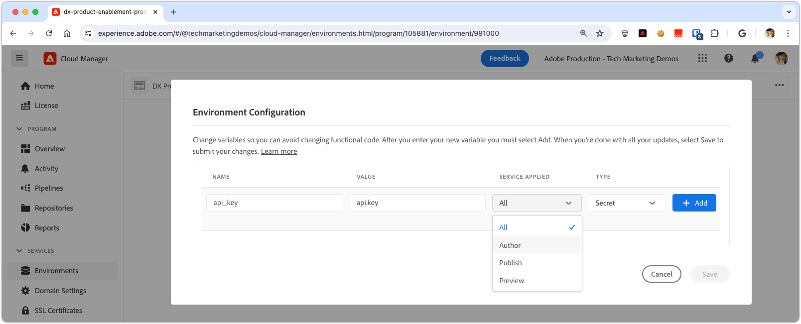

# Managing secrets in AEM as a Cloud Service

Managing secrets, such as API keys and passwords, is crucial for maintaining application security. Adobe Experience Manager (AEM) as a Cloud Service offers robust tools to handle secrets securely.

In this tutorial, you'll learn best practices for managing secrets within AEM. We'll cover the tools and techniques provided by AEM to safeguard your sensitive information, ensuring your application remains secure and confidential.

This tutorial assumes a working knowledge of AEM Java development, OSGi services, Sling Models, and Adobe Cloud Manager.

## Secrets manager OSGi service

In AEM as a Cloud Service, managing secrets through OSGi services provides a scalable and secure approach. OSGi services can be configured to handle sensitive information, such as API keys and passwords, defined through OSGi configurations, and set via Cloud Manager.

### OSGi service implementation

We will walk through the development of a custom OSGi service that [exposes secrets from OSGi configurations](https://experienceleague.adobe.com/en/docs/experience-manager-cloud-service/content/implementing/deploying/configuring-osgi#secret-configuration-values).

The implementation reads secrets from OSGi configuration via the `@Activate` method and exposes them through the `getSecret(String secretName)` method. Alternatively, you can create discrete methods like `getApiKey()` for each secret, but this approach requires more maintenance as secrets are added or removed.

```java
package com.example.core.util.impl;

import com.example.core.util.SecretsManager;
import org.osgi.service.component.annotations.*;
import org.slf4j.Logger;
import org.slf4j.LoggerFactory;
import org.apache.sling.api.resource.ValueMap;
import org.apache.sling.api.resource.ValueMapDecorator;
import java.util.Map;

@Component(
    service = { SecretsManager.class }
)
public class SecretsManagerImpl implements SecretsManager {
    private static final Logger log = LoggerFactory.getLogger(SecretsManagerImpl.class);
 
    private ValueMap secrets;

    @Override
    public String getSecret(String secretName) {
        return secrets.get(secretName, String.class);
    }

    @Activate
    @Modified
    protected void activate(Map<String, Object> properties) {
        secrets = new ValueMapDecorator(properties);
    }
}
```

As an OSGi service, it's best to register and consume it via a Java interface. Below is a simple interface that allows consumers to get secrets by OSGi property name.

```java
package com.example.core.util;

import org.osgi.annotation.versioning.ConsumerType;

@ConsumerType
public interface SecretsManager {
    String getSecret(String secretName);
}
```

## Mapping secrets to OSGi Configuration

To expose secret values in the OSGi service, map them to OSGi configurations using [OSGi secret configuration values](https://experienceleague.adobe.com/en/docs/experience-manager-cloud-service/content/implementing/deploying/configuring-osgi#secret-configuration-values). Define the OSGi property name as the key to retrieve the secret value from the `SecretsManager.getSecret()` method.

Define the secrets in the OSGi configuration file `/apps/example/osgiconfig/config/com.example.core.util.impl.SecretsManagerImpl.cfg.json` in your AEM Maven project. Each property represents a secret exposed in AEM, with the value set via Cloud Manager. The key is the OSGi property name, used to retrieve the secret value from the `SecretsManager` service.

```json
{
    "api.key": "$[secret:api_key]",
    "service.password": "$[secret:service_password]"
}
```

Alternatively to using a shared secrets manager OSGi service, you can include secrets directly in the OSGi configuration of specific services that use them. This approach is useful when secrets are only needed by a single OSGi service and not shared across multiple services. In this case, secret values are defined in the OSGi configuration file for the specific service and accessed in the service's Java code via the `@Activate` method.

## Consuming secrets

Secrets can be consumed from the OSGi service in various ways, such as from a Sling Model or another OSGi service. Below are examples of how to consume secrets from both.

### From Sling Model

Sling Models often provide business logic for AEM site components. The `SecretsManager` OSGi service can be consumed via the `@OsgiService` annotation and used within the Sling Model to retrieve the secret value.

```java
import com.example.core.util.SecretsManager;
import org.apache.sling.api.resource.Resource;
import org.apache.sling.api.servlets.SlingHttpServletRequest;
import org.apache.sling.models.annotations.Model;
import org.apache.sling.models.annotations.OsgiService;

@Model(
    adaptables = {SlingHttpServletRequest.class, Resource.class},
    adapters = {ExampleDatabaseModel.class}
)
public class ExampleDatabaseModelImpl implements ExampleDatabaseModel {

    @OsgiService
    SecretsManager secretsManager;

    @Override 
    public String doWork() {
        final String secret = secretsManager.getSecret("api.key");
        // Do work with secret
    }
}
```

### From OSGi service

OSGi services often expose reusable business logic within AEM, used by Sling Models, AEM services like Workflows, or other custom OSGi services. The `SecretsManager` OSGi service can be consumed via the `@Reference` annotation and used within the OSGi service to retrieve the secret value.

```java
import com.example.core.util.SecretsManager;
import org.osgi.service.component.annotations.Component;
import org.osgi.service.component.annotations.Reference;

@Component
public class ExampleSecretConsumerImpl implements ExampleSecretConsumer {

    @Reference
    SecretsManager secretsManager;

    public void doWork() {
        final String secret = secretsManager.getSecret("service.password");
        // Do work with the secret
    }
}
```

## Setting secrets in Cloud Manager

With the OSGi service and configuration in place, the final step is to set the secret values in Cloud Manager.

Values for secrets can be set via the [Cloud Manager API](https://developer.adobe.com/experience-cloud/cloud-manager/reference/api/#tag/Variables) or, more commonly, via the [Cloud Manager UI](https://experienceleague.adobe.com/en/docs/experience-manager-cloud-service/content/implementing/using-cloud-manager/environment-variables#overview). To apply a secret variable via the Cloud Manager UI:



1. Log in to [Adobe Cloud Manager](https://my.cloudmanager.adobe.com).
1. Select the AEM Program and Environment for which you want to set the secret.
1. In the Environment details view, select the **Configuration** tab.
1. Select **Add**.
1. In the Environment Configuration dialog:
   - Enter the secret variable name (e.g., `api_key`) referenced in the OSGi configuration.
   - Enter the secret value.
   - Select which AEM service the secret applies to.
   - Select **Secret** as the type.
1. Select **Add** to persist the secret.
1. Add as many secrets as required. When complete, select **Save** to apply the changes immediately to the AEM environment.

Using Cloud Manager configurations for secrets provides the benefit of applying different values for different environments or services and rotating secrets without redeploying the AEM application.
