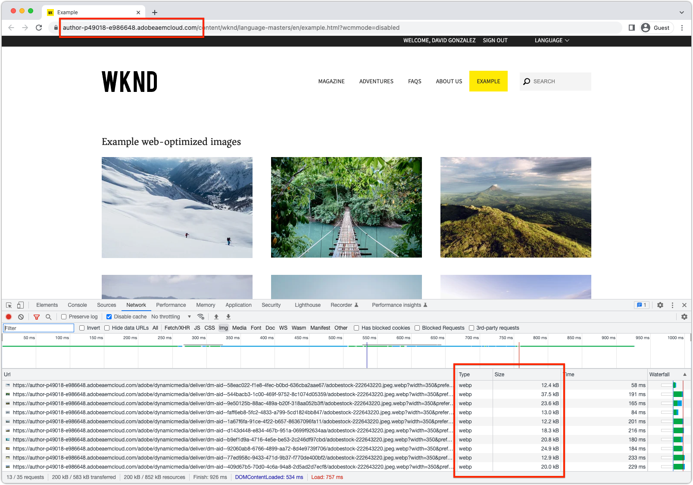
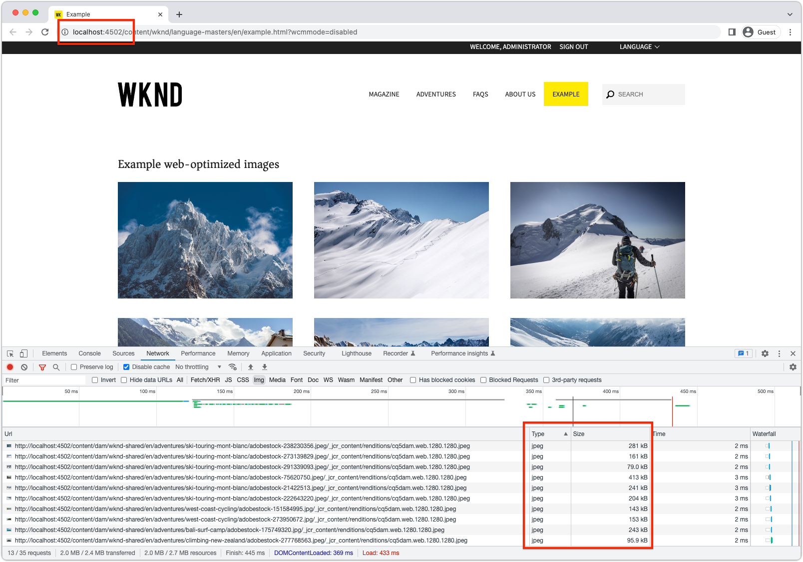

# Web-optimized delivery Java&trade; APIs

Learn how to use AEM as a Cloud Service's web-optimized image delivery Java&trade; APIs to develop highly performant web experiences.

AEM as a Cloud Service supports [web-optimized image delivery](https://experienceleague.adobe.com/docs/experience-manager-core-components/using/developing/web-optimized-image-delivery.html) which automatically generates optimized image web renditions of assets. Web-optimized image delivery can be used three primary approaches:

1. [Use AEM Core WCM Components](https://experienceleague.adobe.com/docs/experience-manager-core-components/using/introduction.html)
2. Create custom component that [extends AEM Core WCM Component image component](https://experienceleague.adobe.com/docs/experience-manager-learn/getting-started-wknd-tutorial-develop/project-archetype/custom-component.html#tackling-the-image-problem)
3. Create custom component that uses the AssetDelivery Java&trade; API to generate web-optimized image URLs.

This article explores using the web-optimized image Java&trade; APIs in a custom component, in a manner that allows code-based to function on both AEM as a Cloud Service, and the AEM SDK.

## APIs

The [AssetDelivery API](https://javadoc.io/doc/com.adobe.aem/aem-sdk-api/latest/com/adobe/cq/wcm/spi/AssetDelivery.html) is an OSGi service that generates web-optimized delivery URLs for image assets. `AssetDelivery.getDeliveryURL(...)` allowed options are [documented here](https://experienceleague.adobe.com/docs/experience-manager-core-components/using/developing/web-optimized-image-delivery.html#can-i-use-web-optimized-image-delivery-with-my-own-component%3F).

The `AssetDelivery` OSGi Service is only satisfied when running in AEM as a Cloud Service. On AEM SDK, references to the `AssetDelivery` OSGi service return `null`. It is best to conditionally use the web-optimized URL when running on AEM as a Cloud Service, and use a fallback image URL on the AEM SDK. Typically the asset's web rendition is a sufficient fallback.


### OSGi Service

Mark the`AssetDelivery` reference as optional in custom OSGi Services so the custom OSGi Service remains available on AEM SDK.

```java
@Reference(cardinality = ReferenceCardinality.OPTIONAL)
private volatile AssetDelivery assetDelivery;
```

### Sling Model

Mark the`AssetDelivery` reference as optional in custom Sling Models so the custom Sling Model remains available on AEM SDK.

```java
@OSGiService(injectionStrategy = InjectionStrategy.OPTIONAL)
private AssetDelivery assetDelivery;
```

### Conditionally use AssetDelivery

Conditionally return the web-optimized image URL or fallback URL based on if the `AssetDelivery` service is available. The conditional use allows for an unbroken experience when running the code on the AEM SDK.

```java
if (assetDelivery != null ) {
    // When running on AEM as a Cloud Service use the real web-optimized image URL.
    return assetDelivery.getDeliveryURL(...);
} else {
    // When running on AEM SDK, use some fallback image so the experience does not break.
    // What the fallback is up to you! 
    return getFallbackURL(...);
}
```

## Example code

The following code creates an example component that displays a list of image assets using web-optimized image URLs. 

When the code runs on AEM as a Cloud Service, the web-optimized webp image renditions are used in the custom component.



When the code runs on AEM SDK, the less optimal static web renditions are used, allowing for the component to function during local development.



The implementation is broken into three logical pieces:

1. The `WebOptimizedImage` OSGi service acts as a "smart proxy" for the AEM-provided `AssetDelivery` OSGi Service that can handle running in both AEM as a Cloud Service and AEM SDK.
2. The `ExampleWebOptimizedImages` Sling Model provides business logic of collecting the list of image assets and their web-optimized urls to display.
3. The `example-web-optimized-images` AEM Component, that implements the HTL to display the list of web-optimized images.

The example code below can be copied in your code base, and updated as necessary.

### OSGi service

The `WebOptimizedImage` OSGi service is split into an addressable public interface (`WebOptimizedImage`), and an internal implementation (`WebOptimizedImageImpl`). The `WebOptimizedImageImpl` returns a web-optimized image URL when running on AEM as a Cloud Service, and a static web rendition URL on the AEM SDK, allowing the component to remain functional on the AEM SDK.

#### Interface

The interface defines the OSGi Service contract that other code such as Sling Models can interact with.

```java
package com.adobe.aem.guides.wknd.core.images;

import org.apache.sling.api.resource.ResourceResolver;
import org.osgi.annotation.versioning.ProviderType;

import java.util.Map;

/**
 * OSGi Service that acts as a facade for the AssetDelivery API, such that a fallback can be automatically served on the AEM SDK.
 *
 * This service can be extended to provide additional functionality, such as srcsets, etc.
 */
@ProviderType
public interface WebOptimizedImage {
    /**
     * Returns the Web Optimized Image URL.
     * @param resourceResolver the user's resource resolver
     * @param path the path to the asset
     * @param options the options to pass to the AssetDelivery API
     * @return the Web Optimized Image URL
     */
    String getDeliveryURL(ResourceResolver resourceResolver, String path, Map<String, Object> options);
}
```

#### Implementation

The OSGi Service implementation includes an optional reference to AEM's `AssetDelivery` OSGi service, and fallback logic for selecting a suitable image URL when `AssetDelivery` is `null` on the AEM SDK. The fallback logic can be updated based on requirements.

```java
package com.adobe.aem.guides.wknd.core.images.impl;

import com.adobe.aem.guides.wknd.core.images.WebOptimizedImage;
import com.adobe.cq.wcm.spi.AssetDelivery;
import com.day.cq.dam.api.Asset;
import com.day.cq.dam.api.Rendition;
import com.day.cq.dam.api.RenditionPicker;
import com.day.cq.dam.commons.util.DamUtil;
import org.apache.commons.lang3.StringUtils;
import org.apache.sling.api.resource.Resource;
import org.apache.sling.api.resource.ResourceResolver;
import org.osgi.service.component.annotations.Component;
import org.osgi.service.component.annotations.Reference;
import org.osgi.service.component.annotations.ReferenceCardinality;

import java.util.Map;
@Component
public class WebOptimizedImageImpl implements WebOptimizedImage {
    private static final String DEFAULT_FORMAT = "webp";
    @Reference(cardinality = ReferenceCardinality.OPTIONAL)
    private volatile AssetDelivery assetDelivery;

    /**
     * Returns the Web Optimized Image URL.
     * @param resourceResolver the user's resource resolver
     * @param path the path to the asset
     * @param options the options to pass to the AssetDelivery API
     * @return the Web Optimized Image URL
     */
    @Override
    public String getDeliveryURL(ResourceResolver resourceResolver, String path, Map<String, Object> options) {
        if (assetDelivery != null) {
            return getWebOptimizedUrl(resourceResolver, path, options);
        } else {
            return getFallbackUrl(resourceResolver, path);
        }
    }
    /**
     * Uses the AssetDelivery API to get the Web Optimized Image URL.
     * @param resourceResolver the user's resource resolver
     * @param path the path to the asset
     * @param options the options to pass to the AssetDelivery API
     * @return the Web Optimized Image URL
     */
    private String getWebOptimizedUrl(ResourceResolver resourceResolver, String path, Map<String, Object> options) {
        Resource resource = resourceResolver.getResource(path);
        Asset asset = DamUtil.resolveToAsset(resource);

        // These 3 options are required for the AssetDelivery API to work, else it will return null
        options.put("path", asset.getPath());
        options.put("format", StringUtils.defaultString((String) options.get("format"), DEFAULT_FORMAT));
        options.put("seoname", StringUtils.defaultString((String) options.get("seoname"), asset.getName()));

        // The resource only provides the security context into AEM so the asset's UUID can be looked up for the Web Optimized Image URL
        return assetDelivery.getDeliveryURL(resource, options);
    }

    /**
     * Fallback to the static web rendition if the AssetDelivery API is not available, meaning the code is running on the AEM SDK.
     * @param resourceResolver the user's resource resolver
     * @param path the path to the asset
     * @return the path to the web rendition
     */
    private String getFallbackUrl(ResourceResolver resourceResolver, String path) {
        Resource resource = resourceResolver.getResource(path);
        Asset asset = DamUtil.resolveToAsset(resource);

        return asset.getRendition(WebRenditionPicker).getPath();
    }

    /**
     * Picks the web rendition of the asset.
     */
    private static final RenditionPicker WebRenditionPicker = new RenditionPicker() {
        @Override
        public Rendition getRendition(Asset asset) {
            return asset.getRenditions().stream().filter(rendition -> StringUtils.startsWith(rendition.getName(), "cq5dam.web.")).findFirst().orElse(asset.getOriginal());
        }
    };
}
```

### Sling Model

The `ExampleWebOptimizedImages` Sling Model is split into an addressable public interface (`ExampleWebOptimizedImages`), and an internal implementation (`ExampleWebOptimizedImagesImpl`);

The `ExampleWebOptimizedImagesImpl` Sling Model collects the list of image assets to display, and invokes the custom `WebOptimizedImage` OSGi Service to obtain the web-optimized image URL. Since this Sling Model represents an AEM Component, it has the usual methods such as `isEmpty()`, `getId()`, and `getData()` however these methods are not directly relevant to using web-optimized images.

#### Interface

The interface defines the Sling Model contract that other code, such as HTL, can interact with.

```java
package com.adobe.aem.guides.wknd.core.models;

import com.adobe.cq.wcm.core.components.models.datalayer.ComponentData;
import com.fasterxml.jackson.annotation.JsonProperty;

import java.util.List;

public interface ExampleWebOptimizedImages {

    /**
     * @return a list of web optimized images for the component to display. Each item in the list has necessary information to render the image.
     */
    List getImages();

    /**
     * @return true if this component has no images to display.
     */
    boolean isEmpty();

    /**
     * @return String representing the unique identifier of the ExampleWebOptimizedImages component on a page
     */
    String getId();

    /**
     * @return JSON data to populate the data layer
     */
    @JsonProperty("dataLayer")
    default ComponentData getData() {
        return null;
    }

    /**
     * Describes a web optimized image.
     */
    interface Img {
        /**
         * @return the URL to the web optimized rendition of the image.
         */
        String getSrc();

        /**
         * @return the alt text of the web optimized image.
         */
        String getAlt();

        /**
         * @return the height of the web optimized image.
         */
        String getHeight();
        /**
         * @return the width of the web optimized image.
         */
        String getWidth();
    }
}
```

#### Implementation

The Sling Model uses the custom `WebOptimizeImage` OSGi service to collect the web-optimized image URLs for the image assets its component displays.

In this example, a simple query is used to collect image assets.

```java
package com.adobe.aem.guides.wknd.core.models.impl;

import com.adobe.aem.guides.wknd.core.images.WebOptimizedImage;
import com.adobe.aem.guides.wknd.core.models.ExampleWebOptimizedImages;
import com.adobe.cq.wcm.core.components.models.datalayer.ComponentData;
import com.adobe.cq.wcm.core.components.models.datalayer.builder.DataLayerBuilder;
import com.adobe.cq.wcm.core.components.util.ComponentUtils;
import com.day.cq.dam.api.Asset;
import com.day.cq.dam.commons.util.DamUtil;
import com.day.cq.wcm.api.Page;
import com.day.cq.wcm.api.components.ComponentContext;
import org.apache.sling.api.SlingHttpServletRequest;
import org.apache.sling.api.resource.Resource;
import org.apache.sling.models.annotations.DefaultInjectionStrategy;
import org.apache.sling.models.annotations.Model;
import org.apache.sling.models.annotations.Required;
import org.apache.sling.models.annotations.injectorspecific.OSGiService;
import org.apache.sling.models.annotations.injectorspecific.ScriptVariable;
import org.apache.sling.models.annotations.injectorspecific.Self;

import java.util.*;

@Model(
        adaptables = {SlingHttpServletRequest.class},
        adapters = {ExampleWebOptimizedImages.class},
        resourceType = {ExampleWebOptimizedImagesImpl.RESOURCE_TYPE},
        defaultInjectionStrategy = DefaultInjectionStrategy.OPTIONAL
)
public class ExampleWebOptimizedImagesImpl implements ExampleWebOptimizedImages {

    protected static final String RESOURCE_TYPE = "wknd/components/example-web-optimized-images";

    private static final int MAX_RESULTS = 10;

    @Self
    @Required
    private SlingHttpServletRequest request;

    @OSGiService
    private WebOptimizedImage webOptimizedImage;

    @ScriptVariable
    private Page currentPage;

    @ScriptVariable
    protected ComponentContext componentContext;

    private List images;

    // XPath query to find image assets to display
    private static final String XPATH_QUERY = "/jcr:root/content/dam/wknd-shared/en/adventures//element(*, dam:Asset) [ (jcr:contains(jcr:content/metadata/@dc:format, 'image/')) ]";
    @Override
    public List getImages() {

        if (images == null) {
            images = new ArrayList<>();

            // Set the AssetDelivery options to request a web-optimized rendition.
            // These options can be set as required by the implementation (Dialog, pass in from HTL via @RequestAttribute)
            final Map<String, Object> options = new HashMap<>();
            options.put("format", "webp");
            options.put("preferwebp", "true");
            options.put("width", "350");
            options.put("height", "350");

            final Iterator<Resource> results = request.getResourceResolver().findResources(XPATH_QUERY, "xpath");

            while (results.hasNext() && images.size() < MAX_RESULTS) {
                Resource resource = results.next();
                Asset asset = DamUtil.resolveToAsset(resource);

                // Get the image URL; the web-optimized rendition on AEM as a Cloud Service, or the static web rendition fallback on AEM SDK
                final String url = webOptimizedImage.getDeliveryURL(request.getResourceResolver(), resource.getPath(), options);

                // Add the image to the list that is passed to the HTL component to display
                // We'll add some extra attributes so that the HTL can display the image in a performant, SEO-friendly, and accessible way
                // ImgImpl can be extended to add additional attributes, such as srcset, etc.
                images.add(new ImgImpl(url, asset.getName(), (String) options.get("height"), (String) options.get("width")));
            }
        }

        return this.images;
    }

    @Override
    public boolean isEmpty() {
        return getImages().isEmpty();
    }

    @Override
    public String getId() {
        return ComponentUtils.getId(request.getResource(), currentPage, componentContext);
    }

    @Override
    public ComponentData getData() {
        if (ComponentUtils.isDataLayerEnabled(request.getResource())) {
            return DataLayerBuilder.forComponent()
                    .withId(() -> getId())
                    .withType(() -> RESOURCE_TYPE)
                    .build();
        }
        return null;
    }

    class ImgImpl implements Img {
        private final String url;
        private final String alt;
        private final int height;
        private final int width;

        public ImgImpl(String url, String alt, String height, String width) {
            this.url = url;
            this.alt = alt;
            this.height = Integer.parseInt(height);
            this.width = Integer.parseInt(width);
        }

        @Override
        public String getSrc() {
            return url;
        }

        @Override
        public String getAlt() {
            return alt;
        }

        @Override
        public String getHeight() {
            return height + "px";
        }

        @Override
        public String getWidth() {
            return width + "px";
        }
    }
}
```

### AEM Component

An AEM Component is bound to the Sling resource type of the `WebOptimizedImagesImpl` Sling Model implementation, and is responsible for displaying the list of images.


The component receives a list of `Img` objects via `getImages()` that include the web-optimized WEBP images when running on AEM as a Cloud Service . The component receives a list of `Img` objects via `getImages()` that include static PNG/JPEG web images when running on AEM SDK.

#### HTL

The HTL uses the `WebOptimizedImages` Sling Model, and renders the list of  `Img` objects return by `getImages()`.

```html
<style>
    .cmp-example-web-optimized-images__list {
        width: 100%;
        list-style: none;
        padding: 0;
        display: flex;
        flex-wrap: wrap;
        justify-content: space-between;
        gap: 2rem;
    }

    .cmp-example-web-optimized-images-list__item {
        margin: 0;
        padding: 0;
    }
</style>

<div data-sly-use.exampleImages="com.adobe.aem.guides.wknd.core.models.ExampleWebOptimizedImages"
     data-sly-use.placeholderTemplate="core/wcm/components/commons/v1/templates.html"
     data-sly-test.hasContent="${!exampleImages.empty}"
     data-cmp-data-layer="${exampleImages.data.json}">

    <h3>Example web-optimized images</h3>

    <ul class="cmp-example-web-optimized-images__list"
        data-sly-list.item="${exampleImages.images}">
        <li class="cmp-example-web-optimized-images-list__item">
            
        </li>
    </ul>
</div>
<sly data-sly-call="${placeholderTemplate.placeholder @ isEmpty=!hasContent, classAppend='cmp-example-web-optimized-images'}"></sly>
```
