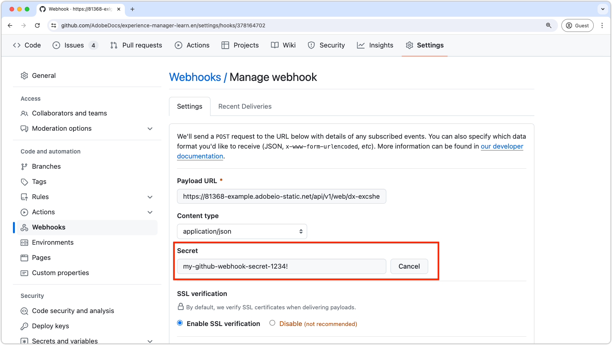

# Github.com webhook verification

Webhooks allow you to build or set up integrations that subscribe to certain events on GitHub.com. When one of those events is triggered, GitHub sends an HTTP POST payload to the webhook's configured URL. However, for security reasons, it is important to verify that the incoming webhook request is actually from GitHub and not from a malicious actor. This tutorial guides you through the steps to verify a GitHub.com webhook request in an Adobe App Builder action using a shared secret.

## Set up Github secret in AppBuilder

1. **Add secret to `.env` file:**
   
   In the App Builder project's `.env` file, add a custom key for the GitHub.com webhook secret:

   ```env
   # Specify your secrets here
   # This file must not be committed to source control
   ...
   GITHUB_SECRET=my-github-webhook-secret-1234!
   ```

2. **Update `ext.config.yaml` file:**

   The `ext.config.yaml` file must be updated to verify the GitHub.com webhook request.

   - Set the AppBuilder action `web` configuration to `raw` to receive the raw request body from GitHub.com.
   - Under `inputs` in the AppBuilder action configuration, add the `GITHUB_SECRET` key, mapping it to the `.env` field containing the secret. The value of this key is the `.env` field name prefixed with `$`.
   - Set the `require-adobe-auth` annotation in the AppBuilder action configuration to `false` to allow the action to be called without requiring Adobe authentication.

   The resulting `ext.config.yaml` file should look something like this:

   ```yaml
   operations:
     view:
       - type: web
         impl: index.html
   actions: actions
   web: web-src
   runtimeManifest:
     packages:
       dx-excshell-1:
         license: Apache-2.0
         actions:
           github-to-jira:
             function: actions/generic/index.js
             web: 'raw'
             runtime: nodejs:20
             inputs:
               LOG_LEVEL: debug
               GITHUB_SECRET: $GITHUB_SECRET
             annotations:
               require-adobe-auth: false
               final: true
   ```

## Add verification code to AppBuilder action

Next, add the JavaScript code provided below (copied from [GitHub.com's documentation](https://docs.github.com/en/webhooks/using-webhooks/validating-webhook-deliveries#javascript-example)) to your AppBuilder action. Make sure to export the `verifySignature` function.

```javascript
// src/dx-excshell-1/actions/generic/github-webhook-verification.js

let encoder = new TextEncoder();

async function verifySignature(secret, header, payload) {
    let parts = header.split("=");
    let sigHex = parts[1];

    let algorithm = { name: "HMAC", hash: { name: 'SHA-256' } };

    let keyBytes = encoder.encode(secret);
    let extractable = false;
    let key = await crypto.subtle.importKey(
        "raw",
        keyBytes,
        algorithm,
        extractable,
        [ "sign", "verify" ],
    );

    let sigBytes = hexToBytes(sigHex);
    let dataBytes = encoder.encode(payload);
    let equal = await crypto.subtle.verify(
        algorithm.name,
        key,
        sigBytes,
        dataBytes,
    );

    return equal;
}

function hexToBytes(hex) {
    let len = hex.length / 2;
    let bytes = new Uint8Array(len);

    let index = 0;
    for (let i = 0; i < hex.length; i += 2) {
        let c = hex.slice(i, i + 2);
        let b = parseInt(c, 16);
        bytes[index] = b;
        index += 1;
    }

    return bytes;
}

module.exports = { verifySignature };
```

## Implement verification in AppBuilder action

Next, verify that the request is coming from GitHub by comparing the signature in the request header to the signature generated by the `verifySignature` function.

In the AppBuilder action's `index.js`, add the following code to the `main` function:


```javascript
// src/dx-excshell-1/actions/generic/index.js

const { verifySignature } = require("./github-webhook-verification");
...

// Main function that will be executed by Adobe I/O Runtime
async function main(params) {
  // Create a Logger
  const logger = Core.Logger("main", { level: params?.LOG_LEVEL || "info" });

  try {
    // Log parameters if LOG_LEVEL is 'debug'
    logger.debug(stringParameters(params));

    // Define required parameters and headers
    const requiredParams = [
      // Verifies the GITHUB_SECRET is present in the action's configuration; add other parameters here as needed.
      "GITHUB_SECRET"
    ];

    const requiredHeaders = [
      // Require the x-hub-signature-256 header, which GitHub.com populates with a sha256 hash of the payload
      "x-hub-signature-256"
    ];

    // Check for missing required parameters and headers
    const errorMessage = checkMissingRequestInputs(params, requiredParams, requiredHeaders);

    if (errorMessage) {
      // Return and log client errors
      return errorResponse(400, errorMessage, logger);
    }

    // Decode the request body (which is base64 encoded) to a string
    const body = Buffer.from(params.__ow_body, 'base64').toString('utf-8');

    // Verify the GitHub webhook signature
    const isSignatureValid = await verifySignature(
      params.GITHUB_SECRET,
      params.__ow_headers["x-hub-signature-256"],
      body
    );

    if (!isSignatureValid) {
      // GitHub signature verification failed
      return errorResponse(401, "Unauthorized", logger);
    } else {
      logger.debug("Signature verified");
    }

    // Parse the request body as JSON so its data is useful in the action
    const githubParams = JSON.parse(body) || {};

    // Optionally, merge the GitHub webhook request parameters with the action parameters
    const mergedParams = {
      ...params,
      ...githubParams
    };

    // Do work based on the GitHub webhook request
    doWork(mergedParams);

    return {
      statusCode: 200,
      body: { message: "GitHub webhook received and processed!" }
    };

  } catch (error) {
    // Log any server errors
    logger.error(error);
    // Return with 500 status code
    return errorResponse(500, "Server error", logger);
  }
}
```

## Configure webhook in GitHub

Back in GitHub.com, provide the same secret value to GitHub.com when creating the webhook. Use the secret value specified in your `.env` file's `GITHUB_SECRET` key.

In GitHub.com, go to the repository settings, and edit the webhook. In the webhook settings, provide the secret value in the `Secret` field. Click __Update webhook__ at the bottom to save the changes.



By following these steps, you ensure that your App Builder action can securely verify that incoming webhook requests are indeed from your GitHub.com webhook.
