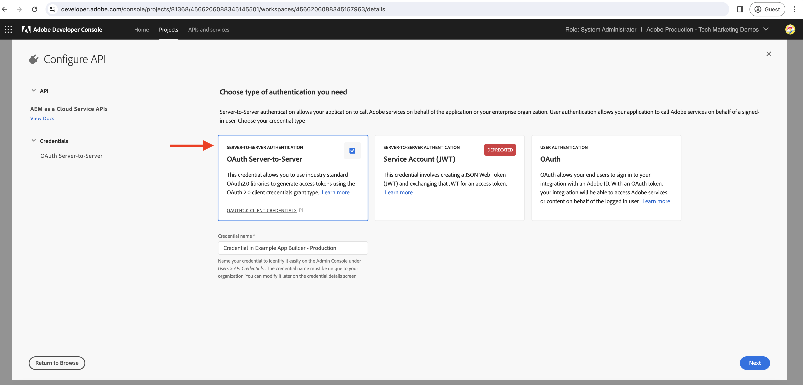
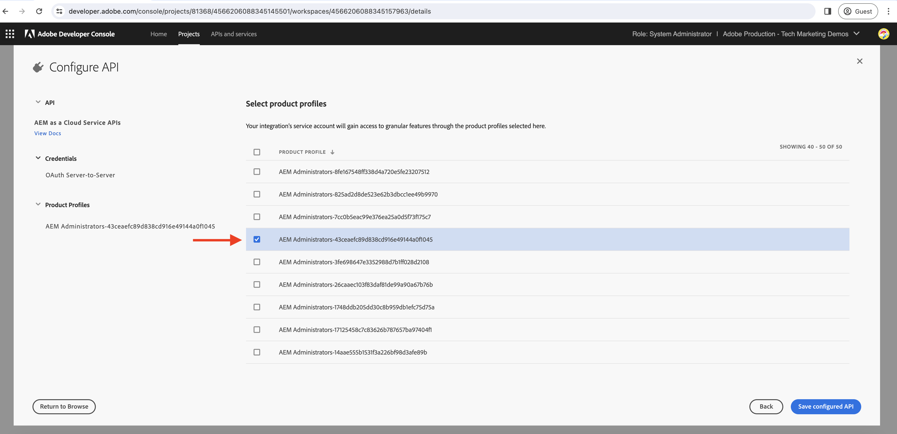
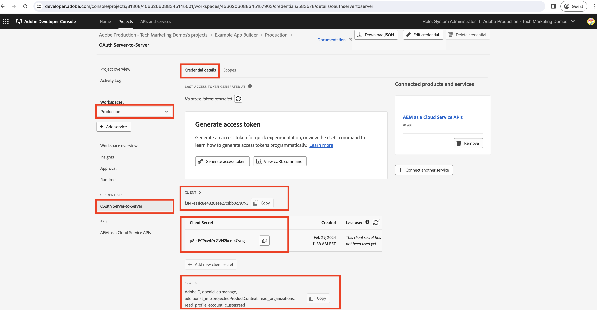

# Generate server-to-server access token in App Builder action

App Builder actions may need to interact with Adobe APIs that support **OAuth Server-to-Server credentials** and are associated with Adobe Developer Console projects the App Builder app is deployed.

This guide explains how to generate an access token by using _OAuth Server-to-Server credentials_ for use in an App Builder action.

>[!IMPORTANT]
>
> The Service Account (JWT) credentials have been deprecated in favor of the OAuth Server-to-Server credentials. However, there are still some Adobe APIs that only support Service Account (JWT) credentials and migration to OAuth Server-to-Server is underway. Review the Adobe API documentation to understand which credentials are supported.

## Adobe Developer Console project configurations

While adding the desired Adobe API to the Adobe Developer Console project, in the _Configure API_ step, select the **OAuth Server-to-Server** authentication type.



To assign the above auto-created integration service account, select the desired product profile. Thus via product profile, the service account permissions are controlled.



## .env file

In the App Builder project's `.env` file, append custom keys for Adobe Developer Console project's OAuth Server-to-Server credentials. The OAuth Server-to-Server credential values can be obtained from the Adobe Developer Console project's __Credentials__ > __OAuth Server-to-Server__ for a given workspace.



```
...
OAUTHS2S_CLIENT_ID=58b23182d80a40fea8b12bc236d71167
OAUTHS2S_CLIENT_SECRET=p8e-EIRF6kY6EHLBSdw2b-pLUWKodDqJqSz3
OAUTHS2S_CECREDENTIALS_METASCOPES=AdobeID,openid,ab.manage,additional_info.projectedProductContext,read_organizations,read_profile,account_cluster.read
```

The values for `OAUTHS2S_CLIENT_ID`, `OAUTHS2S_CLIENT_SECRET`, `OAUTHS2S_CECREDENTIALS_METASCOPES` can be directly copied from the Adobe Developer Console project's OAuth Server-to-Server Credentials screen.

## Inputs mapping

With the OAuth Server-to-Serevr credential value set in the `.env` file, they must be mapped to AppBuilder action inputs so they can be read in the action itself. To do this, add entries for each variable in the `ext.config.yaml` action `inputs` in the format: `PARAMS_INPUT_NAME: $ENV_KEY`.

For example:

```yaml
operations:
  view:
    - type: web
      impl: index.html
actions: actions
runtimeManifest:
  packages:
    dx-excshell-1:
      license: Apache-2.0
      actions:
        generic:
          function: actions/generic/index.js
          web: 'yes'
          runtime: nodejs:16
          inputs:
            LOG_LEVEL: debug
            OAUTHS2S_CLIENT_ID: $OAUTHS2S_CLIENT_ID
            OAUTHS2S_CLIENT_SECRET: $OAUTHS2S_CLIENT_SECRET
            OAUTHS2S_CECREDENTIALS_METASCOPES: $OAUTHS2S_CECREDENTIALS_METASCOPES
          annotations:
            require-adobe-auth: false
            final: true
```

The keys defined under `inputs` are available on the `params` object provided to the App Builder action.

## OAuth Server-to-Server credentials to access token

In the App Builder action, the OAuth Server-to-Server credentials are available in the `params` object. Using these credentials the access token can be generated using [OAuth 2.0 libraries](https://oauth.net/code/). Or you can use the [Node Fetch library](https://www.npmjs.com/package/node-fetch) to make a POST request to the Adobe IMS token endpoint to get the access token.

The following example demonstrates how to use the `node-fetch` library to make a POST request to the Adobe IMS token endpoint to get the access token.

```javascript
const fetch = require("node-fetch");
const { Core } = require("@adobe/aio-sdk");
const { errorResponse, stringParameters, checkMissingRequestInputs } = require("../utils");

async function main(params) {
  const logger = Core.Logger("main", { level: params.LOG_LEVEL || "info" });

  try {
    // Perform any necessary input error checking
    const systemErrorMessage = checkMissingRequestInputs(params, ["OAUTHS2S_CLIENT_ID", "OAUTHS2S_CLIENT_SECRET", "OAUTHS2S_CECREDENTIALS_METASCOPES"], []);

    // The Adobe IMS token endpoint URL
    const adobeIMSV3TokenEndpointURL = 'https://ims-na1.adobelogin.com/ims/token/v3';

    // The POST request options
    const options = {
        method: 'POST',
        headers: {
        'Content-Type': 'application/x-www-form-urlencoded',
        },
        body: `grant_type=client_credentials&client_id=${params.OAUTHS2S_CLIENT_ID}&client_secret=${params.OAUTHS2S_CLIENT_SECRET}&scope=${params.OAUTHS2S_CECREDENTIALS_METASCOPES}`,
    };

    // Make a POST request to the Adobe IMS token endpoint to get the access token
    const tokenResponse = await fetch(adobeIMSV3TokenEndpointURL, options);
    const tokenResponseJSON = await tokenResponse.json();

    // The 24-hour IMS Access Token is used to call the AEM Data Service API
    // Can look at caching this token for 24 hours to reduce calls
    const accessToken = tokenResponseJSON.access_token;

    // Invoke an AEM Data Service API using the access token
    const aemDataResponse = await fetch(`https://api.adobeaemcloud.com/adobe/stats/statistics/contentRequestsQuota?imsOrgId=${IMS_ORG_ID}&current=true`, {
      headers: {
        'X-Adobe-Accept-Experimental': '1',
        'x-gw-ims-org-id': IMS_ORG_ID,
        'X-Api-Key': params.OAUTHS2S_CLIENT_ID,
        Authorization: `Bearer ${access_token}`, // The 24-hour IMS Access Token
      },
      method: "GET",
    });

    if (!aemDataResponse.ok) { throw new Error("Request to API failed with status code " + aemDataResponse.status);}

    // API data
    let data = await aemDataResponse.json();

    const response = {
      statusCode: 200,
      body: data,
    };

    return response;
  } catch (error) {
    logger.error(error);
    return errorResponse(500, "server error", logger);
  }
}

exports.main = main;
```
