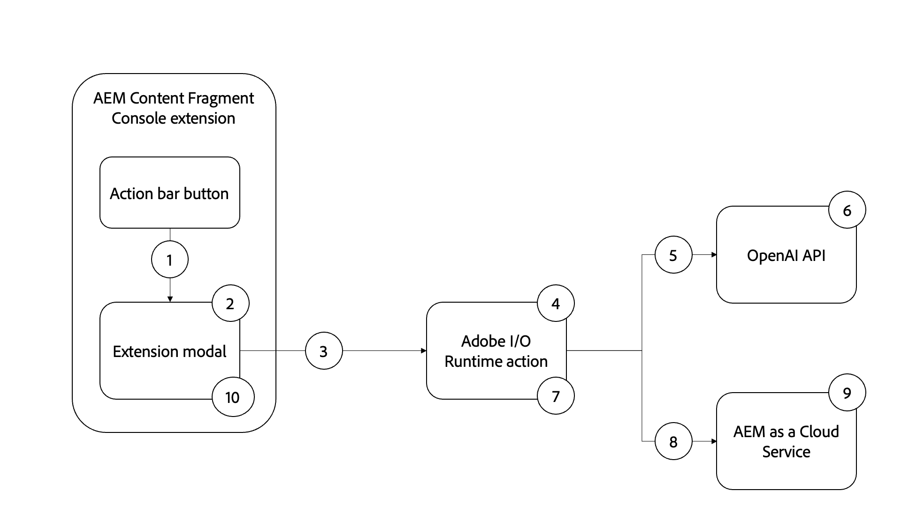

# AEM image asset generation using OpenAI

Learn how to generate an image using OpenAI or DALL.E 2 and upload it to AEM DAM for content velocity.

{width="500" zoomable="yes"}

This example AEM Content Fragment Console extension is an [action bar](../action-bar.md) extension that generates digital image from natural language input using [OpenAI API](https://openai.com/api/) or [DALL.E 2](https://openai.com/dall-e-2/). The generated image is uploaded to the AEM DAM and selected Content Fragment's image property is updated to refer this newly generated, uploaded image from DAM.

In this example you learn:

1. Image generation using [OpenAI API](https://beta.openai.com/docs/guides/images/image-generation-beta) or [DALL.E 2](https://openai.com/dall-e-2/)
1. Uploading images to AEM
1. Content Fragment property update

The functional flow of the example extension is as follows:

{align="center"}

1. Select Content Fragment and clicking the extension's `Generate Image` button in the [action bar](#extension-registration) opens the [modal](#modal).
1. The [modal](#modal) displays a custom input form built with [React Spectrum](https://react-spectrum.adobe.com/react-spectrum/).
1. Submitting the form sends the user provided `Image Description` text, the selected Content Fragment, and the AEM host to the [custom Adobe I/O Runtime action](#adobe-io-runtime-action).
1. The [Adobe I/O Runtime action](#adobe-io-runtime-action) validates the inputs.
1. Next it calls the OpenAI's [Image generation](https://beta.openai.com/docs/guides/images/image-generation-beta) API and it uses `Image Description` text to specify what image should be generated.
1. The [image generation](https://beta.openai.com/docs/guides/images/image-generation-beta) endpoint creates an original image of size _1024x1024_ pixels using the prompt request parameter value and returns the generated image URL as response.
1. The [Adobe I/O Runtime action](#adobe-io-runtime-action) downloads the generated image to the App Builder runtime.
1. Next it initiates the image upload from the App Builder runtime to AEM DAM under a predefined path.
1. The AEM as a Cloud Service saves image to the DAM and returns success or failure responses to the Adobe I/O Runtime action. The successful upload response updates the selected Content Fragment's image property value using another HTTP request to AEM from the Adobe I/O Runtime action.
1. The modal receives the response from the Adobe I/O Runtime action, and provides AEM asset details link of the newly generated, uploaded image.

This video reviews the example image generation using OpenAI or DALL.E 2 extension, how it works and how it is developed. The video has chapter markings such as __Functional Demo, Setup, and Tech-Code__ to watch the relevant piece quickly.

>[!VIDEO](https://video.tv.adobe.com/v/3413093?quality=12&learn=on)


## The App Builder extension app

The example uses an existing Adobe Developer Console project, and the following options when initializing the App Builder app via `aio app init`.

+   What templates do you want to search for?: `All Extension Points`
+   Choose the template(s) to install:` @adobe/aem-cf-admin-ui-ext-tpl`
+   What do you want to name your extension?: `Image generation`
+   Please provide a short description of your extension: `An example action bar extension that generates an image using OpenAI and uploads it to AEM DAM.`
+   What version would you like to start with?: `0.0.1`
+   What would you like to do next?
    +   `Add a custom button to Action Bar`
        + Please provide label name for the button: `Generate Image`
        + Do you need to show a modal for the button? `y`
    +   `Add server-side handler`
        + Adobe I/O Runtime lets you invoke serverless code on demand. How would you like to name this action?: `generate-image`

The generated App Builder extension app is updated as described below.

## Additional setup

1.  Sign up for a free [OpenAI API](https://openai.com/api/) account and create an [API key](https://beta.openai.com/account/api-keys)
1.  Add this key to your App Builder project's `.env` file

    ```
        # Specify your secrets here
        # This file must not be committed to source control
        ## Adobe I/O Runtime credentials
        ...
        AIO_runtime_apihost=https://adobeioruntime.net
        ...
        # OpenAI secret API key
        OPENAI_API_KEY=my-openai-secrete-key-to-generate-images
        ...
    ```

1.  Pass `OPENAI_API_KEY` as param to the Adobe I/O Runtime action, update the `src/aem-cf-console-admin-1/ext.config.yaml`

    ```yaml
        ...

        runtimeManifest:
          packages:
            aem-cf-console-admin-1:
              license: Apache-2.0
              actions:
                generate-image:
                  function: actions/generate-image/index.js
                  web: 'yes'
                  runtime: nodejs:16
                  inputs:
                    LOG_LEVEL: debug
                    OPENAI_API_KEY: $OPENAI_API_KEY
        ...
    ```

1.  Install below Node.js libraries
    1. [The OpenAI Node.js library](https://github.com/openai/openai-node#installation) - to invoke the OpenAI API easily
    1. [AEM Upload](https://github.com/adobe/aem-upload#install) - to upload images to AEM-CS instances.


>[!TIP]
>
>In the following sections, you learn about the key React and Adobe I/O Runtime action JavaScript files. For your reference the key files from `web-src` and  `actions` folder of the AppBuilder project are provided, see [adobe-appbuilder-cfc-ext-image-generation-code.zip](./assets/digital-image-generation/adobe-appbuilder-cfc-ext-image-generation-code.zip). 


## App routes{#app-routes}

The `src/aem-cf-console-admin-1/web-src/src/components/App.js` contains the [React router](https://reactrouter.com/en/main). 

There are two logical sets of routes:

1.  The first route maps requests to the `index.html`, which invokes the React component responsible for the [extension registration](#extension-registration).

    ```javascript
    <Route index element={<ExtensionRegistration />} />
    ```

1.  The second set of routes maps URLs to React components that render the contents of the extension's modal. The `:selection` param represents a delimited list content fragment path. 

    If the extension has multiple buttons to invoke discrete actions, each [extension registration](#extension-registration) maps to a route defined here.

    ```javascript
    <Route
        exact path="content-fragment/:selection/generate-image-modal"
        element={<GenerateImageModal />}
        />
    ```

## Extension registration

`ExtensionRegistration.js`, mapped to the `index.html` route, is the entry point for the AEM extension and defines:

1. The location of the extension button appears in the AEM authoring experience (`actionBar` or `headerMenu`)
1. The extension button's definition in `getButton()` function
1. The click handler for the button, in the `onClick()` function

+ `src/aem-cf-console-admin-1/web-src/src/components/ExtensionRegistration.js`

```javascript
function ExtensionRegistration() {
  const init = async () => {
    const guestConnection = await register({
      id: extensionId,
      methods: {
        // Configure your Action Bar button here
        actionBar: {
          getButton() {
            return {
              'id': 'generate-image',     // Unique ID for the button
              'label': 'Generate Image',  // Button label 
              'icon': 'PublishCheck'      // Button icon; get name from: https://spectrum.adobe.com/page/icons/ (Remove spaces, keep uppercase)
            }
          },

          // Click handler for the extension button
          onClick(selections) {
            // Collect the selected content fragment paths 
            const selectionIds = selections.map(selection => selection.id);

            // Create a URL that maps to the 
            const modalURL = "/index.html#" + generatePath(
              "/content-fragment/:selection/generate-image-modal",
              {
                // Set the :selection React route parameter to an encoded, delimited list of paths of the selected content fragments
                selection: encodeURIComponent(selectionIds.join('|')),
              }
            );

            // Open the route in the extension modal using the constructed URL
            guestConnection.host.modal.showUrl({
              title: "Generate Image",
              url: modalURL
            })
          }
        },

      }
    })
  }
  init().catch(console.error)
```

## Modal

Each route of the extension, as defined in [`App.js`](#app-routes), maps to a React component that renders in the extension's modal. 

In this example app, there is a modal React component (`GenerateImageModal.js`) that has four states:

1. Loading, indicating the user must wait
1. The warning message that suggests the users select only one Content Fragment at a time
1. The Generate Image form that allows the user to provide an image description in the natural language.
1. The response of the image generation operation, providing the AEM asset details link of the newly generated, uploaded image.

Importantly, any interaction with AEM from the extension should be delegated to an [AppBuilder Adobe I/O Runtime action](https://developer.adobe.com/runtime/docs/guides/using/creating_actions/), which is a separate serverless process running in [Adobe I/O Runtime](https://developer.adobe.com/runtime/docs/).
The use of Adobe I/O Runtime actions to communicate with AEM, and is to avoid Cross-Origin Resource Sharing (CORS) connectivity issues.

When the _Generate Image_ form is submitted, a custom `onSubmitHandler()` invokes the Adobe I/O Runtime action, passing the image description, current AEM host (domain), and user's AEM access token. The action then calls the OpenAI's [Image generation](https://beta.openai.com/docs/guides/images/image-generation-beta) API to generate an image using the submitted image description. Next using [AEM Upload](https://github.com/adobe/aem-upload) node module's `DirectBinaryUpload` class it uploads generated image to AEM and finally uses [AEM Content Fragment API](https://experienceleague.adobe.com/docs/experience-manager-65/assets/extending/assets-api-content-fragments.html) to update the content fragments.

When the response from the Adobe I/O Runtime action is received, the modal is updated to display the results of the image generation operation. 

+ `src/aem-cf-console-admin-1/web-src/src/components/GenerateImageModal.js`

```javascript
export default function GenerateImageModal() {
  // Set up state used by the React component
  const [guestConnection, setGuestConnection] = useState();

  // State hooks to manage the application state
  const [imageDescription, setImageDescription] = useState(null);
  const [validationState, setValidationState] = useState({});

  const [actionInvokeInProgress, setActionInvokeInProgress] = useState(false);
  const [actionResponse, setActionResponse] = useState();

  // Get the selected content fragment paths from the route parameter `:selection`
  const { selection } = useParams();
  const fragmentIds = selection?.split('|') || [];

  console.log('Selected Fragment Ids', fragmentIds);

  if (!fragmentIds || fragmentIds.length === 0) {
    console.error('The Content Fragments are not selected, can NOT generate images');
    return;
  }

  // Asynchronously attach the extension to AEM, we must wait or the guestConnection to be set before doing anything in the modal
  useEffect(() => {
    (async () => {
      const myGuestConnection = await attach({ id: extensionId });

      setGuestConnection(myGuestConnection);
    })();
  }, []);

  // Determine view to display in the modal
  if (!guestConnection) {
    // If the guestConnection is not initialized, display a loading spinner
    return <Spinner />;
  } if (actionInvokeInProgress) {
    // If the 'Generate Image' action has been invoked but not completed, display a loading spinner
    return <Spinner />;
  } if (fragmentIds.length > 1) {
    // If more than one CF selected show warning and suggest to select only one CF
    return renderMoreThanOneCFSelectionError();
  } if (fragmentIds.length === 1 && !actionResponse) {
    // Display the 'Generate Image' modal and ask for image description
    return renderImgGenerationForm();
  } if (actionResponse) {
    // If the 'Generate Image' actio has completed, display the response
    return renderActionResponse();
  }

  /**
   * Renders the message suggesting to select only on CF at a time to not lose credits accidentally
   *
   * @returns the suggestion or error message to select one CF at a time
   */
  function renderMoreThanOneCFSelectionError() {
    return (
      <Provider theme={defaultTheme} colorScheme="light">
        <Content width="100%">
          <Text>
            As this operation
            <strong> uses credits from Generative AI services</strong>
            {' '}
            such as DALL.E 2 (or Stable Dufusion), we allow only one Generate Image at a time.
            <p />
            <strong>So please select only one Content Fragment at this moment.</strong>
          </Text>

          <Flex width="100%" justifyContent="end" alignItems="center" marginTop="size-400">
            <ButtonGroup align="end">
              <Button variant="negative" onPress={() => guestConnection.host.modal.close()}>Close</Button>
            </ButtonGroup>
          </Flex>

        </Content>
      </Provider>
    );
  }

  /**
   * Renders the form asking for image description in the natural language and
   * displays message this action uses credits from Generative AI services.
   *
   *
   * @returns the image description input field and credit usage message
   */
  function renderImgGenerationForm() {
    return (

      <Provider theme={defaultTheme} colorScheme="light">
        <Content width="100%">

          <Flex width="100%">
            <Form
              width="100%"
            >
              <TextField
                label="Image Description"
                description="The image description in natural language, for e.g. Alaskan adventure in wilderness, animals, and flowers."
                isRequired
                validationState={validationState?.propertyName}
                onChange={setImageDescription}
                contextualHelp={(
                  <ContextualHelp>
                    <Heading>Need help?</Heading>
                    <Content>
                      <Text>
                        The
                        <strong>description of an image</strong>
                        {' '}
                        you are looking for in the natural language, for e.g. &quot;Family vacation on the beach with blue ocean, dolphins, boats and drink&quot;
                      </Text>
                    </Content>
                  </ContextualHelp>
                  )}
              />

              <Text>
                <p />
                Please note this will use credits from Generative AI services such as OpenAI/DALL.E 2. The AI-generated images are saved to this AEM as a Cloud Service Author service using logged user access (IMS) token.
              </Text>

              <ButtonGroup align="end">
                <Button variant="accent" onPress={onSubmitHandler}>Use Credits</Button>
                <Button variant="accent" onPress={() => guestConnection.host.modal.close()}>Close</Button>
              </ButtonGroup>
            </Form>
          </Flex>

        </Content>
      </Provider>

    );
  }

  function buildAssetDetailsURL(aemImgURL) {
    const urlParts = aemImgURL.split('.com');
    const aemAssetdetailsURL = `${urlParts[0]}.com/ui#/aem/assetdetails.html${urlParts[1]}`;

    return aemAssetdetailsURL;
  }

  /**
   * Displays the action response received from the App Builder
   *
   * @returns Displays App Builder action and details
   */
  function renderActionResponse() {
    return (
      <Provider theme={defaultTheme} colorScheme="light">
        <Content width="100%">

          {actionResponse.status === 'success'
            && (
              <>
                <Heading level="4">
                  Successfully generated an image, uploaded it to this AEM-CS Author service, and associated it to the selected Content Fragment.
                </Heading>

                <Text>
                  {' '}
                  Please see generated image in AEM-CS
                  {' '}
                  <Link>
                    <a href={buildAssetDetailsURL(actionResponse.aemImgURL)} target="_blank" rel="noreferrer">
                      here.
                    </a>
                  </Link>
                </Text>
              </>
            )}

          {actionResponse.status === 'failure'
            && (
            <Heading level="4">
              Failed to generate, upload image, please check App Builder logs.
            </Heading>
            )}

          <Flex width="100%" justifyContent="end" alignItems="center" marginTop="size-400">
            <ButtonGroup align="end">
              <Button variant="negative" onPress={() => guestConnection.host.modal.close()}>Close</Button>
            </ButtonGroup>
          </Flex>

        </Content>
      </Provider>
    );
  }

  /**
   * Handle the Generate Image form submission.
   * This function calls the supporting Adobe I/O Runtime actions such as
   * - Call the Generative AI service (DALL.E) with 'image description' to generate an image
   * - Download the AI generated image to App Builder runtime
   * - Save the downloaded image to AEM DAM and update Content Fragement's image reference property to use this new image
   *
   * When invoking the Adobe I/O Runtime actions, the following parameters are passed as they're used by the action to connect to AEM:
   * - AEM Host to connect to
   * - AEM access token to connect to AEM with
   * - The Content Fragment path to update
   *
   * @returns In case of success the updated content fragment, otherwise failure message
   */
  async function onSubmitHandler() {
    console.log('Started Image Generation orchestration');

    // Validate the form input fields
    if (imageDescription?.length > 1) {
      setValidationState({ imageDescription: 'valid' });
    } else {
      setValidationState({ imageDescription: 'invalid' });
      return;
    }

    // Mark the extension as invoking the action, so the loading spinner is displayed
    setActionInvokeInProgress(true);

    // Set the HTTP headers to access the Adobe I/O runtime action
    const headers = {
      Authorization: `Bearer ${guestConnection.sharedContext.get('auth').imsToken}`,
      'x-gw-ims-org-id': guestConnection.sharedContext.get('auth').imsOrg,
    };

    // Set the parameters to pass to the Adobe I/O Runtime action
    const params = {

      aemHost: `https://${guestConnection.sharedContext.get('aemHost')}`,

      fragmentId: fragmentIds[0],
      imageDescription,
    };

    const generateImageAction = 'generate-image';

    try {
      const generateImageActionResponse = await actionWebInvoke(allActions[generateImageAction], headers, params);

      // Set the response from the Adobe I/O Runtime action
      setActionResponse(generateImageActionResponse);

      console.log(`Response from ${generateImageAction}:`, actionResponse);
    } catch (e) {
      // Log and store any errors
      console.error(e);
    }

    // Set the action as no longer being invoked, so the loading spinner is hidden
    setActionInvokeInProgress(false);
  }
}
```

>[!NOTE]
>
>In the `buildAssetDetailsURL()` function, the `aemAssetdetailsURL` variable value assumes that the [Unified Shell](https://experienceleague.adobe.com/docs/experience-manager-cloud-service/content/overview/aem-cloud-service-on-unified-shell.html#overview) is enabled. If you have disabled the Unified Shell, you need to remove the `/ui#/aem` from the variable value.


## Adobe I/O Runtime action

An AEM extension App Builder app can define or use 0 or many Adobe I/O Runtime actions. 
Adobe Runtime action is responsible for work that requires interacting with AEM or Adobe or third-party web services.

In this example app, the `generate-image` Adobe I/O Runtime action is responsible for:

1. Generating an image using [OpenAI API Image Generation](https://beta.openai.com/docs/guides/images/image-generation-beta) service
1. Uploading the generated image into AEM-CS instance using [AEM Upload](https://github.com/adobe/aem-upload) library
1. Making an HTTP request to the AEM Content Fragment API to update the content fragment's image property.
1. Returning the key information of successes and failure for display by the modal (`GenerateImageModal.js`)


### The orchestrator - `index.js`

The `index.js` orchestrates above 1 to 3 tasks by using the respective JavaScript modules, namely `generate-image-using-openai, upload-generated-image-to-aem, update-content-fragement`. These modules and associated code is described in the next [subsections](#image-generation-module---generate-image-using-openaijs).

+ `src/aem-cf-console-admin-1/actions/generate-image/index.js`

```javascript

/**
 *
 * This action orchestrates an image generation by calling the OpenAI API (DALL.E 2) and saves generated image to AEM.
 *
 * It leverages following modules
 *  - 'generate-image-using-openai' - To generate an image using OpenAI API
 *  - 'upload-generated-image-to-aem' - To upload the generated image into AEM-CS instance
 *  - 'update-content-fragement' - To update the CF image property with generated image's DAM path
 *
 */

const { Core } = require('@adobe/aio-sdk');
const {
  errorResponse, stringParameters, getBearerToken, checkMissingRequestInputs,
} = require('../utils');

const { generateImageUsingOpenAI } = require('./generate-image-using-openai');

const { uploadGeneratedImageToAEM } = require('./upload-generated-image-to-aem');

const { updateContentFragmentToUseGeneratedImg } = require('./update-content-fragement');

// main function that will be executed by Adobe I/O Runtime
async function main(params) {
  // create a Logger
  const logger = Core.Logger('main', { level: params.LOG_LEVEL || 'info' });

  try {
    // 'info' is the default level if not set
    logger.info('Calling the main action');

    // log parameters, only if params.LOG_LEVEL === 'debug'
    logger.debug(stringParameters(params));

    // check for missing request input parameters and headers
    const requiredParams = ['aemHost', 'fragmentId', 'imageDescription'];
    const requiredHeaders = ['Authorization'];
    const errorMessage = checkMissingRequestInputs(params, requiredParams, requiredHeaders);

    if (errorMessage) {
      // return and log client errors
      return errorResponse(400, errorMessage, logger);
    }

    // extract the user Bearer token from the Authorization header
    const token = getBearerToken(params);

    // Call OpenAI (DALL.E 2) API to generate an image using image description
    const generatedImageURL = await generateImageUsingOpenAI(params);
    logger.info(`Generated image using OpenAI API and url is : ${generatedImageURL}`);

    // Upload the generated image to AEM-CS
    const uploadedImagePath = await uploadGeneratedImageToAEM(params, generatedImageURL, token);
    logger.info(`Uploaded image to AEM, path is: ${uploadedImagePath}`);

    // Update Content Fragment with the newly generated image reference
    const updateContentFragmentPath = await updateContentFragmentToUseGeneratedImg(params, uploadedImagePath, token);
    logger.info(`Updated Content Fragment path is: ${updateContentFragmentPath}`);

    let result;
    if (updateContentFragmentPath) {
      result = {
        status: 'success', message: 'Successfully generated and uploaded image to AEM', genTechServiceImageURL: generatedImageURL, aemImgURL: uploadedImagePath, fragmentPath: updateContentFragmentPath,
      };
    } else {
      result = { status: 'failure', message: 'Failed to generated and uploaded image, please check App Builder logs' };
    }

    const response = {
      statusCode: 200,
      body: result,
    };

    logger.info('Adobe I/O Runtime action response', response);

    // Return the response to the caller
    return response;
  } catch (error) {
    // log any server errors
    logger.error(error);
    // return with 500
    return errorResponse(500, 'server error', logger);
  }
}

exports.main = main;

```


### Image generation module - `generate-image-using-openai.js`

This module is responsible for calling OpenAI's [Image Generation](https://beta.openai.com/docs/guides/images/image-generation-beta) endpoint using [openai](https://github.com/openai/openai-node) library. To get the OpenAI API secrete key defined in the `.env` file, it uses `params.OPENAI_API_KEY`.

+ `src/aem-cf-console-admin-1/actions/generate-image/generate-image-using-openai.js`

```javascript
/**
 * This module calls OpenAI API to generate an image based on image description provided to Action
 *
 */

const { Configuration, OpenAIApi } = require('openai');

const { Core } = require('@adobe/aio-sdk');

// Placeholder than actual OpenAI Image
const PLACEHOLDER_IMG_URL = 'https://www.gstatic.com/webp/gallery/2.png';

async function generateImageUsingOpenAI(params) {
  // create a Logger
  const logger = Core.Logger('generateImageUsingOpenAI', { level: params.LOG_LEVEL || 'info' });

  let generatedImageURL = PLACEHOLDER_IMG_URL;

  // create configuration object with the API Key
  const configuration = new Configuration({
    apiKey: params.OPENAI_API_KEY,
  });

  // create OpenAIApi object
  const openai = new OpenAIApi(configuration);

  logger.info(`Generating image for input: ${params.imageDescription}`);

  try {
    // invoke createImage method with details
    const response = await openai.createImage({
      prompt: params.imageDescription,
      n: 1,
      size: '1024x1024',
    });

    generatedImageURL = response.data.data[0].url;

    logger.info(`The OpenAI generate image url is: ${generatedImageURL}`);
  } catch (error) {
    logger.error(`Error while generating image, details are: ${error}`);
  }

  return generatedImageURL;
}

module.exports = {
  generateImageUsingOpenAI,
};

```

### Upload image to AEM module - `upload-generated-image-to-aem.js`

This module is responsible for uploading the OpenAI generated image to AEM using [AEM Upload](https://github.com/adobe/aem-upload) library. The generated image is first downloaded to the App Builder runtime using Node.js [File System](https://nodejs.org/api/fs.html) library and once upload to AEM is completed it is deleted. 

In below code `uploadGeneratedImageToAEM` function orchestrates generated image download to runtime, upload it to AEM and delete it from runtime. The image is uploaded to the `/content/dam/wknd-shared/en/generated` path, make sure all the folders exist in the DAM, its prerequisite to use [AEM Upload](https://github.com/adobe/aem-upload) library.

+ `src/aem-cf-console-admin-1/actions/generate-image/upload-generated-image-to-aem.js`

```javascript

/**
 * This module uploads the generated image to AEM-CS instance using current user's IMS token
 *
 */

const { Core } = require('@adobe/aio-sdk');
const fs = require('fs');

const {
  DirectBinaryUploadErrorCodes,
  DirectBinaryUpload,
  DirectBinaryUploadOptions,
} = require('@adobe/aem-upload');

const codes = DirectBinaryUploadErrorCodes;
const IMG_EXTENSION = '.png';

const GENERATED_IMAGES_DAM_PATH = '/content/dam/wknd-shared/en/generated';

async function downloadImageToRuntime(logger, generatedImageURL) {
  logger.log('Downloading generated image to the runtime');

  // placeholder image name
  let generatedImageName = 'generated.png';

  try {
    // Get the generated image name from the image URL
    const justImgURL = generatedImageURL.substring(0, generatedImageURL.indexOf(IMG_EXTENSION) + 4);
    generatedImageName = justImgURL.substring(justImgURL.lastIndexOf('/') + 1);

    // Read image from URL as the buffer
    const response = await fetch(generatedImageURL);
    const buffer = await response.buffer();

    // Write/download image to the runtime
    fs.writeFileSync(generatedImageName, buffer, (err) => {
      if (err) throw err;
      logger.log('Saved the generated image!');
    });
  } catch (error) {
    logger.error(`Error while downloading image on the runtime, details are: ${error}`);
  }

  return generatedImageName;
}

function setupEventHandlers(binaryUpload, logger) {
  binaryUpload.on('filestart', (data) => {
    const { fileName } = data;

    logger.log(`Started file upload ${fileName}`);
  });

  binaryUpload.on('fileprogress', (data) => {
    const { fileName, transferred } = data;

    logger.log(`Fileupload is in progress ${fileName} & ${transferred}`);
  });

  binaryUpload.on('fileend', (data) => {
    const { fileName } = data;

    logger.log(`Finished file upload ${fileName}`);
  });

  binaryUpload.on('fileerror', (data) => {
    const { fileName, errors } = data;

    logger.log(`Error in file upload ${fileName} and ${errors}`);
  });
}

async function getImageSize(downloadedImgName) {
  const stats = fs.statSync(downloadedImgName);
  return stats.size;
}

async function uploadImageToAEMFromRuntime(logger, aemURL, downloadedImgName, accessToken) {
  let aemImageURL;
  try {
    logger.log('Uploading generated image to AEM from the runtime');

    const binaryUpload = new DirectBinaryUpload();

    // setup event handlers to track the progress, success or error
    setupEventHandlers(binaryUpload, logger);

    // get downloaded image size
    const imageSize = await getImageSize(downloadedImgName);
    logger.info(`The image upload size is: ${imageSize}`);

    // The deatils of the file to be uploaded
    const uploadFiles = [
      {
        fileName: downloadedImgName, // name of the file as it will appear in AEM
        fileSize: imageSize, // total size, in bytes, of the file
        filePath: downloadedImgName, // Full path to the local file
      },
    ];

    // Provide AEM URL and DAM Path where images will be uploaded
    const options = new DirectBinaryUploadOptions()
      .withUrl(`${aemURL}${GENERATED_IMAGES_DAM_PATH}`)
      .withUploadFiles(uploadFiles);

    // Add headers like content type and authorization
    options.withHeaders({
      'content-type': 'image/png',
      Authorization: `Bearer ${accessToken}`,
    });

    // Start the upload to AEM
    await binaryUpload.uploadFiles(options)
      .then((result) => {
        // Handle Error
        result.getErrors().forEach((error) => {
          if (error.getCode() === codes.ALREADY_EXISTS) {
            logger.error('The generated image already exists');
          }
        });

        // Handle Upload result and check for errors
        result.getFileUploadResults().forEach((fileResult) => {
          // log file upload result
          logger.info(`File upload result ${JSON.stringify(fileResult)}`);

          fileResult.getErrors().forEach((fileErr) => {
            if (fileErr.getCode() === codes.ALREADY_EXISTS) {
              const fileName = fileResult.getFileName();
              logger.error(`The generated image already exists ${fileName}`);
            }
          });
        });
      })
      .catch((err) => {
        logger.info(`Failed to uploaded generated image to AEM${err}`);
      });

    logger.info('Successfully uploaded generated image to AEM');

    aemImageURL = `${aemURL + GENERATED_IMAGES_DAM_PATH}/${downloadedImgName}`;
  } catch (error) {
    logger.info(`Error while uploading generated image to AEM, see ${error}`);
  }

  return aemImageURL;
}

async function deleteFileFromRuntime(logger, downloadedImgName) {
  try {
    logger.log('Deleting the generated image from the runtime');

    fs.unlinkSync(downloadedImgName);

    logger.log('Successfully deleted the generated image from the runtime');
  } catch (error) {
    logger.error(`Error while deleting generated image from the runtime, details are: ${error}`);
  }
}

async function uploadGeneratedImageToAEM(params, generatedImageURL, accessToken) {
  // create a Logger
  const logger = Core.Logger('uploadGeneratedImageToAEM', { level: params.LOG_LEVEL || 'info' });

  const aemURL = params.aemHost;

  logger.info(`Uploading generated image from ${generatedImageURL} to AEM ${aemURL} by streaming the bytes.`);

  // download image to the App Builder runtime
  const downloadedImgName = await downloadImageToRuntime(logger, generatedImageURL);

  // Upload image to AEM from the App Builder runtime
  const aemImageURL = await uploadImageToAEMFromRuntime(logger, aemURL, downloadedImgName, accessToken);

  // Delete the downloaded image from the App Builder runtime
  await deleteFileFromRuntime(logger, downloadedImgName);

  return aemImageURL;
}

module.exports = {
  uploadGeneratedImageToAEM,
};
```

### Update Content Fragment module - `update-content-fragement.js`

This module is responsible for updating the given Content Fragment's image property with newly uploaded image's DAM path using the AEM Content Fragment API.

+ `src/aem-cf-console-admin-1/actions/generate-image/update-content-fragement.js`

```javascript

/**
 * This module updates the CF image property with generated image's DAM path
 *
 */
const { Core } = require('@adobe/aio-sdk');

const ADVENTURE_MODEL_IMG_PROPERTY_NAME = 'primaryImage';

const ARTICLE_MODEL_IMG_PROPERTY_NAME = 'featuredImage';

const AUTHOR_MODEL_IMG_PROPERTY_NAME = 'profilePicture';

function findImgPropertyName(fragmenPath) {
  if (fragmenPath && fragmenPath.includes('/adventures')) {
    return ADVENTURE_MODEL_IMG_PROPERTY_NAME;
  } if (fragmenPath && fragmenPath.includes('/magazine')) {
    return ARTICLE_MODEL_IMG_PROPERTY_NAME;
  }
  return AUTHOR_MODEL_IMG_PROPERTY_NAME;
}

async function updateContentFragmentToUseGeneratedImg(params, uploadedImagePath, accessToken) {
  // create a Logger
  const logger = Core.Logger('updateContentFragment', { level: params.LOG_LEVEL || 'info' });

  const fragmenPath = params.fragmentId;
  const imgPropName = findImgPropertyName(fragmenPath);
  const relativeImgPath = uploadedImagePath.substring(uploadedImagePath.indexOf('/content/dam'));

  logger.info(`Update CF ${fragmenPath} to use ${relativeImgPath} image path`);

  const body = {
    properties: {
      elements: {
        [imgPropName]: {
          value: relativeImgPath,
        },
      },
    },
  };

  const res = await fetch(`${params.aemHost}${fragmenPath.replace('/content/dam/', '/api/assets/')}.json`, {
    method: 'put',
    body: JSON.stringify(body),
    headers: {
      Authorization: `Bearer ${accessToken}`,
      'Content-Type': 'application/json',
    },

  });

  if (res.ok) {
    logger.info(`Successfully updated ${fragmenPath}`);
    return fragmenPath;
  }

  logger.info(`Failed to update ${fragmenPath}`);
  return '';
}

module.exports = {
  updateContentFragmentToUseGeneratedImg,
};

```
