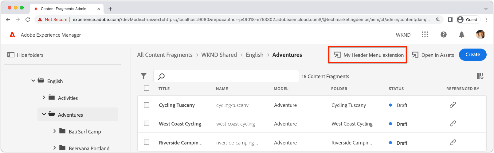

# Extension registration

AEM Content Fragment Console extensions are specialized App Builder app, based on React and uses the [React Spectrum](https://react-spectrum.adobe.com/react-spectrum/) UI framework. 

To define where and how the AEM Content Fragment Console the extension appears, two specific configurations are required in the extension's App Builder app: app routing and the extension registration.

## App routes{#app-routes}

The extension's `App.js` declares the [React router](https://reactrouter.com/en/main) that includes an index route that registers the extension in the AEM Content Fragment Console.

The index route is invoked when then AEM Content Fragment Console initially loads, and target of this route defines how the extension is exposed in the console.

+ `./src/aem-cf-console-admin-1/web-src/src/components/App.js`

```javascript
import ExtensionRegistration from "./ExtensionRegistration"
...            
function App(props) {
  return (
    <Router>
      <ErrorBoundary onError={onError} FallbackComponent={fallbackComponent}>
        <Routes>
          {/* The index route maps to the extension registration */}
          <Route index element={<ExtensionRegistration />} />
          ...                                   
        </Routes>
      </ErrorBoundary>
    </Router>
  )
  ...
}
```

## Extension registration

`ExtensionRegistration.js` must be immediately loaded via the index route of the extension, and acts the registration point of the extension, defining:

1. The extension type; a [header menu](./header-menu.md) or [action bar](./action-bar.md) button.
    + [Header menu](./header-menu.md) extensions are denoted by the `headerMenu` property under `methods`.
    + [Action bar](./action-bar.md) extensions are denoted by the `actionBar` property under `methods`.
1. The extension button's definition, in `getButton()` function. This function returns an object with fields:
    + `id` is a unique ID for the button
    + `label` is the extension button's label in the AEM Content Fragment console
    + `icon` is the extension button's icon in the AEM Content Fragment console. The icon is a [React Spectrum](https://spectrum.adobe.com/page/icons/) icon name, with spaces removed.
1. The click handler for the button, in defined in a `onClick()` function.
    + [Header Menu](./header-menu.md) extensions do not pass parameters to the click handler.
    + [Action Bar](./action-bar.md) extensions provide a list of selected content fragment paths in the `selections` parameter.

### Header Menu extension



The Header Menu extension buttons display when no Content Fragments are selected. Because Header Menu extensions do no act upon a Content Fragment selection, no Content Fragments are provided to its `onClick()` handler.

+ `./src/aem-cf-console-admin-1/web-src/src/components/ExtensionRegistration.js`

```javascript
function ExtensionRegistration() {
  const init = async () => {
    const guestConnection = await register({
      id: extensionId, // A unique ID for the extension
      methods: {
        // Configure your Action Bar button here
        headerMenu: {
          getButton() {
            return {
              'id': 'example.my-header-menu-extension', // Unique ID for the button
              'label': 'My header menu extension',      // Button label 
              'icon': 'Edit'                            // Button icon from https://spectrum.adobe.com/page/icons/
            }
          },

          // Click handler for the extension button
          // Header Menu extensions do not pass parameters to the click handler
          onClick() { ... }
        }
      }
    })
  }
  init().catch(console.error)
}
```

<div class="column is-8-desktop is-full-mobile is-half-tablet" style="
    border: solid 1px #ccc;
    border-radius: 10px;
    margin: 4rem auto;
">
  <div class="is-flex is-padded-small is-padded-big-mobile">
    <div>
      <p class="has-text-weight-bold is-size-36 is-size-27-touch is-margin-bottom-big has-text-blackest">Skip to building a header menu extension</p>
      <p class="has-text-blackest">Learn how to register and define a header menu extension in the AEM Content Fragments Console.</p>
      <div class="has-align-start is-margin-top-big">
        <a href="./header-menu.md" target="_blank" class="spectrum-Button spectrum-Button--outline spectrum-Button--primary spectrum-Button--sizeM">
          <span class="spectrum-Button-label has-no-wrap has-text-weight-bold" title="Learn to build a header menu extension">Learn to build a header menu extension</span>
        </a>
      </div>
    </div>
  </div>
</div>

### Action Bar extension


Action Bar extension buttons display when one or more Content Fragments are selected. The selected Content Fragment's paths are made available to the extension via the `selections` parameter, in the button's `onClick(..)` handler.

+ `./src/aem-cf-console-admin-1/web-src/src/components/ExtensionRegistration.js`

```javascript
function ExtensionRegistration() {
  const init = async () => {
    const guestConnection = await register({
      id: extensionId, // A unique ID for the extension
      methods: {
        // Configure your Action Bar button here
        actionBar: {
          getButton() {
            return {
              'id': 'example.my-action-bar-extension',  // Unique ID for the button
              'label': 'My action bar extension',       // Button label 
              'icon': 'Edit'                            // Button icon from https://spectrum.adobe.com/page/icons/
            }
          },

          // Click handler for the extension button
          // Only Action Bar buttons populate the selections parameter
          onClick(selections) { ... }
        }
      }
    })
  }
  init().catch(console.error)
}
```

<div class="column is-8-desktop is-full-mobile is-half-tablet" style="
    border: solid 1px #ccc;
    border-radius: 10px;
    margin: 4rem auto;
">
  <div class="is-flex is-padded-small is-padded-big-mobile">
    <div>
      <p class="has-text-weight-bold is-size-36 is-size-27-touch is-margin-bottom-big has-text-blackest">Skip to building an action bar extension</p>
      <p class="has-text-blackest">Learn how to register and define an action bar extension in the AEM Content Fragments Console.</p>
      <div class="has-align-start is-margin-top-big">
        <a href="./action-bar.md" target="_blank" class="spectrum-Button spectrum-Button--outline spectrum-Button--primary spectrum-Button--sizeM">
          <span class="spectrum-Button-label has-no-wrap has-text-weight-bold" title="Learn to build a action bar extension">Learn to build an action bar extension</span>
        </a>
      </div>
    </div>
  </div>
</div>

## Conditionally include extensions

AEM Content Fragment Console extensions can execute custom logic to limit when the extension appears in the AEM Content Fragment Console. This check is performed before the `register` call in the `ExtensionRegistration` component, and immediately returns if the extension should not be displayed.

This check has limited context available:

+ The AEM host that the extension is loading on.
+ The current user's AEM access token.

The most common checks for loading an extension are:

+ Using the AEM Host (`new URLSearchParams(window.location.search).get('repo')`) to determine if the extension should load.
  + Only show the extension on AEM environments that are part of a specific program (as shown in the example below).
  + Only show the extension on a specific AEM environment (i.e. AEM host).
+ Using an [Adobe I/O Runtime action](./runtime-action.md) to make an HTTP call to AEM to determine if the current user should see the extension.

The example below illustrates limiting the extension to all environments in program `p12345`.

+ `./src/aem-cf-console-admin-1/web-src/src/components/ExtensionRegistration.js`

```javascript
function ExtensionRegistration() {
  const PROGRAM_ID = 'p12345';

  // Get the current AEM Host (author-pXXX-eYYY.adobeaemcloud.com) the extension is loading on
  const aemHost = new URLSearchParams(window.location.search).get('repo');

  // Create a check to determine if the current AEM host matches the AEM program that uses this extension 
  const aemHostRegex = new RegExp(`^author-${PROGRAM_ID}-e[\\d]+\\.adobeaemcloud\\.com$`)

  // Disable the extension if the Cloud Manager Program Id doesn't match the regex.
  if (!aemHostRegex.test(aemHost)) {
    return; // Skip extension registration if the environment is not in program p12345.
  }

  // Else, continue initializing the extension
  const init = async () => { .. };
  
  init().catch(console.error);
}
```
