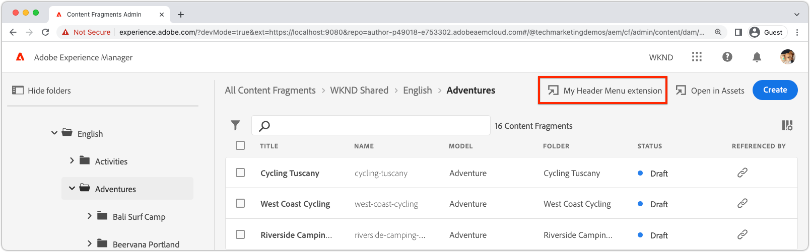

# Header menu extension

{align="center"}

Extensions that include a header menu, introduce a button to the header of the AEM Content Fragment Console that displays when __no__ Content Fragments are selected. Because header menu extension buttons only display when no Content Fragments are selected, they typically do no act upon existing Content Fragments. Instead, header menus extensions typically:

+ Create new Content Fragments using custom logic, such as creating a set of Content Fragments, linked via content references.
+ Acting upon a programmatically selected set of Content Fragments, such as exporting all Content Fragments created in the last week.

## Extension registration

`ExtensionRegistration.js` is the entry point for the AEM extension and defines:

1. The extension type; in the case a header menu button.
1. The extension button's definition, in `getButton()` function.
1. The click handler for the button, in the `onClick()` function.

+ `./src/aem-cf-console-admin-1/web-src/src/components/ExtensionRegistration.js`

```javascript
function ExtensionRegistration() {
  const init = async () => {
    const guestConnection = await register({
      id: extensionId, // Must be unique
      methods: {
        // Configure your Header Menu button here
        headerMenu: {
          getButton() {
            return {
              'id': 'example.my-header-menu-button',    // Unique ID for the button
              'label': 'My header menu button',         // Button label 
              'icon': 'Bookmark'                        // Button icon; get name from: https://spectrum.adobe.com/page/icons/ (Remove spaces, keep uppercase)
            }
          },

          // Click handler for the Header Menu extension button
          onClick() {
            // Header Menu buttons are not associated with selected Content Fragment, and thus are not provided a selection parameter.        
            // Do work like importing data from a well known location, or exporting a welll known set of data
            doWork();            
          },
        }
      }
    }
  }
  init().catch(console.error);
}
```

## Modal


AEM Content Fragment Console header menu extensions may require:

+ Additional input from the user to perform the desired action.
+ The ability to provide the user details information about the result of the action.

To support these requirements, the AEM Content Fragment Console extension allows a custom modal that renders as a React application.

+ `./src/aem-cf-console-admin-1/web-src/src/components/ExtensionRegistration.js`

```javascript
function ExtensionRegistration() {
  ...
  onClick() {
    // Create a URL that maps to the React route to be rendered in the modal
    const modalURL = "/index.html#/content-fragment/my-extension";

    // Open the modal and display the React route created above
    guestConnection.host.modal.showUrl({
      title: "My modal title",
      url: modalURL
    })     
  }
  ...     
}...
```

<div class="column is-8-desktop is-full-mobile is-half-tablet" style="
    border: solid 1px #ccc;
    border-radius: 10px;
    margin: 4rem auto;
">
  <div class="is-flex is-padded-small is-padded-big-mobile">
    <div>
      <p class="has-text-weight-bold is-size-36 is-size-27-touch is-margin-bottom-big has-text-blackest">Skip to creating a modal</p>
      <p class="has-text-blackest">Learn how to create a modal that is displayed when clicking the header menu extension button.</p>
      <div class="has-align-start is-margin-top-big">
        <a href="./modal.md" target="_blank" class="spectrum-Button spectrum-Button--outline spectrum-Button--primary spectrum-Button--sizeM">
          <span class="spectrum-Button-label has-no-wrap has-text-weight-bold" title="Learn to build a modal">Learn to build a modal</span>
        </a>
      </div>
    </div>
  </div>
</div>

## No modal

Occasionally, AEM Content Fragment console header menu extensions do not require further interaction with the user, for example:

+ Invoking a back-end process that does not require user input, such as import or export.
+ Opening a new web page, such as to internal documentation on content guidelines.

In these instances, the AEM Content Fragment Console extension does not require a [modal](#modal), and may perform the work directly in the header menu button's `onClick` handler.

The AEM Content Fragment Console extension allows for a progress indicator to overlay the AEM Content Fragment Console while the work is being performed, blocking the user from performing further actions. The use of the the progress indicator is optional, but useful for communicating the progress of synchronous work to the user.

+ `./src/aem-cf-console-admin-1/web-src/src/components/ExtensionRegistration.js`

```javascript
function ExtensionRegistration() {
  guestConnection: { ...
    methods: { ...
      headerMenu: { ...
        onClick() {
          // Optionally, show the progress indicator overlay on the AEM Content Fragment console
          guestConnection.host.progressCircle.start();
          // Perform work on the selected Content Fragments
          doWork();
          // Hide the progress indicator overlay on the AEM Content Fragment console when the work is done
          guestConnection.host.progressCircle.stop();
        }
      }
    }
  }
}
```
