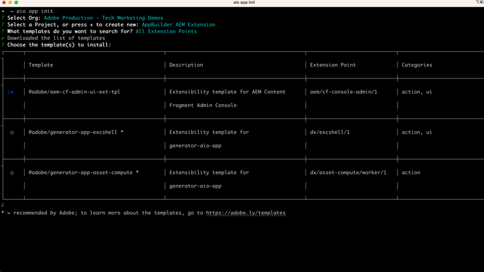
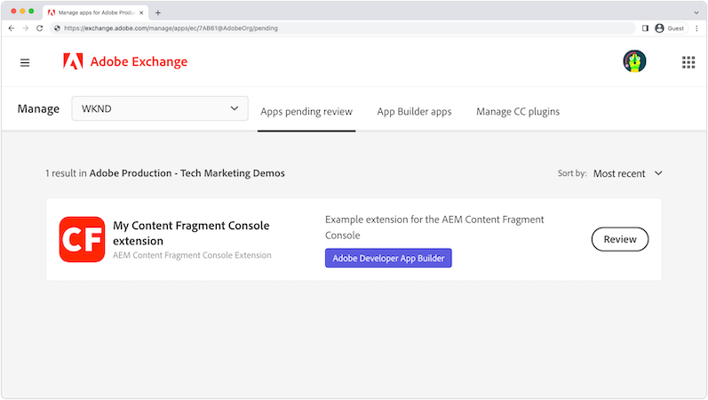

# AEM Content Fragments Console extension

[AEM Content Fragments Console](https://experienceleague.adobe.com/docs/experience-manager-cloud-service/content/sites/administering/content-fragments/content-fragments-console.html) extensions can be added through two extension points: a button in the [Content Fragment Console's](https://experienceleague.adobe.com/docs/experience-manager-cloud-service/content/sites/administering/content-fragments/content-fragments-console.html) header menu or action bar. The extensions are written in JavaScript that run as App Builder apps - and can implement a custom web UI and serverless Adobe I/O Runtime actions to perform more intensive, long-running work.

{align="center"}

| Extension type | Description | Parameter(s) |
| :--- | :--- | :--- |
| Header menu | Adds a button to the header that displays when __zero__ Content Fragments are selected. | None. |
| Action bar | Adds a button to the action bar that displays when __one or more__ Content Fragments are selected. | An array of the selected Content Fragments' paths. |

A single AEM Content Fragments Console extension can include zero or one Header menu, and zero or one Action bar extension type. If multiple extension types of the same type are required, multiple AEM Content Fragments Console extensions must be created.

AEM Content Fragments Console extensions, require an [Adobe Developer Console project](https://developer.adobe.com/uix/docs/services/aem-cf-console-admin/extension-development/#create-a-project-in-adobe-developer-console) and an [App Builder app](https://developer.adobe.com/uix/docs/services/aem-cf-console-admin/code-generation) using the `@adobe/aem-cf-admin-ui-ext-tpl` template, associated with the Adobe Developer Console project.

Select from the following capabilities when generating the App Builder app, based on what the extension does. Any combinations of options can be used in an extension.

|                                            | Add button to [Header menu](./header-menu.md) | Add button to [Action Bar](./action-bar.md) | Show [Modal](./modal.md) | Add [server-side handler](./runtime-action.md) |  
| ------------------------------------------ | :-----------------------: | :----------------------: | :--------: | :--------------------:  |
| Available when Content Fragments are not selected | ✔                         |                          |            |                         |
| Available when one or more Content Fragments are selected |                           | ✔                        |            |                         |   
| Collects custom input from user                   |                           |                          | ✔️          |                         |
| Displays custom feedback to user           |                           |                          | ✔️          |                         |
| Invokes HTTP requests to AEM                       |                           |                          |            | ✔                       |
| Invokes HTTP requests to Adobe/3rd party services  |                           |                          |            | ✔                       |

## Adobe Developer documentation

Adobe Developer contains developer details on AEM Content Fragment Console extensions. Please review the [Adobe Developer content for further technical details](https://developer.adobe.com/uix/docs/).

## Develop an extension

Follow the steps outlined below to learn how to generate, develop, and deploy an AEM Content Fragment Console extension for AEM as a Cloud Service.

    <!-- Create Adobe Developer Project -->
    

        

            

                <figure class="image is-16by9">
                    
                </figure>
            

            

                

                    
1. Create a project

                    
Create an Adobe Developer Console project that defines it's access to other Adobe services, and manages its deployments.

                    <a href="./adobe-developer-console-project.md" class="spectrum-Button spectrum-Button--outline spectrum-Button--primary spectrum-Button--sizeM">
                        Create an Adobe Developer Project
                    </a>
                

            

        

    

    <!-- Generate an Extension app -->
    

        

            

                <figure class="image is-16by9">
                    
                </figure>
            

            

                

                    
2. Initialize an extension app

                    
Initialize an AEM Content Fragment Console extension App Builder app that defines where the extension appears, and the work it performs.

                    <a href="./app-initialization.md" class="spectrum-Button spectrum-Button--outline spectrum-Button--primary spectrum-Button--sizeM">
                        Initialize an extension app
                    </a>
                

            

        

    

    <!-- Extension registration -->
    

        

            

                <figure class="image is-16by9">
                    
                </figure>
            

            

                

                    
3. Extension registration

                    
Register the extension in the AEM Content Fragment Console as a header menu or action bar extension type.

                    <a href="./extension-registration.md" class="spectrum-Button spectrum-Button--outline spectrum-Button--primary spectrum-Button--sizeM">
                        Register the extension
                    </a>
                

            

        

    

    <!-- Header Menu -->
    

        

            

                <figure class="image is-16by9">
                    
                </figure>
            

            

                

                    
4a. Header Menu

                    
Learn how to create an AEM Content Fragment Console header menu extension.

                    <a href="./header-menu.md" class="spectrum-Button spectrum-Button--outline spectrum-Button--primary spectrum-Button--sizeM">
                        Extend the header menu
                    </a>
                

            

        

    

    <!-- Action Bar -->
    

        

            

                <figure class="image is-16by9">
                    
                </figure>
            

            

                

                    
4b. Action Bar

                    
Learn how to create an AEM Content Fragment Console action bar extension.

                    <a href="./action-bar.md" class="spectrum-Button spectrum-Button--outline spectrum-Button--primary spectrum-Button--sizeM">
                        Extend the action bar
                    </a>
                

            

        

    

    <!-- Modal -->
    

        

            

                <figure class="image is-16by9">
                    
                </figure>
            

            

                

                    
5. Modal

                    
Add a custom modal to the extension that can be used to create bespoke experiences for users. Modals often collect input from users, and display the results of an operation.

                    <a href="./modal.md" class="spectrum-Button spectrum-Button--outline spectrum-Button--primary spectrum-Button--sizeM">
                        Add a modal
                    </a>
                

            

        

    

    <!-- Adobe I/O Runtime action -->
    

        

            

                <figure class="image is-16by9">
                    
                </figure>
            

            

                

                    
6. Adobe I/O Runtime action

                    
Add a serverless Adobe I/O Runtime action that the extension can invoke to interact with Content Fragments and AEM to perform custom business operations.

                    <a href="./runtime-action.md" class="spectrum-Button spectrum-Button--outline spectrum-Button--primary spectrum-Button--sizeM">
                        Add an Adobe I/O Runtime action
                    </a>
                

            

        

    

    <!-- Test -->
    

        

            

                <figure class="image is-16by9">
                    
                </figure>
            

            

                

                    
7. Test

                    
Test the extensions during development, and sharing completed extensions to  QA or UAT testers using a special URL.

                    <a href="./test.md" class="spectrum-Button spectrum-Button--outline spectrum-Button--primary spectrum-Button--sizeM">
                        Test the extension
                    </a>
                

            

        

    

    <!-- Extension deployment -->
    

        

            

                <figure class="image is-16by9">
                    
                </figure>
            

            

                

                    
8. Production deployment

                    
Deploy the extension to Adobe I/O making it available to AEM users. Extensions can be updated, and removed as well.

                    <a href="./deploy.md" class="spectrum-Button spectrum-Button--outline spectrum-Button--primary spectrum-Button--sizeM">
                        Deploy to production
                    </a>
                

            

        

    

## Example extensions

Example AEM Content Fragment Console extensions.

    <!-- Bulk property update extension -->
    

        

            

                <figure class="image is-16by9">
                    
                </figure>
            

            

                

                    
Bulk property update extension

                    
Explore an example action bar extension that bulk updates a property on selected Content Fragments.

                    <a href="./example-extensions/bulk-property-update.md" class="spectrum-Button spectrum-Button--outline spectrum-Button--primary spectrum-Button--sizeM">
                        Explore the example extension
                    </a>
                

            

        

    

    <!-- Image Generartion update extension -->
    

        

            

                <figure class="image is-16by9">
                    
                </figure>
            

            

                

                    
OpenAI-based image generation and upload to AEM extension

                    
Explore an example action bar extension that generates an image using OpenAI, uploads it to AEM and updates image property on the selected Content Fragment.

                    <a href="./example-extensions/image-generation-and-image-upload.md" class="spectrum-Button spectrum-Button--outline spectrum-Button--primary spectrum-Button--sizeM">
                        Explore the example extension
                    </a>
                

            

        

    
    

    

