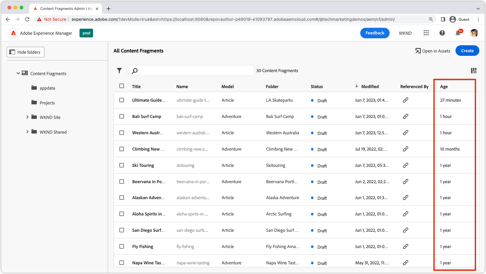

# Custom grid columns

{align="center"}   

Custom grid columns can be added to the Content Fragment Console using the  `contentFragmentGrid` extension point. This example shows how to add a custom column that displays the Content Fragments age, based on its last modified date, in human readable format.

## Extension point

This example extends to extension point `contentFragmentGrid` to add a custom column to the Content Fragment Console.

| AEM UI extended | Extension point |
| ------------------------ | --------------------- | 
| [Content Fragment Console](https://developer.adobe.com/uix/docs/services/aem-cf-console-admin/) | [Grid Columns](https://developer.adobe.com/uix/docs/services/aem-cf-console-admin/api/grid-columns/) | 

## Example extension

The following example creates a custom column, `Age` that displays the age of the Content Fragment in human readable format. The age is computed from the last modified date of the Content Fragment.

The code shows how the Content Fragment's metadata can be obtained in the extension's registration file, and how the Content Fragment's JSON content can be transformed can be exported.

This example uses the [Luxon](https://moment.github.io/luxon/) library to compute the age of the Content Fragment, installed via `npm i luxon`.

### Extension registration

`ExtensionRegistration.js`, mapped to the index.html route, is the entry point for the AEM extension and defines:

+ The location of the extension injects itself (`contentFragmentGrid`) in the AEM authoring experience
+ The definition of the custom column, in the `getColumns()` function
+ The values for each custom column, by row

```javascript
import React from "react";
import { generatePath } from "react-router";
import { Text } from "@adobe/react-spectrum";
import { register } from "@adobe/uix-guest";
import { extensionId } from "./Constants";
import { Duration } from "luxon";

/**
 * Set up a in-memory cache of the custom column data.
 * This is important if the work to contain column data is expensive, such as making HTTP requests to obtain the value.
 * 
 * The caching of computed value is optional, but recommended if the work to compute the column data is expensive.
 */
const COLUMN_AGE_ID = "age";
const cache = {
  [COLUMN_AGE_ID]: {},
};

function ExtensionRegistration() {
  const init = async () => {
    const guestConnection = await register({
      id: extensionId,
      methods: {
        contentFragmentGrid: {
          getColumns() {
            return [
              {
                id: COLUMN_AGE_ID,          // Give the column a unique ID.
                label: "Age",               // The label to display
                render: async function (fragments) {
                  // This function is run for each row in the grid.
                  // The fragments parameter is an array of all the fragments (aka each row) in the grid.
                  const context = await guestConnection.hostConnection.getRemoteApi().getSharedContext();

                  // Iterate over each fragment in the grid
                  for (const fragment of fragments) {
                    // Check if a previous pass has computed the value for this fragment.id. If it has, we can skip it.
                    if (!cache[COLUMN_AGE_ID][fragment.id]) {
                      // If the fragment.id has not been computed and cached, then compute the value and cache it.
                      cache[COLUMN_AGE_ID][fragment.id] = await computeAgeColumnValue(fragment, context);
                    }
                  }
                  // Return the populated cache of the custom column data.
                  return cache[COLUMN_AGE_ID];
                }
              },
              // Add other custom columns here...
            ];
          },
        },
      },
    });
  };
  init().catch(console.error);

  return <Text>IFrame for integration with Host (AEM)...</Text>;
}

async function computeAgeColumnValue(fragment, context) {
  // Various data is available in the sharedContext, such as the AEM host, the IMS token, and the fragment itself.
  
  // Accessing AEM APIs requires the IMS token, which is available in the sharedContext, and also supporting CORS configurations deployed to AEM Author.
  //const aemHost = context.aemHost;
  //const accessToken = context.auth.imsToken;
  
  // Get the user's locale to format the value of the column.
  const locale = context.locale;

  // Compute the value of the column, in this case we are computing the age of the fragment from its last modified date.
  const duration = Duration.fromMillis(Date.now() - fragment.modifiedDate).rescale();

  let largestUnit = {};

  if (duration.years > 0) {
    largestUnit = {years: duration.years};
  } else if (duration.months > 0) {
    largestUnit = {months: duration.months};
  } else if (duration.days > 0) {
    largestUnit = {days: duration.days};
  } else if (duration.hours > 0) {
    largestUnit = {hours: duration.hours};
  } else if (duration.minutes > 0) {
    largestUnit = {minutes: duration.minutes};
  } else if (duration.seconds > 0) {
    largestUnit = {seconds: duration.seconds};
  }

  // Convert the largest unit of the age to human readable format.
  const columnValue = Duration.fromObject(largestUnit, {locale: locale}).toHuman();

  // Return the value of the column.
  return columnValue;
}

export default ExtensionRegistration;
```

#### Content Fragment data

The `render(..)` method  in `getColumns()` is passed an array of fragments. Each object in the array represents a row in the grid, and contains the following metadata about the Content Fragment. This metadata can be used to popular custom columns in the grid.


```javascript
render: async function (fragments) {
    for (const fragment of fragments) {
        // An example value from this console log is displayed below.
        console.log(fragment);
    }
}
```

Example Content Fragment JSON that is available as an element of the `fragments` parameter in the `render(..)` method.

```json
{
    "id": "/content/dam/wknd-shared/en/magazine/alaska-adventure/alaskan-adventures",
    "name": "alaskan-adventures",
    "title": "Alaskan Adventures",
    "status": "draft",
    "statusPreview": null,
    "model": {
        "name": "Article",
        "id": "/conf/wknd-shared/settings/dam/cfm/models/article"
    },
    "folderId": "/content/dam/wknd-shared/en/magazine/alaska-adventure",
    "folderName": "Alaska Adventure",
    "createdBy": "admin",
    "createdDate": 1684875665786,
    "modifiedBy": "admin",
    "modifiedDate": 1654104774889,
    "publishedBy": "",
    "publishedDate": 0,
    "locale": "",
    "main": true,
    "translations": {
        "locale": "en",
        "languageCopies": [
            {
                "path": "/content/dam/wknd-shared/en/magazine/alaska-adventure/alaskan-adventures",
                "title": "Alaskan Adventures",
                "locale": "en",
                "model": "Article",
                "status": "DRAFT",
                "id": "/content/dam/wknd-shared/en/magazine/alaska-adventure/alaskan-adventures"
            }
        ]
    },
    "transientStatus": {},
    "extensions": {
        "age": "1 year old"
    }
}
```

If other data is required to populate the custom column, HTTP requests can be made to AEM Author to retrieve the data.

>[!IMPORTANT]
>
> Ensure that the AEM Author instance is configured to allow [cross-origin requests](https://experienceleague.adobe.com/docs/experience-manager-learn/getting-started-with-aem-headless/deployments/configurations/cors.html) from the origins the AppBuilder app is running on. Allowed origins include `https://localhost:9080`, the AppBuilder Stage origin, and the AppBuilder Production origin.
>
> Alternatively, the extension can call a custom [AppBuilder action](../../runtime-action.md) that makes the request to AEM Author on behalf of the extension.


```javascript
const context = await guestConnection.hostConnection.getRemoteApi().getSharedContext();
...
// Fetch the Content Fragment JSON from AEM Author using the AEM Assets HTTP API
const response = await fetch(`${context.aemHost}${fragment.id.slice('/content/dam'.length)}.json`, {
    headers: {
        'Authorization': `Bearer ${context.auth.imsToken}`
    }
})
...
```

#### Column definition

The result of the render method is a JavaScript object whose keys are the path of the Content Fragment (or the `fragment.id`) and the value is value to display in the column.

For example, this extension's results for the `age` column are:

```json
{
    "/content/dam/wknd-shared/en/magazine/la-skateparks/ultimate-guide-to-la-skateparks": "22 minutes",
    "/content/dam/wknd-shared/en/adventures/bali-surf-camp/bali-surf-camp": "1 hour",
    "/content/dam/wknd-shared/en/magazine/western-australia/western-australia-by-camper-van": "1 hour",
    "/content/dam/wknd-shared/en/adventures/climbing-new-zealand/climbing-new-zealand": "10 months",
    "/content/dam/wknd-shared/en/magazine/skitouring/skitouring": "1 year",
    "/content/dam/wknd-shared/en/adventures/beervana-portland/beervana-in-portland": "1 year",
    "/content/dam/wknd-shared/en/magazine/alaska-adventure/alaskan-adventures": "1 year",
    "/content/dam/wknd-shared/en/magazine/arctic-surfing/aloha-spirits-in-northern-norway": "1 year",
    "/content/dam/wknd-shared/en/magazine/san-diego-surf-spots/san-diego-surfspots": "1 year",
    "/content/dam/wknd-shared/en/magazine/fly-fishing-amazon/fly-fishing": "1 year",
    "/content/dam/wknd-shared/en/adventures/napa-wine-tasting/napa-wine-tasting": "1 year",
    "/content/dam/wknd-shared/en/adventures/cycling-southern-utah/cycling-southern-utah": "1 year",
    "/content/dam/wknd-shared/en/adventures/gastronomic-marais-tour/gastronomic-marais-tour": "1 year",
    "/content/dam/wknd-shared/en/adventures/tahoe-skiing/tahoe-skiing": "1 year",
    "/content/dam/wknd-shared/en/adventures/surf-camp-in-costa-rica/surf-camp-costa-rica": "1 year",
    "/content/dam/wknd-shared/en/adventures/yosemite-backpacking/yosemite-backpacking": "1 year",
    "/content/dam/wknd-shared/en/adventures/whistler-mountain-biking/whistler-mountain-biking": "1 year",
    "/content/dam/wknd-shared/en/adventures/colorado-rock-climbing/colorado-rock-climbing": "1 year",
    "/content/dam/wknd-shared/en/adventures/ski-touring-mont-blanc/ski-touring-mont-blanc": "1 year",
    "/content/dam/wknd-shared/en/adventures/cycling-tuscany/cycling-tuscany": "1 year",
    "/content/dam/wknd-shared/en/adventures/west-coast-cycling/west-coast-cycling": "1 year",
    "/content/dam/wknd-shared/en/adventures/downhill-skiing-wyoming/downhill-skiing-wyoming": "1 year",
    "/content/dam/wknd-shared/en/adventures/riverside-camping-australia/riverside-camping-australia": "1 year",
    "/content/dam/wknd-shared/en/contributors/ian-provo": "1 year",
    "/content/dam/wknd-shared/en/contributors/sofia-sj-berg": "1 year",
    "/content/dam/wknd-shared/en/contributors/justin-barr": "1 year",
    "/content/dam/wknd-shared/en/contributors/jake-hammer": "1 year",
    "/content/dam/wknd-shared/en/contributors/jacob-wester": "1 year",
    "/content/dam/wknd-shared/en/contributors/stacey-roswells": "1 year",
    "/content/dam/wknd-shared/en/contributors/kumar-selveraj": "1 year"
}
```
