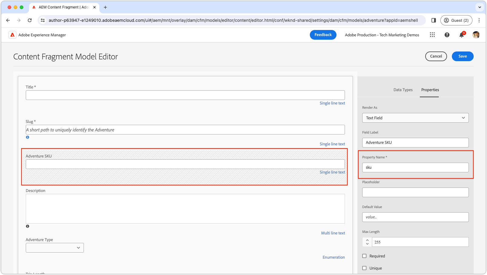

# Custom fields

Learn how to create custom fields in the AEM Content Fragment Editor.

>[!VIDEO](https://video.tv.adobe.com/v/3427585?learn=on)

AEM UI extensions should be developed using the [Adobe React Spectrum](https://react-spectrum.adobe.com/react-spectrum/index.html) framework, as this maintains a consistent look and feel with the rest of AEM, and also has an extensive library of pre-built functionality, decreasing development time.

## Extension point

This example replaces an existing filed in the Content Fragment Editor with a custom implementation.

| AEM UI extended | Extension point |
| ------------------------ | --------------------- | 
| [Content Fragment Editor](https://developer.adobe.com/uix/docs/services/aem-cf-editor/) | [Custom form element rendering](https://developer.adobe.com/uix/docs/services/aem-cf-editor/api/custom-fields/) | 

## Example extension

This example demonstrates restricting field values in the Content Fragment Editor to a predetermined set by replacing the standard field with a custom dropdown of predefined SKUs. Authors can select from this specific SKU list. While SKUs usually come from a Product Information Management (PIM) system, this example simplifies by statically listing the SKUs.

The source code for this example is [available for download](./assets/editor-custom-field/content-fragment-editor-custom-field-src.zip).

### Content Fragment Model definition

This example binds to any Content Fragment field whose name is `sku` (via a [regular expression match](#extension-registration) of `^sku$`) and replaces it with a custom field. The example uses the WKND Adventure Content Fragment model that has been updated  and the definition is as follows:



Despite the custom SKU field being displayed as a dropdown, its underlying model is configured as a text field. The custom field implementation only needs to align with the appropriate property name and type, facilitating the replacement of the standard field with the custom dropdown version.


### App routes

In the main React component `App.js`, include the `/sku-field` route to render the `SkuField` React component.

`src/aem-cf-editor-1/web-src/src/components/App.js`

```javascript
import React from "react";
import ErrorBoundary from "react-error-boundary";
import { HashRouter as Router, Routes, Route } from "react-router-dom";
import ExtensionRegistration from "./ExtensionRegistration";
import SkuField from "./SkuField"; // Custom component implemented below

function App() {
  return (
    <Router>
      <ErrorBoundary onError={onError} FallbackComponent={fallbackComponent}>
        <Routes>
          <Route index element={<ExtensionRegistration />} />
          <Route
            exact path="index.html"
            element={<ExtensionRegistration />}
          />
          {/* This is the React route that maps to the custom field */}
          <Route
            exact path="/sku-field"
            element={<SkuField />}/>
        </Routes>
      </ErrorBoundary>
    </Router>
  )
  ...
}
...
```

This custom route of `/sku-field` maps to the `SkuField` component is used below in the [Extension registration](#extension-registration).

### Extension registration

`ExtensionRegistration.js`, mapped to the index.html route, is the entry point for the AEM extension and defines:

+ The widget definition in `getDefinitions()` function with `fieldNameExp` and `url` attributes. The complete list of available attributes is available in the [Custom Form Element Rendering API Reference](https://developer.adobe.com/uix/docs/services/aem-cf-editor/api/custom-fields/#api-reference).
+ The `url` attribute value, a relative URL path (`/index.html#/skuField`) to load the field UI.

`src/aem-cf-editor-1/web-src/src/components/ExtensionRegistration.js`

```javascript
import { Text } from "@adobe/react-spectrum";
import { register } from "@adobe/uix-guest";
import { extensionId } from "./Constants";

function ExtensionRegistration() {
  const init = async () => {
    const guestConnection = await register({
      id: extensionId,
      methods: {
        field: {
          getDefinitions() {
            return [
              // Multiple fields can be registered here.
              {
                fieldNameExp: '^sku$',  // This is a regular expression that matches the field name in the Content Fragment Model to replace with React component specified in the `url` key.
                url: '/#/sku-field',    // The URL, which is mapped vai the Route in App.js, to the React component that will be used to render the field.
              },
              // Other bindings besides fieldNameExp, other bindings can be used as well as defined here:
              // https://developer.adobe.com/uix/docs/services/aem-cf-editor/api/custom-fields/#api-reference
            ];
          },
        },
      }
    });
  };
  init().catch(console.error);

  return <Text>IFrame for integration with Host (AEM)...</Text>;
}

export default ExtensionRegistration;
```

### Custom field

The `SkuField` React component updates the Content Fragment Editor with a custom UI, using Adobe React Spectrum for its picker form. Highlights include:

+ Utilizing `useEffect` for initialization and connection to AEM's Content Fragment Editor, with a loading state shown until setup is complete.
+ Rendering inside an iFrame, it dynamically adjusts the iFrame's height via the `onOpenChange` function to accommodate the Adobe React Spectrum Picker's dropdown.
+ Communicates field selections back to the host using `connection.host.field.onChange(value)` in the `onSelectionChange` function, ensuring the selected value is validated and auto-saved per the Content Fragment Model's guidelines.

Custom fields are rendered within an iFrame injected into the Content Fragment Editor. Communication between the custom field code and the Content Fragment Editor is exclusively through the `connection` object, established by the `attach` function from the `@adobe/uix-guest` package.

`src/aem-cf-editor-1/web-src/src/components/SkuField.js`

```javascript
import React, { useEffect, useState } from "react";
import { extensionId } from "./Constants";
import { attach } from "@adobe/uix-guest";
import { Provider, View, lightTheme } from "@adobe/react-spectrum";
import { Picker, Item } from "@adobe/react-spectrum";

const SkuField = (props) => {
  const [connection, setConnection] = useState(null);
  const [validationState, setValidationState] = useState(null);
  const [value, setValue] = useState(null);
  const [model, setModel] = useState(null);
  const [items, setItems] = useState(null);

  /**
   * Mock function that gets a list of Adventure SKUs to display.
   * The data could come anywhere, AEM's HTTP APIs, a PIM, or other system.
   * @returns a list of items for the picker
   */
  async function getItems() {
    // Data to drive input field validation can come from anywhere.
    // Fo example this commented code shows how it could be fetched from an HTTP API.
    // fetch(MY_API_URL).then((response) => response.json()).then((data) => { return data; }

    // In this example, for simplicity, we generate a list of 25 SKUs.
    return Array.from({ length: 25 }, (_, i) => ({ 
        name: `WKND-${String(i + 1).padStart(3, '0')}`, 
        id: `WKND-${String(i + 1).padStart(3, '0')}` 
    }));
  }

  /**
   * When the fields changes, update the value in the Content Fragment Editor
   * @param {*} value the selected value in the picker
   */
  const onSelectionChange = async (value) => {
    // This sets the value in the React state of the custom field
    setValue(value);
    // This calls the setValue method on the host (AEM's Content Fragment Editor)
    connection.host.field.onChange(value);
  };

  /**
   * Some widgets, like the Picker, have a variable height.
   * In these cases adjust the Content Fragment Editor's iframe's height so the field doesn't get cut off.     *
   * @param {*} isOpen true if the picker is open, false if it's closed
   */
  const onOpenChange = async (isOpen) => {
    if (isOpen) {
      // Calculate the height of the picker box and its label, and surrounding padding.
      const pickerHeight = Number(document.body.clientHeight.toFixed(0));
      // Calculate the height of the picker options dropdown, and surrounding padding.
      // We do this  by multiplying the number of items by the height of each item (32px) and adding 12px for padding.
      const optionsHeight = items.length * 32 + 12;

      // Set the height of the iframe to the height of the picker + the height of the options, or 400px, whichever is smaller.
      // The options will scroll if they they cannot fit into 400px
      const height = Math.min(pickerHeight + optionsHeight, 400);

      // Set the height of the iframe in the Content Fragment Editor
      await connection.host.field.setHeight(height);
    } else {
      // Set the height of the iframe in the Content Fragment Editor to the height of the closed picker.
      await connection.host.field.setHeight(
        Number(document.body.clientHeight.toFixed(0))
      );
    }
  };

  useEffect(() => {
    const init = async () => {
      // Connect to the host (AEM's Content Fragment Editor)
      const conn = await attach({ id: extensionId });
      setConnection(conn);

      // get the Content Fragment Model
      setModel(await conn.host.field.getModel());

      // Share the validation state back to the client.
      // When conn.host.field.setValue(value) is called, the
      await conn.host.field.onValidationStateChange((state) => {
        // state can be `valid` or `invalid`.
        setValidationState(state);
      });
      // Get default value from the Content Fragment Editor
      // (either the default value set in the model, or a perviously set value)
      setValue(await conn.host.field.getDefaultValue());

      // Get the list of items for the picker; in this case its a list of adventure SKUs 
      // This could come from elsewhere in AEM or from an external system.
      setItems(await getItems());
    };

    init().catch(console.error);
  }, []);

  // If the component is not yet initialized, return a loading state.
  if (!connection || !model || !items) {
    // Put whatever loader you like here...
    return <Provider theme={lightTheme}>Loading custom field...</Provider>;
  }

  // Wrap the Spectrum UI component in a Provider theme, such that it is styled appropriately.
  // Render the picker, and bind to the data and custom event handlers.

  // Set as much of the model as we can, to allow maximum authoring flexibility without developer support.
  return (
    <Provider theme={lightTheme}>
      <View width="100%">
        <Picker
          label={model.fieldLabel}
          isRequired={model.required}
          placeholder={model.emptyText}
          errorMessage={model.customErrorMsg}
          selectedKey={value}
          necessityIndicator="icon"
          shouldFlip={false}
          width={"90%"}
          items={items}
          isInvalid={validationState === "invalid"}
          onSelectionChange={onSelectionChange}
          onOpenChange={onOpenChange}
        >
          {(item) => <Item key={item.value}>{item.name}</Item>}
        </Picker>
      </View>
    </Provider>
  );
};

export default SkuField;
```
