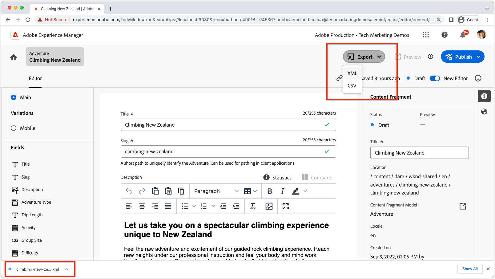

# Export Content Fragment to XML

{align="center"}

Custom buttons can be added to the Content Fragment Editor header menu using the `headerMenu` extension point. This example shows how to add a button to the header menu and how to handle the click event to export the active Content Fragment as XML or CSV.

Header buttons can exist as a single button, or as a button with subitems. This example shows how to implement a button with subitems, however includes the commented out code to implement a single button. 

## Extension point

This example extends to extension point `headerBar` to add custom button to the Content Fragment Editor.

| AEM UI extended | Extension point |
| ------------------------ | --------------------- | 
| [Content Fragment Editor](https://developer.adobe.com/uix/docs/services/aem-cf-editor/) | [Header Menu](https://developer.adobe.com/uix/docs/services/aem-cf-editor/api/header-menu/) | 

## Example extension

The following example creates a header menu button with two subitems, one to export the active Content Fragment as XML (implemented), and one to export the active Content Fragment as CSV (not implemented).

The code shows how the Content Fragment's content can be obtained in the extension's registration file, and how the Content Fragment's JSON content can be transformed can be exported.

### Extension registration

`ExtensionRegistration.js`, mapped to the index.html route, is the entry point for the AEM extension and defines:

+ The location of the extension button appears (`headerMenu`) in the AEM authoring experience
+ The extension button's definition in getButton() function
+ The click handler for the button, in the onClick() function, or a list of subitems, and their click handlers.

`src/aem-ui-extension/web-src/src/components/ExtensionRegistration.js`

```javascript
import { Text } from "@adobe/react-spectrum";
import { register } from "@adobe/uix-guest";
import { extensionId } from "./Constants";
import { toXML } from 'jstoxml';

// This function is called when the extension is registered with the host and runs in an iframe in the Content Fragment Editor browser window.
function ExtensionRegistration() {

  const init = async () => {
    const guestConnection = await register({
      id: extensionId,
      methods: {
        headerMenu: {
          getButtons() {
            return [
              {
                id: 'export',               // Provide a unique ID for the button
                label: 'Export',            // Provide a label for the button
                variant: 'secondary',
                icon: 'OpenIn',             //  Provide an icon for the button (see https://spectrum.adobe.com/page/icons/ for a list of available icons)
                /*
                onClick: async () => {
                  // Use the onClick handler if you do NOT want sub-items and handle  a single-button click.
                  // This example uses the subItems array below to attach multiple actions to the button.
                  console.log("Clicked Export");
                },
                */
                subItems: [
                  // Sub-items are used to create a dropdown menu with multiple items for the header menu button.
                  // Do not include the subItems property if you do not want sub-items.
                  {
                      id: 'xml',                  // Provide a unique ID for the sub-item
                      label: 'XML',               // Provide a label for the sub-item
                      onClick: async () => {      // Provide a click handler for the sub-item  
                          // Get the Content Fragment JSON representation
                          const contentFragment = await guestConnection.host.contentFragment.getContentFragment();
                          console.log(contentFragment);
                          // Use a library like jstoxml to convert the JSON to XML
                          const xml = toXML({ contentFragment: contentFragment.main }, { header: true, indent: '  ' });
                          // Get the download file name from the Content Fragment's node name (last segment of the path)
                          const contentFragmentName = contentFragment.path.split('/').at(-1);
                          // Trigger the download of the XML contents
                          download(contentFragmentName, 'xml', xml);
                      },
                  },
                  {
                      id: 'csv',
                      label: 'CSV',
                      onClick: async () => {
                          const contentFragment = await guestConnection.host.contentFragment.getContentFragment();
                          alert("Implement your CSV export here!");
                          // This can be implemented in the same way as the XML export above, using a similar library such as https://www.npmjs.com/package/json-2-csv                          
                      },
                  },
              ],
              },
            ];
          },
        },
      }
    });
  };
  init().catch(console.error);

  return <Text>IFrame for integration with Host (AEM)...</Text>;
}

/**
 * This function triggers a download of the content fragment export.
 * 
 * Not all extensions require App Builder workers or React web apps in extension modals. 
 * Extensions like this can be fully implemented in the extension's registration file.
 * 
 * @param {*} name the filename
 * @param {*} type  the file type/extension
 * @param {*} contents the contents of the file to export
 */
function download(name, type, contents) {
  // Create a link element to trigger the download
  const a = document.createElement('a');
  // Set the filename this file should download as
  a.setAttribute('download', `${name}.${type}`);
  // Set the content fragment value as a data URL - This approach typically works for Content Fragments as their text content is usually under 2MB
  // For larger downloads, you may need to use Blob or Streams
  a.href = `data:attachment/${type},${encodeURIComponent(contents)}`;
  // Trigger the download as an attachment
  a.click();
}

export default ExtensionRegistration;
```

#### Content Fragment data

The active Content Fragment can be retrieved using the `getContentFragment()` method on the `guestConnection.host.contentFragment` object.

```javascript
const contentFragment = await guestConnection.host.contentFragment.getContentFragment();
```

The `contentFragment` object contains all the information about the Content Fragment, including the path, model, metadata, main content, and any variants.

```json
{
    "path": "/content/dam/wknd-shared/en/adventures/climbing-new-zealand/climbing-new-zealand",
    "etag": "\"2f18b858f4896ec1d7c41ba7a16bed7d\"",
    "model": {
        "path": "/conf/wknd-shared/settings/dam/cfm/models/adventure",
        "title": "Adventure"
    },
    "fragmentId": "eb0175d3-b011-421b-b1be-0ef5b2b64518",
    "metadata": {
        "title": "Climbing New Zealand",
        "description": "",
        "createdBy": "janedoe@example.com",
        "createdDate": "2022-09-09T18:05:35.453Z",
        "modifiedBy": "janedoe@example.com",
        "modifiedDate": "2023-06-01T14:46:56.394Z",
        "publishedBy": "",
        "publishedDate": "",
        "status": "DRAFT"
    },
    "main": {
        "title": "Climbing New Zealand",
        "slug": "climbing-new-zealand",
        "description": {
            "contentType": "text/html",
            "value": "<h2><b>Let us take you on a spectacular climbing experience unique to New Zealand</b></h2>\n<p>Feel the raw adventure and excitement of our guided rock climbing experience. Reach new heights under our professional instruction and feel your body and mind work together in harmony.&nbsp;Come join us for a guided rock climbing adventure in the mountains that trained Sir Edmund Hilary. Whether it is your first time thinking of putting on climbing shoes or you are an old hand looking for some new challenges, our guides can make your climbing adventure a trip you won't soon forget. New Zealand has countless climbing routes to choose from and is known as one of the premiere climbing destinations in the world. With so many different routes and areas to choose from our guides can tailor each trip to your exact specifications. Let us help you make your New Zealand climbing vacation a memory you will cherish forever!</p>\n<p>Related trips:</p>\n<ul>\n<li><a href=\"../../../../content/dam/wknd-shared/en/adventures/colorado-rock-climbing/colorado-rock-climbing\">Colorado Rock Climbing</a></li>\n<li><a href=\"../../../../content/dam/wknd-shared/en/adventures/yosemite-backpacking/yosemite-backpacking\">Yosemite Backpacking</a>&nbsp;</li>\n</ul>"
        },
        "adventureType": "Overnight Trip",
        "tripLength": "2 Days",
        "activity": "Rock Climbing",
        "groupSize": 3,
        "difficulty": "Intermediate",
        "price": 900,
        "primaryImage": {
            "path": "/content/dam/wknd-shared/en/adventures/climbing-new-zealand/adobestock-140634652.jpeg",
            "name": "adobestock-140634652.jpeg",
            "title": "Rock Climbing and Bouldering above the lake and mountains",
            "size": 688150,
            "mimeType": "image/jpeg",
            "width": 1293,
            "height": 862,
            "id": "7f2a2314-7701-4c27-8945-bd5388ac94da",
            "created": {
                "at": "2022-09-09T18:05:37.383Z",
                "by": "janedoe@example.com"
            },
            "status": "MODIFIED"
        },
        "itinerary": {
            "contentType": "text/html",
            "value": "<h2><b>Day 1 - It's climb time</b></h2>\n<p>We depart and end from a central meeting spot in the town of Fauchere.&nbsp; From there we'll be driving 30-50 minutes to the climbing site. On our way there, we'll go over important safety and climbing procedures. After arriving at trailhead, we will confirm all safety and personal climbing equipment (shoes, harness, helmets, belay devises, and more). Our hike to the climbing area will be between 5 minutes to an hour based on where we decide to climb and the desires of the group. On the rock, we will spend about 6 hours climbing.&nbsp; We'll go over different bouldering and climbing techniques first, fundamentals of setting anchors, belay systems and hardware,. Then, we'll make our way to the top.&nbsp; Once we get there, you'll find the view to be spectactular and the sense of accomplishment even better.&nbsp; But as they say, what goes up must come down. We now face another challenge - rappelling back down. But after a day of learning and applying our skills, we will be very comfortable on the mountain and with our abilities.</p>\n<h2><b>Day 2 - Up the world's highest waterfall climb</b></h2>\n<p>Now it's time to satiate your inner-adrenaline junkie.&nbsp; We're going up behind a 60m waterfall to the top of Wanaka. You'll be pushed to reach the highest point, both mentally and physically, with overhangs to get you there. Enjoy the incredible views of surrounding lakes and mountains once you reach summit.&nbsp;</p>"
        },
        "gearList": {
            "contentType": "text/html",
            "value": "<p>We will provide all technical equipment for the course including rock shoes.</p>\n<p>Please bring appropriate clothing for the weather on each of the days, waterproofs, a warm layer, drinks and lunch for the day.&nbsp;</p>"
        }
    },
    "tags": [],
    "variations": {
        "mobile": {
            "title": "Mobile",
            "description": "This is the Content Fragment variation for use on Mobile devices.",
            "elements": {
                "title": "Climbing NZ",
                "slug": "climbing-new-zealand",
                "description": {
                    "contentType": "text/html",
                    "value": "<h2><b>Let us take you on a spectacular climbing experience unique to New Zealand</b></h2>\n<p>Feel the raw adventure and excitement of our guided rock climbing experience. Reach new heights under our professional instruction and feel your body and mind work together in harmony.&nbsp;Come join us for a guided rock climbing adventure in the mountains that trained Sir Edmund Hilary.&nbsp;</p>"
                },
                "adventureType": "Overnight Trip",
                "tripLength": "2 Days",
                "activity": "Rock Climbing",
                "groupSize": 3,
                "difficulty": "Intermediate",
                "price": 900,
                "primaryImage": {
                    "path": "/content/dam/wknd-shared/en/adventures/climbing-new-zealand/adobestock-140634652.jpeg",
                    "name": "adobestock-140634652.jpeg",
                    "title": "Rock Climbing and Bouldering above the lake and mountains",
                    "size": 688150,
                    "mimeType": "image/jpeg",
                    "width": 1293,
                    "height": 862,
                    "id": "7f2a2314-7701-4c27-8945-bd5388ac94da",
                    "created": {
                        "at": "2022-09-09T18:05:37.383Z",
                        "by": "janedoe@example.com"
                    },
                    "status": "MODIFIED"
                },
                "itinerary": {
                    "contentType": "text/html",
                    "value": "<h2><b>Day 1 - It's climb time</b></h2>\n<p>We depart and end from a central meeting spot in the town of Fauchere.&nbsp; From there we'll be driving 30-50 minutes to the climbing site. On our way there, we'll go over important safety and climbing procedures. After arriving at trailhead, we will confirm all safety and personal climbing equipment (shoes, harness, helmets, belay devises, and more). Our hike to the climbing area will be between 5 minutes to an hour based on where we decide to climb and the desires of the group. On the rock, we will spend about 6 hours climbing.&nbsp; We'll go over different bouldering and climbing techniques first, fundamentals of setting anchors, belay systems and hardware,. Then, we'll make our way to the top.&nbsp; Once we get there, you'll find the view to be spectactular and the sense of accomplishment even better.&nbsp; But as they say, what goes up must come down. We now face another challenge - rappelling back down. But after a day of learning and applying our skills, we will be very comfortable on the mountain and with our abilities.</p>\n<h2><b>Day 2 - Up the world's highest waterfall climb</b></h2>\n<p>Now it's time to satiate your inner-adrenaline junkie.&nbsp; We're going up behind a 60m waterfall to the top of Wanaka. You'll be pushed to reach the highest point, both mentally and physically, with overhangs to get you there. Enjoy the incredible views of surrounding lakes and mountains once you reach summit.&nbsp;</p>\n"
                },
                "gearList": {
                    "contentType": "text/html",
                    "value": "<p>We will provide all technical equipment for the course including rock shoes.</p>\n<p>Please bring appropriate clothing for the weather on each of the days, waterproofs, a warm layer, drinks and lunch for the day.&nbsp;</p>\n"
                }
            },
            "tags": []
        }
    },
    "translations": {
        "data": {
            "locale": "en",
            "languageCopies": [
                {
                    "path": "/content/dam/wknd-shared/en/adventures/climbing-new-zealand/climbing-new-zealand",
                    "title": "Climbing New Zealand",
                    "locale": "en",
                    "model": "Adventure",
                    "status": "DRAFT"
                }
            ]
        },
        "error": null
    }
}
```
