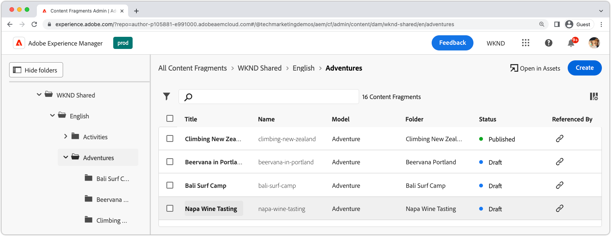
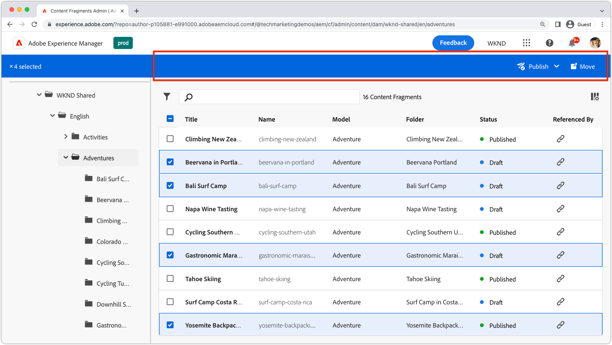
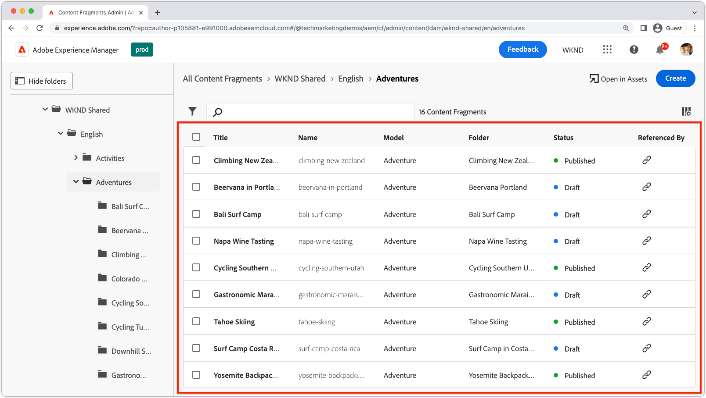
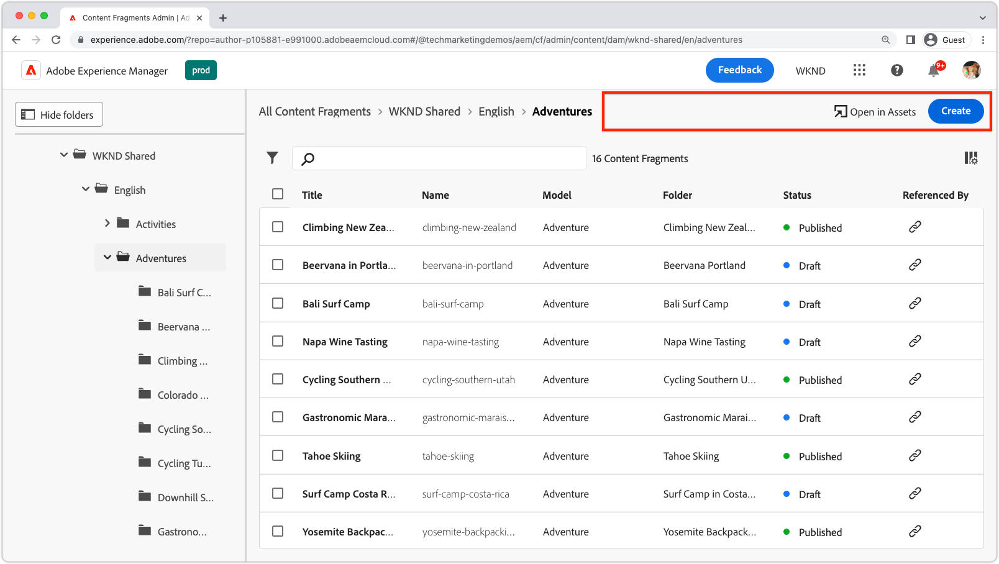
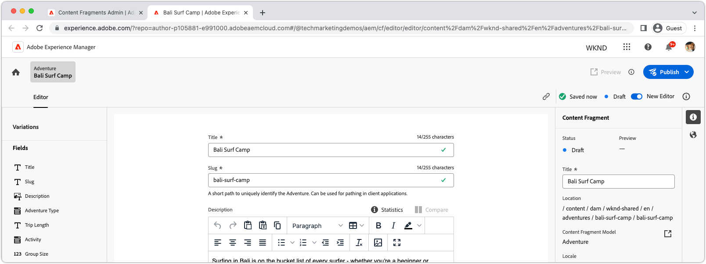
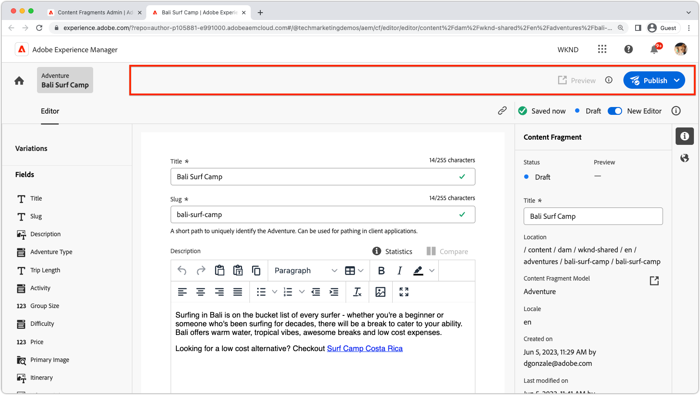
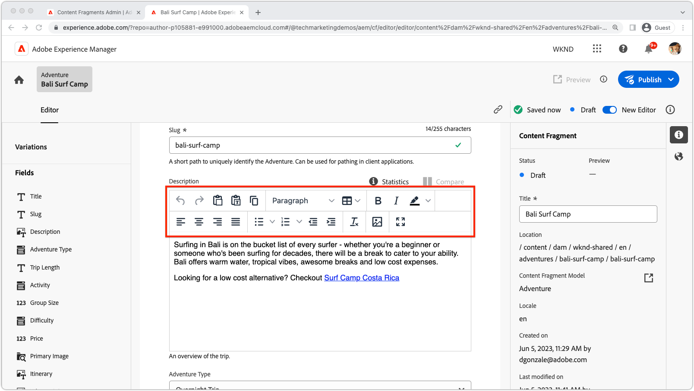
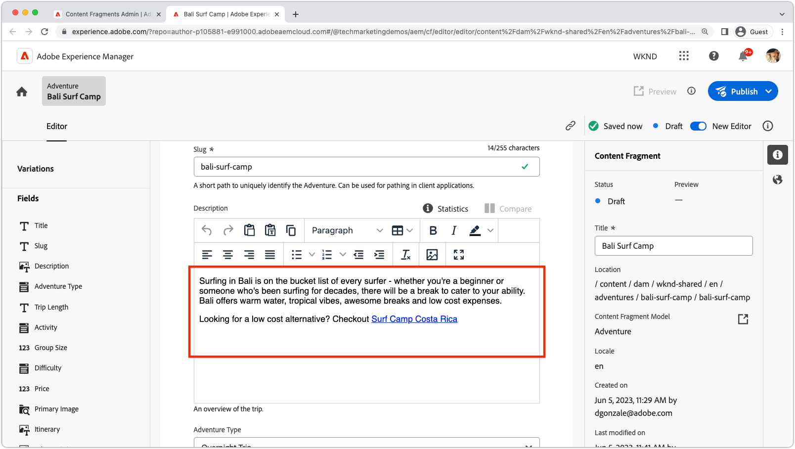
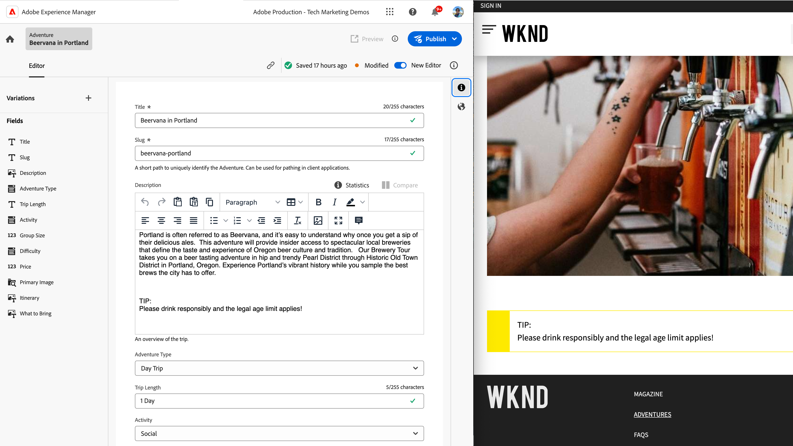

# AEM Content Fragments extensibility

AEM Content Fragments UI is a powerful extensible UI for managing creating, managing, and editing Content Fragments. There are several extension points available for customizing the UI to meet your needs. Different extension points are available based on which UI that you are extending.

## Content Fragments Console extension points

The Content Fragment Console in AEM (Adobe Experience Manager) is a user interface that provides a centralized location for managing and organizing content fragments. It offers a comprehensive set of tools and features to create, edit, publish, and track content fragments, empowering users to efficiently manage structured content across various channels and touchpoints.

[AEM Content Fragments Console](https://experienceleague.adobe.com/docs/experience-manager-cloud-service/content/sites/administering/content-fragments/content-fragments-console.html) is the extensible UI for listing and managing content fragments. [AEM Content Fragment Console extensions are created](https://developer.adobe.com/uix/docs/services/aem-cf-console-admin/code-generation) using the `@adobe/aem-cf-admin-ui-ext-tpl` App Builder template.

The following Content Fragments Console extension points are available:

      

        

          

            <figure class="image is-16by9">
              
            </figure>
          

          

            

              
<a href="https://developer.adobe.com/uix/docs/services/aem-cf-console-admin/api/action-bar/" title="Action bar" target="_blank" rel="referrer">Action bar</a>

              
Customize actions for when one or more Content Fragments are selected.

              <a href="https://developer.adobe.com/uix/docs/services/aem-cf-console-admin/api/action-bar/" class="spectrum-Button spectrum-Button--outline spectrum-Button--primary spectrum-Button--sizeM" target="_blank" rel="referrer">
                View the docs
              </a>
            

          

        

      

  

    

      

        <figure class="image is-16by9">
          
        </figure>
      

      

        

          
<a href="https://developer.adobe.com/uix/docs/services/aem-cf-console-admin/api/grid-columns/" title="Grid columns" target="_blank" rel="referrer">Grid columns</a>

          
Customize the data that appears in the Content Fragments list.

          <a href="https://developer.adobe.com/uix/docs/services/aem-cf-console-admin/api/grid-columns/" class="spectrum-Button spectrum-Button--outline spectrum-Button--primary spectrum-Button--sizeM" target="_blank" rel="referrer">
            View the docs
          </a>
        

      

    

  

  

    

      

        <figure class="image is-16by9">
          
        </figure>
      

      

        

          
<a href="https://developer.adobe.com/uix/docs/services/aem-cf-console-admin/api/header-menu/" title="Header menu" target="_blank" rel="referrer">Header menu</a>

          
Customize actions for when no Content Fragments are selected.

          <a href="https://developer.adobe.com/uix/docs/services/aem-cf-console-admin/api/header-menu/" class="spectrum-Button spectrum-Button--outline spectrum-Button--primary spectrum-Button--sizeM" target="_blank" rel="referrer">
            View the docs
          </a>
        

      

    

  
  

## Content Fragments Editor extension points

The Content Fragment Editor in AEM (Adobe Experience Manager) is a user interface component that allows users to create, edit, and manage content fragments. It provides a visually intuitive and user-friendly environment for working with structured content, enabling users to define and organize content elements, apply templates, manage variations, and preview how the content appears across different channels. The Content Fragment Editor streamlines the process of creating reusable and modular content that can be easily distributed and published across multiple digital experiences.

AEM Content Fragments Editor is the extensible UI for editing content fragments. [AEM Content Fragment Editor extensions are created](https://developer.adobe.com/uix/docs/services/aem-cf-editor/code-generation/) using the `@adobe/aem-cf-editor-ui-ext-tpl` App Builder template.

The following Content Fragments Editor extension points are available:

    

      

        

          <figure class="image is-16by9">
            
          </figure>
        

        

          

            
<a href="https://developer.adobe.com/uix/docs/services/aem-cf-editor/api/header-menu/" title="Header menu" target="_blank" rel="referrer">Header menu</a>

            
Customize actions in the Content Fragment Editor's header menu.

            <a href="https://developer.adobe.com/uix/docs/services/aem-cf-editor/api/header-menu" class="spectrum-Button spectrum-Button--outline spectrum-Button--primary spectrum-Button--sizeM" target="_blank" rel="referrer">
              View the docs
            </a>
          

        

      

    

  

    

      

        <figure class="image is-16by9">
          
        </figure>
      

      

        

          
<a href="https://developer.adobe.com/uix/docs/services/aem-cf-editor/api/rte-toolbar/" title="Rich Text Editor toolbar"  target="_blank" rel="referrer">Rich Text Editor toolbar</a>

          
Add custom button to the Content Fragment Editor's Rich Text Editor (RTE).

          <a href="https://developer.adobe.com/uix/docs/services/aem-cf-editor/api/rte-toolbar/" class="spectrum-Button spectrum-Button--outline spectrum-Button--primary spectrum-Button--sizeM" target="_blank" rel="referrer">
            View the docs
          </a>
        

      

    

  

  

    

      

        <figure class="image is-16by9">
          
        </figure>
      

      

        

          
<a href="https://developer.adobe.com/uix/docs/services/aem-cf-editor/api/rte-widgets/" title="Rich Text Editor widgets" target="_blank" rel="referrer">Rich Text Editor widgets</a>

          
Customize actions in RTE that are bound to keystrokes.

          <a href="https://developer.adobe.com/uix/docs/services/aem-cf-editor/api/rte-widgets/" class="spectrum-Button spectrum-Button--outline spectrum-Button--primary spectrum-Button--sizeM" target="_blank" rel="referrer">
            View the docs
          </a>
        

      

    

  

  

    

      

        <figure class="image is-16by9">
          
        </figure>
      

      

        

          
<a href="https://developer.adobe.com/uix/docs/services/aem-cf-editor/api/rte-badges/ " title="Rich Text Editor badges" target="_blank" rel="referrer">Rich Text Editor badges</a>

          
Customize non-editable styled blocks inside RTE.

          <a href="https://developer.adobe.com/uix/docs/services/aem-cf-editor/api/rte-badges/" class="spectrum-Button spectrum-Button--outline spectrum-Button--primary spectrum-Button--sizeM" target="_blank" rel="referrer">
            View the docs
          </a>
        

      

    

  

## Extension examples

Welcome to a collection of AEM UI extensibility code examples! This resource is designed to provide you with practical demonstrations and insights into extending the Adobe Experience Manager (AEM) user interface. Whether you are a developer looking to enhance the functionality of AEM, these code examples serve as a valuable reference.

  

    

      

        <figure class="image is-16by9">
          
        </figure>
      

      

        

          
<a href="./examples/console-bulk-property-update.md" title="Bulk property update">Bulk Content Fragment property update</a>

          
A Content Fragment Console Action Bar extension with modal and Adobe I/O Runtime action.

          <a href="./examples/console-bulk-property-update.md" class="spectrum-Button spectrum-Button--outline spectrum-Button--primary spectrum-Button--sizeM">
            View the example
          </a>
        

      

    

  

  

        

            

                <figure class="image is-16by9">
                    
                </figure>
            

            

                

                    
<a href="./examples/console-image-generation-and-image-upload.md" title="OpenAI-based image generation and upload to AEM extension">OpenAPI image generation</a>

                    
Explore an example action bar extension that generates an image using OpenAI, uploads it to AEM and updates image property on the selected Content Fragment.

                    <a href="./examples/console-image-generation-and-image-upload.md" class="spectrum-Button spectrum-Button--outline spectrum-Button--primary spectrum-Button--sizeM">
                        View the example
                    </a>
                

            

        

    
    
  

    

      

        <figure class="image is-16by9">
          
        </figure>
      

      

        

          
<a href="./examples/custom-grid-columns.md" title="Custom columns">Custom columns</a>

          
Add a custom column to the Content Fragment Console.

          <a href="./examples/custom-grid-columns.md" class="spectrum-Button spectrum-Button--outline spectrum-Button--primary spectrum-Button--sizeM">
            View the example
          </a>
        

      

    

  
    
  

    

      

        <figure class="image is-16by9">
          
        </figure>
      

      

        

          
<a href="./examples/editor-export-to-xml.md" title="Export to XML">Export to XML</a>

          
Export a Content Fragment as XML from the Content Fragment Editor.

          <a href="./examples/editor-export-to-xml.md" class="spectrum-Button spectrum-Button--outline spectrum-Button--primary spectrum-Button--sizeM">
            View the example
          </a>
        

      

    

  
    
  

    

      

        <figure class="image is-16by9">
          
        </figure>
      

      

        

          
<a href="./examples/editor-rte-toolbar.md" title="Rich Text Editor toolbar button">Rich Text Editor toolbar button</a>

          
Add custom toolbar buttons to RTE fields in the Content Fragment Editor.

          <a href="./examples/editor-rte-toolbar.md" class="spectrum-Button spectrum-Button--outline spectrum-Button--primary spectrum-Button--sizeM">
            View the example
          </a>
        

      

    

  
   

