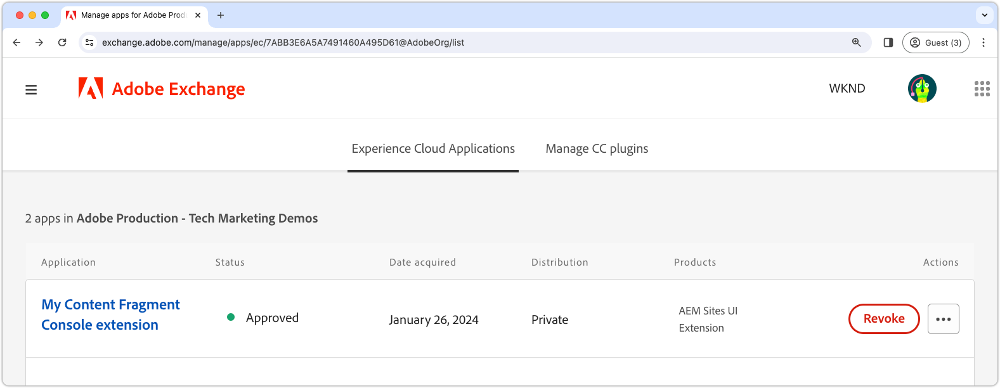
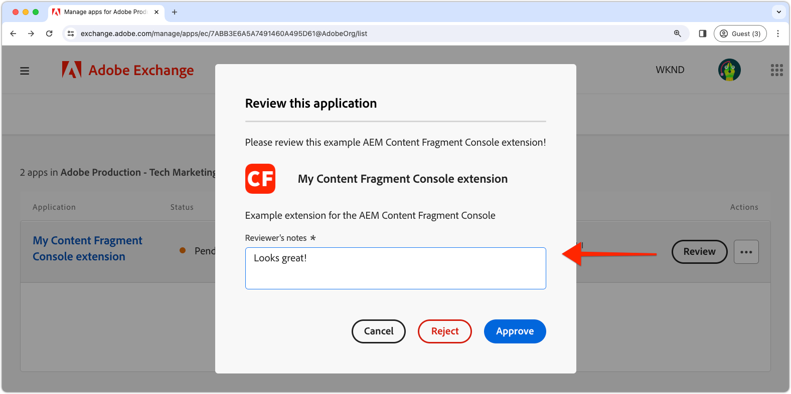
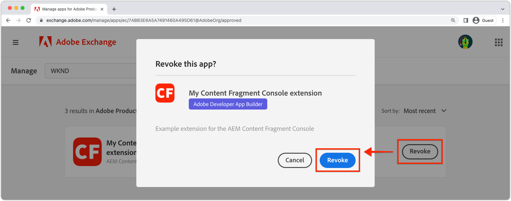

# Deploy an extension

For use on AEM as a Cloud Service environments, the extension App Builder app must be deployed and approved.

{align="center"}

There are several considerations to be aware of when deploying extension App Builder apps:

+ Extensions are deployed to the Adobe Developer Console project workspace. The default workspaces are:
  + __Production__ workspace contains extension deployments that are available in all AEM as a Cloud Service.
  + __Stage__ workspace acts as a developer workspace. Extensions deployed to the Stage workspace are not available in AEM as a Cloud Service.
  Adobe Developer Console workspaces do not have any direct correlation with AEM as a Cloud Service environment types.
+ An extension deployed to the Production workspace displays in all AEM as a Cloud Service environments in the Adobe Org that the extension exists in. 
  An extension cannot be limited to the environments it's registered with by adding [conditional logic that checks the AEM as a Cloud Service host name](https://developer.adobe.com/uix/docs/guides/publication/#enabling-extension-only-on-specific-aem-environments).
+ Multiple extensions can be used on AEM as a Cloud Service. Adobe recommends each extension App Builder app is used to solve a single business objective. That said, a single extension App Builder app can implement multiple extension points that support a common business objective.

## Initial deployment

For an extension to be available on AEM as a Cloud Service environments, it must be deployed to Adobe Developer Console. 

The deployment process split into two logical steps:

1. Deployment of the extension App Builder app to Adobe Developer Console by a developer.
1. Approval of the extension by a deployment manager or business owner.

### Deploy the extension

Deploy the extension to the Production workspace. Extensions deployed to the Production workspace are automatically added to all AEM as a Cloud Service Author services in Adobe Org that the extension is deployed to.

1. Open a command line to the root of the updated extension App Builder app.
1. Ensure that the Production workspace is active
    
    ```shell
    $ aio app use -w Production
    ```
    
    Merge any changes to `.env` and `.aio`.
    
1. Deploy the updated extension App Builder app.
    
    ```shell
    $ aio app deploy
    ```

#### Request deployment approval

{align="center"}

1. Log in to [Adobe Developer Console](https://developer.adobe.com) 
1. Select __Console__
1. Navigate to __Projects__
1. Select the project associated with the extension
1. Select the __Production__ workspace
1. Select __Submit for approval__
1. Complete and submit the form, updating the fields as needed.

### Deployment approval 

{align="center"}

1. Log in to [Adobe Exchange](https://exchange.adobe.com/)
2. Navigate to __Manage__ > __Experience Cloud Applications__
3. __Review__ the extension App Builder app
4. If the extension changes are acceptable __Accept__ the review. This immediately injects the extension on all AEM as a Cloud Service Author services within the Adobe Org.

Once the extension request is approved, the extension immediately becomes active in the AEM as a Cloud Service Author services.

## Update an extension

Updating and extension App Builder app follows the same process as the [initial deployment](#initial-deployment), with the deviation that the existing extension deployment must first be revoked.

### Revoke the extension

To deploy a new version of an extension, it must first be revoked (or removed). While the extension is Revoked, it is not available in AEM consoles.

1. Log in to [Adobe Exchange](https://exchange.adobe.com/)
1. Navigate to __Manage__ > __Experience Cloud Applications__
1. __Revoke__ the Extension to update

### Deploy the extension

Deploy the extension to the Production workspace. Extensions deployed to the Production workspace are automatically added to all AEM as a Cloud Service Author services in Adobe Org that the extension is deployed to.

1. Open a command line to the root of the updated extension App Builder app.
1. Ensure that the Production workspace is active

    ```shell
    $ aio app use -w Production
    ```

    Merge any changes to `.env` and `.aio`.

1. Deploy the updated extension App Builder app.
    
    ```shell
    $ aio app deploy
    ```

#### Request deployment approval

{align="center"}

1. Log in to [Adobe Developer Console](https://developer.adobe.com) 
1. Select __Console__
1. Navigate to __Projects__
1. Select the project associated with the extension
1. Select the __Production__ workspace
1. Select __Submit for approval__
1. Complete and submit the form, updating the fields as needed.

#### Approve the deployment request 

{align="center"}

1. Log in to [Adobe Exchange](https://exchange.adobe.com/)
1. Navigate to __Manage__ > __Experience Cloud Applications__
1. __Review__ the extension App Builder app
1. If the extension changes are acceptable __Accept__ the review. This immediately injects the extension on all AEM as a Cloud Service Author services within the Adobe Org.

Once the extension request is approved, the extension immediately becomes active in the AEM as a Cloud Service Author services.

## Remove an extension



To remove an extension, revoke (or remove) it from Adobe Exchange. When the extension is revoked, it is removed from all AEM as a Cloud Service Author services.

1. Log in to [Adobe Exchange](https://exchange.adobe.com/)
1. Navigate to __Manage__ > __Experience Cloud Applications__
1. __Revoke__ the Extension to remove
