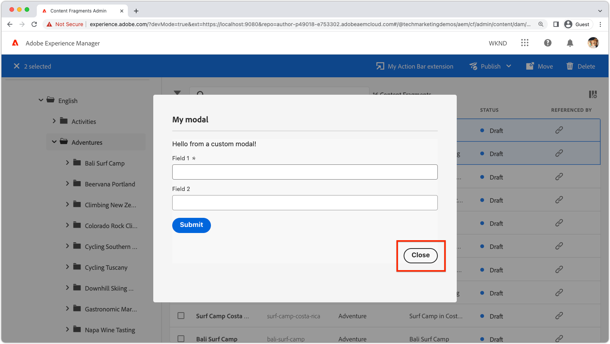

# Extension modal

{align="center"}

AEM UI extension modal provide a way to attach custom UI to AEM UI extensions.

Modals are React applications, based on [React Spectrum](https://react-spectrum.adobe.com/react-spectrum/), and can create any custom UI required by the extension, including, but not limited to:

+ Confirmation dialogs
+ [Input forms](https://react-spectrum.adobe.com/react-spectrum/#forms)
+ [Progress indicators](https://react-spectrum.adobe.com/react-spectrum/#status)
+ [Results summary](https://react-spectrum.adobe.com/react-spectrum/#collections)
+ Error messages
+ ... or even a full-blown, multi-view React application!

## Modal routes

The modal experience is defined by the extension App Builder React app defined under the `web-src` folder. As with any React app, the full experience is orchestrated using [React routes](https://reactrouter.com/en/main/components/routes) that render [React components](https://reactjs.org/docs/components-and-props.html). 

At least one route is required to generate the initial modal view. This initial route is invoked in the [extension registration](#extension-registration)'s `onClick(..)` function, as shown below.


+ `./src/aem-ui-extension/web-src/src/components/App.js`

```javascript
import MyModal from './MyModal';
import MyModalResults from './MyModalResults';
...
function App(props) {
  return (
    <Router>
      <ErrorBoundary onError={onError} FallbackComponent={fallbackComponent}>
        <Routes>
          ...         
          {/* 
            Define the entry route to the modal.

            For modals opened from Action Bar extensions.
            Depending on the extension point, different parameters are passed to the modal.
            This example illustrates a modal for the AEM Content Fragment Console (list view), where typically a :selection parameter is used to pass in the list of selected Content Fragments.
            Where as Header Menu extensions do not use a selection parameter.
           */}
          <Route
            exact path="aem-ui-extension/:selection/my-modal"
            element={<MyModal />}
          />                    

          {/* Define any other routes the modal may need */}
          <Route
            exact path="aem-ui-extension/my-modal"
            element={<MyOtherModalView />}
          />                    

        </Routes>
      </ErrorBoundary>
    </Router>
  )
  ...
}
```

## Extension registration

To open a modal, a call to `guestConnection.host.modal.showUrl(..)` is made frm the extension's `onClick(..)` function. `showUrl(..)` is passed a JavaScript object with key/values:

+ `title` provides the name of title of the modal displayed to the user
+ `url` is the URL that invokes the [React route](#modal-routes) responsible for the modal's initial view.

It is imperative that the `url` passed to `guestConnection.host.modal.showUrl(..)` resolves to route in the extension, otherwise nothing displays in the modal.

+ `./src/aem-ui-extension/web-src/src/components/ExtensionRegistration.js`

```javascript
function ExtensionRegistration() {
  ...
  onClick() {
    // Create a URL that maps to the React route to be rendered in the modal
    const modalURL = "/index.html#/aem-ui-extension/my-modal";

    // Open the modal and display the React route created above
    guestConnection.host.modal.showUrl({
      title: "My modal title",
      url: modalURL
    })     
  }
  ...     
}...
```

## Modal component

Each route of the extension, [that isn't the `index` route](./extension-registration.md#app-routes), maps to a React component that can render in the extension's modal. 

A modal can be comprised of any number of React routes, from a simple one-route modal to a complex, multi-route modal. 

The following illustrates a simple one-route modal, however this modal view could contain React links that invoke other routes or behaviors.

+ `./src/aem-ui-extension/web-src/src/components/MyModal.js`

```javascript
import React, { useState, useEffect } from 'react'
import { attach } from "@adobe/uix-guest"
import {
  Flex,
  Provider,
  Content,
  defaultTheme,
  Text,
  ButtonGroup,
  Button
} from '@adobe/react-spectrum'
import Spinner from "./Spinner"
import { useParams } from "react-router-dom"
import { extensionId } from "./Constants"

export default function MyModal() {
  // Initial modal views for Action Bar extensions typically pass in the list of selected Content Fragment Paths from ExtensionRegistration.js
  // Get the paths from useParams() and split on delimiter used
  let { selection } = useParams();
  let contentFragmentPaths = selection?.split('|') || [];
  
  // Asynchronously attach the extension to AEM. 
  // Wait or the guestConnection to be set before doing anything in the modal.
  const [guestConnection, setGuestConnection] = useState()

  useEffect(() => {
    (async () => {
      const guestConnection = await attach({ id: extensionId })
      setGuestConnection(guestConnection);
    })()
  }, [])

  if (!guestConnection) {
    // If the guestConnection is not initialized, display a loading spinner
    return <Spinner />
  } else {
    // Else the modal is ready to render!
    return (
        <Provider theme={defaultTheme} colorScheme='light'>
        {/* 
            Use the React Spectrum components to render the modal UI.
            Using React Spectrum ensures a consistent, accessible, future-proof look-and-feel and speeds up development.
        */}
            <Content width="100%">
                <Flex width="100%">
                    <Text>
                        This is the contents in the modal! 
                        Anything can be created in this return statement!

                        The selected Content Fragments are: { contentFragmentPaths.join(', ') }
                    </Text>                    
                    {/*
                        Modals must provide their own Close button, by calling: guestConnection.host.modal.close()
                    */}
                    <ButtonGroup align="end">
                        <Button variant="primary" onPress={() => guestConnection.host.modal.close()}>Close</Button>
                    </ButtonGroup>
                </Flex>
            </Content>
        </Provider>
    )
  }
}
```

## Close the modal

{align="center"}

Modals must provide their own close control. This done by invoking `guestConnection.host.modal.close()`.

```javascript
<ButtonGroup align="end">
    <Button variant="primary" onPress={() => guestConnection.host.modal.close()}>Close</Button>
</ButtonGroup>
```
