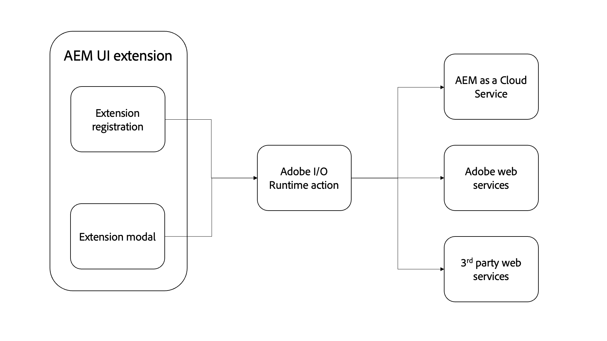

# Adobe I/O Runtime action

{align="center"}

AEM UI extensions can optionally include any number of [Adobe I/O Runtime actions](https://developer.adobe.com/runtime/docs/). 

Adobe I/O Runtime actions are serverless functions that can be invoked by the extension. Actions are useful for performing work that requires interacting with AEM, or other Adobe web services. Actions typically are most useful for performing long-running (anything longer than a few seconds) tasks, or making HTTP requests to AEM or other web services.

The benefits of using Adobe I/O Runtime actions to perform work are:

+ Actions are serverless functions that run outside the context of a browser, removing the need to worry about CORS
+ Actions cannot be interrupted by the user (for example, refreshing the browser)
+ Actions are asynchronous, so they can run as long as needed without blocking the user

In the context of AEM UI extensions, actions are often used to communicate with AEM as a Cloud Service directly:

+ Collecting related data from AEM about the selected or current content
+ Performing custom operations on content
+ Bespoke creation of content

While the AEM UI extension is surfaced in specific AEM UI's, extensions, and their supporting actions, can invoke any available AEM HTTP API, including custom AEM API endpoints.

## Invoke an action

Adobe I/O Runtime actions are primarily invoked from two places in an AEM UI extension:

1. The [extension registration's](./extension-registration.md) `onClick(..)` handler
1. Within a [modal](./modal.md)

### From extension registration

Adobe I/O Runtime actions can be called directly from the extension registration code. The most common use case is to bind an action to a [header menu](https://developer.adobe.com/uix/docs/services/aem-cf-console-admin/api/header-menu/)'s button that does not use [modals](./modal.md).

+ `./src/aem-ui-extension/web-src/src/components/ExtensionRegistration.js`

```javascript
// allActions is an object containing all the actions defined in the extension's manifest
import allActions from '../config.json'

// actionWebInvoke is a helper that invokes an action
import actionWebInvoke from '../utils'
...
function ExtensionRegistration() {
  const init = async () => {
    const guestConnection = await register({
      id: extensionId, // A unique ID for the extension
      methods: {
        // Configure your header menu button here
        headerMenu: {
          getButton() {
            return {
              'id': 'example.my-header-menu-extension',  // Unique ID for the button
              'label': 'My header menu extension',       // Button label 
              'icon': 'Edit'                             // Button icon from https://spectrum.adobe.com/page/icons/
            }
          },

          // Click handler for the extension button
          onClick() {
            // Set the HTTP headers required to access the Adobe I/O runtime action
            const headers = {
              'Authorization': 'Bearer ' + guestConnection.sharedContext.get('auth').imsToken,
              'x-gw-ims-org-id': guestConnection.sharedContext.get('auth').imsOrg
            };

            // Set the parameters to pass to the Adobe I/O Runtime action
            const params = {
              aemHost: `https://${guestConnection.sharedContext.get('aemHost')}`, // Pass in the AEM host if the action interacts with AEM
              aemAccessToken: guestConnection.sharedContext.get('auth').imsToken
            };

            try {
              // Invoke Adobe I/O Runtime action named `generic`, with the configured headers and parameters.
              const actionResponse = await actionWebInvoke(allActions['generic'], headers, params);
            } catch (e) {
              // Log and store any errors
              console.error(e)
            }           
          }
        }
      }
    })
  }
  init().catch(console.error);
}
```

### From modal

Adobe I/O Runtime actions can be called directly from modals to perform more involved work, especially work that relies on communication with AEM as a Cloud Service, Adobe web service, or even third-party services.

Adobe I/O Runtime actions are Node.js based JavaScript applications that run in the serverless Adobe I/O Runtime environment. These actions are addressable via HTTP by the extension SPA.

+ `./src/aem-ui-extension/web-src/src/components/MyModal.js`

```javascript
import React, { useState, useEffect } from 'react'
import { attach } from "@adobe/uix-guest"
import {
  Flex,
  Provider,
  Content,
  defaultTheme,
  Text,
  ButtonGroup,
  Button
} from '@adobe/react-spectrum'
import Spinner from "./Spinner"
import { useParams } from "react-router-dom"
import { extensionId } from "./Constants"

export default function MyModal() {
  // Initial modal views for Action Bar extensions typically pass in the list of selected Content Fragment Paths from ExtensionRegistration.js
  // Get the paths from useParams() and split on delimiter used
  let { selection } = useParams();
  let contentFragmentPaths = selection?.split('|') || [];

  const [actionInvokeInProgress, setActionInvokeInProgress] = useState(false);
  const [actionResponse, setActionResponse] = useState();

  // Asynchronously attach the extension to AEM. 
  // Wait or the guestConnection to be set before doing anything in the modal.
  const [guestConnection, setGuestConnection] = useState()
  useEffect(() => {
    (async () => {
      const guestConnection = await attach({ id: extensionId })
      setGuestConnection(guestConnection);
    })()
  }, [])

  if (!guestConnection) {
    // If the guestConnection is not initialized, display a loading spinner
    return <Spinner />
  } else if (!actionResponse) {
    // Else if the modal is ready to render and has not called the Adobe I/O Runtime action yet
    return (
        <Provider theme={defaultTheme} colorScheme='light'>
            <Content width="100%">
                <Flex width="100%">
                    <Text>
                        The selected Content Fragments are: { contentFragmentPaths.join(', ') }
                    </Text>                    

                     <ButtonGroup align="end">
                        <Button variant="cta" onPress={doWork}>Do work</Button>
                        <Button variant="primary" onPress={() => guestConnection.host.modal.close()}>Close</Button>
                    </ButtonGroup>
                </Flex>
            </Content>
        </Provider>
    )
  } else {
    // Else the modal has called the Adobe I/O Runtime action and is ready to render the response
    return (
        <Provider theme={defaultTheme} colorScheme='light'>
            <Content width="100%">
                <Flex width="100%">
                    <Text>
                        Done! The response from the action is: { actionResponse }
                    </Text>                    

                     <ButtonGroup align="end">
                        <Button variant="primary" onPress={() => guestConnection.host.modal.close()}>Close</Button>
                    </ButtonGroup>
                </Flex>
            </Content>
        </Provider>
    )
  }

  /**
   * Invoke the Adobe I/O Runtime action and store the response in the React component's state.
   */
  async function doWork() {
    // Mark the extension as invoking the action, so the loading spinner is displayed
    setActionInvokeInProgress(true);

    // Set the HTTP headers to access the Adobe I/O runtime action
    const headers = {
      'Authorization': 'Bearer ' + guestConnection.sharedContext.get('auth').imsToken,
      'x-gw-ims-org-id': guestConnection.sharedContext.get('auth').imsOrg
    };

    // Set the parameters to pass to the Adobe I/O Runtime action
    const params = {
      aemHost: `https://${guestConnection.sharedContext.get('aemHost')}`,
      contentFragmentPaths: contentFragmentPaths
    };

    try {
      // Invoke Adobe I/O Runtime action with the configured headers and parameters
      // Invoke the Adobe I/O Runtime action named `generic`.
      const actionResponse = await actionWebInvoke(allActions['generic'], headers, params);

      // Set the response from the Adobe I/O Runtime action
      setActionResponse(actionResponse);
    } catch (e) {
      // Log and store any errors
      console.error(e)
    }

    // Set the action as no longer being invoked, so the loading spinner is hidden
    setActionInvokeInProgress(false);
  }
}
```

## Adobe I/O Runtime action

+ `src/aem-ui-extension/actions/generic/index.js`

```javascript
const fetch = require('node-fetch')
const { Core } = require('@adobe/aio-sdk')
const { errorResponse, getBearerToken, stringParameters, checkMissingRequestInputs } = require('../utils')

async function main (params) {
  const logger = Core.Logger('main', { level: params.LOG_LEVEL || 'info' })

  try {
    logger.debug(stringParameters(params))

    // Check for missing request input parameters and headers
    const requiredParams = [ 'aemHost', 'contentFragmentPaths' ]
    const requiredHeaders = ['Authorization']
    const errorMessage = checkMissingRequestInputs(params, requiredParams, requiredHeaders)
    if (errorMessage) {
      // return and log client errors
      return errorResponse(400, errorMessage, logger)
    }
      
    // Extract the user Bearer token from the Authorization header used to authenticate the request to AEM
    const accessToken = getBearerToken(params);

    // Example HTTP request to AEM payload; This updates all 'title' properties of the Content Fragments to 'Hello World'
    const body = {
      "properties": {
        "elements": {
          "title": {
            "value": "Hello World"
          }
        }
      }
    };

    let results = await Promise.all(params.contentFragmentPaths.map(async (contentFragmentPath) => {
      // Invoke the AEM HTTP Assets Content Fragment API to update each Content Fragment
      // The AEM host is passed in as a parameter to the Adobe I/O Runtime action
      const res = await fetch(`${params.aemHost}${contentFragmentPath.replace('/content/dam/', '/api/assets/')}.json`, { 
        method: 'put',
        body: JSON.stringify(body),
        headers: {
          // Pass in the accessToken as AEM Author service requires authentication/authorization
          'Authorization': `Bearer ${accessToken}`,
          'Content-Type': 'application/json'
        }
      });

      if (res.ok) {
        logger.info(`Successfully updated title of ${contentFragmentPath}`);
        return { contentFragmentPath, status: res.status, statusText: res.statusText, body: await res.json() };
      } else {
        logger.info(`Failed to update title of ${contentFragmentPath}`);
        return { contentFragmentPath, status: res.status, statusText: res.statusText, body: await res.text() };
      }
    }));

    // Return a response to the AEM Content Fragment extension React application
    const response = {
      statusCode: 200,
      body: results
    };
    return response;

  } catch (error) {
    logger.error(error)
    return errorResponse(500, 'server error', logger)
  }
}
```

## AEM HTTP APIs

The following AEM HTTP APIs are commonly used for interacting with AEM from extensions:

+ [AEM GraphQL APIs](https://experienceleague.adobe.com/landing/experience-manager/headless/developer.html)
+ [AEM Assets HTTP API](https://experienceleague.adobe.com/docs/experience-manager-cloud-service/content/assets/admin/mac-api-assets.html)
     + [Content Fragments Support in AEM Assets HTTP API](https://experienceleague.adobe.com/docs/experience-manager-cloud-service/content/assets/admin/assets-api-content-fragments.html)
+ [AEM QueryBuilder API](https://experienceleague.adobe.com/docs/experience-manager-cloud-service/content/implementing/developing/full-stack/search/query-builder-api.html)
+ [Complete AEM as a Cloud Service API reference](https://experienceleague.adobe.com/docs/experience-manager-cloud-service/content/implementing/developing/reference-materials.html)


## Adobe npm modules

The following are useful npm modules for developing Adobe I/O Runtime actions:

+ [@adobe/aio-sdk](https://www.npmjs.com/package/@adobe/aio-sdk)
  + [Core SDK](https://github.com/adobe/aio-sdk-core)
  + [State Library](https://github.com/adobe/aio-lib-state)
  + [Files Library](https://github.com/adobe/aio-lib-files)
  + [Adobe Target Library](https://github.com/adobe/aio-lib-target)
  + [Adobe Analytics Library](https://github.com/adobe/aio-lib-analytics)
  + [Adobe Campaign Standard Library](https://github.com/adobe/aio-lib-campaign-standard)
  + [Adobe Customer Profile Library](https://github.com/adobe/aio-lib-customer-profile)
  + [Adobe Audience Manager Customer Data Library](https://github.com/adobe/aio-lib-audience-manager-cd)
  + [Adobe I/O Events](https://github.com/adobe/aio-lib-events)
+ [@adobe/aio-lib-core-networking](https://github.com/adobe/aio-lib-core-networking)
+ [@adobe/node-httptransfer](https://github.com/adobe/node-httptransfer)
