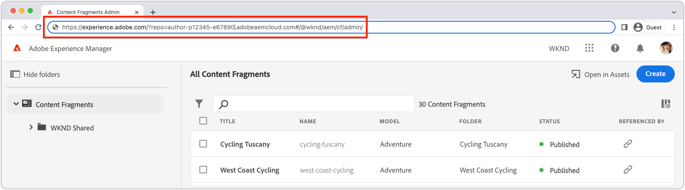

# Verify an extension

AEM UI extensions can be verified against any AEM as a Cloud Service environment in the Adobe Org the extension belongs to.

Testing an extension is done through a specially crafted URL that instructs AEM to load the extension, only for that request.

>[!VIDEO](https://video.tv.adobe.com/v/3412877?quality=12&learn=on)

>[!IMPORTANT]
>
> The video above showcases the use of a Content Fragment Console extension to illustrate App Builder extension app preview and verification. However, it's important to note that the concepts covered can be applied to all AEM UI extensions.

## AEM UI URL

{align="center"}

To create a URL that mounts the non-production extension into AEM, the URL of the AEM UI the extension is injected into must be obtained. Navigate to the AEM as a Cloud Service environment to verify the extension on, and open the UI the extension is to be previewed on.

For example, to preview an extension for the Content Fragment console:

1. Log in to the desired AEM as a Cloud Service env.
1. Select the __Content Fragments__ icon.
1. Wait for the AEM Content Fragment Console to load in the browser.
1. Copy the AEM Content Fragment Console's URL from the browser's address bar, it should resemble:

    ```
    https://experience.adobe.com/?repo=author-p1234-e5678.adobeaemcloud.com#/@wknd/aem/cf/admin
    ```

This URL is used below when crafting the URLs for development and stage verification. If verifying the extension against other AEM UIs, obtain those URLs and apply the same steps below.

## Verify local development builds

1. Open a command line to the root of the extension project.
1. Run the AEM UI extension as a local App Builder app

    ```shell
    $ aio app run
    ...
    No change to package.json was detected. No package manager install will be executed.

    To view your local application:
      -> https://localhost:9080
    To view your deployed application in the Experience Cloud shell:
      -> https://experience.adobe.com/?devMode=true#/custom-apps/?localDevUrl=https://localhost:9080
    ```

  Take note of the local application URL, shown above as `-> https://localhost:9080`

1. Initially (and whenever you see a Connection Error) open `https://localhost:9080` (or whatever your local application URL is) in your web browser, and manually accept [the HTTPS certificate](https://developer.adobe.com/uix/docs/services/aem-cf-console-admin/extension-development/#accepting-the-certificate-first-time-users).
1. Add the following two query params to the [AEM UI's URL](#aem-ui-url)
    + `&devMode=true`
    + `&ext=<LOCAL APPLICATION URL>`, usually `&ext=https://localhost:9080`.

    Add the two above query parameters (`devMode` and `ext`) as the __first__ query parameters in the URL. AEM's extensible UI's use hash routes (`#/@wknd/aem/...`), so incorrectly post-fixing the parameters after the `#` does not work.
    
    The preview URL should look like:

      ```
      https://experience.adobe.com/?devMode=true&ext=https://localhost:9080&repo=author-p1234-e5678.adobeaemcloud.com#/@wknd/aem/cf/admin
      ```

1. Copy and paste the preview URL into your browser.
  
    + You may have to initially, and then periodically, [accept the HTTPS certificate](https://developer.adobe.com/uix/docs/services/aem-cf-console-admin/extension-development/#accepting-the-certificate-first-time-users) for the local application's host (`https://localhost:9080`).

1. The AEM UI loads with the local version of the extension injected into it for verification.

>[!IMPORTANT]
>
>Remember, when using this approach, the extension under development only impacts your experience, and all other users of the AEM UI experience the UI without the injected extension. 

## Verify stage builds

1. Open a command line to the root of the extension project.
1. Ensure that the Stage workspace is active (or whichever Workspace is used for verification).

    ```shell
    $ aio app use -w Stage
    ```

    Merge any changes to `.env` and `.aio`.

1. Deploy the updated extension App Builder app. If not logged in, run `aio login` first.

    ```shell
    $ aio app deploy
    ...
    Your deployed actions:
    web actions:
      -> https://98765-123aquarat.adobeio-static.net/api/v1/web/aem-cf-console-admin-1/generic 
    To view your deployed application:
      -> https://98765-123aquarat.adobeio-static.net/index.html
    To view your deployed application in the Experience Cloud shell:
      -> https://experience.adobe.com/?devMode=true#/custom-apps/?localDevUrl=https://98765-123aquarat.adobeio-static.net/index.html
    New Extension Point(s) in Workspace 'Production': 'aem/cf-console-admin/1'
    Successful deployment 🏄
    ```

1. Add the following two query params to the [AEM UI's URL](#aem-ui-url)
    + `&devMode=true`
    + `&ext=<DEPLOYED APPLICATION URL>`

    Add the two above query parameters (`devMode` and `ext`) as the __first__ query parameters in the URL, as extensible AEM UIs use a hash route (`#/@wknd/aem/...`), so incorrectly post-fixing the parameters after the `#` does not work.

    The preview URL should look like:

    ```
    https://experience.adobe.com/?devMode=true&ext=https://98765-123aquarat.adobeio-static.net/index.html&repo=author-p1234-e5678.adobeaemcloud.com#/@wknd/aem/cf/admin
    ```

1. Copy and paste the preview URL into your browser.
1. The AEM Content Fragment Console injects the version of the extension deployed to Stage workspace in. This Stage URL can be shared to QA or business users for verification.

  Remember, when using this approach, the Staged extension is only injected on AEM Content Fragment Console's when access with the craft Stage URL. 

1. Deployed extensions can be updated by running `aio app deploy` again, and these changes automatically reflect when using the preview URL.
1. To remove an extension for verification, run `aio app undeploy`.

## Preview bookmarklet 

To ease the creation of preview and preview URLs described above, a JavaScript bookmarklet that loads the extension can be created. 

The bookmarklet below previews the [local development builds](#verify-local-development-builds) of the extension on `https://localhost:9080`. To preview [stage builds](#verify-stage-builds), create a bookmarklet with the `previewApp` variable set to the URL of the deployed App Builder app.

1. Create a bookmark in your browser.
1. Edit the bookmark.
1. Give a bookmark a meaningful name, such as `AEM UI Extension Preview (localhost:9080)`.
1. Set the bookmark's URL to the following code:

    ```javascript
    javascript: (() => {
        /* Change this to the URL of the local App Builder app if not using https://localhost:9080 */
        const previewApp = 'https://localhost:9080';

        const repo = new URL(window.location.href).searchParams.get('repo');
        
        if (window.location.href.match(/https:\/\/experience\.adobe\.com\/.*\/aem\/cf\/(editor|admin)\/.*/i)) {
            window.location = `https://experience.adobe.com/?devMode=true&ext=${previewApp}&repo=${repo}${window.location.hash}`;
        } 
    })();
    ```

1. Navigate to an extensible AEM UI to load the preview extension on, and then click the bookmarklet.

>[!TIP]
>
> If the App Builder extension does not load, when using, `&ext=https://localhost:9080`, open that host and port directly in a browser tab, and accept the self-signed certificate. Then try the bookmarklet again.
