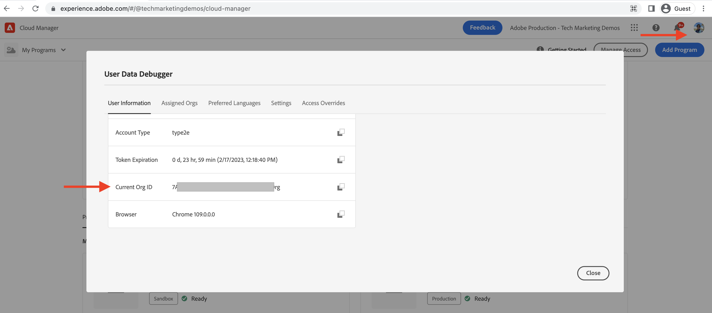
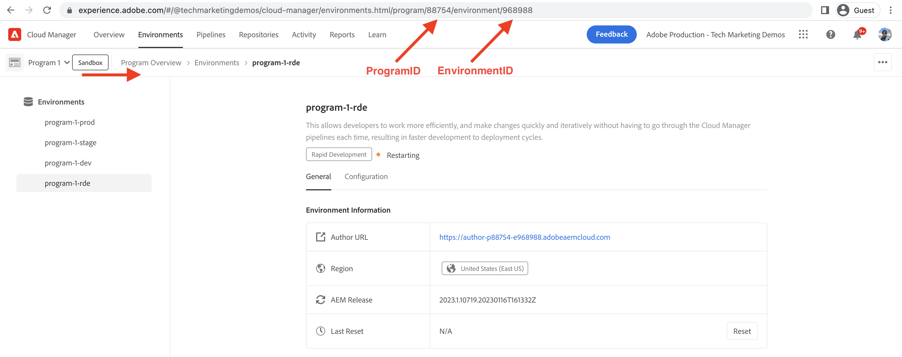

# How to set up Rapid Development Environment

Learn **how to set up** Rapid Development Environment (RDE) in AEM as a Cloud Service.

This video shows:

- Adding an RDE to your program using Cloud Manager
- RDE login flow using Adobe IMS, how it is similar to any other AEM as a Cloud Service environment
- Setup of [Adobe I/O Runtime Extensible CLI](https://developer.adobe.com/runtime/docs/guides/tools/cli_install/) also known as the `aio CLI`
- Setup and configuration of AEM RDE and Cloud Manager `aio CLI` plugin using non-interactive mode. For interactive mode, see the [setup instructions](#setup-the-aem-rde-plugin)

>[!VIDEO](https://video.tv.adobe.com/v/3415490?quality=12&learn=on)

## Prerequisite 

The following should be installed locally:

- [Node.js](https://nodejs.org/en/) (LTS - Long-Term Support)
- [npm 8+](https://docs.npmjs.com/)

## Local setup

To deploy the [WKND Sites Project's](https://github.com/adobe/aem-guides-wknd#aem-wknd-sites-project) code and content onto the RDE from your local machine, complete the following steps.

### Adobe I/O Runtime Extensible CLI 

Install the Adobe I/O Runtime Extensible CLI, also known as the `aio CLI` by running the following command from the command line. 

```shell
$ npm install -g @adobe/aio-cli
```

### Install and setup aio CLI plugins

The aio CLI must have plugins installed and setup with the Organization, Program, and RDE Environment ID to interact with your RDE. Setup can be performed via the aio CLI using the simpler interactive mode or non-interactive mode.

>[!BEGINTABS]

>[!TAB Interactive mode]

Install andd setup the AEM RDE plugins by using the `aio cli`'s `plugins:install` command.

1. Install the aio CLI's AEM RDE plugin using the `aio cli`'s `plugins:install` command.
 
    ```shell
    $ aio plugins:install @adobe/aio-cli-plugin-aem-rde    
    $ aio plugins:update
    ```

    The AEM RDE plugin, allows developers to deploy code and content from the local machine.

2. Log in to the Adobe I/O Runtime Extensible CLI by running the following command to get the access token. Make sure to log in to the same Adobe Org as your Cloud Manager.

    ```shell
    $ aio login
    ```

3. Run the following command to set up RDE using interactive mode.
    
    ```shell
    $ aio aem:rde:setup
    ```
    
4. The CLI prompts you to enter the Organization ID, Program ID, and Environment ID.

    ```shell
    Setup the CLI configuration necessary to use the RDE commands.
    ? Do you want to store the information you enter in this setup procedure locally? (y/N)
    ```

    - Choose __No__  if you are only working with a single RDE, and want to store your RDE configuration globally on your local machine.
  
    - Choose __Yes__ if you are working with multiple RDEs, or want to store your RDE configuration locally, in the current folder's `.aio` file, for each project.

5. Select the Organization ID, Program ID, and RDE Environment ID from the list of available options.

6. Verify the correct Organization, Program and Environment are setup by running the following command.

    ```shell
    $ aio aem rde setup --show
    ```

>[!TAB Non-interactive mode]

Install and setup the Cloud Manager and AEM RDE plugins by using the `aio cli`'s `plugins:install` command.

```shell
$ aio plugins:install @adobe/aio-cli-plugin-cloudmanager
$ aio plugins:install @adobe/aio-cli-plugin-aem-rde
$ aio plugins:update
```

The Cloud Manager plugin, allows developers to interact with Cloud Manager from the command line.

The AEM RDE plugin, allows developers to deploy code and content from the local machine.

The aio CLI plugins must be configured to interact with your RDE. 

1. First, using the Cloud Manager, copy the values of the Organization, Program, and Environment ID.

   -  Organization ID: Copy the value from **Profile Picture > Account info(internal) > Modal Window > Current Org ID**

    

   - Program ID: Copy the value from **Program Overview > Environments > {ProgramName}-rde > Browser URI > numbers between `program/` and `/environment`**

    

   - Environment ID: Copy the value from **Program Overview > Environments > {ProgramName}-rde > Browser URI > numbers after `environment/`**

    

1.  Use the `aio cli`'s `config:set` command set these values by running the following command.

    ```shell
    $ aio config:set cloudmanager_orgid <ORGANIZATION ID>
    $ aio config:set cloudmanager_programid <PROGRAM ID>
    $ aio config:set cloudmanager_environmentid <ENVIRONMENT ID>
    ```

1. Verify the current config values by running the following command.

    ```shell
    $ aio config:list
    ```

1. Switch or review which Organization you are currently logged in to:

    ```shell
    $ aio where
    ```

>[!ENDTABS]

## Verify RDE access

Verify the AEM RDE plugin installation and configuration by running the following command.

```shell
$ aio aem:rde:status
```

The RDE status information is displayed like environment status, the list of _your AEM project_ bundles and configurations on author and publish service.

## Next Step

Learn [how to use](./how-to-use.md) an RDE to deploy code and content from your favorite Integrated Development Environment (IDE) for faster development cycles.


## Additional resources

[Enabling RDE in a program documentation](https://experienceleague.adobe.com/docs/experience-manager-cloud-service/content/implementing/developing/rapid-development-environments.html#enabling-rde-in-a-program)

Setup of [Adobe I/O Runtime Extensible CLI](https://developer.adobe.com/runtime/docs/guides/tools/cli_install/) also known as the `aio CLI` 

[aio CLI usage and commands](https://github.com/adobe/aio-cli#usage)

[Adobe I/O Runtime CLI plugin for interactions with AEM Rapid Development Environments](https://github.com/adobe/aio-cli-plugin-aem-rde#aio-cli-plugin-aem-rde)

[Cloud Manager aio CLI plugin](https://github.com/adobe/aio-cli-plugin-cloudmanager)
