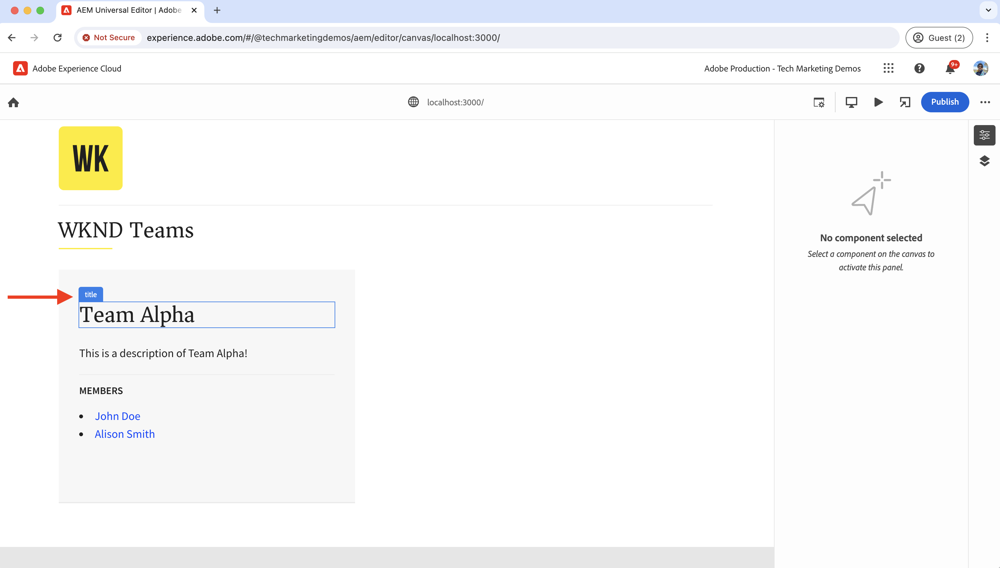
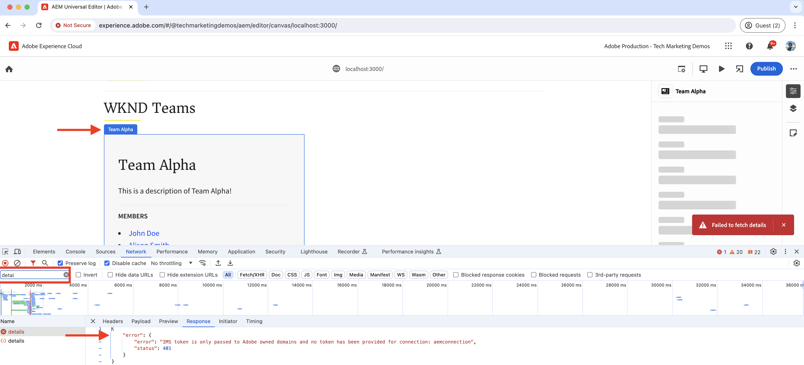
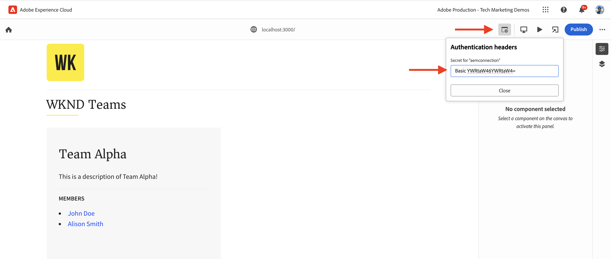
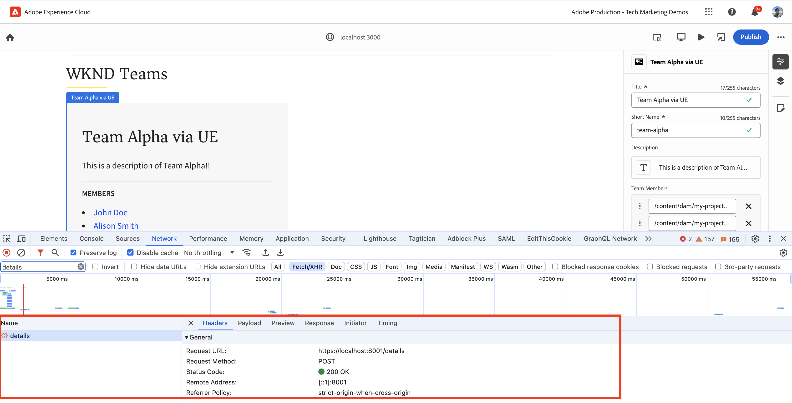
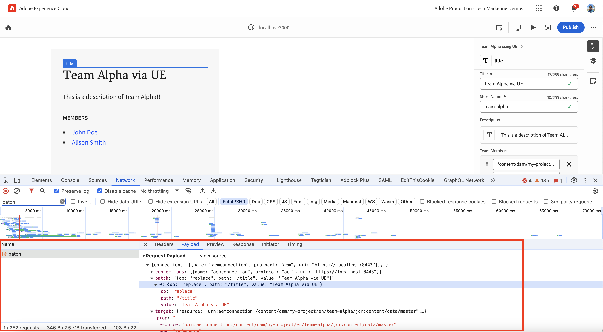
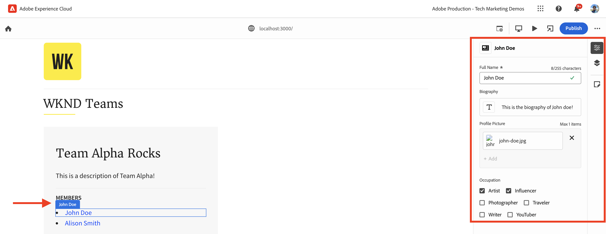
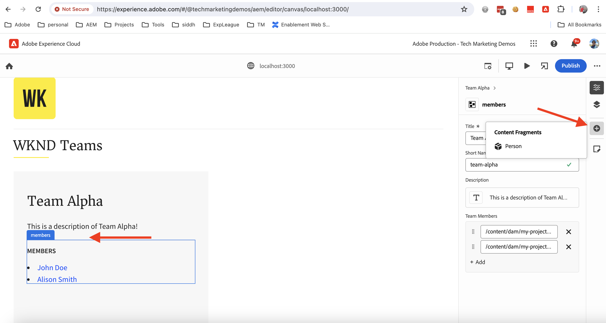
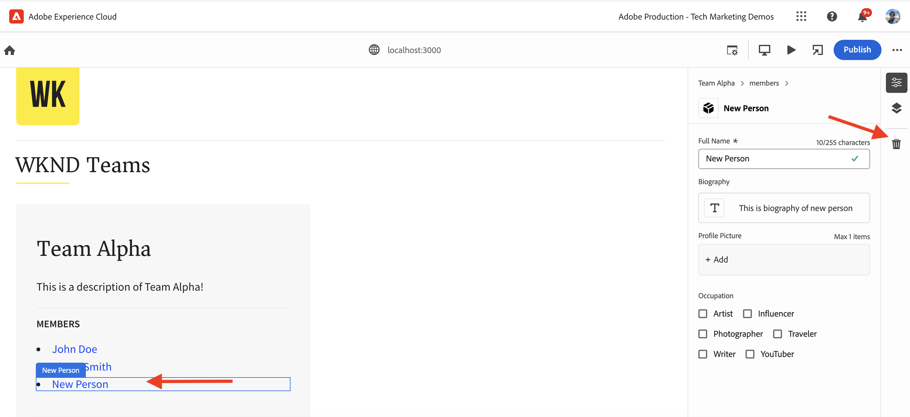

# Instrument React app to edit content using Universal Editor

Learn how to instrument the React app to edit the content using Universal Editor.

## Prerequisites

You have set up the local development environment as described in the previous [Local development setup](./local-development-setup.md) step.

## Include the Universal Editor core library

Let's begin by including the Universal Editor core library in the WKND Teams React app. It is a JavaScript library that provides the communication layer between the edited App and the Universal Editor.

There are two ways to include the Universal Editor core library in the React app:

1. Node module dependency from the npm registry, see [@adobe/universal-editor-cors](https://www.npmjs.com/package/@adobe/universal-editor-cors).
1. Script tag (`<script>`) within the HTML file.

For this tutorial, let's use the Script tag approach.

1. Install the `react-helmet-async` package to manage the `<script>` tag in the React app.

    ```bash
    $ npm install react-helmet-async
    ```

1. Update the `src/App.js` file of the WKND Teams React app to include the Universal Editor core library.

    ```javascript
    ...
    import { Helmet, HelmetProvider } from "react-helmet-async";

    function App() {
    return (
        <HelmetProvider>
            <div className="App">
                <Helmet>
                    {/* AEM Universal Editor :: CORE Library
                      Loads the LATEST Universal Editor library
                    */}
                    <script
                        src="https://universal-editor-service.experiencecloud.live/corslib/LATEST"
                        async
                    />
                </Helmet>
                <Router>
                    <header>
                        <Link to={"/"}>
                        
                        </Link>
                        <hr />
                    </header>
                    <Routes>
                        <Route path="/" element={<Home />} />
                        <Route path="/person/:fullName" element={<Person />} />
                    </Routes>
                </Router>
            </div>
        </HelmetProvider>
    );
    }

    export default App;
    ```

## Add metadata - content source

To connect the WKND Teams React app _with the content source_ for editing, you need to provide connection metadata. The Universal Editor service uses this metadata to establish a connection with the content source.

The connection metadata is stored as `<meta>` tags in the HTML file. The syntax for the connection metadata is as follows:

```html
<meta name="urn:adobe:aue:<category>:<referenceName>" content="<protocol>:<url>">
```

Let's add the connection metadata to the WKND Teams React app within the `<Helmet>` component. Update the `src/App.js` file with the following `<meta>` tag. In this example, the content source is a local AEM instance running on `https://localhost:8443`.

```javascript
...
function App() {
return (
    <HelmetProvider>
        <div className="App">
            <Helmet>
                {/* AEM Universal Editor :: CORE Library
                    Loads the LATEST Universal Editor library
                */}
                <script
                    src="https://universal-editor-service.experiencecloud.live/corslib/LATEST"
                    async
                />
                {/* AEM Universal Editor :: Connection metadata 
                    Connects to local AEM instance
                */}
                <meta
                    name="urn:adobe:aue:system:aemconnection"
                    content={`aem:https://localhost:8443`}
                />
            </Helmet>
            ...
    </HelmetProvider>
);
}

export default App;
```

The `aemconnection` provides a short name of the content source. The subsequent instrumentation uses the short name to refer to the content source.

## Add metadata - local Universal Editor service configuration

Instead of the Adobe-hosted Universal Editor service, a local copy of the Universal Editor service is used for local development. The local service binds the Universal Editor and the AEM SDK, so let's add the local Universal Editor service metadata to the WKND Teams React app. 

These configuration settings are also stored as `<meta>` tags in the HTML file. The syntax for the local Universal Editor service metadata is as follows:

```html
<meta name="urn:adobe:aue:config:service" content="<url>">
```

Let's add the connection metadata to the WKND Teams React app within the `<Helmet>` component. Update the `src/App.js` file with the following `<meta>` tag. In this example, the local Universal Editor service is running on `https://localhost:8001`.

```javascript
...

function App() {
  return (
    <HelmetProvider>
      <div className="App">
        <Helmet>
          {/* AEM Universal Editor :: CORE Library
              Loads the LATEST Universal Editor library
          */}
          <script
            src="https://universal-editor-service.experiencecloud.live/corslib/LATEST"
            async
          />
          {/* AEM Universal Editor :: Connection metadata 
              Connects to local AEM instance
          */}
          <meta
            name="urn:adobe:aue:system:aemconnection"
            content={`aem:https://localhost:8443`}
          />
          {/* AEM Universal Editor :: Configuration for Service
              Using locally running Universal Editor service
          */}
          <meta
            name="urn:adobe:aue:config:service"
            content={`https://localhost:8001`}
          />
        </Helmet>
        ...
    </HelmetProvider>
);
}
export default App;
```

## Instrument the React components

To edit the contents of the WKND Teams React app such as _team title and team description_, you need to instrument the React components. The instrumentation means adding relevant data attributes (`data-aue-*`) to the HTML elements that you want to make editable using the Universal Editor. For more information on data attributes, see [Attributes and Types](https://experienceleague.adobe.com/en/docs/experience-manager-cloud-service/content/implementing/developing/universal-editor/attributes-types).

### Define editable elements

Let's begin by defining the elements that you want to edit using the Universal Editor. In the WKND Teams React app, the team title and description are stored in the Team Content Fragment in AEM, thus the best candidates for editing.

Let's instrument the `Teams` React component to make the team title and description editable.

1. Open the `src/components/Teams.js` file of the WKND Teams React app.
1. Add the `data-aue-prop`, `data-aue-type` and `data-aue-label` attribute to the team title and description elements.

    ```javascript
    ...
    function Teams() {
        const { teams, error } = useAllTeams();
        ...

        return (
            <div className="team">
                // AEM Universal Editor :: Instrumentation using data-aue-* attributes
                <h2 className="team__title" data-aue-prop="title" data-aue-type="text" data-aue-label="title">{title}</h2>
                <p className="team__description" data-aue-prop="description" data-aue-type="richtext" data-aue-label="description">{description.plaintext}</p>
                ...
            </div>
        );
    }

    export default Teams;
    ```

1. Refresh the Universal Editor page in the browser that loads the WKND Teams React app. You can now see that the team title and description elements are editable.

    

1. If you try to edit the team title or description using inline editing or the properties rail, it shows a loading spinner but does not allow you to edit the content. Because the Universal Editor is not aware of the AEM resource details for loading and saving the content.

    

In summary, the above changes mark the team title and description elements as editable in the Universal Editor. However, **you cannot edit (via inline or properties rail) and save the changes yet**, for that you need to add the AEM resource details using the `data-aue-resource` attribute. Let's do that in the next step.

### Define AEM resource details

To save the edited content back to AEM and also to load the content in the properties rail, you need to provide the AEM resource details to the Universal Editor. 

In this case, the AEM resource is the Team Content Fragment path, so let's add the resource details to the `Teams` React component at the top level `<div>` element.

1. Update the `src/components/Teams.js` file to add the `data-aue-resource`, `data-aue-type` and `data-aue-label` attributes to the top-level `<div>` element.

    ```javascript
    ...
    function Teams() {
        const { teams, error } = useAllTeams();
        ...

        // Render single Team
        function Team({ _path, title, shortName, description, teamMembers }) {
            // Must have title, shortName and at least 1 team member
            if (!_path || !title || !shortName || !teamMembers) {
                return null;
            }

          return (
            // AEM Universal Editor :: Instrumentation using data-aue-* attributes
            <div className="team" data-aue-resource={`urn:aemconnection:${_path}/jcr:content/data/master`} data-aue-type="reference" data-aue-label={title}>
            ...
            </div>
        );
        }
    }
    export default Teams;
    ```
    
    The value of the `data-aue-resource` attribute is the AEM resource path of the Team Content Fragment. The `urn:aemconnection:` prefix uses the short name of the content source defined in the connection metadata.

1. Refresh the Universal Editor page in the browser that loads the WKND Teams React app. You can now see that the top-level Team element is editable but the properties rail is still not loading the content. In the browser's network tab, you can see the 401 Unauthorized error for the `details` request that loads the content. It is trying to use the IMS token for authentication but the local AEM SDK does not support IMS authentication.

    

1. To fix the 401 Unauthorized error, you need to provide the local AEM SDK authentication details to the Universal Editor using the **Authentication headers** option in the Universal Editor. As its local AEM SDK, set the value to `Basic YWRtaW46YWRtaW4=` for `admin:admin` credentials.

    

1. Refresh the Universal Editor page in the browser that loads the WKND Teams React app. You can now see that the properties rail is loading the content and you can edit the team title and description inline or using the properties rail.

    

#### Under the hood

The properties rail loads the content from the AEM resource using the local Universal Editor service. Using the browser's network tab, you can see the POST request to the local Universal Editor service (`https://localhost:8001/details`) for loading the content.

When you edit the content using inline editing or properties rail, the changes are saved back to the AEM resource using the local Universal Editor service. Using the browser's network tab, you can see the POST request to the local Universal Editor service (`https://localhost:8001/update` or `https://localhost:8001/patch`) for saving the content.



The request payload JSON object contains the necessary details like the content server (`connections`), resource path (`target`), and the updated content (`patch`).



### Expand the editable content

Let's expand the editable content and apply the instrumentation to the **team members** so that you can edit the team members using the properties rail.

Like above, let's add the relevant `data-aue-*` attributes to the team members in the `Teams` React component.

1. Update the `src/components/Teams.js` file to add data attributes to the `<li key={index} className="team__member">` element.

    ```javascript
    ...
    function Teams() {
        const { teams, error } = useAllTeams();
        ...

        <div>
            <h4 className="team__members-title">Members</h4>
            <ul className="team__members">
                {/* Render the referenced Person models associated with the team */}
                {teamMembers.map((teamMember, index) => {
                    return (
                        // AEM Universal Editor :: Instrumentation using data-aue-* attributes
                        <li key={index} className="team__member" data-aue-resource={`urn:aemconnection:${teamMember?._path}/jcr:content/data/master`} data-aue-type="component" data-aue-label={teamMember.fullName}>
                        <Link to={`/person/${teamMember.fullName}`}>
                            {teamMember.fullName}
                        </Link>
                        </li>
                    );
                })}
            </ul>
        </div>
        ...
    }
    export default Teams;
    ```

    The value of the `data-aue-type` attribute is `component` as the team members are stored as `Person` Content Fragments in AEM and helps to indicate the movable/deletable parts of the content.

1. Refresh the Universal Editor page in the browser that loads the WKND Teams React app. You can now see that the team members are editable using the properties rail.

    

#### Under the hood

Like above, content retrieval and saving are done by the local Universal Editor service. The `/details`, `/update` or `/patch` requests are made to the local Universal Editor service for loading and saving the content.

### Define add and delete content 

So far, you have made the existing content editable but what if you want to add new content? Let's add the ability to add or delete team members to the WKND team using the Universal Editor. Thus, the content authors do not need to go to the AEM to add or delete team members.

However, a quick recap, the WKND Team members are stored as `Person` Content Fragments in AEM and are associated with the Team Content Fragment using the `teamMembers` property. To review the model definition in AEM visit [my-project](http://localhost:4502/libs/dam/cfm/models/console/content/models.html/conf/my-project).

1. First, create the component definition file `/public/static/component-definition.json`. This file contains the component definition for the `Person` Content Fragment. The `aem/cf` plugin allows for inserting content fragments, based on a model and a template providing the default values to apply.

    ```json
    {
        "groups": [
            {
            "title": "Content Fragments",
            "id": "content-fragments",
            "components": [
                {
                "title": "Person",
                "id": "person",
                "plugins": {
                    "aem": {
                        "cf": {
                            "name": "person",
                            "cfModel": "/conf/my-project/settings/dam/cfm/models/person",
                            "cfFolder": "/content/dam/my-project/en",
                            "title": "person",
                            "template": {
                                "fullName": "New Person",
                                "biographyText": "This is biography of new person"
                                }
                            }
                        }
                    }
                }
            ]
            }
        ]
    }
    ```

1. Next, refer above component definition file in `index.html` of the WKND Team React App. Update the `public/index.html` file's `<head>` section to include the component definition file.

    ```html
    ...
    <script
        type="application/vnd.adobe.aue.component+json"
        src="/static/component-definition.json"
    ></script>
    <title>WKND App - Basic GraphQL Tutorial</title>
    </head>
    ...
    ```

1. Finally, update the `src/components/Teams.js` file to add data attributes. The **MEMBERS** section to act as a container for the team members, let's add the `data-aue-prop`, `data-aue-type`, and `data-aue-label` attributes to the `<div>` element.

    ```javascript
    ...
    function Teams() {
        const { teams, error } = useAllTeams();
        ...
        
        {/* AEM Universal Editor :: Team Members as container */}
        <div data-aue-prop="teamMembers" data-aue-type="container" data-aue-label="members">
            <h4 className="team__members-title">Members</h4>
            <ul className="team__members">
            {/* Render the referenced Person models associated with the team */}
            {teamMembers.map((teamMember, index) => {
                return (
                // AEM Universal Editor :: Instrumentation using data-aue-* attributes
                <li key={index} className="team__member" data-aue-resource={`urn:aemconnection:${teamMember?._path}/jcr:content/data/master`} data-aue-type="component" data-aue-label={teamMember.fullName}>
                    <Link to={`/person/${teamMember.fullName}`}>
                    {teamMember.fullName}
                    </Link>
                </li>
                );
            })}
            </ul>
        </div>
        ...
    }
    export default Teams;
    ```

1. Refresh the Universal Editor page in the browser that loads the WKND Teams React app. You can now see that the **MEMBERS** section acts as a container. You can insert new team members using the properties rail and the **+** icon.

    

1. To delete a team member, select the team member and click the **Delete** icon.

    

#### Under the hood

The content add and delete operations are done by the local Universal Editor service. The POST request to `/add` or `/remove` with a detailed payload are made to the local Universal Editor service for adding or deleting the content to the AEM.

## Solution files

To verify your implementation changes or if you are unable to get the WKND Teams React app working with the Universal Editor, refer to the [basic-tutorial-instrumented-for-UE](https://github.com/adobe/aem-guides-wknd-graphql/tree/solution/basic-tutorial-instrumented-for-UE) solution branch. 

File-by-file comparison with the working **basic-tutorial** branch is available [here](https://github.com/adobe/aem-guides-wknd-graphql/compare/solution/basic-tutorial...solution/basic-tutorial-instrumented-for-UE?expand=1).

## Congratulations

You have successfully instrumented the WKND Teams React app to add, edit and delete the content using the Universal Editor. You have learned how to include the core library, add connection and the local Universal Editor service metadata, and instrument the React component using various data (`data-aue-*`) attributes.
